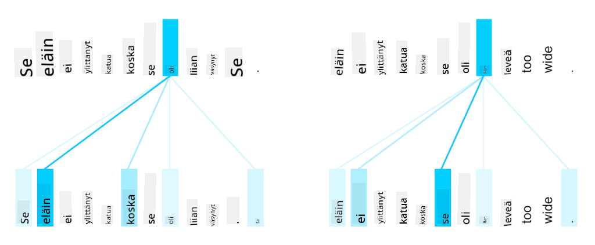

<!--
CO_OP_TRANSLATOR_METADATA:
{
  "original_hash": "7e617f0b8de85a43957a853aba09bfeb",
  "translation_date": "2025-08-28T20:00:57+00:00",
  "source_file": "lessons/5-NLP/18-Transformers/README.md",
  "language_code": "fi"
}
-->
# Huomiomekanismit ja Transformerit

## [Ennakkovisa](https://red-field-0a6ddfd03.1.azurestaticapps.net/quiz/118)

Yksi NLP:n tärkeimmistä ongelmista on **konekäännös**, joka on olennainen tehtävä esimerkiksi Google Kääntäjän kaltaisille työkaluille. Tässä osiossa keskitymme konekäännökseen tai yleisemmin mihin tahansa *sekvenssistä sekvenssiin* -tehtävään (jota kutsutaan myös **lauseen muunnokseksi**).

RNN:ien avulla sekvenssistä sekvenssiin -tehtävä toteutetaan kahdella rekurrentilla verkolla, joissa toinen verkko, **enkooderi**, tiivistää syötesekvenssin piilotilaan, kun taas toinen verkko, **dekooderi**, purkaa tämän piilotilan käännetyksi tulokseksi. Tässä lähestymistavassa on kuitenkin muutamia ongelmia:

* Enkooderin verkon lopputila ei muista hyvin lauseen alkua, mikä heikentää mallin laatua pitkien lauseiden kohdalla.
* Kaikilla sekvenssin sanoilla on sama vaikutus tulokseen. Todellisuudessa kuitenkin tietyillä sanoilla syötesekvenssissä on usein suurempi vaikutus kuin toisilla.

**Huomiomekanismit** tarjoavat keinon painottaa kunkin syötevektorin kontekstuaalista vaikutusta RNN:n kunkin ennusteen kohdalla. Tämä toteutetaan luomalla oikopolkuja syöte-RNN:n välitilojen ja tuloste-RNN:n välille. Näin ollen, kun tuotetaan tulostesymbolia yt, otamme huomioon kaikki syötteen piilotilat hi, eri painokertoimilla αt,i.

> Enkooderi-dekooderi-malli additiivisella huomiomekanismilla [Bahdanau et al., 2015](https://arxiv.org/pdf/1409.0473.pdf), lainattu [tästä blogikirjoituksesta](https://lilianweng.github.io/lil-log/2018/06/24/attention-attention.html)

Huomiomatriisi {αi,j} edustaa sitä, kuinka paljon tietyt syötesanat vaikuttavat tietyn sanan muodostumiseen tulostesekvenssissä. Alla on esimerkki tällaisesta matriisista:

> Kuva [Bahdanau et al., 2015](https://arxiv.org/pdf/1409.0473.pdf) (Kuva 3)

Huomiomekanismit ovat vastuussa monista nykyisistä tai lähes nykyisistä huipputuloksista NLP:ssä. Huomion lisääminen kuitenkin kasvattaa huomattavasti mallin parametrien määrää, mikä aiheutti skaalausongelmia RNN:ien kanssa. Yksi RNN:ien skaalaamisen keskeisistä rajoitteista on, että mallien rekurrentti luonne tekee koulutuksen eräajosta ja rinnakkaistamisesta haastavaa. RNN:ssä jokainen sekvenssin elementti täytyy käsitellä järjestyksessä, mikä estää helpon rinnakkaistamisen.

> Kuva [Googlen blogista](https://research.googleblog.com/2016/09/a-neural-network-for-machine.html)

Huomiomekanismien käyttöönotto yhdessä tämän rajoitteen kanssa johti nykyisten huipputason Transformer-mallien, kuten BERT ja Open-GPT3, kehittämiseen.

## Transformer-mallit

Yksi transformereiden keskeisistä ideoista on välttää RNN:ien sekventiaalinen luonne ja luoda malli, joka on rinnakkaistettavissa koulutuksen aikana. Tämä saavutetaan kahdella idealla:

* positionaalinen koodaus
* itsereferenssihuomion käyttö mallintamaan kuvioita RNN:ien (tai CNN:ien) sijaan (tästä syystä transformereita esittelevä artikkeli on nimeltään *[Attention is all you need](https://arxiv.org/abs/1706.03762)*)

### Positionaalinen koodaus/embedding

Positionaalisen koodauksen idea on seuraava:  
1. RNN:ien käytössä tokenien suhteellinen sijainti esitetään askelten määrällä, eikä sitä tarvitse eksplisiittisesti esittää.  
2. Kun siirrytään huomioon, meidän täytyy tietää tokenien suhteelliset sijainnit sekvenssissä.  
3. Positionaalisen koodauksen saamiseksi laajennamme token-sekvenssiämme sekvenssin token-sijaintien sekvenssillä (esim. numeroilla 0, 1, ...).  
4. Sitten yhdistämme token-sijainnin ja tokenin embedding-vektorin. Sijainnin (kokonaisluku) muuntamiseksi vektoriksi voimme käyttää erilaisia lähestymistapoja:

* Koulutettava embedding, kuten token-embedding. Tämä on lähestymistapa, jota tarkastelemme tässä. Sovellamme embedding-kerroksia sekä tokeneihin että niiden sijainteihin, jolloin saadaan saman ulottuvuuden embedding-vektorit, jotka sitten summataan yhteen.
* Kiinteä positionaalinen koodausfunktio, kuten alkuperäisessä artikkelissa ehdotettiin.

> Kuva kirjoittajalta

Positionaalisen embeddingin tuloksena saadaan embedding, joka sisältää sekä alkuperäisen tokenin että sen sijainnin sekvenssissä.

### Monipäinen itsereferenssihuomio

Seuraavaksi meidän täytyy tunnistaa kuvioita sekvenssissämme. Tätä varten transformerit käyttävät **itsereferenssihuomiota**, joka on käytännössä huomio, jota sovelletaan samaan sekvenssiin sekä syötteenä että tulosteena. Itsereferenssihuomion soveltaminen mahdollistaa **kontekstin** huomioimisen lauseessa ja sen, mitkä sanat liittyvät toisiinsa. Esimerkiksi se auttaa tunnistamaan, mihin sanat, kuten *se*, viittaavat, ja ottaa myös kontekstin huomioon:

> Kuva [Googlen blogista](https://research.googleblog.com/2017/08/transformer-novel-neural-network.html)

Transformereissa käytämme **monipäistä huomiota**, jotta verkko pystyy tunnistamaan useita erilaisia riippuvuuksia, kuten pitkäaikaisia vs. lyhytaikaisia sanasuhteita, yhteisviittauksia vs. muita suhteita jne.

[TensorFlow Notebook](TransformersTF.ipynb) sisältää lisää yksityiskohtia transformer-kerrosten toteutuksesta.

### Enkooderi-dekooderi-huomio

Transformereissa huomiota käytetään kahdessa paikassa:

* Tunnistamaan kuvioita syötetekstissä itsereferenssihuomion avulla
* Suorittamaan sekvenssin käännös - tämä on huomio-kerros enkooderin ja dekooderin välillä.

Enkooderi-dekooderi-huomio on hyvin samanlainen kuin RNN:ien huomio, kuten tämän osion alussa kuvattiin. Tämä animoitu kaavio selittää enkooderi-dekooderi-huomion roolin.

Koska jokainen syötepositio kartoitetaan itsenäisesti jokaiseen tulostepositioon, transformerit voivat rinnakkaistaa paremmin kuin RNN:t, mikä mahdollistaa paljon suuremmat ja ilmaisukykyisemmät kielimallit. Jokainen huomiopää voi oppia erilaisia suhteita sanojen välillä, mikä parantaa NLP-tehtävien suorituskykyä.

## BERT

**BERT** (Bidirectional Encoder Representations from Transformers) on erittäin suuri monikerroksinen transformer-verkko, jossa on 12 kerrosta *BERT-base*-mallissa ja 24 kerrosta *BERT-large*-mallissa. Malli koulutetaan ensin suurella tekstikorpuksella (Wikipedia + kirjat) käyttämällä valvomatonta koulutusta (ennustamalla peitettyjä sanoja lauseessa). Esikoulutuksen aikana malli omaksuu merkittävän määrän kielen ymmärrystä, jota voidaan hyödyntää muilla aineistoilla hienosäädön avulla. Tätä prosessia kutsutaan **siirto-oppimiseksi**.

> Kuva [lähde](http://jalammar.github.io/illustrated-bert/)

## ✍️ Harjoitukset: Transformerit

Jatka oppimista seuraavissa muistikirjoissa:

* [Transformerit PyTorchilla](TransformersPyTorch.ipynb)
* [Transformerit TensorFlow'lla](TransformersTF.ipynb)

## Yhteenveto

Tässä oppitunnissa opit Transformereista ja Huomiomekanismeista, jotka ovat olennaisia työkaluja NLP:n työkalupakissa. Transformer-arkkitehtuureista on olemassa monia variaatioita, kuten BERT, DistilBERT, BigBird, OpenGPT3 ja muita, joita voidaan hienosäätää. [HuggingFace-paketti](https://github.com/huggingface/) tarjoaa kirjaston monien näiden arkkitehtuurien kouluttamiseen sekä PyTorchilla että TensorFlow'lla.

## 🚀 Haaste

## [Jälkivisa](https://red-field-0a6ddfd03.1.azurestaticapps.net/quiz/218)

## Kertaus ja itseopiskelu

* [Blogikirjoitus](https://mchromiak.github.io/articles/2017/Sep/12/Transformer-Attention-is-all-you-need/), joka selittää klassisen [Attention is all you need](https://arxiv.org/abs/1706.03762) -artikkelin transformereista.
* [Blogikirjoitussarja](https://towardsdatascience.com/transformers-explained-visually-part-1-overview-of-functionality-95a6dd460452) transformereista, joka selittää arkkitehtuurin yksityiskohtaisesti.

## [Tehtävä](assignment.md)

---

**Vastuuvapauslauseke**:  
Tämä asiakirja on käännetty käyttämällä tekoälypohjaista käännöspalvelua [Co-op Translator](https://github.com/Azure/co-op-translator). Vaikka pyrimme tarkkuuteen, huomioithan, että automaattiset käännökset voivat sisältää virheitä tai epätarkkuuksia. Alkuperäinen asiakirja sen alkuperäisellä kielellä tulisi pitää ensisijaisena lähteenä. Kriittisen tiedon osalta suositellaan ammattimaista ihmiskäännöstä. Emme ole vastuussa väärinkäsityksistä tai virhetulkinnoista, jotka johtuvat tämän käännöksen käytöstä.