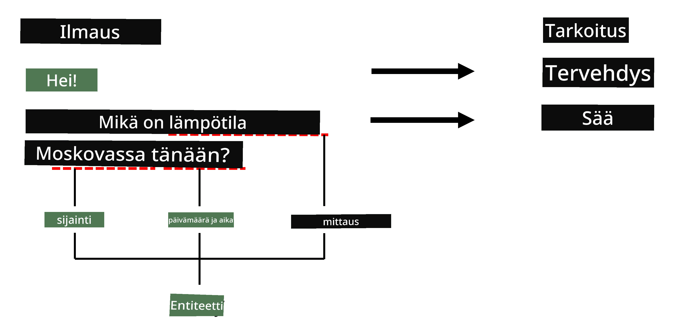
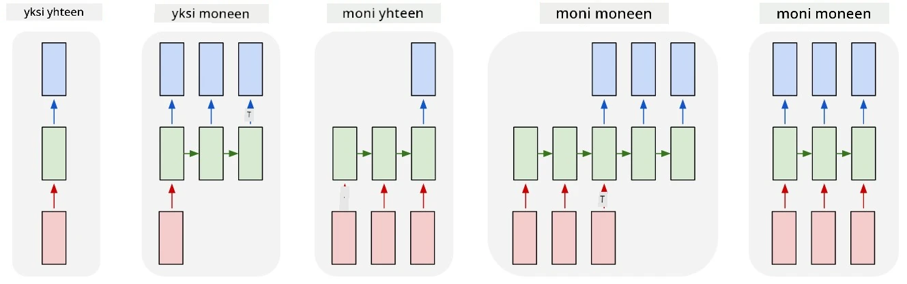

# Nimien tunnistus (Named Entity Recognition)

Tähän mennessä olemme keskittyneet pääasiassa yhteen NLP-tehtävään - luokitteluun. On kuitenkin olemassa myös muita NLP-tehtäviä, joita voidaan toteuttaa neuroverkoilla. Yksi näistä tehtävistä on **[nimien tunnistus](https://wikipedia.org/wiki/Named-entity_recognition)** (NER), joka keskittyy tunnistamaan tekstistä tiettyjä entiteettejä, kuten paikkoja, henkilön nimiä, päivämäärä- ja aikavälejä, kemiallisia kaavoja ja niin edelleen.

## [Ennakkokysely](https://ff-quizzes.netlify.app/en/ai/quiz/37)

## Esimerkki NER:n käytöstä

Oletetaan, että haluat kehittää luonnollisen kielen chatbotin, joka on samanlainen kuin Amazon Alexa tai Google Assistant. Älykkäät chatbotit toimivat *ymmärtämällä* käyttäjän tarpeet tekemällä tekstiluokittelua syötteenä annettuun lauseeseen. Tämän luokittelun tuloksena saadaan niin sanottu **intentio**, joka määrittää, mitä chatbotin tulisi tehdä.

> Kuva: kirjoittaja

Käyttäjä voi kuitenkin antaa joitakin parametreja osana lausetta. Esimerkiksi säätä kysyessään hän voi määrittää sijainnin tai ajankohdan. Botin tulisi pystyä ymmärtämään nämä entiteetit ja täyttämään parametripaikat vastaavasti ennen toiminnan suorittamista. Juuri tässä NER astuu kuvaan.

> ✅ Toinen esimerkki voisi olla [tieteellisten lääketieteellisten artikkeleiden analysointi](https://soshnikov.com/science/analyzing-medical-papers-with-azure-and-text-analytics-for-health/). Yksi tärkeimmistä asioista, joita meidän täytyy etsiä, ovat tietyt lääketieteelliset termit, kuten sairaudet ja lääkeaineet. Vaikka pieni määrä sairauksia voidaan todennäköisesti tunnistaa merkkijonohakua käyttämällä, monimutkaisemmat entiteetit, kuten kemialliset yhdisteet ja lääkkeiden nimet, vaativat monimutkaisempaa lähestymistapaa.

## NER token-luokitteluna

NER-mallit ovat pohjimmiltaan **token-luokittelumalleja**, koska jokaiselle syötteen tokenille meidän täytyy päättää, kuuluuko se johonkin entiteettiin vai ei, ja jos kuuluu - mihin entiteettiluokkaan.

Tarkastellaan seuraavaa artikkelin otsikkoa:

**Kolmiliuskaisen läpän vuoto** ja **litiumkarbonaatin** **toksisuus** vastasyntyneellä lapsella.

Entiteetit tässä ovat:

* Kolmiliuskaisen läpän vuoto on sairaus (`DIS`)
* Litiumkarbonaatti on kemiallinen aine (`CHEM`)
* Toksisuus on myös sairaus (`DIS`)

Huomaa, että yksi entiteetti voi ulottua usean tokenin yli. Ja kuten tässä tapauksessa, meidän täytyy erottaa toisistaan kaksi peräkkäistä entiteettiä. Siksi on yleistä käyttää kahta luokkaa kullekin entiteetille - yksi määrittää entiteetin ensimmäisen tokenin (usein käytetään etuliitettä `B-`, joka tarkoittaa **b**eginning eli alkua), ja toinen entiteetin jatkumon (`I-`, joka tarkoittaa **i**nner eli sisäistä tokenia). Käytämme myös `O`-luokkaa edustamaan kaikkia **m**uita tokeneita. Tällainen tokenien tagitus tunnetaan nimellä [BIO-tagitus](https://en.wikipedia.org/wiki/Inside%E2%80%93outside%E2%80%93beginning_(tagging)) (tai IOB). Kun otsikko on tagitettu, se näyttää tältä:

Token | Tag
------|-----
Kolmiliuskaisen | B-DIS
läpän | I-DIS
vuoto | I-DIS
ja | O
litium | B-CHEM
karbonaatti | I-CHEM
toksisuus | B-DIS
vastasyntyneellä | O
lapsella | O
. | O

Koska meidän täytyy rakentaa yksi-yhteen vastaavuus tokenien ja luokkien välillä, voimme kouluttaa oikeanpuoleisen **moni-moniin** neuroverkkopohjaisen mallin tästä kuvasta:

> *Kuva [tästä blogikirjoituksesta](http://karpathy.github.io/2015/05/21/rnn-effectiveness/) kirjoittajalta [Andrej Karpathy](http://karpathy.github.io/). NER token-luokittelumallit vastaavat oikeanpuoleista verkkoarkkitehtuuria tässä kuvassa.*

## NER-mallien kouluttaminen

Koska NER-malli on pohjimmiltaan token-luokittelumalli, voimme käyttää RNN:itä, joihin olemme jo tutustuneet, tämän tehtävän suorittamiseen. Tässä tapauksessa jokainen toistuvan verkon lohko palauttaa tokenin ID:n. Seuraava esimerkkivihko näyttää, kuinka LSTM voidaan kouluttaa token-luokitteluun.

## ✍️ Esimerkkivihkot: NER

Jatka oppimista seuraavassa vihkossa:

* [NER TensorFlow'lla](NER-TF.ipynb)

## Yhteenveto

NER-malli on **token-luokittelumalli**, mikä tarkoittaa, että sitä voidaan käyttää token-luokittelun suorittamiseen. Tämä on erittäin yleinen tehtävä NLP:ssä, ja se auttaa tunnistamaan tekstistä tiettyjä entiteettejä, kuten paikkoja, nimiä, päivämääriä ja paljon muuta.

## 🚀 Haaste

Suorita alla linkitetty tehtävä, jossa koulutat nimien tunnistusmallin lääketieteellisiä termejä varten, ja kokeile sitä sitten eri datasetillä.

## [Jälkikysely](https://ff-quizzes.netlify.app/en/ai/quiz/38)

## Kertaus ja itseopiskelu

Lue blogikirjoitus [The Unreasonable Effectiveness of Recurrent Neural Networks](http://karpathy.github.io/2015/05/21/rnn-effectiveness/) ja tutustu artikkelin lisälukemisosioon syventääksesi tietämystäsi.

## [Tehtävä](lab/README.md)

Tämän oppitunnin tehtävässä sinun tulee kouluttaa lääketieteellisten entiteettien tunnistusmalli. Voit aloittaa LSTM-mallin kouluttamisella, kuten tässä oppitunnissa on kuvattu, ja jatkaa BERT-transformerimallin käyttämiseen. Lue [ohjeet](lab/README.md) saadaksesi kaikki yksityiskohdat.

---

