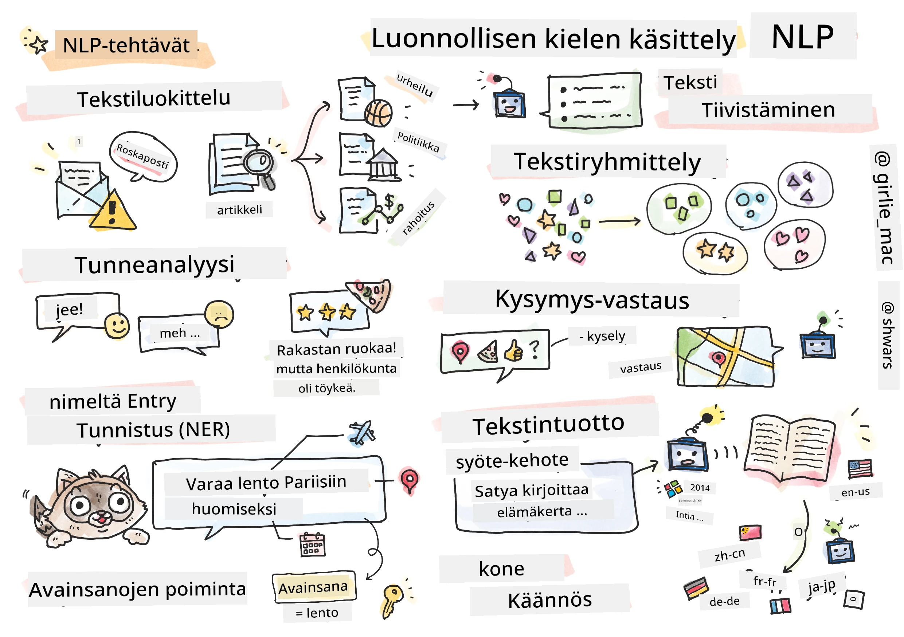

# Luonnollisen kielen käsittely



Tässä osiossa keskitymme käyttämään hermoverkkoja tehtävien käsittelemiseksi, jotka liittyvät **luonnollisen kielen käsittelyyn (NLP)**. On monia NLP-ongelmia, jotka haluamme tietokoneiden pystyvän ratkaisemaan:

* **Tekstin luokittelu** on tyypillinen luokittelutehtävä, joka koskee tekstijonoja. Esimerkkeinä ovat sähköpostiviestien luokittelu roskapostiksi tai ei-roskapostiksi, tai artikkeleiden luokittelu urheilu-, liiketoiminta-, politiikka-kategorioihin jne. Myös, kun kehitetään chatbotteja, meidän on usein ymmärrettävä, mitä käyttäjä halusi sanoa – tässä tapauksessa käsittelemme **aikomusluokittelua**. Usein aikomusluokittelussa pitää käsitellä monia kategorioita.
* **Sentimenttianalyysi** on tyypillinen regressiotehtävä, jossa meidän täytyy antaa numero (sentimentti), joka vastaa kuinka positiivinen/negatiivinen lauseen merkitys on. Kehittyneempi versio sentimenttianalyysistä on **aspektipohjainen sentimenttianalyysi** (ABSA), jossa sentimentti määritetään ei koko lauseelle, vaan sen eri osille (aspekteille), esim. *Tässä ravintolassa pidin ruoasta, mutta ilmapiiri oli hirveä*.
* **Nimien entiteettien tunnistus** (NER) tarkoittaa tiettyjen entiteettien poimimista tekstistä. Esimerkiksi meidän täytyy ymmärtää, että lauseessa *Minun pitää lentää Pariisiin huomenna* sana *huomenna* viittaa PÄIVÄMÄÄRÄÄN, ja *Pariisi* on PAIKKA.  
* **Avainsanojen poiminta** on samanlaista kuin NER, mutta tässä meidän täytyy automaattisesti poimia lauseen merkitykselle tärkeitä sanoja ilman ennakkokoulutusta tiettyihin entiteettityyppeihin.
* **Tekstiryhmittely** voi olla hyödyllistä, kun haluamme ryhmitellä samanlaisia lauseita, esimerkiksi samankaltaisia pyyntöjä teknisen tuen keskusteluissa.
* **Kysymysten vastaaminen** tarkoittaa mallin kykyä vastata tiettyyn kysymykseen. Malli saa syötteenä tekstikappaleen ja kysymyksen, ja sen täytyy antaa paikka tekstistä, jossa kysymyksen vastaus on (tai joskus generoida vastausteksti).
* **Tekstin generointi** on kyky generoida uutta tekstiä. Sitä voidaan pitää luokittelutehtävänä, joka ennustaa seuraavan kirjaimen/sanan perustuen johonkin *tekstikehotteeseen*. Edistyneet tekstin generointimallit, kuten GPT-3, pystyvät ratkomaan myös muita NLP-tehtäviä luokittelun osalta käyttämällä tekniikkaa, jota kutsutaan [prompt-ohjelmoinniksi](https://towardsdatascience.com/software-3-0-how-prompting-will-change-the-rules-of-the-game-a982fbfe1e0) tai [prompt-suunnitteluksi](https://medium.com/swlh/openai-gpt-3-and-prompt-engineering-dcdc2c5fcd29)
* **Tekstin tiivistäminen** on tekniikka, jossa haluamme, että tietokone "lukee" pitkän tekstin ja tiivistää sen muutamaan lauseeseen.
* **Konekäännös** voidaan nähdä tekstin ymmärtämisen ja tekstin generoinnin yhdistelmänä kahdella eri kielellä.

Aluksi suurin osa NLP-tehtävistä ratkaistiin perinteisillä menetelmillä, kuten kielioppisääntöjen avulla. Esimerkiksi konekäännöksessä käytettiin jäsennintä (parser), joka muunsi alkuperäisen lauseen syntaksipuuksi, sitten korkeamman tason semanttisia rakenteita poimittiin lauseen merkityksen esittämiseksi, ja tämän merkityksen sekä kohdekielen kieliopin perusteella tulos generoitiin. Nykyään monet NLP-tehtävät ratkaistaan tehokkaammin hermoverkkojen avulla.

> Monet klassiset NLP-menetelmät on toteutettu [Natural Language Processing Toolkit (NLTK)](https://www.nltk.org) Python-kirjastossa. Saatavilla on loistava [NLTK-kirja](https://www.nltk.org/book/), joka kattaa miten erilaisia NLP-tehtäviä voidaan ratkaista käyttämällä NLTK:ta.

Kurssillamme keskitymme pääasiassa hermoverkkojen käyttöön NLP:ssä, ja käytämme NLTK:ta tarvittaessa.

Olemme jo oppineet käyttämään hermoverkkoja taulukkomuotoisen datan ja kuvien käsittelyyn. Pääasiallinen ero näiden tietotyyppien ja tekstin välillä on, että teksti on muuttuvan pituinen jono, kun taas kuvien syötekoon koko tiedetään etukäteen. Vaikka konvoluutioneuroverkot pystyvät poimimaan kuvioita syötedatasta, tekstin kuviot ovat monimutkaisempia. Esim., kieltosanat voivat olla erillään subjektista mielivaltaisen monta sanaa (esim. *En pidä appelsiineista* vs. *En pidä niistä isoista värikkäistä maukkaista appelsiineista*), ja tämä pitäisi kuitenkin tulkita yhtenä kuviona. Siksi kielen käsittelyssä tarvitsemme uusia hermoverkkotyyppejä, kuten *toistuvat verkot* ja *transformerit*.

## Kirjastojen asennus

Jos käytät paikallista Python-asennusta tämän kurssin ajamiseen, saatat joutua asentamaan kaikki tarvittavat NLP-kirjastot seuraavilla komennoilla:

**PyTorchille**
```bash
pip install -r requirements-pytorch.txt
```
**TensorFlow'lle**
```bash
pip install -r requirements-tf.txt
```

> Voit kokeilla NLP:tä TensorFlown kanssa [Microsoft Learnissä](https://docs.microsoft.com/learn/modules/intro-natural-language-processing-tensorflow/?WT.mc_id=academic-77998-cacaste)

## GPU-varoitus

Tässä osiossa joidenkin esimerkkien mallien harjoittaminen on melko suurta.
* **Käytä GPU:lla varustettua konetta**: On suositeltavaa ajaa muistikirjojasi GPU:lla varustetulla koneella vähentääksesi odotusaikoja suurten mallien kanssa työskennellessä.
* **GPU-muistin rajoitukset**: GPU:lla ajaminen voi johtaa tilanteisiin, joissa GPU-muisti loppuu, erityisesti suuria malleja kouluttaessa.
* **GPU-muistin kulutus**: Koulutuksen aikana käytetty GPU-muistin määrä riippuu monista tekijöistä, mukaan lukien minibatchin koko.
* **Minibatchin koon minimointi**: Jos kohtaat ongelmia GPU-muistin kanssa, harkitse minibatchin koon pienentämistä koodissasi.
* **TensorFlow'n GPU-muistin vapautus**: Vanhemmat TensorFlow-versiot eivät välttämättä vapauta GPU-muistia oikein, kun koulutetaan useita malleja saman Python-ytimen sisällä. GPU-muistin hallinnan optimoimiseksi voit konfiguroida TensorFlow'hun lataamaan GPU-muistia vain tarpeen mukaan.
* **Koodin lisääminen**: Asettaaksesi TensorFlow'n kasvattamaan GPU-muistin käyttöä tarpeen mukaan, lisää seuraava koodi muistikirjoihisi:

```python
physical_devices = tf.config.list_physical_devices('GPU') 
if len(physical_devices)>0:
    tf.config.experimental.set_memory_growth(physical_devices[0], True) 
```

Jos olet kiinnostunut oppimaan NLP:tä klassisesta koneoppimisen näkökulmasta, käy [tässä oppimateriaalissa](https://github.com/microsoft/ML-For-Beginners/tree/main/6-NLP)

## Tässä osiossa
Tässä osiossa opimme:

* [Tekstin esittäminen tensoreina](13-TextRep/README.md)
* [Sanasijoitukset](14-Embeddings/README.md)
* [Kielimallit](15-LanguageModeling/README.md)
* [Toistuvat hermoverkot](16-RNN/README.md)
* [Generatiiviset verkot](17-GenerativeNetworks/README.md)
* [Transformerit](18-Transformers/README.md)

---

<!-- CO-OP TRANSLATOR DISCLAIMER START -->
**Vastuuvapauslauseke**:
Tämä asiakirja on käännetty käyttämällä tekoälypohjaista käännöspalvelua [Co-op Translator](https://github.com/Azure/co-op-translator). Vaikka pyrimme tarkkuuteen, otathan huomioon, että automaattiset käännökset saattavat sisältää virheitä tai epätarkkuuksia. Alkuperäinen asiakirja sen alkuperäiskielellä on virallinen lähde. Tärkeissä asioissa suositellaan ammattimaista ihmiskäännöstä. Emme ole vastuussa tämän käännöksen käytöstä aiheutuvista väärinymmärryksistä tai tulkinnoista.
<!-- CO-OP TRANSLATOR DISCLAIMER END -->