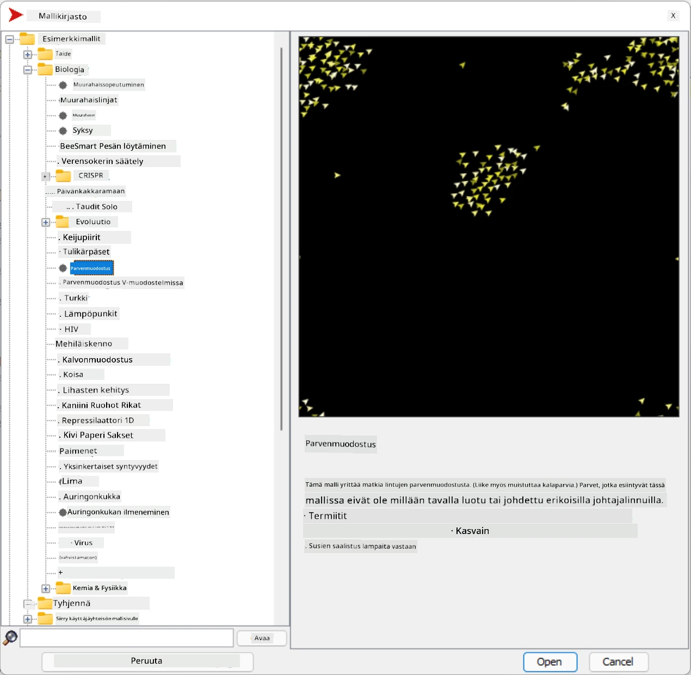
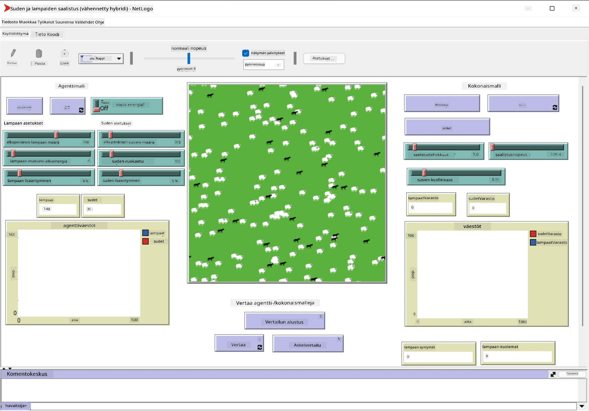

# Multi-agenttijärjestelmät

Yksi mahdollinen tapa saavuttaa älykkyyttä on niin sanottu **emergentti** (tai **synergeettinen**) lähestymistapa, joka perustuu siihen, että monien suhteellisen yksinkertaisten agenttien yhdistetty käyttäytyminen voi johtaa järjestelmän kokonaisvaltaisesti monimutkaisempaan (tai älykkäämpään) käyttäytymiseen. Teoreettisesti tämä perustuu [kollektiivisen älykkyyden](https://en.wikipedia.org/wiki/Collective_intelligence), [emergentismin](https://en.wikipedia.org/wiki/Global_brain) ja [evolutionaarisen kybernetiikan](https://en.wikipedia.org/wiki/Global_brain) periaatteisiin, jotka väittävät, että korkeamman tason järjestelmät saavat jonkinlaista lisäarvoa, kun ne yhdistetään asianmukaisesti alemman tason järjestelmistä (niin sanottu *metajärjestelmäsiirtymän periaate*).

## [Ennakkokysely](https://ff-quizzes.netlify.app/en/ai/quiz/45)

**Multi-agenttijärjestelmät** nousivat esiin tekoälyn alalla 1990-luvulla vastauksena internetin ja hajautettujen järjestelmien kasvuun. Yksi klassisista tekoälyn oppikirjoista, [Artificial Intelligence: A Modern Approach](https://en.wikipedia.org/wiki/Artificial_Intelligence:_A_Modern_Approach), tarkastelee klassista tekoälyä multi-agenttijärjestelmien näkökulmasta.

Multi-agenttilähestymistavan keskiössä on **agentin** käsite - entiteetti, joka elää jossain **ympäristössä**, jota se voi havaita ja johon se voi vaikuttaa. Tämä on hyvin laaja määritelmä, ja agentteja voi olla monenlaisia ja eri luokitteluita:

* Kyvyn perusteella tehdä päätöksiä:
   - **Reaktiiviset** agentit toimivat yleensä yksinkertaisella pyyntö-vastaus-tyyppisellä käyttäytymisellä
   - **Pohdiskelevat** agentit käyttävät jonkinlaista loogista päättelyä ja/tai suunnittelukykyjä
* Paikan perusteella, jossa agentti suorittaa koodinsa:
   - **Staattiset** agentit toimivat omistetulla verkkosolmulla
   - **Liikkuvat** agentit voivat siirtää koodinsa verkkosolmujen välillä
* Käyttäytymisen perusteella:
   - **Passiiviset agentit** eivät omaa erityisiä tavoitteita. Tällaiset agentit voivat reagoida ulkoisiin ärsykkeisiin, mutta eivät aloita toimia itse.
   - **Aktiiviset agentit** omaavat tavoitteita, joita ne pyrkivät saavuttamaan
   - **Kognitiiviset agentit** sisältävät monimutkaista suunnittelua ja päättelyä

Multi-agenttijärjestelmiä käytetään nykyään monissa sovelluksissa:

* Peleissä monet ei-pelaajahahmot käyttävät jonkinlaista tekoälyä ja voidaan katsoa olevan älykkäitä agentteja
* Videotuotannossa monimutkaisten 3D-kohtausten renderöinti, jotka sisältävät väkijoukkoja, tehdään tyypillisesti multi-agenttisimulaation avulla
* Järjestelmämallinnuksessa multi-agenttilähestymistapaa käytetään simuloimaan monimutkaisen mallin käyttäytymistä. Esimerkiksi multi-agenttilähestymistapaa on käytetty menestyksekkäästi ennustamaan COVID-19-taudin leviämistä maailmanlaajuisesti. Samanlaista lähestymistapaa voidaan käyttää mallintamaan kaupungin liikennettä ja tarkastelemaan, miten se reagoi liikennesääntöjen muutoksiin.
* Monimutkaisissa automaatiojärjestelmissä jokainen laite voi toimia itsenäisenä agenttina, mikä tekee koko järjestelmästä vähemmän monoliittisen ja kestävämmän.

Emme käytä paljon aikaa syventyäksemme multi-agenttijärjestelmiin, mutta tarkastelemme yhtä esimerkkiä **multi-agenttimallinnuksesta**.

## NetLogo

[NetLogo](https://ccl.northwestern.edu/netlogo/) on multi-agenttimallinnusympäristö, joka perustuu muokattuun versioon [Logo](https://en.wikipedia.org/wiki/Logo_(programming_language))-ohjelmointikielestä. Tämä kieli kehitettiin ohjelmointikonseptien opettamiseen lapsille, ja sen avulla voit ohjata agenttia nimeltä **kilpikonna**, joka voi liikkua ja jättää jäljen taakseen. Tämä mahdollistaa monimutkaisten geometristen kuvioiden luomisen, mikä on hyvin visuaalinen tapa ymmärtää agentin käyttäytymistä.

NetLogossa voimme luoda useita kilpikonnia käyttämällä `create-turtles`-komentoa. Voimme sitten käskeä kaikkia kilpikonnia tekemään joitain toimia (alla olevassa esimerkissä - liikkumaan 10 pistettä eteenpäin):

```
create-turtles 10
ask turtles [
  forward 10
]
```

Tietenkään ei ole mielenkiintoista, jos kaikki kilpikonnat tekevät saman asian, joten voimme `ask`-komennolla kohdistaa ryhmiä kilpikonnia, esimerkiksi niitä, jotka ovat tietyn pisteen läheisyydessä. Voimme myös luoda kilpikonnia eri *rotuihin* käyttämällä `breed [cats cat]`-komentoa. Tässä `cat` on rodun nimi, ja meidän täytyy määritellä sekä yksikkö- että monikkomuoto, koska eri komennot käyttävät eri muotoja selkeyden vuoksi.

> ✅ Emme syvenny NetLogo-kielen oppimiseen - voit vierailla erinomaisessa [Beginner's Interactive NetLogo Dictionary](https://ccl.northwestern.edu/netlogo/bind/)-resurssissa, jos olet kiinnostunut oppimaan lisää.

Voit [ladata](https://ccl.northwestern.edu/netlogo/download.shtml) ja asentaa NetLogon kokeillaksesi sitä.

### Mallikirjasto

NetLogon hienous on siinä, että se sisältää kirjaston toimivia malleja, joita voit kokeilla. Siirry **File &rightarrow; Models Library**, ja sinulla on monia mallikategorioita, joista valita.



> Kuvakaappaus mallikirjastosta Dmitry Soshnikovilta

Voit avata yhden malleista, esimerkiksi **Biology &rightarrow; Flocking**.

### Pääperiaatteet

Kun avaat mallin, sinut ohjataan NetLogon pääruutuun. Tässä on esimerkkimalli, joka kuvaa susien ja lampaiden populaatiota rajallisten resurssien (ruohon) avulla.



> Kuvakaappaus Dmitry Soshnikovilta

Tällä ruudulla näet:

* **Käyttöliittymä**-osion, joka sisältää:
  - Pääkentän, jossa kaikki agentit elävät
  - Erilaisia ohjaimia: painikkeita, liukusäätimiä jne.
  - Graafeja, joita voit käyttää simulaation parametrien näyttämiseen
* **Koodi**-välilehden, joka sisältää editorin, jossa voit kirjoittaa NetLogo-ohjelman

Useimmissa tapauksissa käyttöliittymässä on **Setup**-painike, joka alustaa simulaation tilan, ja **Go**-painike, joka käynnistää suorituksen. Näitä käsitellään vastaavilla käsittelijöillä koodissa, jotka näyttävät tältä:

```
to go [
...
]
```

NetLogon maailma koostuu seuraavista objekteista:

* **Agentit** (kilpikonnat), jotka voivat liikkua kentällä ja tehdä jotain. Voit käskeä agentteja käyttämällä `ask turtles [...]`-syntaksia, ja hakasulkeissa oleva koodi suoritetaan kaikilla agenteilla *kilpikonnatilassa*.
* **Ruudut** ovat kentän neliömäisiä alueita, joilla agentit elävät. Voit viitata kaikkiin agentteihin samalla ruudulla, tai voit muuttaa ruutujen värejä ja joitain muita ominaisuuksia. Voit myös `ask patches`-komennolla käskeä ruutuja tekemään jotain.
* **Tarkkailija** on ainutlaatuinen agentti, joka hallitsee maailmaa. Kaikki painikkeiden käsittelijät suoritetaan *tarkkailijatilassa*.

> ✅ Multi-agenttiympäristön kauneus on siinä, että kilpikonnatilassa tai ruututtilassa suoritettava koodi suoritetaan samanaikaisesti kaikilla agenteilla rinnakkain. Näin ollen kirjoittamalla vähän koodia ja ohjelmoimalla yksittäisen agentin käyttäytymistä, voit luoda monimutkaisen simulaatiojärjestelmän käyttäytymisen kokonaisuutena.

### Parvikäyttäytyminen

Esimerkkinä multi-agenttikäyttäytymisestä tarkastellaan **[parvikäyttäytymistä](https://en.wikipedia.org/wiki/Flocking_(behavior))**. Parvikäyttäytyminen on monimutkainen kuvio, joka muistuttaa hyvin sitä, miten lintuparvet lentävät. Niiden lentoa katsellessa voi ajatella, että ne noudattavat jonkinlaista kollektiivista algoritmia tai että niillä on jonkinlainen *kollektiivinen älykkyys*. Tämä monimutkainen käyttäytyminen kuitenkin syntyy, kun jokainen yksittäinen agentti (tässä tapauksessa *lintu*) tarkkailee vain joitain muita agentteja lyhyen matkan päässä ja noudattaa kolmea yksinkertaista sääntöä:

* **Suuntauksen yhtenäisyys** - se ohjautuu kohti naapureiden keskimääräistä suuntaa
* **Yhteensulautuminen** - se pyrkii ohjautumaan kohti naapureiden keskimääräistä sijaintia (*pitkän matkan vetovoima*)
* **Erottelu** - kun se pääsee liian lähelle muita lintuja, se pyrkii siirtymään pois (*lyhyen matkan hylkiminen*)

Voit suorittaa parvikäyttäytymisesimerkin ja tarkkailla käyttäytymistä. Voit myös säätää parametreja, kuten *erottelun astetta* tai *näköetäisyyttä*, joka määrittää, kuinka kauas kukin lintu voi nähdä. Huomaa, että jos vähennät näköetäisyyden nollaan, kaikki linnut tulevat sokeiksi, ja parvikäyttäytyminen lakkaa. Jos vähennät erottelun nollaan, kaikki linnut kerääntyvät suoraan linjaan.

> ✅ Vaihda **Koodi**-välilehteen ja katso, missä parvikäyttäytymisen kolme sääntöä (suuntaus, yhteensulautuminen ja erottelu) on toteutettu koodissa. Huomaa, kuinka viittaamme vain niihin agenteihin, jotka ovat näköetäisyydellä.

### Muita malleja kokeiltavaksi

On muutamia muita mielenkiintoisia malleja, joita voit kokeilla:

* **Art &rightarrow; Fireworks** näyttää, kuinka ilotulitus voidaan nähdä yksittäisten tulivirtojen kollektiivisena käyttäytymisenä
* **Social Science &rightarrow; Traffic Basic** ja **Social Science &rightarrow; Traffic Grid** näyttävät kaupungin liikenteen mallin 1D- ja 2D-ruudukossa liikennevaloilla tai ilman. Jokainen auto simulaatiossa noudattaa seuraavia sääntöjä:
   - Jos edessä oleva tila on tyhjä - kiihdytä (tiettyyn maksiminopeuteen asti)
   - Jos se näkee esteen edessä - jarruta (ja voit säätää, kuinka kauas kuljettaja voi nähdä)
* **Social Science &rightarrow; Party** näyttää, kuinka ihmiset ryhmittyvät yhteen cocktailkutsuilla. Voit löytää parametrien yhdistelmän, joka johtaa ryhmän onnellisuuden nopeimpaan kasvuun.

Kuten näistä esimerkeistä näet, multi-agenttisimulaatiot voivat olla varsin hyödyllinen tapa ymmärtää monimutkaisen järjestelmän käyttäytymistä, joka koostuu yksilöistä, jotka noudattavat samaa tai samanlaista logiikkaa. Sitä voidaan myös käyttää virtuaalisten agenttien, kuten [NPC:iden](https://en.wikipedia.org/wiki/NPC) ohjaamiseen tietokonepeleissä tai agenttien ohjaamiseen 3D-animoiduissa maailmoissa.

## Pohdiskelevat agentit

Edellä kuvatut agentit ovat hyvin yksinkertaisia, reagoiden ympäristön muutoksiin jonkinlaisen algoritmin avulla. Sellaisina ne ovat **reaktiivisia agentteja**. Kuitenkin joskus agentit voivat tehdä päätelmiä ja suunnitella toimintaansa, jolloin niitä kutsutaan **pohdiskeleviksi**.

Tyypillinen esimerkki olisi henkilökohtainen agentti, joka saa ihmiseltä ohjeen varata lomamatkan. Oletetaan, että internetissä on monia agentteja, jotka voivat auttaa sitä. Sen pitäisi sitten ottaa yhteyttä muihin agentteihin nähdäkseen, mitkä lennot ovat saatavilla, mitkä ovat hotellien hinnat eri päivämäärille, ja yrittää neuvotella paras hinta. Kun lomamatkasuunnitelma on valmis ja omistaja vahvistanut sen, se voi jatkaa varausta.

Tätä varten agenttien täytyy **kommunikoida**. Onnistuneeseen kommunikointiin ne tarvitsevat:

* Joitain **standardikieliä tiedon vaihtoon**, kuten [Knowledge Interchange Format](https://en.wikipedia.org/wiki/Knowledge_Interchange_Format) (KIF) ja [Knowledge Query and Manipulation Language](https://en.wikipedia.org/wiki/Knowledge_Query_and_Manipulation_Language) (KQML). Nämä kielet on suunniteltu [puheaktiteorian](https://en.wikipedia.org/wiki/Speech_act) pohjalta.
* Näiden kielten tulisi myös sisältää joitain **neuvotteluprotokollia**, jotka perustuvat erilaisiin **huutokauppatyyppeihin**.
* **Yhteinen ontologia**, jota käytetään, jotta ne viittaavat samoihin käsitteisiin tietäen niiden semantiikan
* Tapa **löytää**, mitä eri agentit voivat tehdä, myös perustuen jonkinlaiseen ontologiaan

Pohdiskelevat agentit ovat paljon monimutkaisempia kuin reaktiiviset, koska ne eivät vain reagoi ympäristön muutoksiin, vaan niiden pitäisi myös pystyä *aloittamaan* toimia. Yksi ehdotetuista arkkitehtuureista pohdiskeleville agenteille on niin sanottu Usko-Tavoite-Aikomus (BDI) -agentti:

* **Uskomukset** muodostavat joukon tietoa agentin ympäristöstä. Se voi olla jäsennelty tietokantana tai sääntöjoukkona, jota agentti voi soveltaa tiettyyn tilanteeseen ympäristössä.
* **Tavoitteet** määrittelevät, mitä agentti haluaa tehdä, eli sen päämäärät. Esimerkiksi yllä olevan henkilökohtaisen avustaja-agentin tavoite on varata matka, ja hotellin agentin tavoite on maksimoida voitto.
* **Aikomukset** ovat erityisiä toimia, joita agentti suunnittelee saavuttaakseen tavoitteensa. Toimet muuttavat tyypillisesti ympäristöä ja aiheuttavat kommunikointia muiden agenttien kanssa.

Saatavilla on joitain alustoja multi-agenttijärjestelmien rakentamiseen, kuten [JADE](https://jade.tilab.com/). [Tämä artikkeli](https://arxiv.org/ftp/arxiv/papers/2007/2007.08961.pdf) sisältää katsauksen multi-agenttialustoista sekä lyhyen historian multi-agenttijärjestelmistä ja niiden eri käyttötilanteista.

## Yhteenveto

Multi-agenttijärjestelmät voivat ottaa hyvin erilaisia muotoja ja niitä voidaan käyttää monissa eri sovelluksissa. 
Ne kaikki pyrkivät keskittymään yksittäisen agentin yksinkertaisempaan käyttäytymiseen ja saavuttamaan järjestelmän kokonaisvaltaisesti monimutkaisemman käyttäytymisen **synergeettisen vaikutuksen** ansiosta.

## 🚀 Haaste

Vie tämä oppitunti todelliseen maailmaan ja yritä hahmottaa multi-agenttijärjestelmä, joka voi ratkaista ongelman. Mitä esimerkiksi multi-agenttijärjestelmän pitäisi tehdä optimoidakseen koulubussireitin? Miten se voisi toimia leipomossa?

## [Jälkikysely](https://ff-quizzes.netlify.app/en/ai/quiz/46)

## Katsaus & Itseopiskelu

Tarkastele tämän tyyppisen järjestelmän käyttöä teollisuudessa. Valitse jokin ala, kuten valmistus tai videopeliteollisuus, ja selvitä, miten multi-agenttijärjestelmiä voidaan käyttää ainutlaatuisten ongelmien ratkaisemiseen.

## [NetLogo-tehtävä](assignment.md)

---

