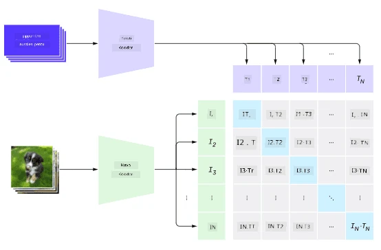
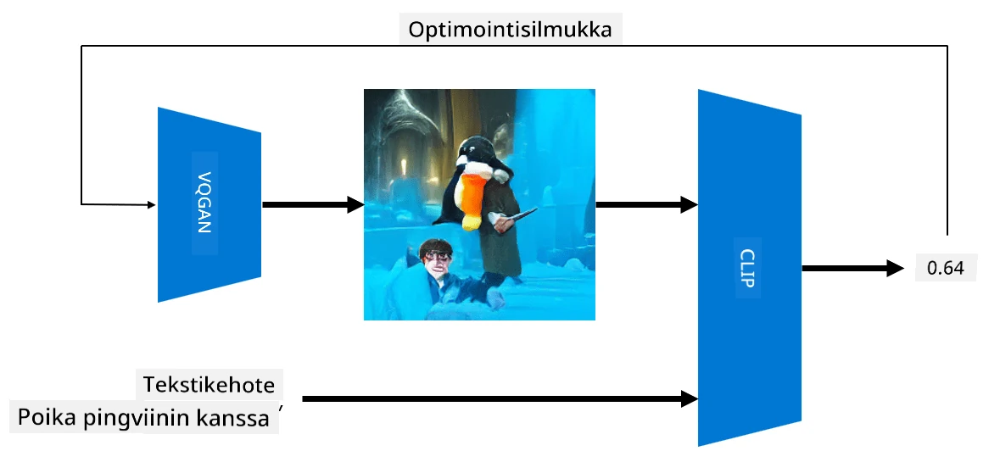

# Monimodaaliset verkot

Transformer-mallien menestyksen jälkeen NLP-tehtävissä samoja tai samankaltaisia arkkitehtuureja on alettu soveltaa myös tietokonenäkötehtäviin. Kasvava kiinnostus kohdistuu mallien rakentamiseen, jotka *yhdistävät* näkö- ja luonnollisen kielen käsittelyn kyvyt. Yksi tällainen yritys on OpenAI:n kehittämä CLIP ja DALL.E.

## Contrastive Image Pre-Training (CLIP)

CLIP:n pääidea on kyky verrata tekstikehotteita kuvaan ja määrittää, kuinka hyvin kuva vastaa kehotetta.

> *Kuva [tästä blogikirjoituksesta](https://openai.com/blog/clip/)*

Malli on koulutettu Internetistä kerätyillä kuvilla ja niiden kuvateksteillä. Jokaisessa erässä otetaan N paria (kuva, teksti) ja muunnetaan ne vektoriedustuksiksi I, ..., T. 

Nämä edustukset yhdistetään toisiinsa. Tappiofunktio on määritelty maksimoimaan kosinissimilariteetti yhden parin (esim. I ja T) välillä ja minimoimaan kosinissimilariteetti kaikkien muiden parien välillä. Tästä syystä tätä lähestymistapaa kutsutaan **kontrastiiviseksi**.

CLIP-malli/kirjasto on saatavilla [OpenAI:n GitHubista](https://github.com/openai/CLIP). Lähestymistapaa on kuvattu [tässä blogikirjoituksessa](https://openai.com/blog/clip/) ja tarkemmin [tässä artikkelissa](https://arxiv.org/pdf/2103.00020.pdf).

Kun tämä malli on esikoulutettu, sille voidaan antaa erä kuvia ja tekstikehotteita, ja se palauttaa tensorin, jossa on todennäköisyyksiä. CLIP:ä voidaan käyttää useisiin tehtäviin:

**Kuvien luokittelu**

Oletetaan, että meidän täytyy luokitella kuvia esimerkiksi kissoihin, koiriin ja ihmisiin. Tässä tapauksessa voimme antaa mallille kuvan ja sarjan tekstikehotteita: "*kuva kissasta*", "*kuva koirasta*", "*kuva ihmisestä*". Tuloksena olevasta kolmen todennäköisyyden vektorista valitsemme vain indeksin, jolla on korkein arvo.

> *Kuva [tästä blogikirjoituksesta](https://openai.com/blog/clip/)*

**Tekstipohjainen kuvahaku**

Voimme tehdä myös päinvastoin. Jos meillä on kokoelma kuvia, voimme syöttää tämän kokoelman mallille ja antaa tekstikehotteen – tämä antaa meille kuvan, joka on eniten samanlainen kuin annettu kehotus.

## ✍️ Esimerkki: [CLIP:n käyttö kuvien luokitteluun ja kuvahakuun](Clip.ipynb)

Avaa [Clip.ipynb](Clip.ipynb) -muistikirja nähdäksesi CLIP toiminnassa.

## Kuvien generointi VQGAN+CLIP:llä

CLIP:ä voidaan käyttää myös **kuvien generointiin** tekstikehotteesta. Tätä varten tarvitaan **generaattorimalli**, joka pystyy tuottamaan kuvia jonkin vektorisyötteen perusteella. Yksi tällainen malli on nimeltään [VQGAN](https://compvis.github.io/taming-transformers/) (Vector-Quantized GAN).

VQGAN:n pääideat, jotka erottavat sen tavallisesta [GAN:sta](../../4-ComputerVision/10-GANs/README.md), ovat seuraavat:
* Autoregressiivisen transformer-arkkitehtuurin käyttö tuottamaan kontekstirikkaita visuaalisia osia, jotka muodostavat kuvan. Nämä visuaaliset osat oppii [CNN](../../4-ComputerVision/07-ConvNets/README.md).
* Alikuvan diskriminaattorin käyttö, joka tunnistaa, ovatko kuvan osat "aitoja" vai "vääriä" (toisin kuin perinteisen GAN:n "kaikki tai ei mitään" -lähestymistapa).

Lisätietoja VQGAN:sta löytyy [Taming Transformers](https://compvis.github.io/taming-transformers/) -sivustolta.

Yksi tärkeä ero VQGAN:n ja perinteisen GAN:n välillä on, että jälkimmäinen voi tuottaa kelvollisen kuvan mistä tahansa syötevektorista, kun taas VQGAN todennäköisesti tuottaa kuvan, joka ei ole koherentti. Siksi kuvan luomisprosessia täytyy ohjata edelleen, ja tämä voidaan tehdä CLIP:llä.

Tuottaaksemme kuvan, joka vastaa tekstikehotetta, aloitamme satunnaisella koodausvektorilla, joka syötetään VQGAN:lle kuvan tuottamiseksi. Sitten CLIP:ä käytetään tuottamaan tappiofunktio, joka osoittaa, kuinka hyvin kuva vastaa tekstikehotetta. Tavoitteena on minimoida tämä tappio käyttämällä takaisinkytkentää syötevektorin parametrien säätämiseen.

Loistava kirjasto, joka toteuttaa VQGAN+CLIP:n, on [Pixray](http://github.com/pixray/pixray).

 |   | 
----|----|----
Kuva, joka on tuotettu kehotteesta *a closeup watercolor portrait of young male teacher of literature with a book* | Kuva, joka on tuotettu kehotteesta *a closeup oil portrait of young female teacher of computer science with a computer* | Kuva, joka on tuotettu kehotteesta *a closeup oil portrait of old male teacher of mathematics in front of blackboard*

> Kuvat **Artificial Teachers** -kokoelmasta, tekijä [Dmitry Soshnikov](http://soshnikov.com)

## DALL-E
### [DALL-E 1](https://openai.com/research/dall-e)
DALL-E on GPT-3:n versio, joka on koulutettu tuottamaan kuvia kehotteista. Sitä on koulutettu 12 miljardilla parametrilla.

Toisin kuin CLIP, DALL-E vastaanottaa sekä tekstin että kuvan yhtenä token-virtana. Näin ollen useista kehotteista voidaan tuottaa kuvia tekstin perusteella.

### [DALL-E 2](https://openai.com/dall-e-2)
Suurin ero DALL.E 1:n ja 2:n välillä on, että jälkimmäinen tuottaa realistisempia kuvia ja taidetta.

Esimerkkejä DALL-E:n tuottamista kuvista:
 |   | 
----|----|----
Kuva, joka on tuotettu kehotteesta *a closeup watercolor portrait of young male teacher of literature with a book* | Kuva, joka on tuotettu kehotteesta *a closeup oil portrait of young female teacher of computer science with a computer* | Kuva, joka on tuotettu kehotteesta *a closeup oil portrait of old male teacher of mathematics in front of blackboard*

## Viitteet

* VQGAN-artikkeli: [Taming Transformers for High-Resolution Image Synthesis](https://compvis.github.io/taming-transformers/paper/paper.pdf)
* CLIP-artikkeli: [Learning Transferable Visual Models From Natural Language Supervision](https://arxiv.org/pdf/2103.00020.pdf)

---

**Vastuuvapauslauseke**:  
Tämä asiakirja on käännetty käyttämällä tekoälypohjaista käännöspalvelua [Co-op Translator](https://github.com/Azure/co-op-translator). Vaikka pyrimme tarkkuuteen, huomioithan, että automaattiset käännökset voivat sisältää virheitä tai epätarkkuuksia. Alkuperäinen asiakirja sen alkuperäisellä kielellä tulisi pitää ensisijaisena lähteenä. Kriittisen tiedon osalta suositellaan ammattimaista ihmiskäännöstä. Emme ole vastuussa väärinkäsityksistä tai virhetulkinnoista, jotka johtuvat tämän käännöksen käytöstä.