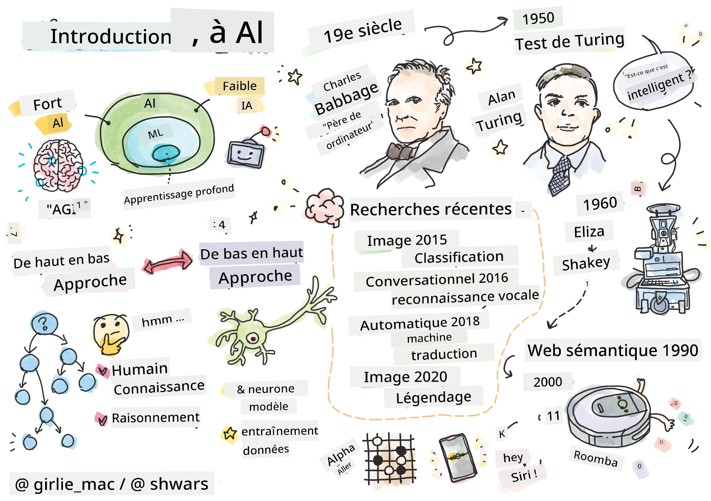
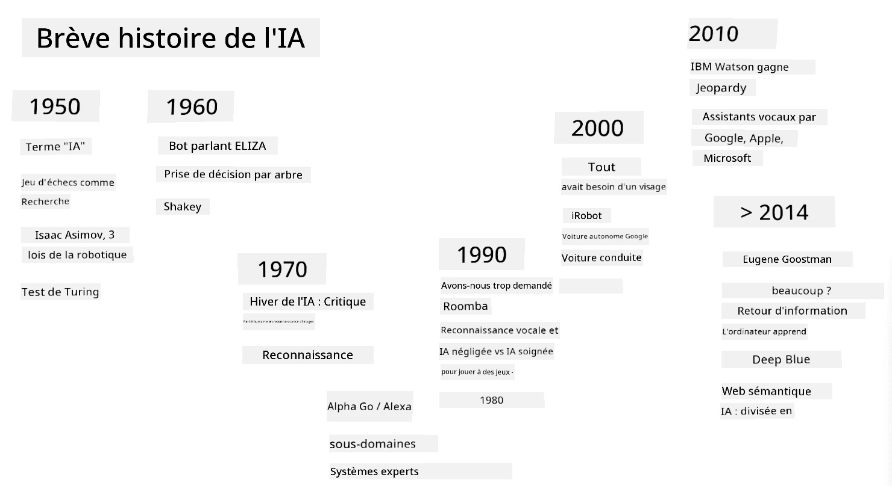
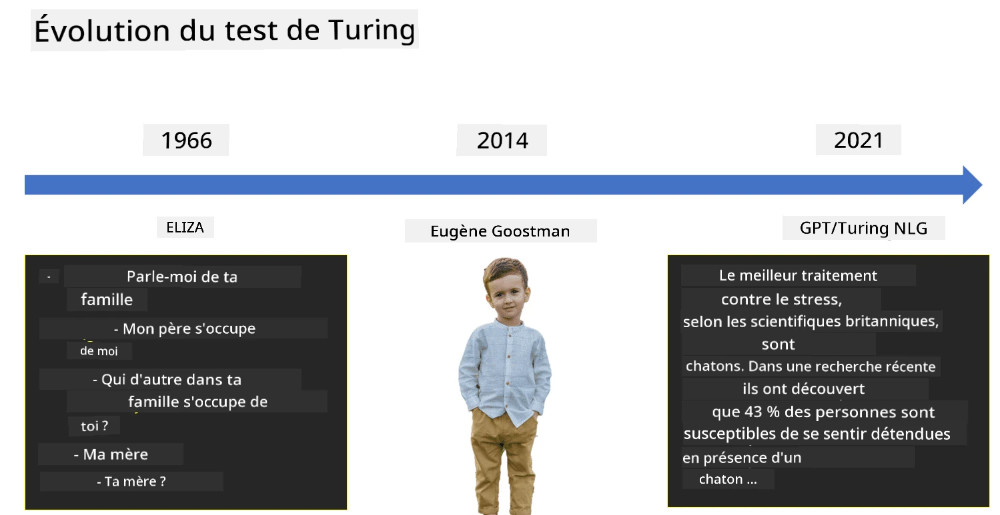

# Introduction à l'IA

> Sketchnote par [Tomomi Imura](https://twitter.com/girlie_mac)

## [Quiz avant le cours](https://ff-quizzes.netlify.app/en/ai/quiz/1)

**L'intelligence artificielle** est une discipline scientifique passionnante qui étudie comment nous pouvons amener les ordinateurs à adopter un comportement intelligent, c'est-à-dire à accomplir des tâches que les êtres humains maîtrisent bien.

À l'origine, les ordinateurs ont été inventés par [Charles Babbage](https://en.wikipedia.org/wiki/Charles_Babbage) pour manipuler des nombres en suivant une procédure bien définie - un algorithme. Les ordinateurs modernes, bien qu'extrêmement plus avancés que le modèle initial proposé au XIXe siècle, suivent toujours le même principe de calculs contrôlés. Ainsi, il est possible de programmer un ordinateur pour accomplir une tâche si nous connaissons la séquence exacte d'étapes nécessaires pour atteindre l'objectif.

> Photo par [Vickie Soshnikova](http://twitter.com/vickievalerie)

> ✅ Déterminer l'âge d'une personne à partir de sa photo est une tâche qui ne peut pas être programmée explicitement, car nous ne savons pas comment nous arrivons à un chiffre dans notre tête lorsque nous le faisons.

---

Cependant, certaines tâches ne peuvent pas être résolues de manière explicite. Prenons l'exemple de déterminer l'âge d'une personne à partir de sa photo. Nous apprenons à le faire en observant de nombreux exemples de personnes d'âges différents, mais nous ne pouvons pas expliquer précisément comment nous y parvenons, ni programmer un ordinateur pour le faire. C'est précisément ce type de tâche qui intéresse **l'intelligence artificielle** (IA).

✅ Pensez à des tâches que vous pourriez déléguer à un ordinateur et qui bénéficieraient de l'IA. Réfléchissez aux domaines de la finance, de la médecine et des arts - comment ces domaines profitent-ils aujourd'hui de l'IA ?

## IA faible vs IA forte

IA faible | IA forte
---------------------------------------|-------------------------------------
L'IA faible désigne des systèmes d'IA conçus et entraînés pour une tâche spécifique ou un ensemble limité de tâches.|L'IA forte, ou Intelligence Artificielle Générale (AGI), désigne des systèmes d'IA dotés d'une intelligence et d'une compréhension au niveau humain.
Ces systèmes d'IA ne sont pas généralement intelligents ; ils excellent dans l'exécution d'une tâche prédéfinie mais manquent de véritable compréhension ou de conscience.|Ces systèmes d'IA ont la capacité d'accomplir toute tâche intellectuelle qu'un être humain peut faire, de s'adapter à différents domaines et de posséder une forme de conscience ou de conscience de soi.
Exemples d'IA faible : assistants virtuels comme Siri ou Alexa, algorithmes de recommandation utilisés par les services de streaming, et chatbots conçus pour des tâches spécifiques de service client.|Atteindre l'IA forte est un objectif à long terme de la recherche en IA et nécessiterait le développement de systèmes d'IA capables de raisonner, d'apprendre, de comprendre et de s'adapter à une large gamme de tâches et de contextes.
L'IA faible est hautement spécialisée et ne possède pas de capacités cognitives humaines ou de capacités générales de résolution de problèmes au-delà de son domaine limité.|L'IA forte est actuellement un concept théorique, et aucun système d'IA n'a atteint ce niveau d'intelligence générale.

Pour plus d'informations, consultez **[Intelligence Artificielle Générale](https://en.wikipedia.org/wiki/Artificial_general_intelligence)** (AGI).

## La définition de l'intelligence et le test de Turing

L'un des problèmes liés au terme **[Intelligence](https://en.wikipedia.org/wiki/Intelligence)** est qu'il n'existe pas de définition claire de ce terme. On peut soutenir que l'intelligence est liée à la **pensée abstraite** ou à la **conscience de soi**, mais nous ne pouvons pas la définir correctement.

> [Photo](https://unsplash.com/photos/75715CVEJhI) par [Amber Kipp](https://unsplash.com/@sadmax) sur Unsplash

Pour voir l'ambiguïté du terme *intelligence*, essayez de répondre à la question : "Un chat est-il intelligent ?". Différentes personnes ont tendance à donner des réponses différentes à cette question, car il n'existe pas de test universellement accepté pour prouver que l'affirmation est vraie ou non. Et si vous pensez qu'il y en a un - essayez de faire passer un test de QI à votre chat...

✅ Prenez une minute pour réfléchir à votre propre définition de l'intelligence. Un corbeau capable de résoudre un labyrinthe pour obtenir de la nourriture est-il intelligent ? Un enfant est-il intelligent ?

---

Lorsque nous parlons d'AGI, nous devons avoir un moyen de déterminer si nous avons créé un système véritablement intelligent. [Alan Turing](https://en.wikipedia.org/wiki/Alan_Turing) a proposé une méthode appelée **[Test de Turing](https://en.wikipedia.org/wiki/Turing_test)**, qui agit également comme une définition de l'intelligence. Le test compare un système donné à quelque chose d'intrinsèquement intelligent - un être humain réel, et comme toute comparaison automatique peut être contournée par un programme informatique, nous utilisons un interrogateur humain. Ainsi, si un être humain est incapable de distinguer entre une personne réelle et un système informatique dans un dialogue textuel, le système est considéré comme intelligent.

> Un chatbot appelé [Eugene Goostman](https://en.wikipedia.org/wiki/Eugene_Goostman), développé à Saint-Pétersbourg, s'est approché de la réussite du test de Turing en 2014 en utilisant une astuce de personnalité ingénieuse. Il annonçait d'emblée qu'il était un garçon ukrainien de 13 ans, ce qui expliquait le manque de connaissances et certaines incohérences dans le texte. Le bot a convaincu 30 % des juges qu'il était humain après un dialogue de 5 minutes, une métrique que Turing pensait qu'une machine pourrait atteindre d'ici 2000. Cependant, il faut comprendre que cela ne signifie pas que nous avons créé un système intelligent, ni qu'un système informatique a trompé l'interrogateur humain - ce n'est pas le système qui a trompé les humains, mais plutôt les créateurs du bot !

✅ Avez-vous déjà été trompé par un chatbot en pensant que vous parliez à un humain ? Comment vous a-t-il convaincu ?

## Différentes approches de l'IA

Si nous voulons qu'un ordinateur se comporte comme un humain, nous devons d'une manière ou d'une autre modéliser notre façon de penser à l'intérieur de l'ordinateur. Par conséquent, nous devons essayer de comprendre ce qui rend un être humain intelligent.

> Pour pouvoir programmer l'intelligence dans une machine, nous devons comprendre comment nos propres processus de prise de décision fonctionnent. Si vous faites un peu d'introspection, vous réaliserez qu'il y a des processus qui se produisent de manière subconsciente – par exemple, nous pouvons distinguer un chat d'un chien sans y réfléchir - tandis que d'autres impliquent un raisonnement.

Il existe deux approches possibles à ce problème :

Approche descendante (raisonnement symbolique) | Approche ascendante (réseaux neuronaux)
---------------------------------------|-------------------------------------
Une approche descendante modélise la façon dont une personne raisonne pour résoudre un problème. Elle consiste à extraire des **connaissances** d'un être humain et à les représenter sous une forme lisible par un ordinateur. Nous devons également développer un moyen de modéliser le **raisonnement** à l'intérieur d'un ordinateur. | Une approche ascendante modélise la structure du cerveau humain, composée d'un grand nombre d'unités simples appelées **neurones**. Chaque neurone agit comme une moyenne pondérée de ses entrées, et nous pouvons entraîner un réseau de neurones à résoudre des problèmes utiles en fournissant des **données d'entraînement**.

Il existe également d'autres approches possibles de l'intelligence :

* Une approche **émergente**, **synergétique** ou **multi-agents** repose sur le fait qu'un comportement intelligent complexe peut être obtenu par l'interaction d'un grand nombre d'agents simples. Selon la [cybernétique évolutive](https://en.wikipedia.org/wiki/Global_brain#Evolutionary_cybernetics), l'intelligence peut *émerger* d'un comportement plus simple et réactif dans le processus de *transition de méta-système*.

* Une approche **évolutionnaire**, ou **algorithme génétique**, est un processus d'optimisation basé sur les principes de l'évolution.

Nous examinerons ces approches plus tard dans le cours, mais pour l'instant, nous nous concentrerons sur deux directions principales : descendante et ascendante.

### L'approche descendante

Dans une **approche descendante**, nous essayons de modéliser notre raisonnement. Parce que nous pouvons suivre nos pensées lorsque nous raisonnons, nous pouvons essayer de formaliser ce processus et de le programmer dans l'ordinateur. Cela s'appelle le **raisonnement symbolique**.

Les gens ont tendance à avoir des règles dans leur tête qui guident leurs processus de prise de décision. Par exemple, lorsqu'un médecin diagnostique un patient, il ou elle peut réaliser qu'une personne a de la fièvre, et donc qu'il pourrait y avoir une inflammation dans le corps. En appliquant un grand ensemble de règles à un problème spécifique, un médecin peut être en mesure de parvenir au diagnostic final.

Cette approche repose fortement sur la **représentation des connaissances** et le **raisonnement**. Extraire des connaissances d'un expert humain peut être la partie la plus difficile, car un médecin, dans de nombreux cas, ne saurait pas exactement pourquoi il ou elle arrive à un diagnostic particulier. Parfois, la solution surgit simplement dans son esprit sans réflexion explicite. Certaines tâches, comme déterminer l'âge d'une personne à partir d'une photo, ne peuvent pas du tout être réduites à la manipulation de connaissances.

### L'approche ascendante

Alternativement, nous pouvons essayer de modéliser les éléments les plus simples de notre cerveau – un neurone. Nous pouvons construire un **réseau neuronal artificiel** dans un ordinateur, puis essayer de lui apprendre à résoudre des problèmes en lui donnant des exemples. Ce processus est similaire à la façon dont un nouveau-né apprend à connaître son environnement en faisant des observations.

✅ Faites quelques recherches sur la façon dont les bébés apprennent. Quels sont les éléments de base du cerveau d'un bébé ?

> | Et le ML ?         |      |
> |--------------|-----------|
> | Une partie de l'intelligence artificielle basée sur l'apprentissage par ordinateur pour résoudre un problème à partir de données est appelée **Machine Learning**. Nous n'aborderons pas l'apprentissage automatique classique dans ce cours - nous vous renvoyons à un programme séparé [Machine Learning pour débutants](http://aka.ms/ml-beginners). |       |

## Un bref historique de l'IA

L'intelligence artificielle a été lancée en tant que domaine au milieu du XXe siècle. Initialement, le raisonnement symbolique était l'approche dominante, et cela a conduit à un certain nombre de succès importants, tels que les systèmes experts – des programmes informatiques capables d'agir comme un expert dans certains domaines problématiques limités. Cependant, il est vite devenu évident que cette approche ne s'adapte pas bien. Extraire les connaissances d'un expert, les représenter dans un ordinateur et maintenir cette base de connaissances précise s'avère être une tâche très complexe et trop coûteuse pour être pratique dans de nombreux cas. Cela a conduit à ce qu'on appelle l'[hiver de l'IA](https://en.wikipedia.org/wiki/AI_winter) dans les années 1970.

> Image par [Dmitry Soshnikov](http://soshnikov.com)

Avec le temps, les ressources informatiques sont devenues moins chères, et davantage de données sont devenues disponibles, ce qui a permis aux approches basées sur les réseaux neuronaux de démontrer de grandes performances en rivalisant avec les êtres humains dans de nombreux domaines, tels que la vision par ordinateur ou la compréhension de la parole. Au cours de la dernière décennie, le terme intelligence artificielle a été principalement utilisé comme synonyme de réseaux neuronaux, car la plupart des succès de l'IA dont nous entendons parler sont basés sur eux.

Nous pouvons observer comment les approches ont changé, par exemple, dans la création d'un programme informatique jouant aux échecs :

* Les premiers programmes d'échecs étaient basés sur la recherche – un programme essayait explicitement d'estimer les coups possibles d'un adversaire pour un certain nombre de coups suivants, et sélectionnait un coup optimal basé sur la position optimale qui pouvait être atteinte en quelques coups. Cela a conduit au développement de l'algorithme de recherche appelé [élagage alpha-bêta](https://en.wikipedia.org/wiki/Alpha%E2%80%93beta_pruning).
* Les stratégies de recherche fonctionnent bien vers la fin du jeu, où l'espace de recherche est limité par un petit nombre de coups possibles. Cependant, au début du jeu, l'espace de recherche est immense, et l'algorithme peut être amélioré en apprenant des matchs existants entre joueurs humains. Des expériences ultérieures ont utilisé ce qu'on appelle le [raisonnement basé sur les cas](https://en.wikipedia.org/wiki/Case-based_reasoning), où le programme recherchait des cas dans la base de connaissances très similaires à la position actuelle dans le jeu.
* Les programmes modernes qui battent les joueurs humains sont basés sur des réseaux neuronaux et l'[apprentissage par renforcement](https://en.wikipedia.org/wiki/Reinforcement_learning), où les programmes apprennent à jouer uniquement en jouant longtemps contre eux-mêmes et en apprenant de leurs propres erreurs – un peu comme les êtres humains lorsqu'ils apprennent à jouer aux échecs. Cependant, un programme informatique peut jouer beaucoup plus de parties en beaucoup moins de temps, et donc apprendre beaucoup plus rapidement.

✅ Faites quelques recherches sur d'autres jeux auxquels l'IA a joué.

De même, nous pouvons voir comment l'approche pour créer des "programmes parlants" (qui pourraient passer le test de Turing) a évolué :

* Les premiers programmes de ce type, comme [Eliza](https://en.wikipedia.org/wiki/ELIZA), étaient basés sur des règles grammaticales très simples et la reformulation de la phrase d'entrée en une question.
* Les assistants modernes, tels que Cortana, Siri ou Google Assistant, sont tous des systèmes hybrides qui utilisent des réseaux neuronaux pour convertir la parole en texte et reconnaître notre intention, puis emploient un raisonnement ou des algorithmes explicites pour effectuer les actions requises.
* À l'avenir, nous pouvons nous attendre à un modèle entièrement basé sur les réseaux neuronaux pour gérer le dialogue par lui-même. Les récents réseaux neuronaux de la famille GPT et [Turing-NLG](https://www.microsoft.com/research/blog/turing-nlg-a-17-billion-parameter-language-model-by-microsoft) montrent de grands succès dans ce domaine.

> Image par Dmitry Soshnikov, [photo](https://unsplash.com/photos/r8LmVbUKgns) par [Marina Abrosimova](https://unsplash.com/@abrosimova_marina_foto), Unsplash

## Recherche récente en IA

La croissance massive de la recherche sur les réseaux neuronaux a commencé vers 2010, lorsque de grands ensembles de données publics ont commencé à être disponibles. Une vaste collection d'images appelée [ImageNet](https://en.wikipedia.org/wiki/ImageNet), qui contient environ 14 millions d'images annotées, a donné naissance au [ImageNet Large Scale Visual Recognition Challenge](https://image-net.org/challenges/LSVRC/).

> Image par [Dmitry Soshnikov](http://soshnikov.com)

En 2012, les [réseaux neuronaux convolutifs](../4-ComputerVision/07-ConvNets/README.md) ont été utilisés pour la première fois dans la classification d'images, ce qui a entraîné une baisse significative des erreurs de classification (de presque 30 % à 16,4 %). En 2015, l'architecture ResNet de Microsoft Research a [atteint une précision au niveau humain](https://doi.org/10.1109/ICCV.2015.123).

Depuis lors, les réseaux neuronaux ont démontré un comportement très performant dans de nombreuses tâches :

---

Année | Parité humaine atteinte
-----|--------
2015 | [Classification d'images](https://doi.org/10.1109/ICCV.2015.123)
2016 | [Reconnaissance vocale conversationnelle](https://arxiv.org/abs/1610.05256)
2018 | [Traduction automatique](https://arxiv.org/abs/1803.05567) (Chinois vers Anglais)
2020 | [Génération de légendes d'images](https://arxiv.org/abs/2009.13682)

Au cours des dernières années, nous avons assisté à de grands succès avec les modèles de langage de grande taille, tels que BERT et GPT-3. Cela s'est produit principalement grâce à la disponibilité d'une grande quantité de données textuelles générales, permettant de former des modèles pour capturer la structure et le sens des textes, les préformer sur des collections de textes générales, puis spécialiser ces modèles pour des tâches plus spécifiques. Nous en apprendrons davantage sur le [traitement du langage naturel](../5-NLP/README.md) plus tard dans ce cours.

## 🚀 Défi

Faites un tour sur Internet pour déterminer, selon vous, où l'IA est utilisée le plus efficacement. Est-ce dans une application de cartographie, un service de reconnaissance vocale ou un jeu vidéo ? Recherchez comment le système a été conçu.

## [Quiz après le cours](https://ff-quizzes.netlify.app/en/ai/quiz/2)

## Révision et étude personnelle

Passez en revue l'histoire de l'IA et de l'apprentissage automatique en lisant [cette leçon](https://github.com/microsoft/ML-For-Beginners/tree/main/1-Introduction/2-history-of-ML). Prenez un élément du sketchnote en haut de cette leçon ou de celle-ci et approfondissez vos recherches pour comprendre le contexte culturel qui a influencé son évolution.

**Devoir** : [Game Jam](assignment.md)

---

<!-- CO-OP TRANSLATOR DISCLAIMER START -->
**Avertissement** :  
Ce document a été traduit à l'aide du service de traduction IA [Co-op Translator](https://github.com/Azure/co-op-translator). Bien que nous nous efforcions d'assurer l'exactitude, veuillez noter que les traductions automatiques peuvent contenir des erreurs ou des inexactitudes. Le document original dans sa langue d'origine doit être considéré comme la source faisant autorité. Pour des informations critiques, il est recommandé de recourir à une traduction humaine professionnelle. Nous ne sommes pas responsables des malentendus ou des interprétations erronées résultant de l'utilisation de cette traduction.
<!-- CO-OP TRANSLATOR DISCLAIMER END -->