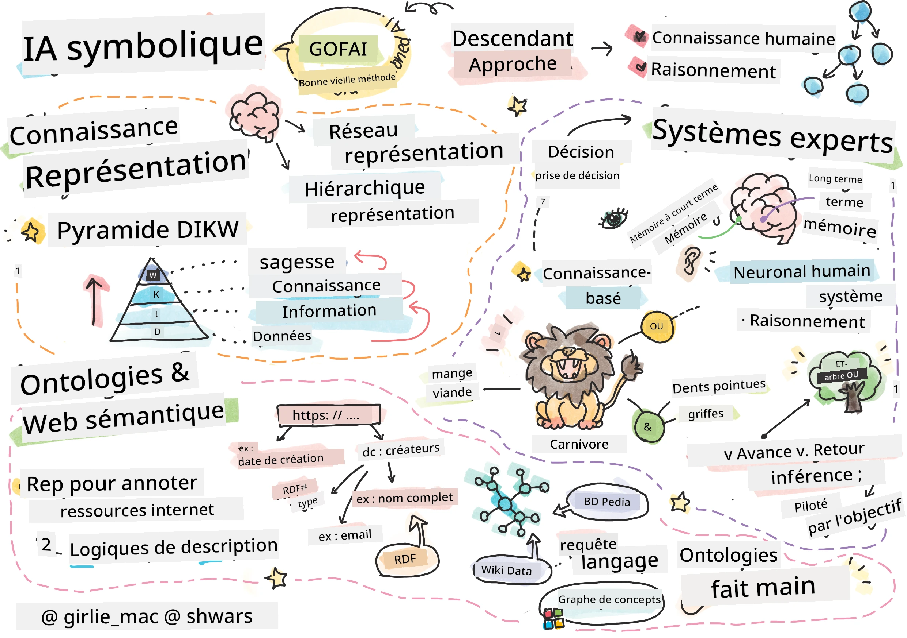
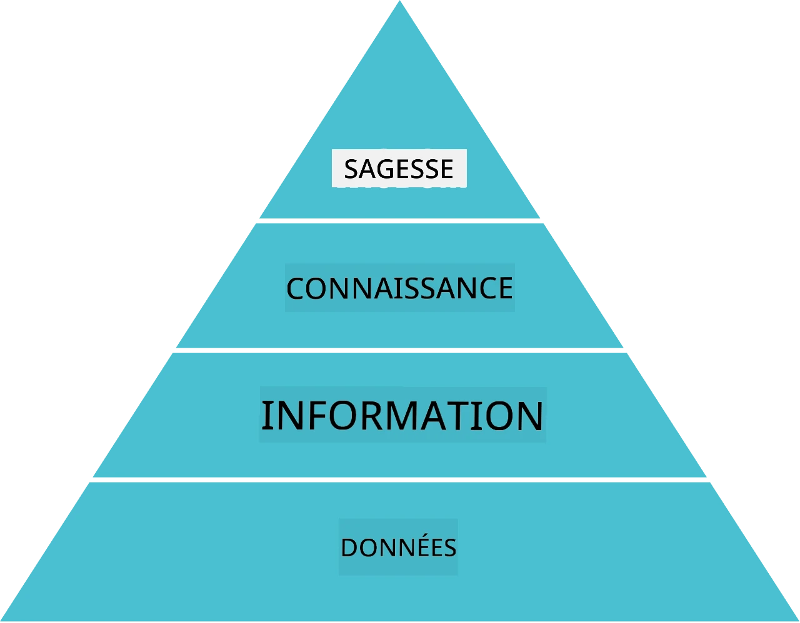
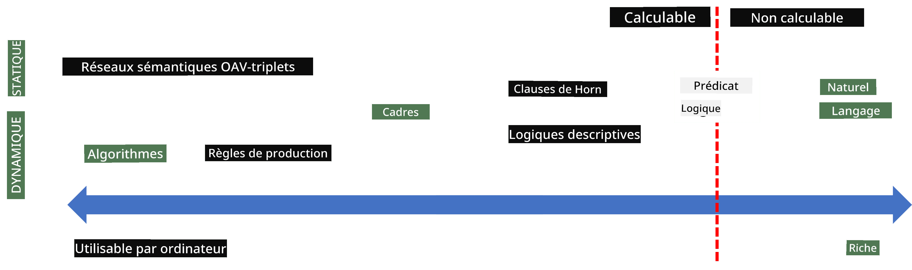
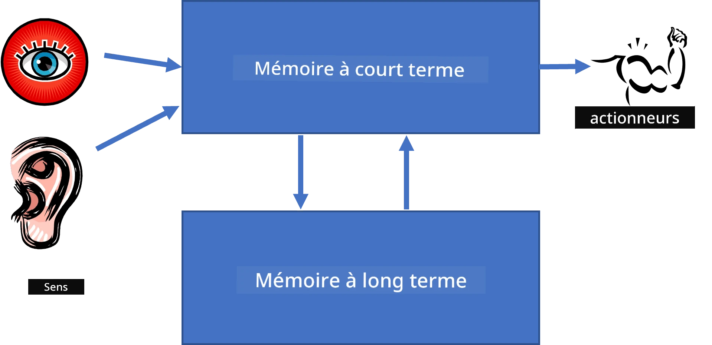
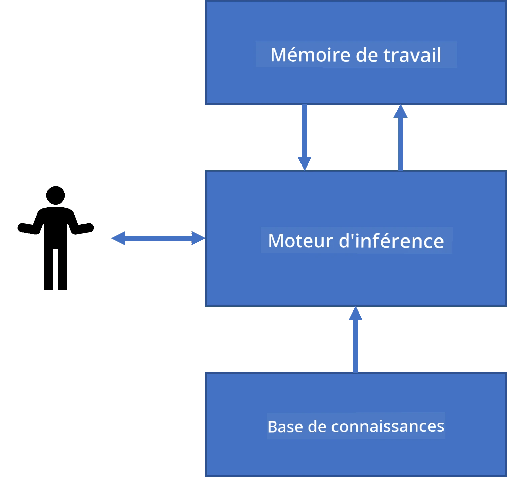
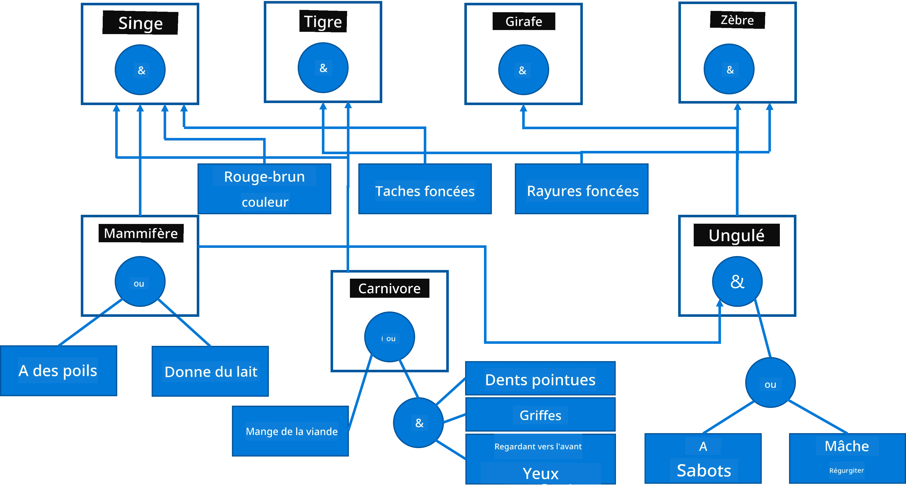
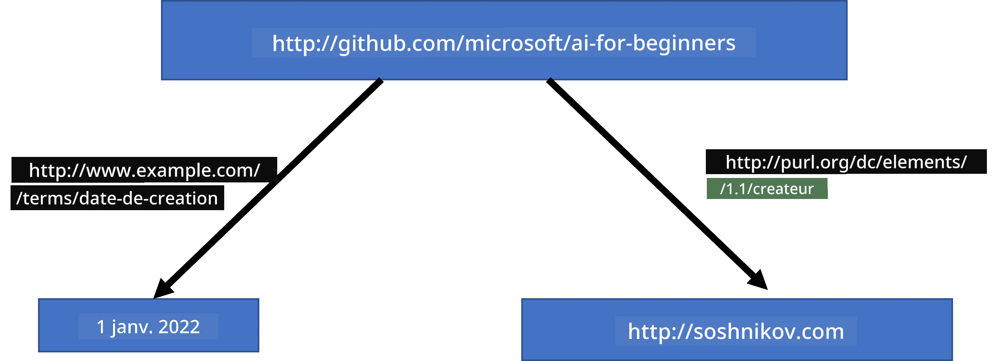
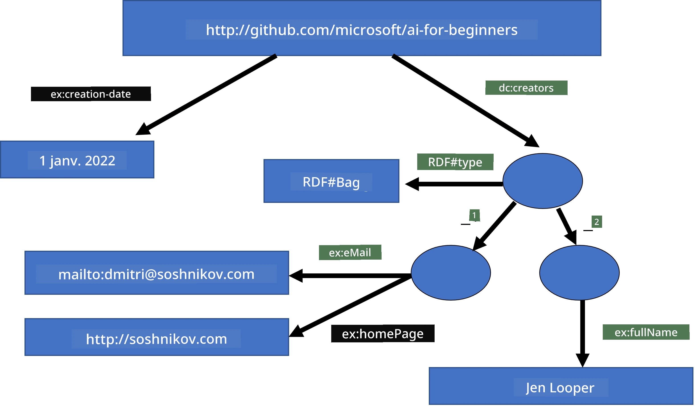
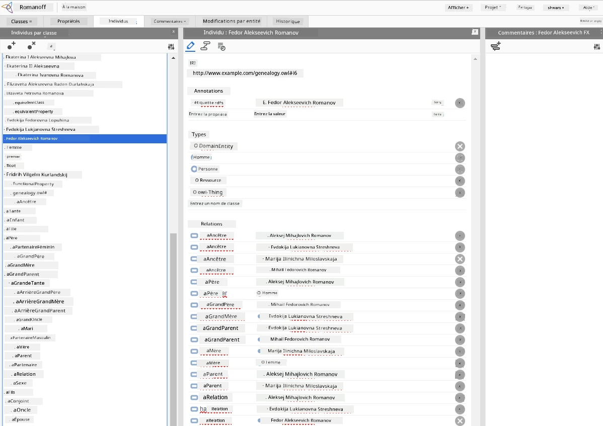

# Représentation des Connaissances et Systèmes Experts



> Sketchnote par [Tomomi Imura](https://twitter.com/girlie_mac)

La quête de l'intelligence artificielle repose sur la recherche de connaissances, afin de comprendre le monde de manière similaire aux humains. Mais comment peut-on s'y prendre ?

## [Quiz préalable à la leçon](https://ff-quizzes.netlify.app/en/ai/quiz/3)

Aux débuts de l'IA, l'approche descendante pour créer des systèmes intelligents (discutée dans la leçon précédente) était populaire. L'idée était d'extraire les connaissances des personnes dans une forme lisible par machine, puis de les utiliser pour résoudre automatiquement des problèmes. Cette approche reposait sur deux grandes idées :

* Représentation des connaissances
* Raisonnement

## Représentation des Connaissances

Un des concepts importants en IA symbolique est la **connaissance**. Il est important de différencier la connaissance de *l'information* ou des *données*. Par exemple, on peut dire que les livres contiennent des connaissances, car on peut étudier des livres et devenir expert. Cependant, ce que contiennent les livres s'appelle en réalité des *données*, et en lisant les livres et en intégrant ces données à notre modèle du monde, nous convertissons ces données en connaissance.

> ✅ **La connaissance** est quelque chose qui est contenu dans notre tête et représente notre compréhension du monde. Elle est obtenue par un processus actif d’**apprentissage**, qui intègre des morceaux d'informations que nous recevons dans notre modèle actif du monde.

Le plus souvent, nous ne définissons pas strictement la connaissance, mais nous l'alignons avec d'autres concepts associés en utilisant la [pyramide DIKW](https://fr.wikipedia.org/wiki/Pyramide_DIKW). Elle contient les concepts suivants :

* **Les données** sont quelque chose représenté dans un support physique, comme un texte écrit ou des paroles prononcées. Les données existent indépendamment des êtres humains et peuvent être transmises entre personnes.
* **L'information** est la manière dont nous interprétons les données dans notre tête. Par exemple, lorsque nous entendons le mot *ordinateur*, nous avons une certaine compréhension de ce que c'est.
* **La connaissance** est l'information intégrée dans notre modèle du monde. Par exemple, une fois que nous avons appris ce qu'est un ordinateur, nous commençons à avoir des idées sur son fonctionnement, son coût, et son utilisation possible. Ce réseau de concepts interdépendants forme notre connaissance.
* **La sagesse** est encore un niveau supérieur de notre compréhension du monde, et elle représente la *métaconnaissance*, par exemple une notion de comment et quand la connaissance doit être utilisée.



*Image [de Wikipédia](https://commons.wikimedia.org/w/index.php?curid=37705247), Par Longlivetheux - Travail personnel, CC BY-SA 4.0*

Ainsi, le problème de la **représentation des connaissances** est de trouver un moyen efficace de représenter la connaissance à l'intérieur d'un ordinateur sous forme de données, afin de la rendre automatiquement utilisable. Ceci peut être vu comme un spectre :



> Image par [Dmitry Soshnikov](http://soshnikov.com)

* À gauche, il y a des types très simples de représentations des connaissances qui peuvent être efficacement utilisées par les ordinateurs. La plus simple est algorithmique, lorsque la connaissance est représentée par un programme informatique. Ce n'est cependant pas la meilleure manière de représenter la connaissance, car ce n’est pas flexible. La connaissance dans notre tête est souvent non-algorithmique.
* À droite, il y a des représentations telles que le texte naturel. C’est la plus puissante, mais elle ne peut pas être utilisée pour un raisonnement automatique.

> ✅ Réfléchissez un instant à la façon dont vous représentez la connaissance dans votre tête et la convertissez en notes. Y a-t-il un format particulier qui fonctionne bien pour vous afin d’aider à la rétention ?

## Classification des Représentations Informatiques des Connaissances

Nous pouvons classer différentes méthodes de représentation des connaissances informatiques dans les catégories suivantes :

* **Représentations en réseau** reposent sur le fait que nous avons un réseau de concepts interdépendants dans notre tête. Nous pouvons tenter de reproduire ces mêmes réseaux sous forme de graphe dans un ordinateur - un **réseau sémantique**.

1. **Triplets objet-attribut-valeur** ou **paires attribut-valeur**. Comme un graphe peut être représenté dans un ordinateur sous forme d'une liste de nœuds et d'arêtes, nous pouvons représenter un réseau sémantique par une liste de triplets, contenant objets, attributs et valeurs. Par exemple, nous construisons les triplets suivants à propos des langages de programmation :

Objet | Attribut | Valeur
-------|-----------|------
Python | est | Langage non typé
Python | inventé-par | Guido van Rossum
Python | syntaxe-bloc | indentation
Langage non typé | ne possède pas | définitions de type

> ✅ Réfléchissez à comment les triplets peuvent être utilisés pour représenter d’autres types de connaissances.

2. **Représentations hiérarchiques** mettent en avant le fait que nous créons souvent une hiérarchie d’objets dans notre tête. Par exemple, nous savons qu’un canari est un oiseau, et que tous les oiseaux ont des ailes. Nous avons aussi une idée de la couleur habituelle d’un canari et de sa vitesse de vol.

   - La **représentation par cadres** est basée sur la représentation de chaque objet ou classe d’objets comme un **cadre** qui contient des **emplacements**. Les emplacements ont des valeurs possibles par défaut, des restrictions de valeurs, ou des procédures stockées qui peuvent être appelées pour obtenir la valeur d’un emplacement. Tous les cadres forment une hiérarchie similaire à une hiérarchie d’objets dans les langages de programmation orientés objet.
   - Les **scénarios** sont un type spécial de cadres qui représentent des situations complexes pouvant se dérouler dans le temps.

**Python**

Emplacement | Valeur | Valeur par défaut | Intervalle |
-----|-------|---------------|----------|
Nom | Python | | |
Est-Un | Langage non typé | | |
Casse variable | | CamelCase | |
Longueur du programme | | | 5-5000 lignes |
Syntaxe de bloc | Indentation | | |

3. **Représentations procédurales** sont basées sur la représentation des connaissances par une liste d’actions qui peuvent être exécutées lorsqu’une certaine condition se produit.
   - Les règles de production sont des instructions de type si-alors qui nous permettent de tirer des conclusions. Par exemple, un médecin peut avoir une règle disant que **SI** un patient a une forte fièvre **OU** un taux élevé de protéine C-réactive dans le test sanguin **ALORS** il a une inflammation. Dès que nous rencontrons une des conditions, nous pouvons conclure une inflammation, puis l’utiliser dans un raisonnement ultérieur.
   - Les algorithmes peuvent être considérés comme une autre forme de représentation procédurale, bien qu’ils soient presque jamais utilisés directement dans les systèmes à base de connaissances.

4. **La logique** a été initialement proposée par Aristote comme moyen de représenter la connaissance humaine universelle.
   - La logique des prédicats, en tant que théorie mathématique, est trop riche pour être calculable, donc un sous-ensemble est généralement utilisé, comme les clauses Horn utilisées en Prolog.
   - La logique descriptive est une famille de systèmes logiques utilisés pour représenter et raisonner sur des hiérarchies d’objets et des représentations de connaissances distribuées telles que le *web sémantique*.

## Systèmes Experts

Un des premiers succès de l’IA symbolique fut les systèmes dits **experts** – des systèmes informatiques conçus pour agir en tant qu’expert dans un domaine de problème limité. Ils étaient basés sur une **base de connaissances** extraite de un ou plusieurs experts humains, et contenaient un **moteur d’inférence** qui effectuait un raisonnement sur cette base.

 | 
---------------------------------------------|------------------------------------------------
Structure simplifiée du système neural humain | Architecture d’un système à base de connaissances

Les systèmes experts sont construits comme le système de raisonnement humain, qui contient une **mémoire à court terme** et une **mémoire à long terme**. De façon similaire, dans les systèmes à base de connaissances nous distinguons les composants suivants :

* **Mémoire du problème** : contient les connaissances à propos du problème en cours de résolution, par exemple la température ou la pression sanguine d’un patient, s’il a une inflammation ou non, etc. Cette connaissance est aussi appelée **connaissance statique**, car elle contient un instantané de ce que nous savons actuellement sur le problème – l’appelé *état du problème*.
* **Base de connaissances** : représente la connaissance à long terme à propos d’un domaine de problème. Elle est extraite manuellement de spécialistes humains, et ne change pas de consultation en consultation. Parce qu’elle permet de naviguer d’un état du problème à un autre, elle est aussi appelée **connaissance dynamique**.
* **Moteur d'inférence** : orchestre l’ensemble du processus de recherche dans l’espace des états du problème, posant des questions à l’utilisateur quand nécessaire. Il est aussi responsable de trouver les bonnes règles à appliquer à chaque état.

Par exemple, considérons le système expert suivant permettant de déterminer un animal en fonction de ses caractéristiques physiques :



> Image par [Dmitry Soshnikov](http://soshnikov.com)

Ce diagramme est appelé un **arbre ET-OU**, et c’est une représentation graphique d’un ensemble de règles de production. Dessiner un arbre est utile au début de l’extraction des connaissances auprès de l’expert. Pour représenter la connaissance dans l’ordinateur il est plus pratique d’utiliser des règles :

```
IF the animal eats meat
OR (animal has sharp teeth
    AND animal has claws
    AND animal has forward-looking eyes
) 
THEN the animal is a carnivore
```

Vous pouvez remarquer que chaque condition du côté gauche de la règle et l'action sont essentiellement des triplets objet-attribut-valeur (OAV). La **mémoire de travail** contient l’ensemble des triplets OAV correspondant au problème en cours de résolution. Un **moteur de règles** recherche les règles dont une condition est satisfaite et les applique, ajoutant un autre triplet à la mémoire de travail.

> ✅ Écrivez votre propre arbre ET-OU sur un sujet qui vous intéresse !

### Inférence Avant (Forward) vs. Arrière (Backward)

Le processus décrit ci-dessus est appelé **inférence avant**. Il commence avec certaines données initiales sur le problème disponibles dans la mémoire de travail, puis exécute la boucle de raisonnement suivante :

1. Si l’attribut cible est présent dans la mémoire de travail – arrêter et donner le résultat
2. Rechercher toutes les règles dont la condition est actuellement satisfaite – obtenir un **ensemble de conflits** de règles.
3. Effectuer une **résolution de conflit** – sélectionner une règle qui sera exécutée à cette étape. Il peut y avoir différentes stratégies de résolution de conflit :
   - Sélectionner la première règle applicable dans la base de connaissances
   - Sélectionner une règle aléatoire
   - Sélectionner une règle *plus spécifique*, c’est-à-dire celle qui satisfait le plus de conditions dans le « côté gauche » (LHS)
4. Appliquer la règle sélectionnée et insérer un nouveau morceau de connaissance dans l’état du problème
5. Répéter à partir de l’étape 1.

Cependant, dans certains cas on peut vouloir commencer avec une connaissance vide du problème, et poser des questions qui nous aideront à arriver à la conclusion. Par exemple, lors d’un diagnostic médical, nous ne réalisons généralement pas tous les tests médicaux à l’avance avant de commencer à diagnostiquer le patient. Nous préférons faire des analyses quand il faut prendre une décision.

Ce processus peut être modélisé par une **inférence arrière**. Elle est guidée par le **but** – la valeur d’un attribut que nous cherchons à trouver :

1. Sélectionner toutes les règles pouvant nous donner la valeur d’un but (c’est-à-dire avec le but dans le RHS (« côté droit »)) – un ensemble de conflits
1. S’il n’y a pas de règles pour cet attribut, ou s’il existe une règle disant que nous devons demander la valeur à l’utilisateur – poser la question, sinon :
1. Utiliser la stratégie de résolution des conflits pour sélectionner une règle que nous utiliserons comme *hypothèse* – nous tenterons de la prouver
1. Répéter de manière récurrente le processus pour tous les attributs dans le LHS de la règle, en essayant de les prouver en tant que buts
1. Si à un moment donné le processus échoue – utiliser une autre règle à l’étape 3.

> ✅ Dans quelles situations l'inférence avant est-elle plus appropriée ? Et l'inférence arrière ?

### Implémentation des Systèmes Experts

Les systèmes experts peuvent être implémentés avec différents outils :

* Programmation directe dans un langage de programmation de haut niveau. Ce n’est pas la meilleure idée, car l’avantage principal d’un système à base de connaissances est que la connaissance est séparée de l’inférence, et potentiellement un expert du domaine devrait pouvoir écrire des règles sans comprendre les détails du processus d’inférence
* Utilisation d’un **shell de systèmes experts**, c’est-à-dire un système spécialement conçu pour être rempli de connaissances à l’aide d’un langage de représentation des connaissances.

## ✍️ Exercice : Inférence Animale

Consultez [Animals.ipynb](https://github.com/microsoft/AI-For-Beginners/blob/main/lessons/2-Symbolic/Animals.ipynb) pour un exemple d’implémentation d’un système expert d’inférence avant et arrière.

> **Note** : Cet exemple est assez simple, et donne seulement une idée de l’aspect d’un système expert. Une fois que vous commencez à créer un tel système, vous ne remarquerez un comportement *intelligent* qu’une fois que vous aurez atteint un certain nombre de règles, environ 200+. À un moment donné, les règles deviennent trop complexes pour toutes les garder en mémoire, et c’est alors que vous pouvez vous demander pourquoi un système prend certaines décisions. Cependant, le trait important des systèmes à base de connaissances est que vous pouvez toujours *expliquer* exactement comment une décision a été prise.

## Ontologies et le Web Sémantique

À la fin du 20ème siècle, une initiative a vu le jour pour utiliser la représentation des connaissances afin d’annoter les ressources Internet, de façon à pouvoir trouver des ressources correspondant à des requêtes très spécifiques. Ce mouvement s’appelait **le Web Sémantique**, et il s’appuyait sur plusieurs concepts :

- Une représentation spéciale des connaissances basée sur les **[logiques descriptives](https://fr.wikipedia.org/wiki/Logique_descriptive)** (DL). Elle est similaire à la représentation de connaissances par cadres, car elle construit une hiérarchie d’objets avec propriétés, mais elle possède une sémantique logique formelle et permet l’inférence. Il existe toute une famille de DL qui équilibrent expressivité et complexité algorithmique de l’inférence.
- Une représentation des connaissances distribuée, où tous les concepts sont représentés par un identifiant URI global, ce qui permet de créer des hiérarchies de connaissances couvrant Internet.
- Une famille de langages basés sur XML pour la description des connaissances : RDF (Resource Description Framework), RDFS (RDF Schema), OWL (Ontology Web Language).

Un concept clé du Web sémantique est celui d'**Ontologie**. Il se réfère à une spécification explicite d'un domaine problématique en utilisant une représentation formelle de la connaissance. L'ontologie la plus simple peut être juste une hiérarchie d'objets dans un domaine problématique, mais les ontologies plus complexes incluront des règles pouvant être utilisées pour l'inférence.

Dans le web sémantique, toutes les représentations sont basées sur des triplets. Chaque objet et chaque relation sont identifiés de manière unique par l'URI. Par exemple, si nous voulons énoncer le fait que ce curriculum d'IA a été développé par Dmitry Soshnikov le 1er janvier 2022 - voici les triplets que nous pouvons utiliser :



```
http://github.com/microsoft/ai-for-beginners http://www.example.com/terms/creation-date “Jan 1, 2022”
http://github.com/microsoft/ai-for-beginners http://purl.org/dc/elements/1.1/creator http://soshnikov.com
```

> ✅ Ici, `http://www.example.com/terms/creation-date` et `http://purl.org/dc/elements/1.1/creator` sont des URI bien connus et universellement acceptés pour exprimer les concepts de *créateur* et de *date de création*.

Dans un cas plus complexe, si nous voulons définir une liste de créateurs, nous pouvons utiliser certaines structures de données définies dans RDF.



> Schémas ci-dessus par [Dmitry Soshnikov](http://soshnikov.com)

Le progrès dans la construction du Web sémantique a été en quelque sorte ralenti par le succès des moteurs de recherche et des techniques de traitement du langage naturel, qui permettent d'extraire des données structurées à partir de textes. Cependant, dans certains domaines, il y a encore des efforts significatifs pour maintenir des ontologies et des bases de connaissances. Quelques projets méritent d’être mentionnés :

* [WikiData](https://wikidata.org/) est une collection de bases de connaissances lisibles par machine associées à Wikipédia. La plupart des données sont extraites des *InfoBoxes* de Wikipédia, des morceaux de contenu structuré à l’intérieur des pages Wikipédia. Vous pouvez [interroger](https://query.wikidata.org/) Wikidata en SPARQL, un langage de requête spécial pour le Web sémantique. Voici une requête d'exemple qui affiche les couleurs d'yeux les plus populaires chez les humains :

```sparql
#defaultView:BubbleChart
SELECT ?eyeColorLabel (COUNT(?human) AS ?count)
WHERE
{
  ?human wdt:P31 wd:Q5.       # human instance-of homo sapiens
  ?human wdt:P1340 ?eyeColor. # human eye-color ?eyeColor
  SERVICE wikibase:label { bd:serviceParam wikibase:language "en". }
}
GROUP BY ?eyeColorLabel
```

* [DBpedia](https://www.dbpedia.org/) est un autre effort similaire à WikiData.

> ✅ Si vous souhaitez expérimenter la création de vos propres ontologies, ou ouvrir des ontologies existantes, il existe un excellent éditeur d'ontologies visuel appelé [Protégé](https://protege.stanford.edu/). Téléchargez-le ou utilisez-le en ligne.



*Éditeur Web Protégé ouvert avec l'ontologie de la famille Romanov. Capture d'écran par Dmitry Soshnikov*

## ✍️ Exercice : Une ontologie de famille


Voir [FamilyOntology.ipynb](https://github.com/Ezana135/AI-For-Beginners/blob/main/lessons/2-Symbolic/FamilyOntology.ipynb) pour un exemple d'utilisation des techniques du Web sémantique afin de raisonner sur les relations familiales. Nous prendrons un arbre généalogique représenté dans le format GEDCOM courant et une ontologie des relations familiales pour construire un graphe de toutes les relations familiales pour un ensemble donné d'individus.

## Microsoft Concept Graph

Dans la plupart des cas, les ontologies sont soigneusement créées à la main. Cependant, il est aussi possible de **miner** des ontologies à partir de données non structurées, par exemple, à partir de textes en langage naturel.

Une telle tentative a été faite par Microsoft Research, et a donné lieu au [Microsoft Concept Graph](https://blogs.microsoft.com/ai/microsoft-researchers-release-graph-that-helps-machines-conceptualize/?WT.mc_id=academic-77998-cacaste).

C’est une grande collection d'entités regroupées en utilisant la relation d'héritage `is-a`. Cela permet de répondre à des questions comme « Qu'est-ce que Microsoft ? » - la réponse étant quelque chose comme « une entreprise avec une probabilité de 0.87, et une marque avec une probabilité de 0.75 ».

Le graphe est disponible soit en tant qu'API REST, soit sous forme d’un grand fichier texte téléchargeable listant toutes les paires d'entités.

## ✍️ Exercice : Un graph des concepts

Essayez le notebook [MSConceptGraph.ipynb](https://github.com/microsoft/AI-For-Beginners/blob/main/lessons/2-Symbolic/MSConceptGraph.ipynb) pour voir comment nous pouvons utiliser Microsoft Concept Graph pour regrouper des articles de presse en plusieurs catégories.

## Conclusion

De nos jours, l’IA est souvent considérée comme synonyme de *Machine Learning* ou de *Réseaux neuronaux*. Cependant, un être humain manifeste aussi un raisonnement explicite, ce qui est quelque chose que les réseaux neuronaux ne gèrent pas actuellement. Dans les projets réels, le raisonnement explicite est encore utilisé pour effectuer des tâches qui nécessitent des explications, ou la capacité de modifier le comportement du système de manière contrôlée.

## 🚀 Défi

Dans le notebook de l'ontologie de famille associé à cette leçon, il y a une opportunité d’expérimenter avec d’autres relations familiales. Essayez de découvrir de nouvelles connexions entre les personnes dans l’arbre généalogique.

## [Quiz post-cours](https://ff-quizzes.netlify.app/en/ai/quiz/4)

## Révision & Auto-apprentissage

Faites des recherches sur internet pour découvrir des domaines où les humains ont essayé de quantifier et codifier les connaissances. Regardez la Taxonomie de Bloom, et remontez dans l’histoire pour apprendre comment les humains ont essayé de comprendre leur monde. Explorez le travail de Linné pour créer une taxonomie des organismes, et observez la manière dont Dmitri Mendeleev a créé une méthode pour décrire et grouper les éléments chimiques. Quels autres exemples intéressants pouvez-vous trouver ?

**Devoir** : [Construire une ontologie](assignment.md)

---

<!-- CO-OP TRANSLATOR DISCLAIMER START -->
**Avertissement** :  
Ce document a été traduit à l’aide du service de traduction automatique [Co-op Translator](https://github.com/Azure/co-op-translator). Bien que nous nous efforçons d’assurer l’exactitude, veuillez noter que les traductions automatiques peuvent contenir des erreurs ou des inexactitudes. Le document original dans sa langue d’origine doit être considéré comme la source faisant foi. Pour les informations cruciales, une traduction professionnelle réalisée par un humain est recommandée. Nous déclinons toute responsabilité en cas de malentendus ou de mauvaises interprétations résultant de l’utilisation de cette traduction.
<!-- CO-OP TRANSLATOR DISCLAIMER END -->