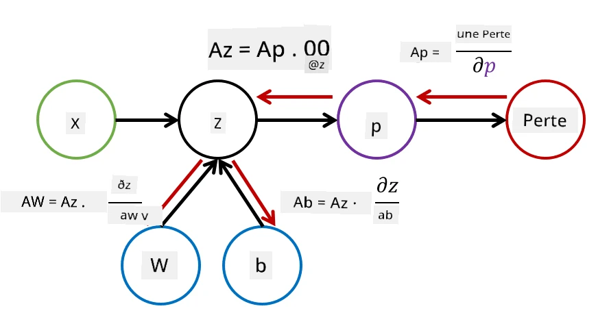

# Introduction aux réseaux neuronaux. Perceptron multicouche

Dans la section précédente, vous avez découvert le modèle de réseau neuronal le plus simple : le perceptron à une couche, un modèle de classification linéaire à deux classes.

Dans cette section, nous allons étendre ce modèle pour en faire un cadre plus flexible, nous permettant de :

* effectuer une **classification multi-classes** en plus de la classification à deux classes
* résoudre des **problèmes de régression** en plus de la classification
* séparer des classes qui ne sont pas linéairement séparables

Nous allons également développer notre propre cadre modulaire en Python, qui nous permettra de construire différentes architectures de réseaux neuronaux.

## [Quiz avant le cours](https://ff-quizzes.netlify.app/en/ai/quiz/7)

## Formalisation de l'apprentissage automatique

Commençons par formaliser le problème de l'apprentissage automatique. Supposons que nous disposons d'un ensemble de données d'entraînement **X** avec des étiquettes **Y**, et que nous devons construire un modèle *f* qui fera des prédictions les plus précises possibles. La qualité des prédictions est mesurée par une **fonction de perte** &lagran;. Les fonctions de perte suivantes sont souvent utilisées :

* Pour un problème de régression, lorsque nous devons prédire un nombre, nous pouvons utiliser **l'erreur absolue** &sum;i|f(x(i))-y(i)|, ou **l'erreur quadratique** &sum;i(f(x(i))-y(i))2
* Pour la classification, nous utilisons la **perte 0-1** (qui est essentiellement la même chose que **l'exactitude** du modèle), ou la **perte logistique**.

Pour un perceptron à une couche, la fonction *f* était définie comme une fonction linéaire *f(x)=wx+b* (ici *w* est la matrice de poids, *x* est le vecteur des caractéristiques d'entrée, et *b* est le vecteur de biais). Pour différentes architectures de réseaux neuronaux, cette fonction peut prendre une forme plus complexe.

> Dans le cas de la classification, il est souvent souhaitable d'obtenir des probabilités des classes correspondantes en sortie du réseau. Pour convertir des nombres arbitraires en probabilités (par exemple, pour normaliser la sortie), nous utilisons souvent la fonction **softmax** &sigma;, et la fonction *f* devient *f(x)=&sigma;(wx+b)*.

Dans la définition de *f* ci-dessus, *w* et *b* sont appelés **paramètres** &theta;=⟨*w,b*⟩. Étant donné l'ensemble de données ⟨**X**,**Y**⟩, nous pouvons calculer une erreur globale sur l'ensemble des données en fonction des paramètres &theta;.

> ✅ **L'objectif de l'entraînement d'un réseau neuronal est de minimiser l'erreur en faisant varier les paramètres &theta;.**

## Optimisation par descente de gradient

Il existe une méthode bien connue d'optimisation de fonction appelée **descente de gradient**. L'idée est que nous pouvons calculer une dérivée (dans le cas multidimensionnel appelée **gradient**) de la fonction de perte par rapport aux paramètres, et faire varier les paramètres de manière à réduire l'erreur. Cela peut être formalisé comme suit :

* Initialiser les paramètres avec des valeurs aléatoires w(0), b(0)
* Répéter les étapes suivantes plusieurs fois :
    - w(i+1) = w(i)-&eta;&part;&lagran;/&part;w
    - b(i+1) = b(i)-&eta;&part;&lagran;/&part;b

Pendant l'entraînement, les étapes d'optimisation sont censées être calculées en tenant compte de l'ensemble des données (rappelez-vous que la perte est calculée comme une somme sur tous les échantillons d'entraînement). Cependant, dans la pratique, nous prenons de petites portions de l'ensemble de données appelées **minibatches**, et calculons les gradients sur un sous-ensemble de données. Comme le sous-ensemble est choisi aléatoirement à chaque fois, cette méthode est appelée **descente de gradient stochastique** (SGD).

## Perceptrons multicouches et rétropropagation

Un réseau à une couche, comme nous l'avons vu plus haut, est capable de classer des classes linéairement séparables. Pour construire un modèle plus riche, nous pouvons combiner plusieurs couches du réseau. Mathématiquement, cela signifie que la fonction *f* aurait une forme plus complexe et serait calculée en plusieurs étapes :
* z1=w1x+b1
* z2=w2&alpha;(z1)+b2
* f = &sigma;(z2)

Ici, &alpha; est une **fonction d'activation non linéaire**, &sigma; est une fonction softmax, et les paramètres &theta;=<*w1,b1,w2,b2*>.

L'algorithme de descente de gradient reste le même, mais le calcul des gradients devient plus complexe. En utilisant la règle de différenciation en chaîne, nous pouvons calculer les dérivées comme suit :

* &part;&lagran;/&part;w2 = (&part;&lagran;/&part;&sigma;)(&part;&sigma;/&part;z2)(&part;z2/&part;w2)
* &part;&lagran;/&part;w1 = (&part;&lagran;/&part;&sigma;)(&part;&sigma;/&part;z2)(&part;z2/&part;&alpha;)(&part;&alpha;/&part;z1)(&part;z1/&part;w1)

> ✅ La règle de différenciation en chaîne est utilisée pour calculer les dérivées de la fonction de perte par rapport aux paramètres.

Notez que la partie la plus à gauche de toutes ces expressions est la même, et nous pouvons donc calculer efficacement les dérivées en commençant par la fonction de perte et en remontant "en arrière" à travers le graphe computationnel. Ainsi, la méthode d'entraînement d'un perceptron multicouche est appelée **rétropropagation**, ou 'backprop'.

> TODO : citation de l'image

> ✅ Nous aborderons la rétropropagation en détail dans notre exemple de notebook.  

## Conclusion

Dans cette leçon, nous avons construit notre propre bibliothèque de réseaux neuronaux, et nous l'avons utilisée pour une tâche simple de classification en deux dimensions.

## 🚀 Défi

Dans le notebook associé, vous allez implémenter votre propre cadre pour construire et entraîner des perceptrons multicouches. Vous pourrez voir en détail comment fonctionnent les réseaux neuronaux modernes.

Passez au notebook [OwnFramework](OwnFramework.ipynb) et travaillez dessus.

## [Quiz après le cours](https://ff-quizzes.netlify.app/en/ai/quiz/8)

## Révision et auto-apprentissage

La rétropropagation est un algorithme courant utilisé en IA et en apprentissage automatique, qui mérite d'être étudié [plus en détail](https://wikipedia.org/wiki/Backpropagation).

## [Devoir](lab/README.md)

Dans ce laboratoire, vous êtes invité à utiliser le cadre que vous avez construit dans cette leçon pour résoudre la classification des chiffres manuscrits MNIST.

* [Instructions](lab/README.md)
* [Notebook](lab/MyFW_MNIST.ipynb)

---

