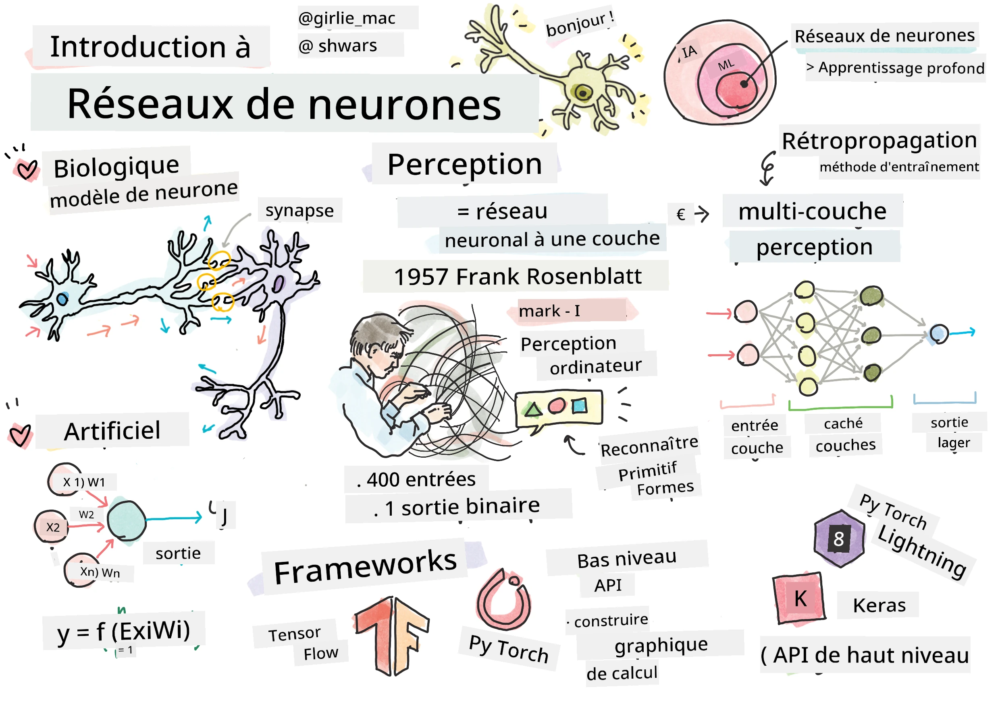

# Introduction aux réseaux neuronaux

Comme nous l'avons vu dans l'introduction, l'une des façons d'atteindre l'intelligence est d'entraîner un **modèle informatique** ou un **cerveau artificiel**. Depuis le milieu du XXe siècle, les chercheurs ont expérimenté différents modèles mathématiques, jusqu'à ce que cette approche s'avère extrêmement fructueuse ces dernières années. Ces modèles mathématiques du cerveau sont appelés **réseaux neuronaux**.

> Parfois, les réseaux neuronaux sont appelés *Réseaux Neuronaux Artificiels* (ANNs), pour indiquer qu'il s'agit de modèles et non de réseaux réels de neurones.

## Apprentissage automatique

Les réseaux neuronaux font partie d'une discipline plus large appelée **Apprentissage Automatique** (Machine Learning), dont l'objectif est d'utiliser des données pour entraîner des modèles informatiques capables de résoudre des problèmes. L'apprentissage automatique constitue une grande partie de l'intelligence artificielle, mais nous ne couvrons pas l'apprentissage automatique classique dans ce programme.

> Consultez notre programme distinct **[Apprentissage Automatique pour Débutants](http://github.com/microsoft/ml-for-beginners)** pour en savoir plus sur l'apprentissage automatique classique.

En apprentissage automatique, nous supposons que nous disposons d'un ensemble de données d'exemples **X**, et de valeurs de sortie correspondantes **Y**. Les exemples sont souvent des vecteurs N-dimensionnels composés de **caractéristiques**, et les sorties sont appelées **étiquettes**.

Nous examinerons les deux problèmes les plus courants en apprentissage automatique :

* **Classification**, où nous devons classer un objet d'entrée dans deux classes ou plus.
* **Régression**, où nous devons prédire une valeur numérique pour chacun des échantillons d'entrée.

> Lorsqu'on représente les entrées et les sorties sous forme de tenseurs, l'ensemble de données d'entrée est une matrice de taille M&times;N, où M est le nombre d'échantillons et N est le nombre de caractéristiques. Les étiquettes de sortie **Y** sont un vecteur de taille M.

Dans ce programme, nous nous concentrerons uniquement sur les modèles de réseaux neuronaux.

## Un modèle de neurone

En biologie, nous savons que notre cerveau est constitué de cellules neuronales (neurones), chacune ayant plusieurs "entrées" (dendrites) et une seule "sortie" (axone). Les dendrites et les axones peuvent conduire des signaux électriques, et les connexions entre eux — appelées synapses — peuvent présenter des degrés de conductivité variables, régulés par des neurotransmetteurs.

 | 
----|----
Neurone réel *([Image](https://en.wikipedia.org/wiki/Synapse#/media/File:SynapseSchematic_lines.svg) de Wikipédia)* | Neurone artificiel *(Image par l'auteur)*

Ainsi, le modèle mathématique le plus simple d'un neurone contient plusieurs entrées X1, ..., XN et une sortie Y, ainsi qu'une série de poids W1, ..., WN. Une sortie est calculée comme suit :

où **f** est une **fonction d'activation** non linéaire.

> Les premiers modèles de neurones ont été décrits dans l'article classique [A logical calculus of the ideas immanent in nervous activity](https://www.cs.cmu.edu/~./epxing/Class/10715/reading/McCulloch.and.Pitts.pdf) par Warren McCullock et Walter Pitts en 1943. Donald Hebb, dans son livre "[The Organization of Behavior: A Neuropsychological Theory](https://books.google.com/books?id=VNetYrB8EBoC)", a proposé une méthode pour entraîner ces réseaux.

## Dans cette section

Dans cette section, nous allons apprendre :
* [Le Perceptron](03-Perceptron/README.md), l'un des premiers modèles de réseaux neuronaux pour la classification binaire
* [Les réseaux multicouches](04-OwnFramework/README.md) avec un notebook associé [comment construire notre propre framework](04-OwnFramework/OwnFramework.ipynb)
* [Les frameworks de réseaux neuronaux](05-Frameworks/README.md), avec ces notebooks : [PyTorch](05-Frameworks/IntroPyTorch.ipynb) et [Keras/Tensorflow](05-Frameworks/IntroKerasTF.ipynb)
* [Le surapprentissage](../../../../lessons/3-NeuralNetworks/05-Frameworks)

---

**Avertissement** :  
Ce document a été traduit à l'aide du service de traduction automatique [Co-op Translator](https://github.com/Azure/co-op-translator). Bien que nous nous efforcions d'assurer l'exactitude, veuillez noter que les traductions automatisées peuvent contenir des erreurs ou des inexactitudes. Le document original dans sa langue d'origine doit être considéré comme la source faisant autorité. Pour des informations critiques, il est recommandé de recourir à une traduction humaine professionnelle. Nous déclinons toute responsabilité en cas de malentendus ou d'interprétations erronées résultant de l'utilisation de cette traduction.