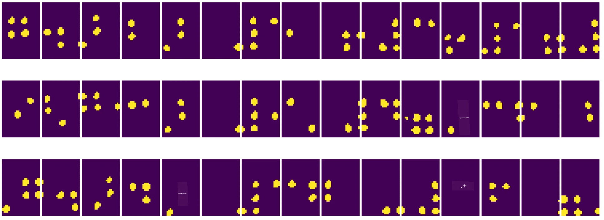
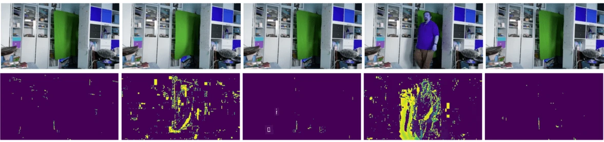

# Introduction à la vision par ordinateur

[La vision par ordinateur](https://wikipedia.org/wiki/Computer_vision) est une discipline dont le but est de permettre aux ordinateurs de comprendre les images numériques à un niveau élevé. Cette définition est assez large, car *comprendre* peut signifier de nombreuses choses différentes, comme trouver un objet sur une image (**détection d'objet**), comprendre ce qui se passe (**détection d'événements**), décrire une image en texte ou reconstruire une scène en 3D. Il existe également des tâches spécifiques liées aux images humaines : estimation de l'âge et des émotions, détection et identification de visages, et estimation de la pose en 3D, pour n'en citer que quelques-unes.

## [Quiz avant le cours](https://ff-quizzes.netlify.app/en/ai/quiz/11)

L'une des tâches les plus simples de la vision par ordinateur est la **classification d'images**.

La vision par ordinateur est souvent considérée comme une branche de l'IA. De nos jours, la plupart des tâches de vision par ordinateur sont résolues à l'aide de réseaux neuronaux. Nous allons en apprendre davantage sur le type particulier de réseaux neuronaux utilisés pour la vision par ordinateur, les [réseaux neuronaux convolutifs](../07-ConvNets/README.md), tout au long de cette section.

Cependant, avant de transmettre une image à un réseau neuronal, il est souvent utile d'utiliser certaines techniques algorithmiques pour améliorer l'image.

Il existe plusieurs bibliothèques Python disponibles pour le traitement d'images :

* **[imageio](https://imageio.readthedocs.io/en/stable/)** peut être utilisé pour lire/écrire différents formats d'image. Il prend également en charge ffmpeg, un outil utile pour convertir des images vidéo en images.
* **[Pillow](https://pillow.readthedocs.io/en/stable/index.html)** (également connu sous le nom de PIL) est un peu plus puissant et prend également en charge certaines manipulations d'images telles que la morphologie, les ajustements de palette, et plus encore.
* **[OpenCV](https://opencv.org/)** est une bibliothèque de traitement d'images puissante écrite en C++, qui est devenue la norme *de facto* pour le traitement d'images. Elle dispose d'une interface Python pratique.
* **[dlib](http://dlib.net/)** est une bibliothèque C++ qui implémente de nombreux algorithmes d'apprentissage automatique, y compris certains algorithmes de vision par ordinateur. Elle dispose également d'une interface Python et peut être utilisée pour des tâches complexes telles que la détection de visages et de points de repère faciaux.

## OpenCV

[OpenCV](https://opencv.org/) est considéré comme la norme *de facto* pour le traitement d'images. Elle contient de nombreux algorithmes utiles, implémentés en C++. Vous pouvez également appeler OpenCV depuis Python.

Un bon endroit pour apprendre OpenCV est [ce cours Learn OpenCV](https://learnopencv.com/getting-started-with-opencv/). Dans notre programme, notre objectif n'est pas d'apprendre OpenCV, mais de vous montrer quelques exemples où il peut être utilisé et comment.

### Chargement des images

Les images en Python peuvent être représentées de manière pratique par des tableaux NumPy. Par exemple, les images en niveaux de gris de taille 320x200 pixels seraient stockées dans un tableau 200x320, et les images en couleur de la même dimension auraient une forme de 200x320x3 (pour 3 canaux de couleur). Pour charger une image, vous pouvez utiliser le code suivant :

```python
import cv2
import matplotlib.pyplot as plt

im = cv2.imread('image.jpeg')
plt.imshow(im)
```

Traditionnellement, OpenCV utilise l'encodage BGR (Bleu-Vert-Rouge) pour les images en couleur, tandis que les autres outils Python utilisent l'encodage plus traditionnel RGB (Rouge-Vert-Bleu). Pour que l'image soit correcte, vous devez la convertir en espace de couleur RGB, soit en permutant les dimensions dans le tableau NumPy, soit en appelant une fonction OpenCV :

```python
im = cv2.cvtColor(im,cv2.COLOR_BGR2RGB)
```

La même fonction `cvtColor` peut être utilisée pour effectuer d'autres transformations d'espace de couleur, comme convertir une image en niveaux de gris ou en espace de couleur HSV (Teinte-Saturation-Valeur).

Vous pouvez également utiliser OpenCV pour charger des vidéos image par image - un exemple est donné dans l'exercice [OpenCV Notebook](OpenCV.ipynb).

### Traitement d'images

Avant de transmettre une image à un réseau neuronal, vous pouvez vouloir appliquer plusieurs étapes de prétraitement. OpenCV peut faire de nombreuses choses, notamment :

* **Redimensionner** l'image en utilisant `im = cv2.resize(im, (320,200),interpolation=cv2.INTER_LANCZOS)`
* **Flouter** l'image en utilisant `im = cv2.medianBlur(im,3)` ou `im = cv2.GaussianBlur(im, (3,3), 0)`
* Modifier la **luminosité et le contraste** de l'image peut être fait par des manipulations de tableaux NumPy, comme décrit [dans cette note Stackoverflow](https://stackoverflow.com/questions/39308030/how-do-i-increase-the-contrast-of-an-image-in-python-opencv).
* Utiliser le [seuil](https://docs.opencv.org/4.x/d7/d4d/tutorial_py_thresholding.html) en appelant les fonctions `cv2.threshold`/`cv2.adaptiveThreshold`, ce qui est souvent préférable à l'ajustement de la luminosité ou du contraste.
* Appliquer différentes [transformations](https://docs.opencv.org/4.5.5/da/d6e/tutorial_py_geometric_transformations.html) à l'image :
    - Les **[transformations affines](https://docs.opencv.org/4.5.5/d4/d61/tutorial_warp_affine.html)** peuvent être utiles si vous devez combiner rotation, redimensionnement et inclinaison de l'image et que vous connaissez l'emplacement source et destination de trois points dans l'image. Les transformations affines conservent les lignes parallèles parallèles.
    - Les **[transformations de perspective](https://medium.com/analytics-vidhya/opencv-perspective-transformation-9edffefb2143)** peuvent être utiles lorsque vous connaissez les positions source et destination de 4 points dans l'image. Par exemple, si vous prenez une photo d'un document rectangulaire via une caméra de smartphone sous un certain angle, et que vous souhaitez obtenir une image rectangulaire du document lui-même.
* Comprendre le mouvement à l'intérieur de l'image en utilisant **[le flux optique](https://docs.opencv.org/4.5.5/d4/dee/tutorial_optical_flow.html)**.

## Exemples d'utilisation de la vision par ordinateur

Dans notre [OpenCV Notebook](OpenCV.ipynb), nous donnons quelques exemples où la vision par ordinateur peut être utilisée pour effectuer des tâches spécifiques :

* **Prétraitement d'une photographie d'un livre en braille**. Nous nous concentrons sur la manière dont nous pouvons utiliser le seuil, la détection de caractéristiques, la transformation de perspective et les manipulations NumPy pour séparer les symboles individuels en braille pour une classification ultérieure par un réseau neuronal.

 |  | 
----|-----|-----

> Image tirée de [OpenCV.ipynb](OpenCV.ipynb)

* **Détection de mouvement dans une vidéo à l'aide de la différence entre les images**. Si la caméra est fixe, les images du flux de la caméra devraient être assez similaires les unes aux autres. Étant donné que les images sont représentées sous forme de tableaux, en soustrayant simplement ces tableaux pour deux images consécutives, nous obtiendrons la différence de pixels, qui devrait être faible pour des images statiques, et devenir plus élevée lorsqu'il y a un mouvement substantiel dans l'image.



> Image tirée de [OpenCV.ipynb](OpenCV.ipynb)

* **Détection de mouvement à l'aide du flux optique**. [Le flux optique](https://docs.opencv.org/3.4/d4/dee/tutorial_optical_flow.html) nous permet de comprendre comment les pixels individuels des images vidéo se déplacent. Il existe deux types de flux optique :

   - **Flux optique dense** calcule le champ vectoriel qui montre pour chaque pixel où il se déplace.
   - **Flux optique clairsemé** est basé sur la prise de certaines caractéristiques distinctives dans l'image (par exemple, les contours) et la construction de leur trajectoire d'une image à l'autre.


> Image tirée de [OpenCV.ipynb](OpenCV.ipynb)

## ✍️ Notebooks d'exemple : OpenCV [essayez OpenCV en action](OpenCV.ipynb)

Faisons quelques expériences avec OpenCV en explorant [OpenCV Notebook](OpenCV.ipynb)

## Conclusion

Parfois, des tâches relativement complexes telles que la détection de mouvement ou la détection de bout de doigt peuvent être résolues uniquement par la vision par ordinateur. Ainsi, il est très utile de connaître les techniques de base de la vision par ordinateur et ce que des bibliothèques comme OpenCV peuvent faire.

## 🚀 Défi

Regardez [cette vidéo](https://docs.microsoft.com/shows/ai-show/ai-show--2021-opencv-ai-competition--grand-prize-winners--cortic-tigers--episode-32?WT.mc_id=academic-77998-cacaste) de l'AI Show pour en apprendre davantage sur le projet Cortic Tigers et comment ils ont construit une solution basée sur des blocs pour démocratiser les tâches de vision par ordinateur via un robot. Faites des recherches sur d'autres projets similaires qui aident à initier de nouveaux apprenants dans ce domaine.

## [Quiz après le cours](https://ff-quizzes.netlify.app/en/ai/quiz/12)

## Révision et étude personnelle

Lisez davantage sur le flux optique [dans ce tutoriel excellent](https://learnopencv.com/optical-flow-in-opencv/).

## [Devoir](lab/README.md)

Dans ce laboratoire, vous prendrez une vidéo avec des gestes simples, et votre objectif sera d'extraire les mouvements haut/bas/gauche/droite en utilisant le flux optique.


---

