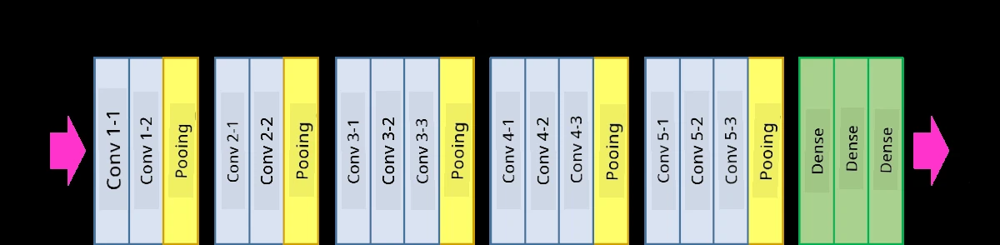
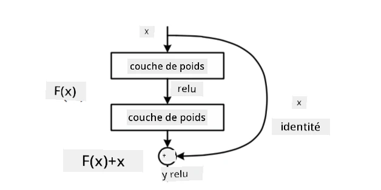
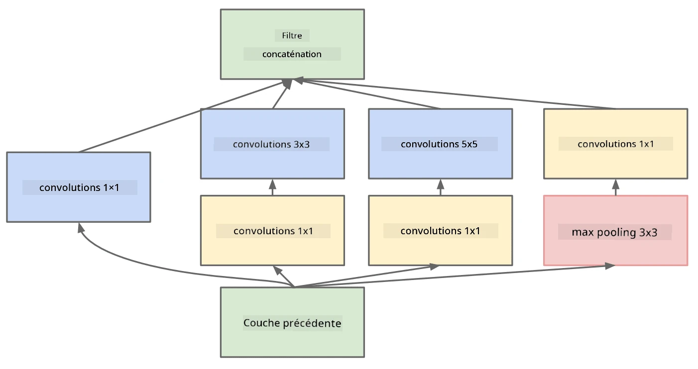

# Architectures CNN Bien Connues

### VGG-16

VGG-16 est un réseau qui a atteint une précision de 92,7 % dans la classification top-5 d'ImageNet en 2014. Il possède la structure de couches suivante :

Comme vous pouvez le voir, VGG suit une architecture pyramidale traditionnelle, qui est une séquence de couches de convolution et de pooling.

> Image tirée de [Researchgate](https://www.researchgate.net/figure/Vgg16-model-structure-To-get-the-VGG-NIN-model-we-replace-the-2-nd-4-th-6-th-7-th_fig2_335194493)

### ResNet

ResNet est une famille de modèles proposée par Microsoft Research en 2015. L'idée principale de ResNet est d'utiliser des **blocs résiduels** :

> Image tirée de [cet article](https://arxiv.org/pdf/1512.03385.pdf)

La raison d'utiliser un passage identitaire est de permettre à notre couche de prédire **la différence** entre le résultat d'une couche précédente et la sortie du bloc résiduel - d'où le nom *résiduel*. Ces blocs sont beaucoup plus faciles à entraîner, et il est possible de construire des réseaux avec plusieurs centaines de ces blocs (les variantes les plus courantes sont ResNet-52, ResNet-101 et ResNet-152).

Vous pouvez également considérer ce réseau comme capable d'ajuster sa complexité au jeu de données. Au début de l'entraînement, les valeurs des poids sont faibles, et la plupart du signal passe par les couches identitaires. Au fur et à mesure que l'entraînement progresse et que les poids deviennent plus importants, la signification des paramètres du réseau augmente, et le réseau s'adapte pour fournir la puissance expressive nécessaire à la classification correcte des images d'entraînement.

### Google Inception

L'architecture Google Inception pousse cette idée un peu plus loin et construit chaque couche du réseau comme une combinaison de plusieurs chemins différents :

> Image tirée de [Researchgate](https://www.researchgate.net/figure/Inception-module-with-dimension-reductions-left-and-schema-for-Inception-ResNet-v1_fig2_355547454)

Ici, il est important de souligner le rôle des convolutions 1x1, car au premier abord, elles peuvent sembler inutiles. Pourquoi utiliser un filtre 1x1 sur une image ? Cependant, il faut se rappeler que les filtres de convolution fonctionnent également avec plusieurs canaux de profondeur (initialement - les couleurs RGB, dans les couches suivantes - les canaux pour différents filtres), et la convolution 1x1 est utilisée pour mélanger ces canaux d'entrée en utilisant différents poids entraînables. Elle peut également être vue comme un sous-échantillonnage (pooling) sur la dimension des canaux.

Voici [un excellent article de blog](https://medium.com/analytics-vidhya/talented-mr-1x1-comprehensive-look-at-1x1-convolution-in-deep-learning-f6b355825578) sur le sujet, ainsi que [l'article original](https://arxiv.org/pdf/1312.4400.pdf).

### MobileNet

MobileNet est une famille de modèles de taille réduite, adaptée aux appareils mobiles. Utilisez-les si vous disposez de ressources limitées et pouvez sacrifier un peu de précision. L'idée principale derrière ces modèles est la **convolution séparée par profondeur**, qui permet de représenter les filtres de convolution par une composition de convolutions spatiales et de convolutions 1x1 sur les canaux de profondeur. Cela réduit considérablement le nombre de paramètres, rendant le réseau plus compact et également plus facile à entraîner avec moins de données.

Voici [un excellent article de blog sur MobileNet](https://medium.com/analytics-vidhya/image-classification-with-mobilenet-cc6fbb2cd470).

## Conclusion

Dans cette unité, vous avez appris le concept principal derrière les réseaux neuronaux de vision par ordinateur - les réseaux convolutionnels. Les architectures réelles qui alimentent la classification d'images, la détection d'objets et même les réseaux de génération d'images sont toutes basées sur les CNN, simplement avec plus de couches et quelques astuces d'entraînement supplémentaires.

## 🚀 Défi

Dans les notebooks associés, il y a des notes en bas sur la façon d'obtenir une meilleure précision. Faites des expériences pour voir si vous pouvez atteindre une précision plus élevée.

## [Quiz post-cours](https://ff-quizzes.netlify.app/en/ai/quiz/14)

## Révision & Auto-apprentissage

Bien que les CNN soient le plus souvent utilisés pour les tâches de vision par ordinateur, ils sont généralement efficaces pour extraire des motifs de taille fixe. Par exemple, si nous travaillons avec des sons, nous pouvons également utiliser des CNN pour rechercher certains motifs spécifiques dans le signal audio - dans ce cas, les filtres seraient unidimensionnels (et ce CNN serait appelé 1D-CNN). Parfois, un CNN 3D est également utilisé pour extraire des caractéristiques dans un espace multidimensionnel, comme certains événements se produisant dans une vidéo - le CNN peut capturer certains motifs de changement de caractéristiques au fil du temps. Faites des recherches et de l'auto-apprentissage sur d'autres tâches réalisables avec les CNN.

## [Devoir](lab/README.md)

Dans ce laboratoire, vous devez classifier différentes races de chats et de chiens. Ces images sont plus complexes que le jeu de données MNIST, ont des dimensions plus élevées, et il y a plus de 10 classes.

---

