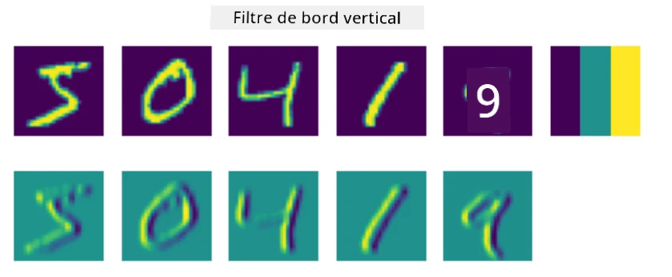
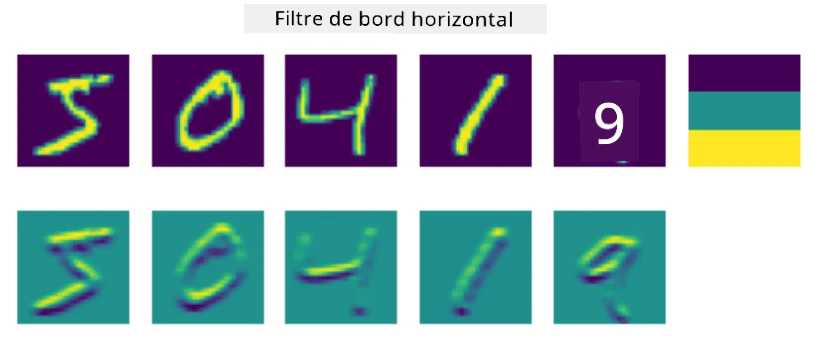
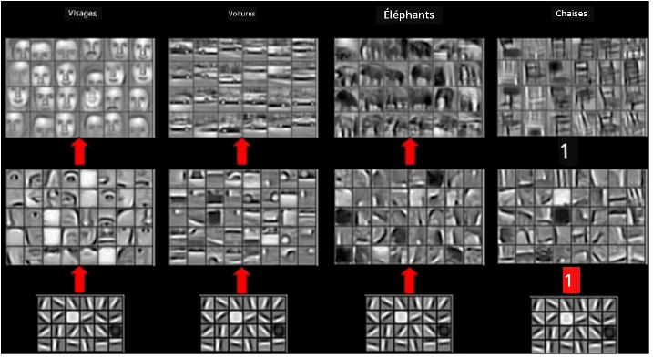

# Réseaux de Neurones Convolutionnels

Nous avons vu précédemment que les réseaux de neurones sont assez performants pour traiter les images, et même un perceptron à une seule couche est capable de reconnaître les chiffres manuscrits du jeu de données MNIST avec une précision raisonnable. Cependant, le jeu de données MNIST est très particulier, car tous les chiffres y sont centrés dans l'image, ce qui simplifie la tâche.

## [Quiz avant le cours](https://ff-quizzes.netlify.app/en/ai/quiz/13)

Dans la vie réelle, nous souhaitons pouvoir reconnaître des objets sur une image, peu importe leur emplacement exact dans celle-ci. La vision par ordinateur est différente de la classification générique, car lorsque nous cherchons un objet spécifique dans une image, nous analysons celle-ci à la recherche de certains **motifs** et de leurs combinaisons. Par exemple, pour identifier un chat, nous pouvons d'abord chercher des lignes horizontales qui pourraient former des moustaches, puis une certaine combinaison de moustaches pourrait nous indiquer qu'il s'agit bien d'une image de chat. La position relative et la présence de certains motifs sont importantes, mais pas leur emplacement exact dans l'image.

Pour extraire ces motifs, nous utiliserons la notion de **filtres convolutionnels**. Comme vous le savez, une image est représentée par une matrice 2D ou un tenseur 3D avec une profondeur de couleur. Appliquer un filtre signifie que nous prenons une matrice relativement petite appelée **noyau de filtre**, et pour chaque pixel de l'image originale, nous calculons la moyenne pondérée avec les points voisins. On peut voir cela comme une petite fenêtre glissant sur toute l'image et moyennant tous les pixels selon les poids du noyau de filtre.

 | 
----|----

> Image par Dmitry Soshnikov

Par exemple, si nous appliquons des filtres de bord vertical et horizontal 3x3 aux chiffres du MNIST, nous obtenons des zones mises en évidence (par exemple, des valeurs élevées) là où se trouvent des bords verticaux et horizontaux dans notre image originale. Ainsi, ces deux filtres peuvent être utilisés pour "chercher" des bords. De la même manière, nous pouvons concevoir différents filtres pour détecter d'autres motifs de bas niveau :

> Image de [Leung-Malik Filter Bank](https://www.robots.ox.ac.uk/~vgg/research/texclass/filters.html)

Cependant, bien que nous puissions concevoir manuellement des filtres pour extraire certains motifs, nous pouvons également concevoir le réseau de manière à ce qu'il apprenne ces motifs automatiquement. C'est l'une des idées principales derrière les CNN.

## Principales idées des CNN

Le fonctionnement des CNN repose sur les idées importantes suivantes :

* Les filtres convolutionnels peuvent extraire des motifs.
* Nous pouvons concevoir le réseau de manière à ce que les filtres soient entraînés automatiquement.
* Nous pouvons utiliser la même approche pour détecter des motifs dans des caractéristiques de haut niveau, et pas seulement dans l'image originale. Ainsi, l'extraction de caractéristiques par les CNN fonctionne sur une hiérarchie de caractéristiques, en commençant par des combinaisons de pixels de bas niveau jusqu'à des combinaisons de parties d'image de haut niveau.

> Image tirée [d'un article de Hislop-Lynch](https://www.semanticscholar.org/paper/Computer-vision-based-pedestrian-trajectory-Hislop-Lynch/26e6f74853fc9bbb7487b06dc2cf095d36c9021d), basé sur [leurs recherches](https://dl.acm.org/doi/abs/10.1145/1553374.1553453)

## ✍️ Exercices : Réseaux de Neurones Convolutionnels

Continuons à explorer le fonctionnement des réseaux de neurones convolutionnels et la manière dont nous pouvons obtenir des filtres entraînables, en travaillant sur les notebooks correspondants :

* [Réseaux de Neurones Convolutionnels - PyTorch](ConvNetsPyTorch.ipynb)
* [Réseaux de Neurones Convolutionnels - TensorFlow](ConvNetsTF.ipynb)

## Architecture Pyramidale

La plupart des CNN utilisés pour le traitement d'images suivent une architecture dite pyramidale. La première couche convolutionnelle appliquée aux images originales comporte généralement un nombre relativement faible de filtres (8-16), correspondant à différentes combinaisons de pixels, comme des lignes horizontales ou verticales. Au niveau suivant, nous réduisons la dimension spatiale du réseau et augmentons le nombre de filtres, ce qui correspond à davantage de combinaisons possibles de caractéristiques simples. À chaque couche, à mesure que nous nous rapprochons du classificateur final, les dimensions spatiales de l'image diminuent et le nombre de filtres augmente.

À titre d'exemple, examinons l'architecture de VGG-16, un réseau qui a atteint une précision de 92,7 % dans la classification top-5 d'ImageNet en 2014 :

> Image tirée de [Researchgate](https://www.researchgate.net/figure/Vgg16-model-structure-To-get-the-VGG-NIN-model-we-replace-the-2-nd-4-th-6-th-7-th_fig2_335194493)

## Architectures CNN les plus connues

[Continuez votre étude des architectures CNN les plus connues](CNN_Architectures.md)

---

