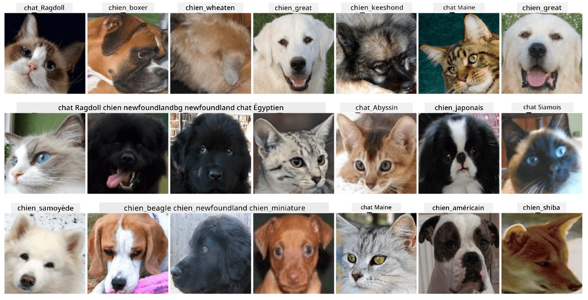

# Classification des visages d'animaux

Travail pratique issu du [Curriculum AI pour débutants](https://github.com/microsoft/ai-for-beginners).

## Tâche

Imaginez que vous devez développer une application pour une garderie d'animaux afin de cataloguer tous les animaux. L'une des fonctionnalités intéressantes de cette application serait de découvrir automatiquement la race à partir d'une photographie. Cela peut être réalisé avec succès en utilisant des réseaux neuronaux.

Vous devez entraîner un réseau neuronal convolutif pour classifier différentes races de chats et de chiens en utilisant le dataset **Pet Faces**.

## Le Dataset

Nous utiliserons le [Oxford-IIIT Pet Dataset](https://www.robots.ox.ac.uk/~vgg/data/pets/), qui contient des images de 37 races différentes de chiens et de chats.



Pour télécharger le dataset, utilisez ce fragment de code :

```python
!wget https://thor.robots.ox.ac.uk/~vgg/data/pets/images.tar.gz
!tar xfz images.tar.gz
!rm images.tar.gz
```

**Remarque :** Les images du Oxford-IIIT Pet Dataset sont organisées par nom de fichier (par exemple, `Abyssinian_1.jpg`, `Bengal_2.jpg`). Le notebook inclut du code pour organiser ces images dans des sous-répertoires spécifiques à chaque race afin de faciliter la classification.

## Notebook de départ

Commencez le travail pratique en ouvrant [PetFaces.ipynb](PetFaces.ipynb)

## Résultat

Vous avez résolu un problème relativement complexe de classification d'images à partir de zéro ! Il y avait un grand nombre de classes, et vous avez tout de même réussi à obtenir une précision raisonnable ! Il est également pertinent de mesurer la précision top-k, car il est facile de confondre certaines classes qui ne sont pas clairement distinctes, même pour les êtres humains.

---

**Avertissement** :  
Ce document a été traduit à l'aide du service de traduction automatique [Co-op Translator](https://github.com/Azure/co-op-translator). Bien que nous nous efforcions d'assurer l'exactitude, veuillez noter que les traductions automatisées peuvent contenir des erreurs ou des inexactitudes. Le document original dans sa langue d'origine doit être considéré comme la source faisant autorité. Pour des informations critiques, il est recommandé de recourir à une traduction humaine professionnelle. Nous déclinons toute responsabilité en cas de malentendus ou d'interprétations erronées résultant de l'utilisation de cette traduction.