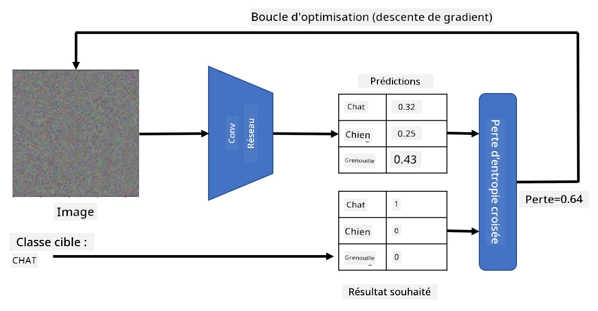

# Réseaux pré-entraînés et apprentissage par transfert

L'entraînement des CNN peut prendre beaucoup de temps et nécessite une grande quantité de données. Cependant, une grande partie du temps est consacrée à l'apprentissage des meilleurs filtres de bas niveau qu'un réseau peut utiliser pour extraire des motifs à partir d'images. Une question naturelle se pose : peut-on utiliser un réseau neuronal entraîné sur un ensemble de données et l'adapter pour classifier d'autres images sans nécessiter un processus d'entraînement complet ?

## [Quiz avant le cours](https://ff-quizzes.netlify.app/en/ai/quiz/15)

Cette approche est appelée **apprentissage par transfert**, car nous transférons une partie des connaissances d'un modèle de réseau neuronal à un autre. Dans l'apprentissage par transfert, nous commençons généralement par un modèle pré-entraîné, qui a été entraîné sur un grand ensemble de données d'images, comme **ImageNet**. Ces modèles sont déjà capables d'extraire efficacement différentes caractéristiques d'images génériques, et dans de nombreux cas, construire simplement un classificateur sur ces caractéristiques extraites peut donner de bons résultats.

> ✅ L'apprentissage par transfert est un terme que l'on retrouve dans d'autres domaines académiques, comme l'éducation. Il fait référence au processus consistant à appliquer des connaissances d'un domaine à un autre.

## Modèles pré-entraînés comme extracteurs de caractéristiques

Les réseaux convolutionnels que nous avons abordés dans la section précédente contiennent plusieurs couches, chacune étant censée extraire des caractéristiques de l'image, en commençant par des combinaisons de pixels de bas niveau (comme des lignes horizontales/verticales ou des traits), jusqu'à des combinaisons de caractéristiques de niveau supérieur, correspondant à des éléments comme un œil ou une flamme. Si nous entraînons un CNN sur un ensemble de données suffisamment large et diversifié, le réseau devrait apprendre à extraire ces caractéristiques communes.

Keras et PyTorch proposent des fonctions permettant de charger facilement les poids de réseaux neuronaux pré-entraînés pour certaines architectures courantes, dont la plupart ont été entraînées sur des images d'ImageNet. Les modèles les plus utilisés sont décrits sur la page [Architectures CNN](../07-ConvNets/CNN_Architectures.md) de la leçon précédente. En particulier, vous pourriez envisager d'utiliser l'un des modèles suivants :

* **VGG-16/VGG-19**, qui sont des modèles relativement simples offrant une bonne précision. Utiliser VGG comme première tentative est souvent un bon choix pour voir comment fonctionne l'apprentissage par transfert.
* **ResNet**, une famille de modèles proposée par Microsoft Research en 2015. Ces modèles ont plus de couches et nécessitent donc davantage de ressources.
* **MobileNet**, une famille de modèles de taille réduite, adaptée aux appareils mobiles. Utilisez-les si vous disposez de ressources limitées et pouvez sacrifier un peu de précision.

Voici des exemples de caractéristiques extraites d'une image de chat par le réseau VGG-16 :

## Ensemble de données "Chats vs. Chiens"

Dans cet exemple, nous utiliserons un ensemble de données de [Chats et Chiens](https://www.microsoft.com/download/details.aspx?id=54765&WT.mc_id=academic-77998-cacaste), qui est très proche d'un scénario réel de classification d'images.

## ✍️ Exercice : Apprentissage par transfert

Voyons l'apprentissage par transfert en action dans les notebooks correspondants :

* [Apprentissage par transfert - PyTorch](TransferLearningPyTorch.ipynb)
* [Apprentissage par transfert - TensorFlow](TransferLearningTF.ipynb)

## Visualisation du chat adversarial

Un réseau neuronal pré-entraîné contient différents motifs dans son *cerveau*, y compris des notions de **chat idéal** (ainsi que de chien idéal, de zèbre idéal, etc.). Il serait intéressant de **visualiser cette image**. Cependant, ce n'est pas simple, car les motifs sont répartis dans les poids du réseau et organisés dans une structure hiérarchique.

Une approche consiste à partir d'une image aléatoire et à utiliser une technique d'optimisation par **descente de gradient** pour ajuster cette image de manière à ce que le réseau commence à penser qu'il s'agit d'un chat.

Cependant, si nous faisons cela, nous obtiendrons quelque chose qui ressemble beaucoup à un bruit aléatoire. Cela s'explique par le fait qu'*il existe de nombreuses façons de faire croire au réseau que l'image d'entrée est un chat*, y compris certaines qui n'ont aucun sens visuel. Bien que ces images contiennent de nombreux motifs typiques d'un chat, rien ne les contraint à être visuellement distinctives.

Pour améliorer le résultat, nous pouvons ajouter un autre terme à la fonction de perte, appelé **perte de variation**. Il s'agit d'une métrique qui montre à quel point les pixels voisins de l'image sont similaires. Minimiser la perte de variation rend l'image plus lisse et élimine le bruit, révélant ainsi des motifs plus visuellement attrayants. Voici un exemple de telles images "idéales", classées comme chat et comme zèbre avec une forte probabilité :

 | 
-----|-----
 *Chat idéal* | *Zèbre idéal*

Une approche similaire peut être utilisée pour effectuer des **attaques adversariales** sur un réseau neuronal. Supposons que nous souhaitons tromper un réseau neuronal et faire en sorte qu'un chien ressemble à un chat. Si nous prenons une image de chien, reconnue par le réseau comme un chien, nous pouvons la modifier légèrement en utilisant l'optimisation par descente de gradient, jusqu'à ce que le réseau commence à la classer comme un chat :

 | 
-----|-----
*Image originale d'un chien* | *Image d'un chien classée comme un chat*

Consultez le code pour reproduire les résultats ci-dessus dans le notebook suivant :

* [Chat idéal et adversarial - TensorFlow](AdversarialCat_TF.ipynb)

## Conclusion

Grâce à l'apprentissage par transfert, vous pouvez rapidement créer un classificateur pour une tâche de classification d'objets personnalisée et obtenir une grande précision. Vous pouvez constater que les tâches plus complexes que nous résolvons maintenant nécessitent une puissance de calcul plus élevée et ne peuvent pas être facilement exécutées sur un CPU. Dans la prochaine unité, nous essayerons d'utiliser une implémentation plus légère pour entraîner le même modèle en utilisant moins de ressources de calcul, ce qui entraîne une précision légèrement inférieure.

## 🚀 Défi

Dans les notebooks associés, des notes en bas expliquent que l'apprentissage par transfert fonctionne mieux avec des données d'entraînement quelque peu similaires (par exemple, un nouveau type d'animal). Faites des expérimentations avec des types d'images complètement nouveaux pour voir à quel point vos modèles d'apprentissage par transfert fonctionnent bien ou mal.

## [Quiz après le cours](https://ff-quizzes.netlify.app/en/ai/quiz/16)

## Révision et auto-apprentissage

Lisez [TrainingTricks.md](TrainingTricks.md) pour approfondir vos connaissances sur d'autres façons d'entraîner vos modèles.

## [Devoir](lab/README.md)

Dans ce laboratoire, nous utiliserons l'ensemble de données réel [Oxford-IIIT](https://www.robots.ox.ac.uk/~vgg/data/pets/) sur les animaux de compagnie, comprenant 35 races de chats et de chiens, et nous construirons un classificateur basé sur l'apprentissage par transfert.

---

