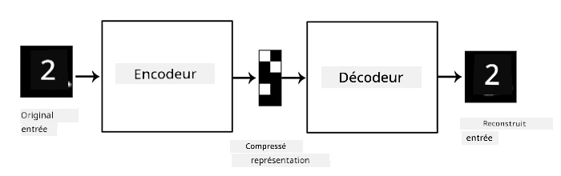
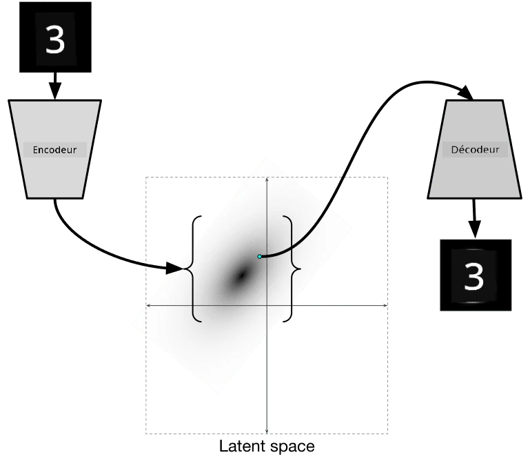
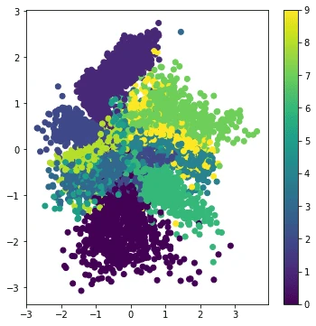

# Autoencodeurs

Lors de l'entraînement des CNN, l'un des problèmes est que nous avons besoin de beaucoup de données annotées. Dans le cas de la classification d'images, il faut séparer les images en différentes classes, ce qui demande un effort manuel.

## [Quiz avant le cours](https://ff-quizzes.netlify.app/en/ai/quiz/17)

Cependant, nous pourrions vouloir utiliser des données brutes (non annotées) pour entraîner des extracteurs de caractéristiques CNN, ce que l'on appelle **l'apprentissage auto-supervisé**. Au lieu d'utiliser des étiquettes, nous utilisons les images d'entraînement comme à la fois entrée et sortie du réseau. L'idée principale de l'**autoencodeur** est d'avoir un **réseau encodeur** qui convertit l'image d'entrée en un certain **espace latent** (généralement un vecteur de taille réduite), puis un **réseau décodeur**, dont l'objectif est de reconstruire l'image originale.

> ✅ Un [autoencodeur](https://wikipedia.org/wiki/Autoencoder) est "un type de réseau de neurones artificiels utilisé pour apprendre des codages efficaces de données non annotées."

Étant donné que nous entraînons un autoencodeur pour capturer autant d'informations que possible de l'image originale afin de la reconstruire avec précision, le réseau cherche à trouver la meilleure **représentation** des images d'entrée pour en saisir le sens.

> Image tirée du [blog Keras](https://blog.keras.io/building-autoencoders-in-keras.html)

## Scénarios d'utilisation des autoencodeurs

Bien que la reconstruction des images originales ne semble pas utile en soi, il existe plusieurs scénarios où les autoencodeurs sont particulièrement utiles :

* **Réduction de la dimension des images pour la visualisation** ou **entraînement des représentations d'images**. Les autoencodeurs donnent généralement de meilleurs résultats que la PCA, car ils tiennent compte de la nature spatiale des images et des caractéristiques hiérarchiques.
* **Dénoiser**, c'est-à-dire supprimer le bruit d'une image. Étant donné que le bruit contient beaucoup d'informations inutiles, l'autoencodeur ne peut pas tout intégrer dans un espace latent relativement petit, et capture donc uniquement les parties importantes de l'image. Lors de l'entraînement des débruiteurs, on commence par des images originales et on utilise des images avec du bruit ajouté artificiellement comme entrée pour l'autoencodeur.
* **Super-résolution**, augmentation de la résolution des images. On commence avec des images haute résolution et on utilise l'image de résolution inférieure comme entrée de l'autoencodeur.
* **Modèles génératifs**. Une fois l'autoencodeur entraîné, la partie décodeur peut être utilisée pour créer de nouveaux objets à partir de vecteurs latents aléatoires.

## Autoencodeurs Variationnels (VAE)

Les autoencodeurs traditionnels réduisent la dimension des données d'entrée en identifiant les caractéristiques importantes des images d'entrée. Cependant, les vecteurs latents n'ont souvent pas beaucoup de sens. En d'autres termes, si l'on prend l'exemple du dataset MNIST, il n'est pas facile de déterminer quels chiffres correspondent à différents vecteurs latents, car des vecteurs latents proches ne correspondent pas nécessairement aux mêmes chiffres.

En revanche, pour entraîner des modèles *génératifs*, il est préférable de comprendre l'espace latent. Cette idée nous mène aux **autoencodeurs variationnels** (VAE).

Un VAE est un autoencodeur qui apprend à prédire une *distribution statistique* des paramètres latents, appelée **distribution latente**. Par exemple, nous pouvons vouloir que les vecteurs latents soient distribués normalement avec une moyenne zmean et un écart-type zsigma (la moyenne et l'écart-type sont tous deux des vecteurs de dimensionnalité d). L'encodeur dans le VAE apprend à prédire ces paramètres, puis le décodeur prend un vecteur aléatoire de cette distribution pour reconstruire l'objet.

En résumé :

 * À partir du vecteur d'entrée, nous prédisons `z_mean` et `z_log_sigma` (au lieu de prédire directement l'écart-type, nous prédisons son logarithme)
 * Nous échantillonnons un vecteur `sample` à partir de la distribution N(zmean,exp(zlog\_sigma))
 * Le décodeur essaie de décoder l'image originale en utilisant `sample` comme vecteur d'entrée

 

> Image tirée de [cet article de blog](https://ijdykeman.github.io/ml/2016/12/21/cvae.html) par Isaak Dykeman

Les autoencodeurs variationnels utilisent une fonction de perte complexe composée de deux parties :

* **Perte de reconstruction**, une fonction de perte qui mesure à quel point l'image reconstruite est proche de la cible (elle peut être l'erreur quadratique moyenne, ou MSE). C'est la même fonction de perte que dans les autoencodeurs classiques.
* **Perte KL**, qui garantit que les distributions des variables latentes restent proches d'une distribution normale. Elle est basée sur la notion de [divergence de Kullback-Leibler](https://www.countbayesie.com/blog/2017/5/9/kullback-leibler-divergence-explained) - une métrique pour estimer la similarité entre deux distributions statistiques.

Un avantage important des VAE est qu'ils permettent de générer de nouvelles images relativement facilement, car nous savons de quelle distribution échantillonner les vecteurs latents. Par exemple, si nous entraînons un VAE avec un vecteur latent 2D sur MNIST, nous pouvons ensuite varier les composantes du vecteur latent pour obtenir différents chiffres :

> Image par [Dmitry Soshnikov](http://soshnikov.com)

Observez comment les images se fondent les unes dans les autres, à mesure que nous obtenons des vecteurs latents provenant de différentes parties de l'espace des paramètres latents. Nous pouvons également visualiser cet espace en 2D :

 

> Image par [Dmitry Soshnikov](http://soshnikov.com)

## ✍️ Exercices : Autoencodeurs

Apprenez-en davantage sur les autoencodeurs dans ces notebooks correspondants :

* [Autoencodeurs avec TensorFlow](AutoencodersTF.ipynb)
* [Autoencodeurs avec PyTorch](AutoEncodersPyTorch.ipynb)

## Propriétés des autoencodeurs

* **Spécifiques aux données** - ils fonctionnent bien uniquement avec le type d'images sur lequel ils ont été entraînés. Par exemple, si nous entraînons un réseau de super-résolution sur des fleurs, il ne fonctionnera pas bien sur des portraits. Cela s'explique par le fait que le réseau peut produire une image de résolution supérieure en utilisant des détails fins issus des caractéristiques apprises à partir du dataset d'entraînement.
* **Avec perte** - l'image reconstruite n'est pas identique à l'image originale. La nature de la perte est définie par la *fonction de perte* utilisée lors de l'entraînement.
* Fonctionne sur des données **non annotées**

## [Quiz après le cours](https://ff-quizzes.netlify.app/en/ai/quiz/18)

## Conclusion

Dans cette leçon, vous avez appris les différents types d'autoencodeurs disponibles pour le scientifique en IA. Vous avez appris à les construire et à les utiliser pour reconstruire des images. Vous avez également découvert le VAE et comment l'utiliser pour générer de nouvelles images.

## 🚀 Défi

Dans cette leçon, vous avez appris à utiliser les autoencodeurs pour les images. Mais ils peuvent également être utilisés pour la musique ! Découvrez le projet [MusicVAE](https://magenta.tensorflow.org/music-vae) du projet Magenta, qui utilise des autoencodeurs pour apprendre à reconstruire de la musique. Faites quelques [expériences](https://colab.research.google.com/github/magenta/magenta-demos/blob/master/colab-notebooks/Multitrack_MusicVAE.ipynb) avec cette bibliothèque pour voir ce que vous pouvez créer.

## [Quiz après le cours](https://ff-quizzes.netlify.app/en/ai/quiz/16)

## Révision & Auto-apprentissage

Pour référence, lisez-en davantage sur les autoencodeurs dans ces ressources :

* [Construire des autoencodeurs avec Keras](https://blog.keras.io/building-autoencoders-in-keras.html)
* [Article de blog sur NeuroHive](https://neurohive.io/ru/osnovy-data-science/variacionnyj-avtojenkoder-vae/)
* [Explication des autoencodeurs variationnels](https://kvfrans.com/variational-autoencoders-explained/)
* [Autoencodeurs variationnels conditionnels](https://ijdykeman.github.io/ml/2016/12/21/cvae.html)

## Devoir

À la fin de [ce notebook avec TensorFlow](AutoencodersTF.ipynb), vous trouverez une "tâche" - utilisez-la comme votre devoir.

---

