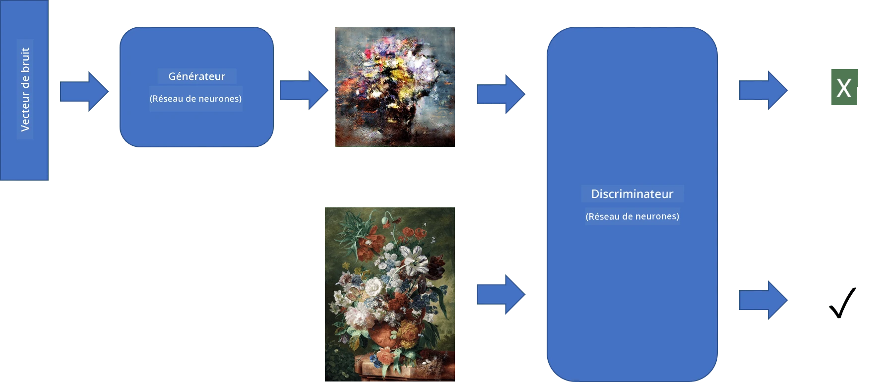
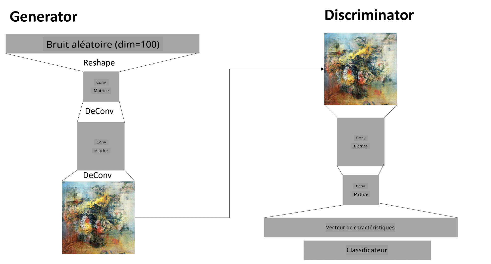

# Réseaux Adversaires Génératifs

Dans la section précédente, nous avons appris à propos des **modèles génératifs** : des modèles capables de générer de nouvelles images similaires à celles du jeu de données d'entraînement. Le VAE était un bon exemple de modèle génératif.

## [Quiz avant le cours](https://ff-quizzes.netlify.app/en/ai/quiz/19)

Cependant, si nous essayons de générer quelque chose de vraiment significatif, comme une peinture avec une résolution raisonnable, avec un VAE, nous constaterons que l'entraînement ne converge pas bien. Pour ce cas d'utilisation, nous devrions nous intéresser à une autre architecture spécifiquement conçue pour les modèles génératifs - les **Réseaux Adversaires Génératifs**, ou GANs.

L'idée principale d'un GAN est d'avoir deux réseaux neuronaux qui seront entraînés l'un contre l'autre :

> Image par [Dmitry Soshnikov](http://soshnikov.com)

> ✅ Un peu de vocabulaire :
> * **Générateur** : un réseau qui prend un vecteur aléatoire et produit une image en résultat.
> * **Discriminateur** : un réseau qui prend une image et doit déterminer si elle est une image réelle (provenant du jeu de données d'entraînement) ou si elle a été générée par un générateur. C'est essentiellement un classificateur d'images.

### Discriminateur

L'architecture du discriminateur ne diffère pas d'un réseau de classification d'images ordinaire. Dans le cas le plus simple, il peut s'agir d'un classificateur entièrement connecté, mais il sera très probablement un [réseau convolutionnel](../07-ConvNets/README.md).

> ✅ Un GAN basé sur des réseaux convolutionnels est appelé un [DCGAN](https://arxiv.org/pdf/1511.06434.pdf)

Un discriminateur CNN se compose des couches suivantes : plusieurs convolutions+poolings (avec une taille spatiale décroissante) et une ou plusieurs couches entièrement connectées pour obtenir un "vecteur de caractéristiques", suivi d'un classificateur binaire final.

> ✅ Un 'pooling' dans ce contexte est une technique qui réduit la taille de l'image. "Les couches de pooling réduisent les dimensions des données en combinant les sorties de clusters de neurones à une couche en un seul neurone dans la couche suivante." - [source](https://wikipedia.org/wiki/Convolutional_neural_network#Pooling_layers)

### Générateur

Un générateur est légèrement plus complexe. Vous pouvez le considérer comme un discriminateur inversé. En partant d'un vecteur latent (à la place d'un vecteur de caractéristiques), il possède une couche entièrement connectée pour le convertir à la taille/forme requise, suivie de déconvolutions+agrandissement. Cela ressemble à la partie *décodage* d'un [autoencodeur](../09-Autoencoders/README.md).

> ✅ Étant donné que la couche de convolution est implémentée comme un filtre linéaire parcourant l'image, la déconvolution est essentiellement similaire à la convolution et peut être mise en œuvre en utilisant la même logique de couche.

> Image par [Dmitry Soshnikov](http://soshnikov.com)

### Entraînement du GAN

Les GANs sont appelés **adversaires** parce qu'il y a une compétition constante entre le générateur et le discriminateur. Pendant cette compétition, le générateur et le discriminateur s'améliorent, ce qui permet au réseau d'apprendre à produire des images de plus en plus réalistes.

L'entraînement se déroule en deux étapes :

* **Entraînement du discriminateur**. Cette tâche est assez simple : nous générons un lot d'images avec le générateur, en les étiquetant 0, ce qui signifie image factice, et nous prenons un lot d'images du jeu de données d'entrée (avec l'étiquette 1, image réelle). Nous obtenons une *perte du discriminateur* et effectuons une rétropropagation.
* **Entraînement du générateur**. Cela est un peu plus complexe, car nous ne connaissons pas directement la sortie attendue pour le générateur. Nous prenons tout le réseau GAN composé d'un générateur suivi d'un discriminateur, nous le nourrissons avec des vecteurs aléatoires et nous attendons que le résultat soit 1 (correspondant à des images réelles). Nous gelons ensuite les paramètres du discriminateur (nous ne voulons pas qu'il soit entraîné à cette étape) et effectuons la rétropropagation.

Pendant ce processus, les pertes du générateur et du discriminateur ne diminuent pas significativement. Dans une situation idéale, elles devraient osciller, ce qui correspond à une amélioration des performances des deux réseaux.

## ✍️ Exercices : GANs

* [Notebook GAN avec TensorFlow/Keras](GANTF.ipynb)
* [Notebook GAN avec PyTorch](GANPyTorch.ipynb)

### Problèmes liés à l'entraînement des GANs

Les GANs sont connus pour être particulièrement difficiles à entraîner. Voici quelques problèmes :

* **Effondrement de mode**. Ce terme désigne le fait que le générateur apprend à produire une seule image réussie qui trompe le discriminateur, au lieu d'une variété d'images différentes.
* **Sensibilité aux hyperparamètres**. Il arrive souvent qu'un GAN ne converge pas du tout, puis qu'une diminution soudaine du taux d'apprentissage entraîne une convergence.
* Maintenir un **équilibre** entre le générateur et le discriminateur. Dans de nombreux cas, la perte du discriminateur peut chuter à zéro relativement rapidement, ce qui empêche le générateur de continuer à s'entraîner. Pour surmonter cela, nous pouvons essayer de définir des taux d'apprentissage différents pour le générateur et le discriminateur, ou de sauter l'entraînement du discriminateur si la perte est déjà trop faible.
* Entraînement pour une **haute résolution**. Reflétant le même problème que les autoencodeurs, ce problème est déclenché parce que reconstruire trop de couches d'un réseau convolutionnel entraîne des artefacts. Ce problème est généralement résolu par ce qu'on appelle le **progressive growing**, où les premières couches sont entraînées sur des images basse résolution, puis les couches sont "débloquées" ou ajoutées. Une autre solution consiste à ajouter des connexions supplémentaires entre les couches et à entraîner plusieurs résolutions en même temps - voir cet article sur les [Multi-Scale Gradient GANs](https://arxiv.org/abs/1903.06048) pour plus de détails.

## Transfert de style

Les GANs sont un excellent moyen de générer des images artistiques. Une autre technique intéressante est le **transfert de style**, qui prend une **image de contenu** et la redessine dans un style différent, en appliquant des filtres à partir d'une **image de style**.

Voici comment cela fonctionne :
* Nous commençons avec une image de bruit aléatoire (ou avec une image de contenu, mais pour mieux comprendre, il est plus simple de commencer par du bruit aléatoire).
* Notre objectif est de créer une image qui soit proche à la fois de l'image de contenu et de l'image de style. Cela sera déterminé par deux fonctions de perte :
   - **Perte de contenu** : calculée à partir des caractéristiques extraites par le CNN à certaines couches de l'image actuelle et de l'image de contenu.
   - **Perte de style** : calculée entre l'image actuelle et l'image de style d'une manière astucieuse en utilisant des matrices de Gram (plus de détails dans le [notebook d'exemple](StyleTransfer.ipynb)).
* Pour rendre l'image plus lisse et éliminer le bruit, nous introduisons également une **perte de variation**, qui calcule la distance moyenne entre les pixels voisins.
* La boucle principale d'optimisation ajuste l'image actuelle en utilisant la descente de gradient (ou un autre algorithme d'optimisation) pour minimiser la perte totale, qui est une somme pondérée de toutes les pertes.

## ✍️ Exemple : [Transfert de style](StyleTransfer.ipynb)

## [Quiz après le cours](https://ff-quizzes.netlify.app/en/ai/quiz/20)

## Conclusion

Dans cette leçon, vous avez appris à propos des GANs et comment les entraîner. Vous avez également découvert les défis spécifiques auxquels ce type de réseau neuronal peut être confronté, ainsi que des stratégies pour les surmonter.

## 🚀 Défi

Parcourez le [notebook de transfert de style](StyleTransfer.ipynb) en utilisant vos propres images.

## Révision & Étude personnelle

Pour référence, lisez davantage sur les GANs dans ces ressources :

* Marco Pasini, [10 Leçons que j'ai apprises en entraînant des GANs pendant un an](https://towardsdatascience.com/10-lessons-i-learned-training-generative-adversarial-networks-gans-for-a-year-c9071159628)
* [StyleGAN](https://en.wikipedia.org/wiki/StyleGAN), une architecture GAN *de facto* à considérer.
* [Créer de l'art génératif avec des GANs sur Azure ML](https://soshnikov.com/scienceart/creating-generative-art-using-gan-on-azureml/)

## Devoir

Revisitez l'un des deux notebooks associés à cette leçon et réentraînez le GAN avec vos propres images. Que pouvez-vous créer ?

---

