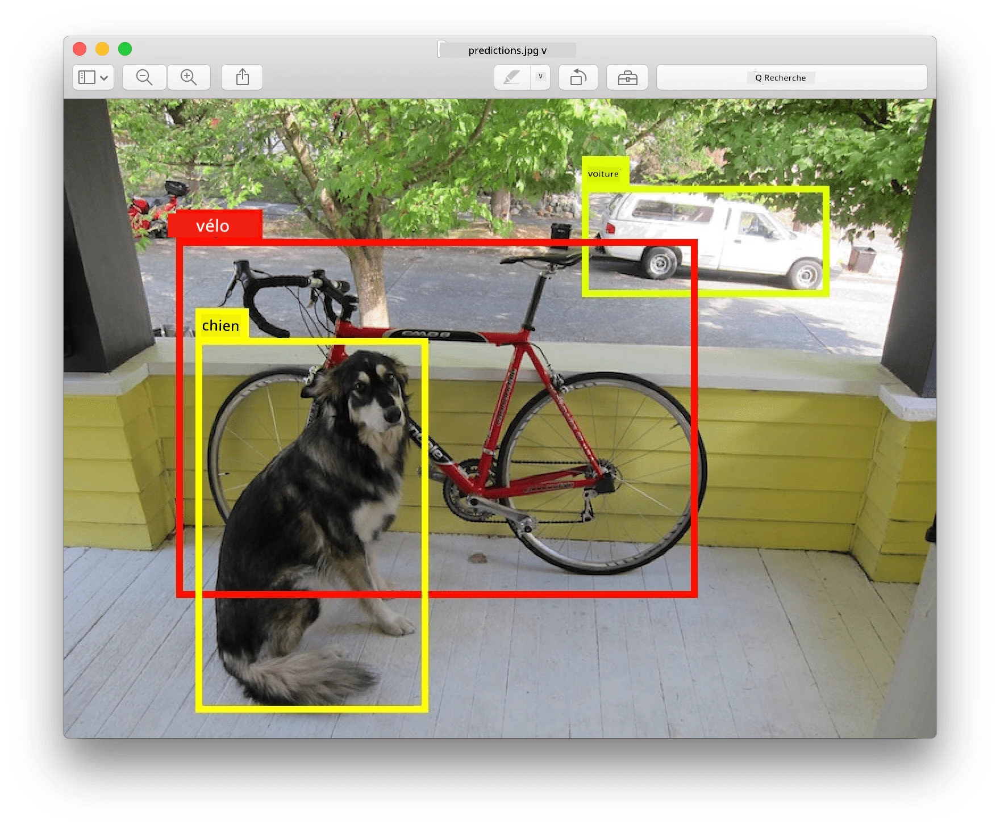
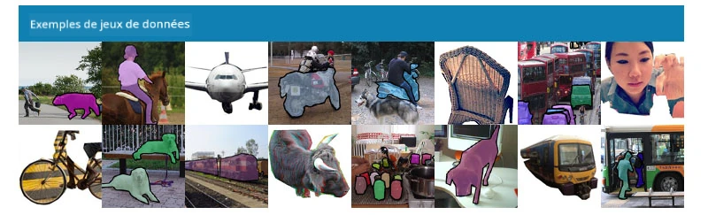
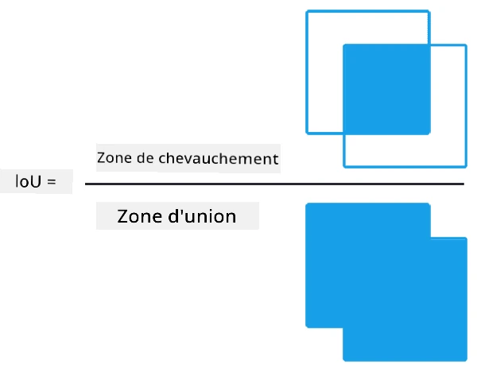
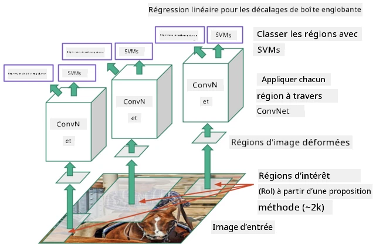
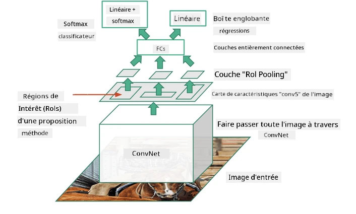
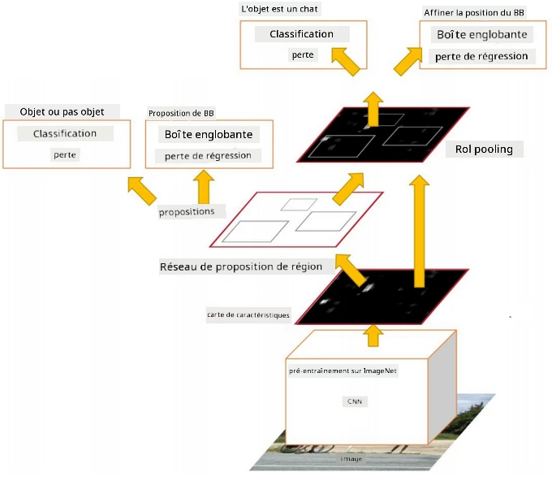

# Détection d'objets

Les modèles de classification d'images que nous avons abordés jusqu'à présent prenaient une image et produisaient un résultat catégorique, comme la classe 'nombre' dans un problème MNIST. Cependant, dans de nombreux cas, nous ne voulons pas seulement savoir qu'une image représente des objets - nous voulons pouvoir déterminer leur emplacement précis. C'est précisément l'objectif de la **détection d'objets**.

## [Quiz avant le cours](https://ff-quizzes.netlify.app/en/ai/quiz/21)

> Image tirée du [site web YOLO v2](https://pjreddie.com/darknet/yolov2/)

## Une approche naïve de la détection d'objets

Supposons que nous voulions trouver un chat sur une image. Une approche très naïve de la détection d'objets serait la suivante :

1. Diviser l'image en plusieurs carreaux.
2. Effectuer une classification d'image sur chaque carreau.
3. Les carreaux qui produisent une activation suffisamment élevée peuvent être considérés comme contenant l'objet en question.

> *Image tirée du [cahier d'exercices](ObjectDetection-TF.ipynb)*

Cependant, cette approche est loin d'être idéale, car elle ne permet à l'algorithme de localiser la boîte englobante de l'objet que de manière très imprécise. Pour une localisation plus précise, nous devons effectuer une sorte de **régression** pour prédire les coordonnées des boîtes englobantes - et pour cela, nous avons besoin de jeux de données spécifiques.

## Régression pour la détection d'objets

[Cet article de blog](https://towardsdatascience.com/object-detection-with-neural-networks-a4e2c46b4491) offre une excellente introduction à la détection de formes.

## Jeux de données pour la détection d'objets

Vous pourriez rencontrer les jeux de données suivants pour cette tâche :

* [PASCAL VOC](http://host.robots.ox.ac.uk/pascal/VOC/) - 20 classes
* [COCO](http://cocodataset.org/#home) - Common Objects in Context. 80 classes, boîtes englobantes et masques de segmentation

## Métriques de détection d'objets

### Intersection over Union

Alors que pour la classification d'images, il est facile de mesurer la performance de l'algorithme, pour la détection d'objets, nous devons mesurer à la fois la justesse de la classe et la précision de la localisation de la boîte englobante inférée. Pour cette dernière, nous utilisons ce qu'on appelle **Intersection over Union** (IoU), qui mesure à quel point deux boîtes (ou deux zones arbitraires) se chevauchent.

> *Figure 2 tirée de [cet excellent article de blog sur IoU](https://pyimagesearch.com/2016/11/07/intersection-over-union-iou-for-object-detection/)*

L'idée est simple : nous divisons la zone d'intersection entre deux figures par la zone de leur union. Pour deux zones identiques, IoU serait égal à 1, tandis que pour des zones complètement disjointes, il serait égal à 0. Sinon, il variera de 0 à 1. Nous considérons généralement uniquement les boîtes englobantes pour lesquelles IoU dépasse une certaine valeur.

### Précision moyenne

Supposons que nous souhaitons mesurer à quel point une classe d'objets donnée $C$ est bien reconnue. Pour cela, nous utilisons la métrique de **précision moyenne**, qui est calculée comme suit :

1. Considérer la courbe Précision-Rappel qui montre la précision en fonction d'une valeur seuil de détection (de 0 à 1).
2. En fonction du seuil, nous détecterons plus ou moins d'objets dans l'image, avec des valeurs de précision et de rappel différentes.
3. La courbe ressemblera à ceci :

> *Image tirée de [NeuroWorkshop](http://github.com/shwars/NeuroWorkshop)*

La précision moyenne pour une classe donnée $C$ est l'aire sous cette courbe. Plus précisément, l'axe du rappel est généralement divisé en 10 parties, et la précision est moyennée sur tous ces points :

$$
AP = {1\over11}\sum_{i=0}^{10}\mbox{Precision}(\mbox{Recall}={i\over10})
$$

### AP et IoU

Nous ne considérons que les détections pour lesquelles IoU dépasse une certaine valeur. Par exemple, dans le jeu de données PASCAL VOC, on suppose généralement que $\mbox{IoU Threshold} = 0.5$, tandis que dans COCO, AP est mesuré pour différentes valeurs de $\mbox{IoU Threshold}$.

> *Image tirée de [NeuroWorkshop](http://github.com/shwars/NeuroWorkshop)*

### Précision moyenne globale - mAP

La principale métrique pour la détection d'objets est appelée **précision moyenne globale**, ou **mAP**. Il s'agit de la valeur de la précision moyenne, moyennée sur toutes les classes d'objets, et parfois aussi sur $\mbox{IoU Threshold}$. Le processus de calcul de **mAP** est décrit en détail
[dans cet article de blog](https://medium.com/@timothycarlen/understanding-the-map-evaluation-metric-for-object-detection-a07fe6962cf3)), ainsi que [ici avec des exemples de code](https://gist.github.com/tarlen5/008809c3decf19313de216b9208f3734).

## Différentes approches de détection d'objets

Il existe deux grandes catégories d'algorithmes de détection d'objets :

* **Réseaux de propositions de régions** (R-CNN, Fast R-CNN, Faster R-CNN). L'idée principale est de générer des **régions d'intérêt** (ROI) et d'exécuter un CNN sur celles-ci, en recherchant une activation maximale. Cela ressemble un peu à l'approche naïve, à l'exception que les ROI sont générées de manière plus intelligente. L'un des principaux inconvénients de ces méthodes est qu'elles sont lentes, car nous avons besoin de nombreux passages du classificateur CNN sur l'image.
* Méthodes **en un seul passage** (YOLO, SSD, RetinaNet). Dans ces architectures, nous concevons le réseau pour prédire à la fois les classes et les ROI en un seul passage.

### R-CNN : CNN basé sur les régions

[R-CNN](http://islab.ulsan.ac.kr/files/announcement/513/rcnn_pami.pdf) utilise [Selective Search](http://www.huppelen.nl/publications/selectiveSearchDraft.pdf) pour générer une structure hiérarchique de régions ROI, qui sont ensuite passées par des extracteurs de caractéristiques CNN et des classificateurs SVM pour déterminer la classe de l'objet, et une régression linéaire pour déterminer les coordonnées de la *boîte englobante*. [Article officiel](https://arxiv.org/pdf/1506.01497v1.pdf)

> *Image tirée de van de Sande et al. ICCV’11*

> *Images tirées de [cet article de blog](https://towardsdatascience.com/r-cnn-fast-r-cnn-faster-r-cnn-yolo-object-detection-algorithms-36d53571365e)*

### F-RCNN - Fast R-CNN

Cette approche est similaire à R-CNN, mais les régions sont définies après l'application des couches de convolution.

> Image tirée de [l'article officiel](https://www.cv-foundation.org/openaccess/content_iccv_2015/papers/Girshick_Fast_R-CNN_ICCV_2015_paper.pdf), [arXiv](https://arxiv.org/pdf/1504.08083.pdf), 2015

### Faster R-CNN

L'idée principale de cette approche est d'utiliser un réseau neuronal pour prédire les ROI - le *Réseau de propositions de régions*. [Article](https://arxiv.org/pdf/1506.01497.pdf), 2016

> Image tirée de [l'article officiel](https://arxiv.org/pdf/1506.01497.pdf)

### R-FCN : Réseau entièrement convolutionnel basé sur les régions

Cet algorithme est encore plus rapide que Faster R-CNN. L'idée principale est la suivante :

1. Nous extrayons des caractéristiques à l'aide de ResNet-101.
1. Les caractéristiques sont traitées par une **carte de score sensible à la position**. Chaque objet des $C$ classes est divisé en $k\times k$ régions, et nous entraînons le réseau à prédire des parties d'objets.
1. Pour chaque partie des $k\times k$ régions, tous les réseaux votent pour les classes d'objets, et la classe d'objet avec le vote maximum est sélectionnée.

> Image tirée de [l'article officiel](https://arxiv.org/abs/1605.06409)

### YOLO - You Only Look Once

YOLO est un algorithme en temps réel en un seul passage. L'idée principale est la suivante :

 * L'image est divisée en $S\times S$ régions.
 * Pour chaque région, **CNN** prédit $n$ objets possibles, les coordonnées de la *boîte englobante* et la *confiance*=*probabilité* * IoU.

 

> Image tirée de [l'article officiel](https://arxiv.org/abs/1506.02640)

### Autres algorithmes

* RetinaNet : [article officiel](https://arxiv.org/abs/1708.02002)
   - [Implémentation PyTorch dans Torchvision](https://pytorch.org/vision/stable/_modules/torchvision/models/detection/retinanet.html)
   - [Implémentation Keras](https://github.com/fizyr/keras-retinanet)
   - [Détection d'objets avec RetinaNet](https://keras.io/examples/vision/retinanet/) dans les exemples Keras
* SSD (Single Shot Detector) : [article officiel](https://arxiv.org/abs/1512.02325)

## ✍️ Exercices : Détection d'objets

Poursuivez votre apprentissage dans le cahier suivant :

[ObjectDetection.ipynb](ObjectDetection.ipynb)

## Conclusion

Dans cette leçon, vous avez exploré rapidement les différentes façons dont la détection d'objets peut être réalisée !

## 🚀 Défi

Lisez ces articles et cahiers sur YOLO et essayez-les par vous-même :

* [Un bon article de blog](https://www.analyticsvidhya.com/blog/2018/12/practical-guide-object-detection-yolo-framewor-python/) décrivant YOLO
 * [Site officiel](https://pjreddie.com/darknet/yolo/)
 * YOLO : [Implémentation Keras](https://github.com/experiencor/keras-yolo2), [cahier étape par étape](https://github.com/experiencor/basic-yolo-keras/blob/master/Yolo%20Step-by-Step.ipynb)
 * YOLO v2 : [Implémentation Keras](https://github.com/experiencor/keras-yolo2), [cahier étape par étape](https://github.com/experiencor/keras-yolo2/blob/master/Yolo%20Step-by-Step.ipynb)

## [Quiz après le cours](https://ff-quizzes.netlify.app/en/ai/quiz/22)

## Révision et auto-apprentissage

* [Détection d'objets](https://tjmachinelearning.com/lectures/1718/obj/) par Nikhil Sardana
* [Une bonne comparaison des algorithmes de détection d'objets](https://lilianweng.github.io/lil-log/2018/12/27/object-detection-part-4.html)
* [Revue des algorithmes de Deep Learning pour la détection d'objets](https://medium.com/comet-app/review-of-deep-learning-algorithms-for-object-detection-c1f3d437b852)
* [Introduction étape par étape aux algorithmes de détection d'objets de base](https://www.analyticsvidhya.com/blog/2018/10/a-step-by-step-introduction-to-the-basic-object-detection-algorithms-part-1/)
* [Implémentation de Faster R-CNN en Python pour la détection d'objets](https://www.analyticsvidhya.com/blog/2018/11/implementation-faster-r-cnn-python-object-detection/)

## [Devoir : Détection d'objets](lab/README.md)

---

