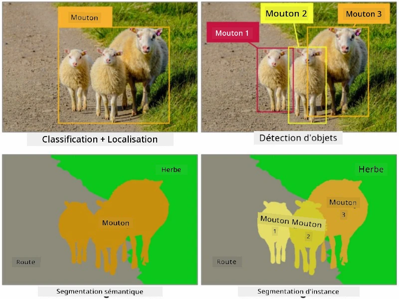
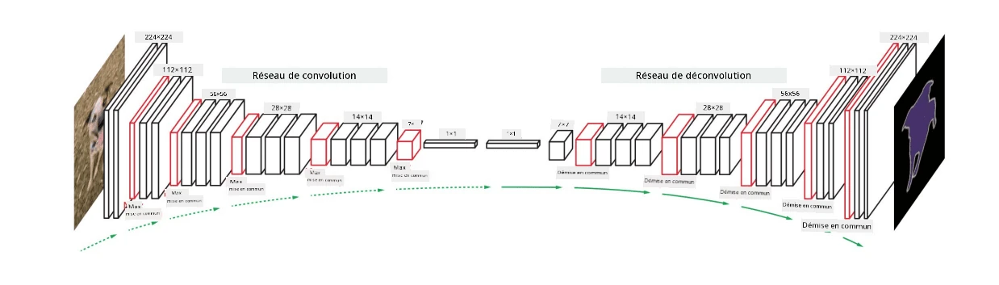

# Segmentation

Nous avons précédemment appris la détection d'objets, qui nous permet de localiser des objets dans une image en prédisant leurs *boîtes englobantes*. Cependant, pour certaines tâches, nous avons besoin d'une localisation d'objets plus précise que les simples boîtes englobantes. Cette tâche est appelée **segmentation**.

## [Quiz avant le cours](https://ff-quizzes.netlify.app/en/ai/quiz/23)

La segmentation peut être vue comme une **classification de pixels**, où pour **chaque** pixel de l'image, nous devons prédire sa classe (*le fond* étant l'une des classes). Il existe deux principaux types d'algorithmes de segmentation :

* La **segmentation sémantique** indique uniquement la classe du pixel, sans distinguer les différents objets appartenant à la même classe.
* La **segmentation par instance** divise les classes en différentes instances.

Par exemple, pour la segmentation par instance, ces moutons sont des objets distincts, tandis que pour la segmentation sémantique, tous les moutons sont représentés par une seule classe.

> Image tirée de [cet article de blog](https://nirmalamurali.medium.com/image-classification-vs-semantic-segmentation-vs-instance-segmentation-625c33a08d50)

Il existe différentes architectures neuronales pour la segmentation, mais elles ont toutes la même structure. D'une certaine manière, cela ressemble à l'autoencodeur que vous avez étudié précédemment, mais au lieu de déconstruire l'image originale, notre objectif est de déconstruire un **masque**. Ainsi, un réseau de segmentation comporte les parties suivantes :

* **Encodeur** : extrait les caractéristiques de l'image d'entrée.
* **Décodeur** : transforme ces caractéristiques en une **image de masque**, ayant la même taille et un nombre de canaux correspondant au nombre de classes.

> Image tirée de [cette publication](https://arxiv.org/pdf/2001.05566.pdf)

Il est particulièrement important de mentionner la fonction de perte utilisée pour la segmentation. Lors de l'utilisation d'autoencodeurs classiques, nous devons mesurer la similarité entre deux images, et nous pouvons utiliser l'erreur quadratique moyenne (MSE) pour cela. En segmentation, chaque pixel de l'image cible du masque représente le numéro de classe (encodé en one-hot le long de la troisième dimension), nous devons donc utiliser des fonctions de perte spécifiques à la classification - la perte d'entropie croisée, moyennée sur tous les pixels. Si le masque est binaire, on utilise la **perte d'entropie croisée binaire** (BCE).

> ✅ L'encodage one-hot est une méthode pour encoder une étiquette de classe dans un vecteur de longueur égale au nombre de classes. Consultez [cet article](https://datagy.io/sklearn-one-hot-encode/) pour en savoir plus sur cette technique.

## Segmentation pour l'imagerie médicale

Dans cette leçon, nous verrons la segmentation en action en entraînant un réseau à reconnaître des nævus humains (également appelés grains de beauté) sur des images médicales. Nous utiliserons la <a href="https://www.fc.up.pt/addi/ph2%20database.html">base de données PH2</a> d'images de dermoscopie comme source d'images. Ce jeu de données contient 200 images réparties en trois classes : nævus typique, nævus atypique et mélanome. Toutes les images contiennent également un **masque** correspondant qui délimite le nævus.

> ✅ Cette technique est particulièrement adaptée à ce type d'imagerie médicale, mais quelles autres applications réelles pourriez-vous imaginer ?

> Image tirée de la base de données PH2

Nous allons entraîner un modèle pour segmenter tout nævus de son arrière-plan.

## ✍️ Exercices : Segmentation sémantique

Ouvrez les notebooks ci-dessous pour en apprendre davantage sur les différentes architectures de segmentation sémantique, pratiquer leur utilisation et les voir en action.

* [Segmentation sémantique avec Pytorch](SemanticSegmentationPytorch.ipynb)
* [Segmentation sémantique avec TensorFlow](SemanticSegmentationTF.ipynb)

## [Quiz après le cours](https://ff-quizzes.netlify.app/en/ai/quiz/24)

## Conclusion

La segmentation est une technique très puissante pour la classification d'images, allant au-delà des boîtes englobantes pour une classification au niveau des pixels. C'est une technique utilisée en imagerie médicale, entre autres applications.

## 🚀 Défi

La segmentation corporelle n'est qu'une des tâches courantes que nous pouvons réaliser avec des images de personnes. Parmi les autres tâches importantes, on trouve la **détection de squelette** et la **détection de pose**. Essayez la bibliothèque [OpenPose](https://github.com/CMU-Perceptual-Computing-Lab/openpose) pour découvrir comment la détection de pose peut être utilisée.

## Révision et auto-apprentissage

Cet [article Wikipédia](https://wikipedia.org/wiki/Image_segmentation) offre un bon aperçu des diverses applications de cette technique. Renseignez-vous davantage sur les sous-domaines de la segmentation par instance et de la segmentation panoptique dans ce domaine d'étude.

## [Devoir](lab/README.md)

Dans ce laboratoire, essayez la **segmentation du corps humain** en utilisant le [jeu de données Segmentation Full Body MADS](https://www.kaggle.com/datasets/tapakah68/segmentation-full-body-mads-dataset) disponible sur Kaggle.

---

