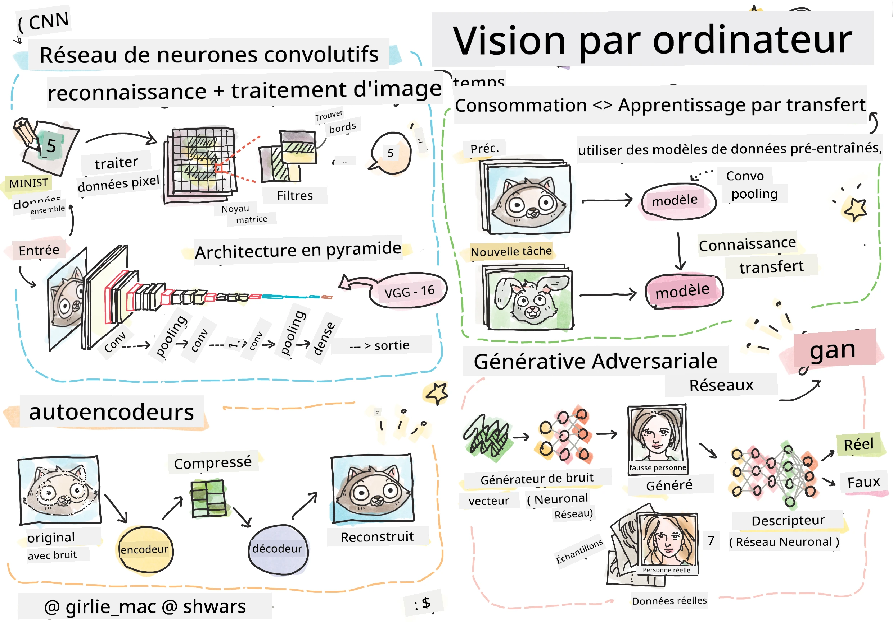

# Vision par ordinateur

Dans cette section, nous allons apprendre :

* [Introduction à la vision par ordinateur et OpenCV](06-IntroCV/README.md)
* [Réseaux neuronaux convolutionnels](07-ConvNets/README.md)
* [Réseaux pré-entraînés et apprentissage par transfert](08-TransferLearning/README.md) 
* [Autoencodeurs](09-Autoencoders/README.md)
* [Réseaux antagonistes génératifs](10-GANs/README.md)
* [Détection d'objets](11-ObjectDetection/README.md)
* [Segmentation sémantique](12-Segmentation/README.md)

**Avertissement** :  
Ce document a été traduit à l'aide du service de traduction automatique [Co-op Translator](https://github.com/Azure/co-op-translator). Bien que nous nous efforcions d'assurer l'exactitude, veuillez noter que les traductions automatisées peuvent contenir des erreurs ou des inexactitudes. Le document original dans sa langue d'origine doit être considéré comme la source faisant autorité. Pour des informations critiques, il est recommandé de recourir à une traduction humaine professionnelle. Nous déclinons toute responsabilité en cas de malentendus ou d'interprétations erronées résultant de l'utilisation de cette traduction.