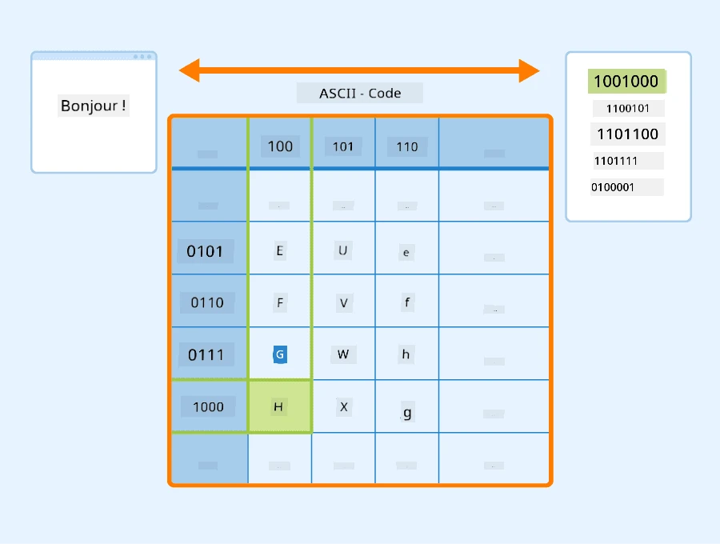
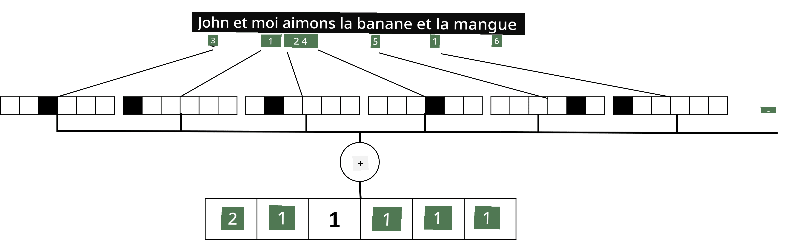

# Représenter le texte sous forme de tenseurs

## [Quiz avant le cours](https://ff-quizzes.netlify.app/en/ai/quiz/25)

## Classification de texte

Dans la première partie de cette section, nous allons nous concentrer sur la tâche de **classification de texte**. Nous utiliserons le jeu de données [AG News](https://www.kaggle.com/amananandrai/ag-news-classification-dataset), qui contient des articles de presse comme celui-ci :

* Catégorie : Sci/Tech  
* Titre : Ky. Company Wins Grant to Study Peptides (AP)  
* Corps : AP - Une entreprise fondée par un chercheur en chimie de l'Université de Louisville a obtenu une subvention pour développer...

Notre objectif sera de classer l'article dans l'une des catégories en fonction du texte.

## Représenter le texte

Pour résoudre des tâches de traitement du langage naturel (NLP) avec des réseaux neuronaux, nous devons trouver un moyen de représenter le texte sous forme de tenseurs. Les ordinateurs représentent déjà les caractères textuels sous forme de nombres qui correspondent aux polices affichées sur votre écran, en utilisant des encodages tels que ASCII ou UTF-8.

> [Source de l'image](https://www.seobility.net/en/wiki/ASCII)

En tant qu'humains, nous comprenons ce que chaque lettre **représente**, et comment tous les caractères se combinent pour former les mots d'une phrase. Cependant, les ordinateurs, par eux-mêmes, n'ont pas cette compréhension, et le réseau neuronal doit apprendre le sens pendant l'entraînement.

Ainsi, nous pouvons utiliser différentes approches pour représenter le texte :

* **Représentation au niveau des caractères**, où chaque caractère est traité comme un nombre. Étant donné que nous avons *C* caractères différents dans notre corpus de texte, le mot *Hello* serait représenté par un tenseur de 5x*C*. Chaque lettre correspondrait à une colonne de tenseur en encodage one-hot.  
* **Représentation au niveau des mots**, où nous créons un **vocabulaire** de tous les mots dans notre texte, puis représentons les mots en utilisant l'encodage one-hot. Cette approche est meilleure dans une certaine mesure, car chaque lettre seule n'a pas beaucoup de sens. En utilisant des concepts sémantiques de niveau supérieur - les mots - nous simplifions la tâche pour le réseau neuronal. Cependant, étant donné la taille importante du dictionnaire, nous devons gérer des tenseurs creux de haute dimension.

Quelle que soit la représentation, nous devons d'abord convertir le texte en une séquence de **tokens**, un token étant soit un caractère, un mot, ou parfois même une partie d'un mot. Ensuite, nous convertissons le token en un nombre, généralement en utilisant un **vocabulaire**, et ce nombre peut être introduit dans un réseau neuronal via un encodage one-hot.

## N-Grams

Dans le langage naturel, le sens précis des mots ne peut être déterminé qu'en contexte. Par exemple, les significations de *réseau neuronal* et *réseau de pêche* sont complètement différentes. Une des façons de prendre cela en compte est de construire notre modèle sur des paires de mots, en considérant les paires de mots comme des tokens de vocabulaire distincts. Ainsi, la phrase *J'aime aller pêcher* sera représentée par la séquence de tokens suivante : *J'aime*, *aime aller*, *aller pêcher*. Le problème avec cette approche est que la taille du dictionnaire augmente considérablement, et des combinaisons comme *aller pêcher* et *aller faire du shopping* sont représentées par des tokens différents, qui ne partagent aucune similarité sémantique malgré le même verbe.

Dans certains cas, nous pouvons envisager d'utiliser des tri-grams -- des combinaisons de trois mots -- également. Cette approche est souvent appelée **n-grams**. Il est également pertinent d'utiliser des n-grams avec une représentation au niveau des caractères, où les n-grams correspondent approximativement à différentes syllabes.

## Sac de mots et TF/IDF

Pour résoudre des tâches comme la classification de texte, nous devons être capables de représenter le texte par un vecteur de taille fixe, que nous utiliserons comme entrée pour le classificateur dense final. Une des façons les plus simples de le faire est de combiner toutes les représentations individuelles des mots, par exemple en les additionnant. Si nous additionnons les encodages one-hot de chaque mot, nous obtiendrons un vecteur de fréquences, montrant combien de fois chaque mot apparaît dans le texte. Une telle représentation du texte est appelée **sac de mots** (BoW).

> Image par l'auteur

Un BoW représente essentiellement quels mots apparaissent dans le texte et en quelles quantités, ce qui peut effectivement être une bonne indication de ce dont parle le texte. Par exemple, un article de presse sur la politique est susceptible de contenir des mots tels que *président* et *pays*, tandis qu'une publication scientifique pourrait inclure des termes comme *collider*, *découvert*, etc. Ainsi, les fréquences des mots peuvent souvent être un bon indicateur du contenu du texte.

Le problème avec BoW est que certains mots courants, tels que *et*, *est*, etc., apparaissent dans la plupart des textes et ont les fréquences les plus élevées, masquant les mots qui sont réellement importants. Nous pouvons réduire l'importance de ces mots en tenant compte de la fréquence à laquelle ils apparaissent dans l'ensemble de la collection de documents. C'est l'idée principale derrière l'approche TF/IDF, qui est expliquée plus en détail dans les notebooks associés à cette leçon.

Cependant, aucune de ces approches ne peut pleinement prendre en compte la **sémantique** du texte. Nous avons besoin de modèles de réseaux neuronaux plus puissants pour cela, que nous aborderons plus tard dans cette section.

## ✍️ Exercices : Représentation du texte

Poursuivez votre apprentissage dans les notebooks suivants :

* [Représentation du texte avec PyTorch](TextRepresentationPyTorch.ipynb)  
* [Représentation du texte avec TensorFlow](TextRepresentationTF.ipynb)  

## Conclusion

Jusqu'à présent, nous avons étudié des techniques qui peuvent ajouter un poids de fréquence à différents mots. Elles sont cependant incapables de représenter le sens ou l'ordre. Comme l'a dit le célèbre linguiste J. R. Firth en 1935, "Le sens complet d'un mot est toujours contextuel, et aucune étude de sens en dehors du contexte ne peut être prise au sérieux." Nous apprendrons plus tard dans le cours comment capturer les informations contextuelles du texte en utilisant la modélisation du langage.

## 🚀 Défi

Essayez d'autres exercices en utilisant le sac de mots et différents modèles de données. Vous pourriez être inspiré par cette [compétition sur Kaggle](https://www.kaggle.com/competitions/word2vec-nlp-tutorial/overview/part-1-for-beginners-bag-of-words)

## [Quiz après le cours](https://ff-quizzes.netlify.app/en/ai/quiz/26)

## Révision et étude autonome

Pratiquez vos compétences avec les techniques d'embedding de texte et de sac de mots sur [Microsoft Learn](https://docs.microsoft.com/learn/modules/intro-natural-language-processing-pytorch/?WT.mc_id=academic-77998-cacaste)

## [Devoir : Notebooks](assignment.md)

---

