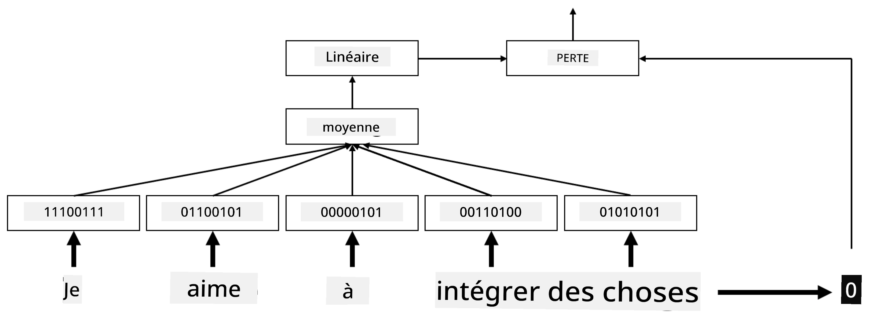
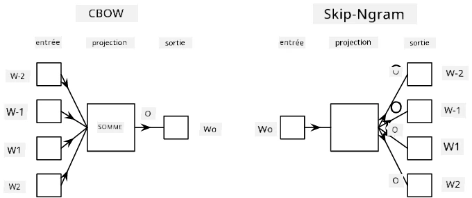

# Embeddings

## [Quiz avant le cours](https://ff-quizzes.netlify.app/en/ai/quiz/27)

Lors de l'entraînement de classificateurs basés sur BoW ou TF/IDF, nous travaillions avec des vecteurs bag-of-words de haute dimension, de longueur `vocab_size`, et nous convertissions explicitement des vecteurs de représentation positionnelle de faible dimension en une représentation sparse one-hot. Cependant, cette représentation one-hot n'est pas efficace en termes de mémoire. De plus, chaque mot est traité indépendamment des autres, c'est-à-dire que les vecteurs encodés en one-hot n'expriment aucune similarité sémantique entre les mots.

L'idée des **embeddings** est de représenter les mots par des vecteurs denses de plus faible dimension, qui reflètent d'une certaine manière le sens sémantique d'un mot. Nous discuterons plus tard de la manière de construire des embeddings de mots significatifs, mais pour l'instant, considérons simplement les embeddings comme un moyen de réduire la dimensionnalité d'un vecteur de mots.

Ainsi, la couche d'embedding prendrait un mot en entrée et produirait un vecteur de sortie de taille spécifiée `embedding_size`. En un sens, cela ressemble beaucoup à une couche `Linear`, mais au lieu de prendre un vecteur encodé en one-hot, elle peut prendre un numéro de mot en entrée, nous permettant ainsi d'éviter de créer de grands vecteurs encodés en one-hot.

En utilisant une couche d'embedding comme première couche dans notre réseau de classification, nous pouvons passer d'un modèle bag-of-words à un modèle **embedding bag**, où nous convertissons d'abord chaque mot de notre texte en son embedding correspondant, puis calculons une fonction d'agrégation sur tous ces embeddings, comme `sum`, `average` ou `max`.

> Image par l'auteur

## ✍️ Exercices : Embeddings

Poursuivez votre apprentissage dans les notebooks suivants :
* [Embeddings avec PyTorch](EmbeddingsPyTorch.ipynb)
* [Embeddings avec TensorFlow](EmbeddingsTF.ipynb)

## Embeddings Sémantiques : Word2Vec

Bien que la couche d'embedding apprenne à mapper les mots à une représentation vectorielle, cette représentation n'a pas nécessairement une signification sémantique forte. Il serait intéressant d'apprendre une représentation vectorielle telle que des mots similaires ou des synonymes correspondent à des vecteurs proches les uns des autres en termes de distance vectorielle (par exemple, distance euclidienne).

Pour cela, nous devons préentraîner notre modèle d'embedding sur une grande collection de textes d'une manière spécifique. Une méthode pour entraîner des embeddings sémantiques est appelée [Word2Vec](https://en.wikipedia.org/wiki/Word2vec). Elle repose sur deux principales architectures utilisées pour produire une représentation distribuée des mots :

 - **Continuous bag-of-words** (CBoW) — dans cette architecture, nous entraînons le modèle à prédire un mot à partir du contexte environnant. Étant donné le ngram $(W_{-2},W_{-1},W_0,W_1,W_2)$, l'objectif du modèle est de prédire $W_0$ à partir de $(W_{-2},W_{-1},W_1,W_2)$.
 - **Continuous skip-gram** — à l'inverse de CBoW, ce modèle utilise une fenêtre de mots de contexte environnants pour prédire le mot actuel.

CBoW est plus rapide, tandis que skip-gram est plus lent, mais représente mieux les mots peu fréquents.

> Image tirée de [cet article](https://arxiv.org/pdf/1301.3781.pdf)

Les embeddings préentraînés Word2Vec (ainsi que d'autres modèles similaires, comme GloVe) peuvent également être utilisés à la place de la couche d'embedding dans les réseaux neuronaux. Cependant, il faut gérer les vocabulaires, car le vocabulaire utilisé pour préentraîner Word2Vec/GloVe est probablement différent de celui de notre corpus de texte. Consultez les notebooks ci-dessus pour voir comment résoudre ce problème.

## Embeddings Contextuels

Une limitation clé des représentations d'embeddings préentraînées traditionnelles comme Word2Vec est le problème de la désambiguïsation des sens des mots. Bien que ces embeddings puissent capturer une partie du sens des mots dans leur contexte, chaque sens possible d'un mot est encodé dans le même embedding. Cela peut poser des problèmes dans les modèles en aval, car de nombreux mots, comme le mot "play", ont des significations différentes selon le contexte dans lequel ils sont utilisés.

Par exemple, le mot "play" dans ces deux phrases a des significations très différentes :

- Je suis allé voir une **pièce** au théâtre.
- John veut **jouer** avec ses amis.

Les embeddings préentraînés mentionnés ci-dessus représentent ces deux significations du mot "play" dans le même embedding. Pour surmonter cette limitation, nous devons construire des embeddings basés sur un **modèle de langage**, qui est entraîné sur un large corpus de texte et *sait* comment les mots peuvent être assemblés dans différents contextes. La discussion sur les embeddings contextuels dépasse le cadre de ce tutoriel, mais nous y reviendrons lorsque nous parlerons des modèles de langage plus tard dans le cours.

## Conclusion

Dans cette leçon, vous avez découvert comment construire et utiliser des couches d'embedding dans TensorFlow et PyTorch pour mieux refléter les significations sémantiques des mots.

## 🚀 Défi

Word2Vec a été utilisé pour des applications intéressantes, comme la génération de paroles de chansons et de poèmes. Consultez [cet article](https://www.politetype.com/blog/word2vec-color-poems) qui explique comment l'auteur a utilisé Word2Vec pour générer de la poésie. Regardez également [cette vidéo de Dan Shiffmann](https://www.youtube.com/watch?v=LSS_bos_TPI&ab_channel=TheCodingTrain) pour découvrir une autre explication de cette technique. Essayez ensuite d'appliquer ces techniques à votre propre corpus de texte, peut-être issu de Kaggle.

## [Quiz après le cours](https://ff-quizzes.netlify.app/en/ai/quiz/28)

## Révision & Étude personnelle

Lisez cet article sur Word2Vec : [Efficient Estimation of Word Representations in Vector Space](https://arxiv.org/pdf/1301.3781.pdf)

## [Devoir : Notebooks](assignment.md)

---

