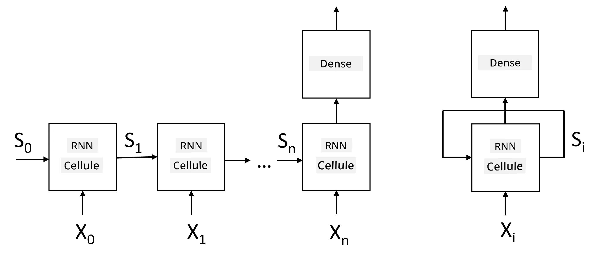

# Réseaux de Neurones Récurrents

## [Quiz avant le cours](https://ff-quizzes.netlify.app/en/ai/quiz/31)

Dans les sections précédentes, nous avons utilisé des représentations sémantiques riches du texte et un simple classificateur linéaire au-dessus des embeddings. Cette architecture permet de capturer le sens global des mots dans une phrase, mais elle ne prend pas en compte l'**ordre** des mots, car l'opération d'agrégation sur les embeddings élimine cette information du texte original. Étant donné que ces modèles ne peuvent pas modéliser l'ordre des mots, ils ne peuvent pas résoudre des tâches plus complexes ou ambiguës comme la génération de texte ou la réponse à des questions.

Pour capturer le sens d'une séquence de texte, nous devons utiliser une autre architecture de réseau de neurones, appelée **réseau de neurones récurrent**, ou RNN. Dans un RNN, nous faisons passer notre phrase à travers le réseau un symbole à la fois, et le réseau produit un certain **état**, que nous transmettons ensuite au réseau avec le symbole suivant.

> Image par l'auteur

Étant donné la séquence d'entrée de tokens X0,...,Xn, le RNN crée une séquence de blocs de réseau de neurones et entraîne cette séquence de bout en bout en utilisant la rétropropagation. Chaque bloc de réseau prend une paire (Xi,Si) comme entrée et produit Si+1 comme résultat. L'état final Sn ou (la sortie Yn) est ensuite transmis à un classificateur linéaire pour produire le résultat. Tous les blocs de réseau partagent les mêmes poids et sont entraînés de bout en bout en une seule passe de rétropropagation.

Étant donné que les vecteurs d'état S0,...,Sn sont transmis à travers le réseau, celui-ci est capable d'apprendre les dépendances séquentielles entre les mots. Par exemple, lorsque le mot *pas* apparaît quelque part dans la séquence, il peut apprendre à négativer certains éléments dans le vecteur d'état, ce qui entraîne une négation.

> ✅ Étant donné que les poids de tous les blocs RNN sur l'image ci-dessus sont partagés, la même image peut être représentée comme un seul bloc (à droite) avec une boucle de rétroaction récurrente, qui transmet l'état de sortie du réseau à l'entrée.

## Anatomie d'une cellule RNN

Voyons comment une cellule RNN simple est organisée. Elle accepte l'état précédent Si-1 et le symbole actuel Xi comme entrées, et doit produire l'état de sortie Si (et, parfois, nous sommes également intéressés par une autre sortie Yi, comme dans le cas des réseaux génératifs).

Une cellule RNN simple contient deux matrices de poids : l'une transforme un symbole d'entrée (appelons-la W), et l'autre transforme un état d'entrée (H). Dans ce cas, la sortie du réseau est calculée comme &sigma;(W&times;Xi+H&times;Si-1+b), où &sigma; est la fonction d'activation et b est un biais supplémentaire.

> Image par l'auteur

Dans de nombreux cas, les tokens d'entrée sont transmis à travers une couche d'embedding avant d'entrer dans le RNN pour réduire la dimensionnalité. Dans ce cas, si la dimension des vecteurs d'entrée est *emb_size*, et le vecteur d'état est *hid_size* - la taille de W est *emb_size*&times;*hid_size*, et la taille de H est *hid_size*&times;*hid_size*.

## Mémoire à Long et Court Terme (LSTM)

L'un des principaux problèmes des RNN classiques est le problème des **gradients qui disparaissent**. Étant donné que les RNN sont entraînés de bout en bout en une seule passe de rétropropagation, il est difficile de propager l'erreur jusqu'aux premières couches du réseau, ce qui empêche le réseau d'apprendre les relations entre des tokens éloignés. Une des façons d'éviter ce problème est d'introduire une **gestion explicite de l'état** en utilisant des **portes**. Il existe deux architectures bien connues de ce type : **Mémoire à Long et Court Terme** (LSTM) et **Unité de Relais Gâtée** (GRU).

> Source de l'image à déterminer

Le réseau LSTM est organisé de manière similaire au RNN, mais il y a deux états qui sont transmis d'une couche à l'autre : l'état réel C, et le vecteur caché H. À chaque unité, le vecteur caché Hi est concaténé avec l'entrée Xi, et ils contrôlent ce qui arrive à l'état C via des **portes**. Chaque porte est un réseau de neurones avec une activation sigmoïde (sortie dans la plage [0,1]), qui peut être considérée comme un masque binaire lorsqu'elle est multipliée par le vecteur d'état. Les portes suivantes existent (de gauche à droite sur l'image ci-dessus) :

* La **porte d'oubli** prend un vecteur caché et détermine quelles composantes du vecteur C doivent être oubliées et lesquelles doivent être transmises.
* La **porte d'entrée** prend certaines informations des vecteurs d'entrée et cachés et les insère dans l'état.
* La **porte de sortie** transforme l'état via une couche linéaire avec activation *tanh*, puis sélectionne certaines de ses composantes en utilisant un vecteur caché Hi pour produire un nouvel état Ci+1.

Les composantes de l'état C peuvent être considérées comme des indicateurs qui peuvent être activés ou désactivés. Par exemple, lorsque nous rencontrons un nom *Alice* dans la séquence, nous pouvons supposer qu'il fait référence à un personnage féminin, et activer l'indicateur dans l'état indiquant que nous avons un nom féminin dans la phrase. Lorsque nous rencontrons ensuite des phrases comme *et Tom*, nous activerons l'indicateur indiquant que nous avons un nom au pluriel. Ainsi, en manipulant l'état, nous pouvons théoriquement suivre les propriétés grammaticales des parties de la phrase.

> ✅ Une excellente ressource pour comprendre les détails des LSTM est cet article [Understanding LSTM Networks](https://colah.github.io/posts/2015-08-Understanding-LSTMs/) de Christopher Olah.

## RNN bidirectionnels et multicouches

Nous avons discuté des réseaux récurrents qui fonctionnent dans une seule direction, du début d'une séquence à la fin. Cela semble naturel, car cela ressemble à la façon dont nous lisons et écoutons un discours. Cependant, dans de nombreux cas pratiques, nous avons un accès aléatoire à la séquence d'entrée, il peut donc être judicieux d'exécuter le calcul récurrent dans les deux directions. Ces réseaux sont appelés **RNN bidirectionnels**. Lorsqu'on travaille avec un réseau bidirectionnel, nous aurons besoin de deux vecteurs d'état cachés, un pour chaque direction.

Un réseau récurrent, qu'il soit unidirectionnel ou bidirectionnel, capture certains motifs au sein d'une séquence et peut les stocker dans un vecteur d'état ou les transmettre en sortie. Comme pour les réseaux convolutionnels, nous pouvons construire une autre couche récurrente au-dessus de la première pour capturer des motifs de niveau supérieur et construire à partir des motifs de bas niveau extraits par la première couche. Cela nous mène à la notion de **RNN multicouche**, qui consiste en deux ou plusieurs réseaux récurrents, où la sortie de la couche précédente est transmise à la couche suivante comme entrée.

*Image tirée de [cet excellent article](https://towardsdatascience.com/from-a-lstm-cell-to-a-multilayer-lstm-network-with-pytorch-2899eb5696f3) de Fernando López*

## ✍️ Exercices : Embeddings

Poursuivez votre apprentissage dans les notebooks suivants :

* [RNNs avec PyTorch](RNNPyTorch.ipynb)
* [RNNs avec TensorFlow](RNNTF.ipynb)

## Conclusion

Dans cette unité, nous avons vu que les RNN peuvent être utilisés pour la classification de séquences, mais en réalité, ils peuvent gérer de nombreuses autres tâches, telles que la génération de texte, la traduction automatique, et bien plus encore. Nous examinerons ces tâches dans l'unité suivante.

## 🚀 Défi

Lisez quelques articles sur les LSTM et réfléchissez à leurs applications :

- [Grid Long Short-Term Memory](https://arxiv.org/pdf/1507.01526v1.pdf)
- [Show, Attend and Tell: Neural Image Caption
Generation with Visual Attention](https://arxiv.org/pdf/1502.03044v2.pdf)

## [Quiz après le cours](https://ff-quizzes.netlify.app/en/ai/quiz/32)

## Révision & Étude personnelle

- [Understanding LSTM Networks](https://colah.github.io/posts/2015-08-Understanding-LSTMs/) de Christopher Olah.

## [Devoir : Notebooks](assignment.md)

---

