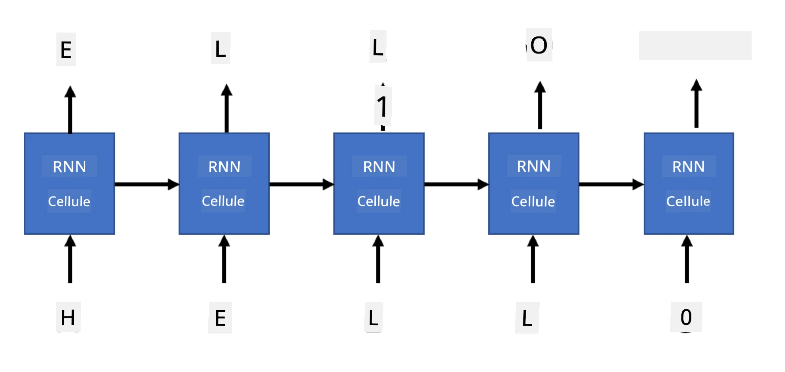

# Réseaux génératifs

## [Quiz pré-lecture](https://ff-quizzes.netlify.app/en/ai/quiz/33)

Les réseaux neuronaux récurrents (RNN) et leurs variantes à cellules à portes, comme les cellules Long Short Term Memory (LSTM) et les Gated Recurrent Units (GRU), offrent un mécanisme pour la modélisation du langage, car ils peuvent apprendre l'ordre des mots et fournir des prédictions pour le mot suivant dans une séquence. Cela nous permet d'utiliser les RNN pour des **tâches génératives**, telles que la génération de texte ordinaire, la traduction automatique et même la génération de légendes pour des images.

> ✅ Pensez à toutes les fois où vous avez bénéficié de tâches génératives, comme la complétion de texte pendant que vous tapez. Faites des recherches sur vos applications préférées pour voir si elles utilisent des RNN.

Dans l'architecture RNN que nous avons abordée dans l'unité précédente, chaque unité RNN produisait l'état caché suivant comme sortie. Cependant, nous pouvons également ajouter une autre sortie à chaque unité récurrente, ce qui nous permettrait de produire une **séquence** (de même longueur que la séquence d'origine). De plus, nous pouvons utiliser des unités RNN qui n'acceptent pas d'entrée à chaque étape, mais prennent simplement un vecteur d'état initial, puis produisent une séquence de sorties.

Cela permet différentes architectures neuronales, illustrées dans l'image ci-dessous :


> Image tirée de l'article de blog [Unreasonable Effectiveness of Recurrent Neural Networks](http://karpathy.github.io/2015/05/21/rnn-effectiveness/) par [Andrej Karpaty](http://karpathy.github.io/)

* **Un-à-un** est un réseau neuronal traditionnel avec une entrée et une sortie.
* **Un-à-plusieurs** est une architecture générative qui accepte une valeur d'entrée et génère une séquence de valeurs de sortie. Par exemple, si nous voulons entraîner un réseau de **génération de légendes d'images** qui produirait une description textuelle d'une image, nous pouvons prendre une image en entrée, la passer à travers un CNN pour obtenir son état caché, puis utiliser une chaîne récurrente pour générer la légende mot par mot.
* **Plusieurs-à-un** correspond aux architectures RNN que nous avons décrites dans l'unité précédente, comme la classification de texte.
* **Plusieurs-à-plusieurs**, ou **séquence-à-séquence**, correspond à des tâches telles que la **traduction automatique**, où un premier RNN collecte toutes les informations de la séquence d'entrée dans l'état caché, et une autre chaîne RNN déroule cet état en une séquence de sortie.

Dans cette unité, nous nous concentrerons sur des modèles génératifs simples qui nous aident à générer du texte. Pour simplifier, nous utiliserons une tokenisation au niveau des caractères.

Nous entraînerons ce RNN à générer du texte étape par étape. À chaque étape, nous prendrons une séquence de caractères de longueur `nchars` et demanderons au réseau de générer le caractère suivant pour chaque caractère d'entrée :



Lors de la génération de texte (pendant l'inférence), nous commençons par une **invite**, qui est passée à travers les cellules RNN pour générer son état intermédiaire, puis la génération commence à partir de cet état. Nous générons un caractère à la fois, et passons l'état et le caractère généré à une autre cellule RNN pour générer le suivant, jusqu'à ce que nous ayons généré suffisamment de caractères.


> Image par l'auteur

## ✍️ Exercices : Réseaux génératifs

Poursuivez votre apprentissage dans les notebooks suivants :

* [Réseaux génératifs avec PyTorch](GenerativePyTorch.ipynb)
* [Réseaux génératifs avec TensorFlow](GenerativeTF.ipynb)

## Génération de texte souple et température

La sortie de chaque cellule RNN est une distribution de probabilité des caractères. Si nous prenons toujours le caractère avec la probabilité la plus élevée comme caractère suivant dans le texte généré, le texte peut souvent devenir "cyclique", répétant les mêmes séquences de caractères encore et encore, comme dans cet exemple :

```
today of the second the company and a second the company ...
```
  
Cependant, si nous examinons la distribution de probabilité pour le caractère suivant, il se peut que la différence entre les quelques probabilités les plus élevées ne soit pas énorme, par exemple un caractère peut avoir une probabilité de 0,2, un autre de 0,19, etc. Par exemple, lorsqu'on cherche le caractère suivant dans la séquence '*play*', le caractère suivant pourrait tout aussi bien être un espace ou **e** (comme dans le mot *player*).

Cela nous amène à la conclusion qu'il n'est pas toujours "juste" de sélectionner le caractère avec la probabilité la plus élevée, car choisir le deuxième plus probable peut également conduire à un texte significatif. Il est plus judicieux de **prélever un échantillon** parmi la distribution de probabilité donnée par la sortie du réseau. Nous pouvons également utiliser un paramètre, la **température**, qui aplatira la distribution de probabilité si nous voulons ajouter plus d'aléatoire, ou la rendre plus raide si nous voulons nous en tenir davantage aux caractères les plus probables.

Explorez comment cette génération de texte souple est implémentée dans les notebooks mentionnés ci-dessus.

## Conclusion

Bien que la génération de texte puisse être utile en soi, les principaux avantages proviennent de la capacité à générer du texte à l'aide de RNN à partir d'un vecteur de caractéristiques initial. Par exemple, la génération de texte est utilisée dans la traduction automatique (séquence-à-séquence, dans ce cas, le vecteur d'état de l'*encodeur* est utilisé pour générer ou *décoder* le message traduit), ou pour générer une description textuelle d'une image (dans ce cas, le vecteur de caractéristiques proviendrait d'un extracteur CNN).

## 🚀 Défi

Suivez des leçons sur Microsoft Learn sur ce sujet :

* Génération de texte avec [PyTorch](https://docs.microsoft.com/learn/modules/intro-natural-language-processing-pytorch/6-generative-networks/?WT.mc_id=academic-77998-cacaste)/[TensorFlow](https://docs.microsoft.com/learn/modules/intro-natural-language-processing-tensorflow/5-generative-networks/?WT.mc_id=academic-77998-cacaste)

## [Quiz post-lecture](https://ff-quizzes.netlify.app/en/ai/quiz/34)

## Révision & Auto-apprentissage

Voici quelques articles pour approfondir vos connaissances :

* Différentes approches de génération de texte avec Markov Chain, LSTM et GPT-2 : [article de blog](https://towardsdatascience.com/text-generation-gpt-2-lstm-markov-chain-9ea371820e1e)
* Exemple de génération de texte dans la [documentation Keras](https://keras.io/examples/generative/lstm_character_level_text_generation/)

## [Devoir](lab/README.md)

Nous avons vu comment générer du texte caractère par caractère. Dans le laboratoire, vous explorerez la génération de texte au niveau des mots.

---

