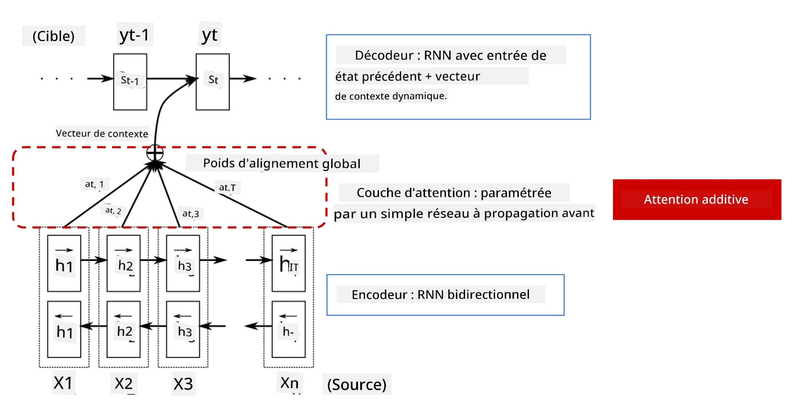
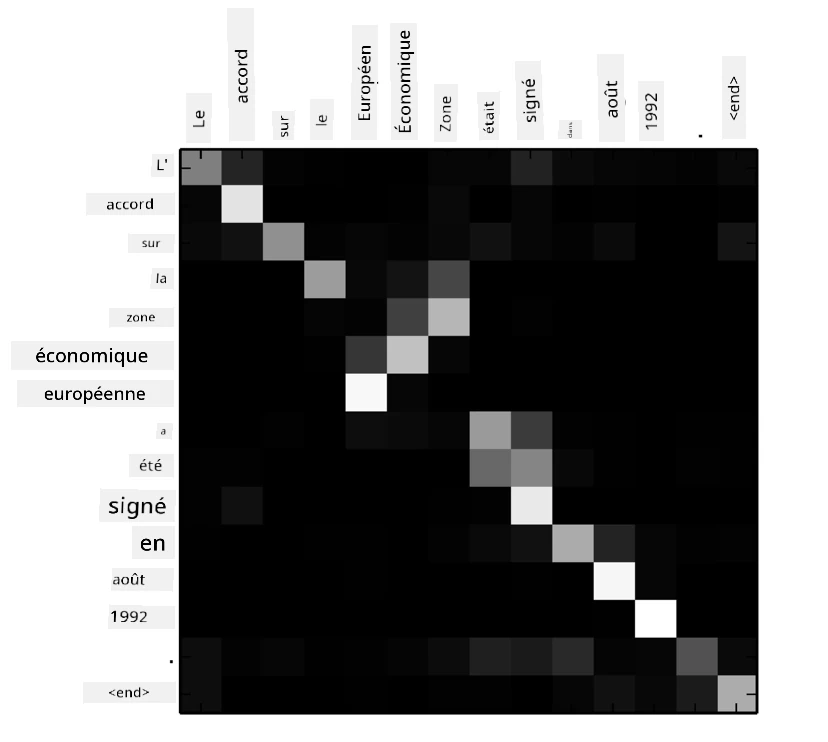
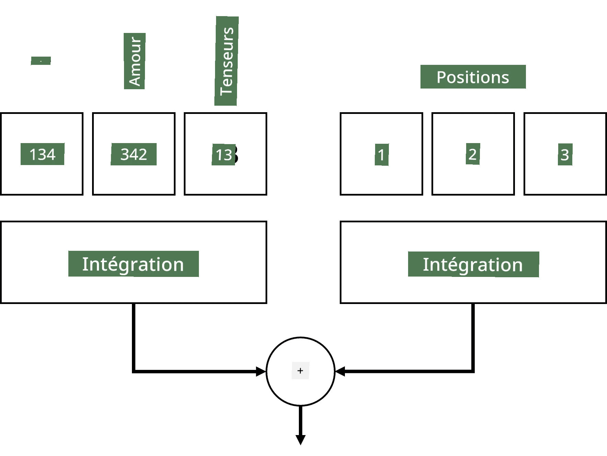
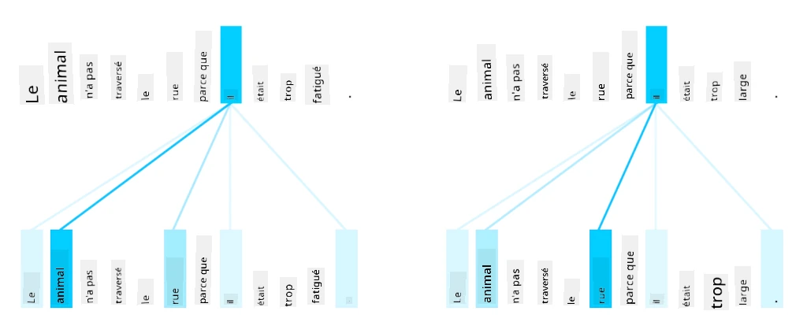
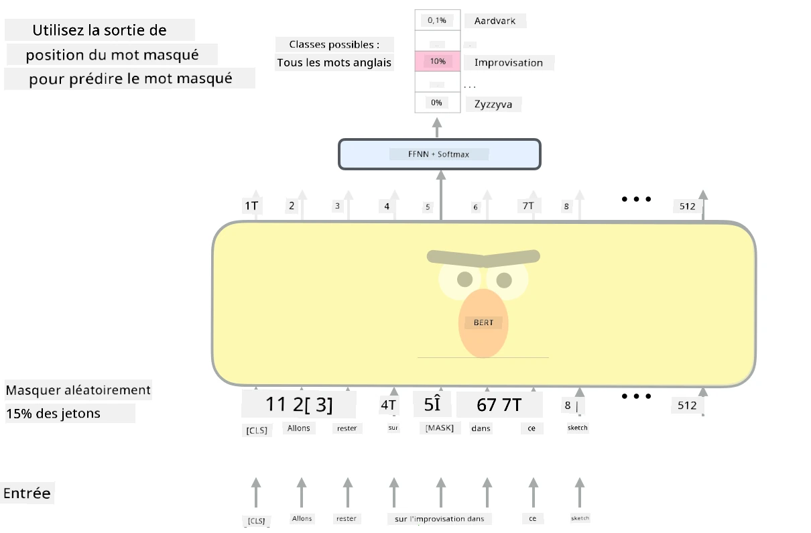

# Mécanismes d'Attention et Transformers

## [Quiz avant le cours](https://ff-quizzes.netlify.app/en/ai/quiz/35)

L'un des problèmes les plus importants dans le domaine du NLP est **la traduction automatique**, une tâche essentielle qui sous-tend des outils tels que Google Traduction. Dans cette section, nous nous concentrerons sur la traduction automatique, ou, plus généralement, sur toute tâche de *séquence à séquence* (également appelée **transduction de phrase**).

Avec les RNNs, la séquence à séquence est mise en œuvre par deux réseaux récurrents, où un réseau, l'**encodeur**, condense une séquence d'entrée en un état caché, tandis qu'un autre réseau, le **décodeur**, déploie cet état caché en un résultat traduit. Cette approche présente quelques problèmes :

* L'état final du réseau encodeur a du mal à se souvenir du début d'une phrase, ce qui entraîne une qualité médiocre du modèle pour les phrases longues.
* Tous les mots d'une séquence ont le même impact sur le résultat. En réalité, cependant, certains mots spécifiques de la séquence d'entrée ont souvent plus d'impact sur les sorties séquentielles que d'autres.

Les **mécanismes d'attention** offrent un moyen de pondérer l'impact contextuel de chaque vecteur d'entrée sur chaque prédiction de sortie du RNN. Cela est mis en œuvre en créant des raccourcis entre les états intermédiaires du RNN d'entrée et du RNN de sortie. Ainsi, lors de la génération du symbole de sortie yt, nous prenons en compte tous les états cachés d'entrée hi, avec différents coefficients de poids &alpha;t,i.

> Le modèle encodeur-décodeur avec mécanisme d'attention additive dans [Bahdanau et al., 2015](https://arxiv.org/pdf/1409.0473.pdf), cité de [ce blog](https://lilianweng.github.io/lil-log/2018/06/24/attention-attention.html)

La matrice d'attention {&alpha;i,j} représente le degré auquel certains mots d'entrée jouent un rôle dans la génération d'un mot donné dans la séquence de sortie. Voici un exemple de cette matrice :

> Figure tirée de [Bahdanau et al., 2015](https://arxiv.org/pdf/1409.0473.pdf) (Fig.3)

Les mécanismes d'attention sont responsables de l'état de l'art actuel ou presque actuel en NLP. Cependant, l'ajout d'attention augmente considérablement le nombre de paramètres du modèle, ce qui a entraîné des problèmes de mise à l'échelle avec les RNNs. Une contrainte clé de la mise à l'échelle des RNNs est que la nature récurrente des modèles rend difficile le traitement par lots et la parallélisation de l'entraînement. Dans un RNN, chaque élément d'une séquence doit être traité dans un ordre séquentiel, ce qui signifie qu'il ne peut pas être facilement parallélisé.

> Figure tirée du [blog de Google](https://research.googleblog.com/2016/09/a-neural-network-for-machine.html)

L'adoption des mécanismes d'attention combinée à cette contrainte a conduit à la création des modèles Transformers, désormais à la pointe de la technologie, que nous connaissons et utilisons aujourd'hui, tels que BERT et Open-GPT3.

## Modèles Transformers

L'une des idées principales derrière les transformers est d'éviter la nature séquentielle des RNNs et de créer un modèle parallélisable pendant l'entraînement. Cela est réalisé en mettant en œuvre deux idées :

* l'encodage positionnel
* l'utilisation du mécanisme d'auto-attention pour capturer des motifs au lieu des RNNs (ou CNNs) (c'est pourquoi l'article qui introduit les transformers s'intitule *[Attention is all you need](https://arxiv.org/abs/1706.03762)*).

### Encodage/Embedding Positionnel

L'idée de l'encodage positionnel est la suivante :
1. Lors de l'utilisation des RNNs, la position relative des tokens est représentée par le nombre d'étapes, et n'a donc pas besoin d'être explicitement représentée.
2. Cependant, une fois que nous passons à l'attention, nous devons connaître les positions relatives des tokens dans une séquence.
3. Pour obtenir l'encodage positionnel, nous augmentons notre séquence de tokens avec une séquence de positions des tokens dans la séquence (c'est-à-dire une séquence de nombres 0,1, ...).
4. Nous mélangeons ensuite la position du token avec un vecteur d'embedding du token. Pour transformer la position (entier) en vecteur, nous pouvons utiliser différentes approches :

* Embedding entraînable, similaire à l'embedding des tokens. C'est l'approche que nous considérons ici. Nous appliquons des couches d'embedding à la fois sur les tokens et leurs positions, ce qui donne des vecteurs d'embedding de mêmes dimensions, que nous additionnons ensuite.
* Fonction d'encodage positionnel fixe, comme proposé dans l'article original.

> Image par l'auteur

Le résultat obtenu avec l'embedding positionnel intègre à la fois le token original et sa position dans une séquence.

### Auto-Attention Multi-Tête

Ensuite, nous devons capturer certains motifs dans notre séquence. Pour ce faire, les transformers utilisent un mécanisme d'**auto-attention**, qui est essentiellement une attention appliquée à la même séquence en tant qu'entrée et sortie. L'application de l'auto-attention nous permet de prendre en compte le **contexte** dans la phrase et de voir quels mots sont interconnectés. Par exemple, cela nous permet de voir quels mots sont référencés par des coréférences, comme *il*, et de prendre également le contexte en compte :

> Image tirée du [blog de Google](https://research.googleblog.com/2017/08/transformer-novel-neural-network.html)

Dans les transformers, nous utilisons l'**attention multi-tête** afin de donner au réseau la capacité de capturer plusieurs types de dépendances différents, par exemple les relations de mots à long terme vs à court terme, les coréférences vs autre chose, etc.

[Notebook TensorFlow](TransformersTF.ipynb) contient plus de détails sur l'implémentation des couches de transformers.

### Attention Encodeur-Décodeur

Dans les transformers, l'attention est utilisée à deux endroits :

* Pour capturer des motifs dans le texte d'entrée en utilisant l'auto-attention.
* Pour effectuer la traduction de séquence - c'est la couche d'attention entre l'encodeur et le décodeur.

L'attention encodeur-décodeur est très similaire au mécanisme d'attention utilisé dans les RNNs, comme décrit au début de cette section. Ce diagramme animé explique le rôle de l'attention encodeur-décodeur.

Étant donné que chaque position d'entrée est mappée indépendamment à chaque position de sortie, les transformers peuvent mieux paralléliser que les RNNs, ce qui permet des modèles de langage beaucoup plus grands et plus expressifs. Chaque tête d'attention peut être utilisée pour apprendre différentes relations entre les mots, ce qui améliore les tâches de traitement du langage naturel en aval.

## BERT

**BERT** (Bidirectional Encoder Representations from Transformers) est un réseau transformer multi-couches très large avec 12 couches pour *BERT-base*, et 24 pour *BERT-large*. Le modèle est d'abord pré-entraîné sur un large corpus de données textuelles (WikiPedia + livres) en utilisant un entraînement non supervisé (prédiction des mots masqués dans une phrase). Pendant le pré-entraînement, le modèle absorbe des niveaux significatifs de compréhension du langage qui peuvent ensuite être exploités avec d'autres ensembles de données via un ajustement fin. Ce processus est appelé **apprentissage par transfert**.

> Image [source](http://jalammar.github.io/illustrated-bert/)

## ✍️ Exercices : Transformers

Poursuivez votre apprentissage dans les notebooks suivants :

* [Transformers en PyTorch](TransformersPyTorch.ipynb)
* [Transformers en TensorFlow](TransformersTF.ipynb)

## Conclusion

Dans cette leçon, vous avez appris les Transformers et les mécanismes d'attention, des outils essentiels dans la boîte à outils du NLP. Il existe de nombreuses variantes des architectures Transformers, notamment BERT, DistilBERT, BigBird, OpenGPT3 et bien d'autres, qui peuvent être ajustées. Le [package HuggingFace](https://github.com/huggingface/) fournit un dépôt pour entraîner plusieurs de ces architectures avec PyTorch et TensorFlow.

## 🚀 Défi

## [Quiz après le cours](https://ff-quizzes.netlify.app/en/ai/quiz/36)

## Révision & Auto-étude

* [Article de blog](https://mchromiak.github.io/articles/2017/Sep/12/Transformer-Attention-is-all-you-need/), expliquant l'article classique [Attention is all you need](https://arxiv.org/abs/1706.03762) sur les transformers.
* [Une série d'articles de blog](https://towardsdatascience.com/transformers-explained-visually-part-1-overview-of-functionality-95a6dd460452) sur les transformers, expliquant l'architecture en détail.

## [Devoir](assignment.md)

---

