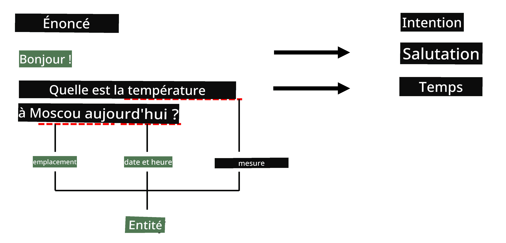
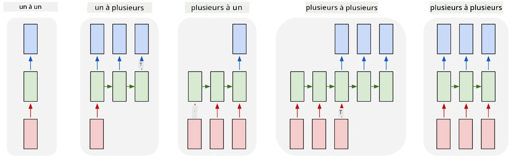

# Reconnaissance d'entités nommées

Jusqu'à présent, nous nous sommes principalement concentrés sur une tâche de traitement du langage naturel (NLP) : la classification. Cependant, il existe d'autres tâches NLP qui peuvent être réalisées avec des réseaux neuronaux. L'une de ces tâches est la **[Reconnaissance d'entités nommées](https://wikipedia.org/wiki/Named-entity_recognition)** (NER), qui consiste à identifier des entités spécifiques dans un texte, telles que des lieux, des noms de personnes, des intervalles de date-heure, des formules chimiques, etc.

## [Quiz avant le cours](https://ff-quizzes.netlify.app/en/ai/quiz/37)

## Exemple d'utilisation de la NER

Supposons que vous souhaitiez développer un chatbot en langage naturel, similaire à Amazon Alexa ou Google Assistant. Les chatbots intelligents fonctionnent en *comprenant* ce que l'utilisateur veut grâce à la classification de texte sur la phrase d'entrée. Le résultat de cette classification est ce qu'on appelle **l'intention**, qui détermine ce que le chatbot doit faire.

> Image par l'auteur

Cependant, un utilisateur peut fournir certains paramètres dans sa phrase. Par exemple, en demandant la météo, il peut spécifier un lieu ou une date. Un bot doit être capable de comprendre ces entités et de remplir les paramètres correspondants avant d'exécuter l'action. C'est précisément là que la NER intervient.

> ✅ Un autre exemple serait [l'analyse de publications scientifiques médicales](https://soshnikov.com/science/analyzing-medical-papers-with-azure-and-text-analytics-for-health/). L'un des principaux objectifs est de rechercher des termes médicaux spécifiques, tels que des maladies et des substances médicales. Alors qu'un petit nombre de maladies peut probablement être extrait par recherche de sous-chaînes, des entités plus complexes, comme des composés chimiques et des noms de médicaments, nécessitent une approche plus sophistiquée.

## NER comme classification de tokens

Les modèles NER sont essentiellement des **modèles de classification de tokens**, car pour chaque token d'entrée, nous devons déterminer s'il appartient à une entité ou non, et si oui, à quelle classe d'entité.

Prenons le titre d'article suivant :

**Régurgitation de la valve tricuspide** et **carbonate de lithium** **toxicité** chez un nouveau-né.

Les entités ici sont :

* Régurgitation de la valve tricuspide est une maladie (`DIS`)
* Carbonate de lithium est une substance chimique (`CHEM`)
* Toxicité est également une maladie (`DIS`)

Notez qu'une entité peut s'étendre sur plusieurs tokens. Et, comme dans ce cas, nous devons distinguer entre deux entités consécutives. Ainsi, il est courant d'utiliser deux classes pour chaque entité : une pour spécifier le premier token de l'entité (souvent avec le préfixe `B-` pour **début**), et une autre pour la continuation de l'entité (`I-`, pour **intérieur**). Nous utilisons également `O` comme classe pour représenter tous les autres tokens (**autres**). Ce type de balisage de tokens est appelé [balisage BIO](https://en.wikipedia.org/wiki/Inside%E2%80%93outside%E2%80%93beginning_(tagging)) (ou IOB). Une fois balisé, notre titre ressemblera à ceci :

Token | Tag
------|-----
Régurgitation | B-DIS
de | I-DIS
la | I-DIS
valve | I-DIS
tricuspide | I-DIS
et | O
carbonate | B-CHEM
de | I-CHEM
lithium | I-CHEM
toxicité | B-DIS
chez | O
un | O
nouveau-né | O
. | O

Puisque nous devons établir une correspondance un-à-un entre les tokens et les classes, nous pouvons entraîner un modèle neuronal **many-to-many** (plusieurs-à-plusieurs) à partir de cette image :

> *Image tirée de [cet article de blog](http://karpathy.github.io/2015/05/21/rnn-effectiveness/) par [Andrej Karpathy](http://karpathy.github.io/). Les modèles de classification de tokens NER correspondent à l'architecture de réseau située à l'extrême droite de cette image.*

## Entraînement des modèles NER

Étant donné qu'un modèle NER est essentiellement un modèle de classification de tokens, nous pouvons utiliser les RNN que nous connaissons déjà pour cette tâche. Dans ce cas, chaque bloc du réseau récurrent renverra l'ID du token. L'exemple de notebook suivant montre comment entraîner un LSTM pour la classification de tokens.

## ✍️ Notebooks d'exemple : NER

Poursuivez votre apprentissage avec le notebook suivant :

* [NER avec TensorFlow](NER-TF.ipynb)

## Conclusion

Un modèle NER est un **modèle de classification de tokens**, ce qui signifie qu'il peut être utilisé pour effectuer la classification de tokens. C'est une tâche très courante en NLP, permettant de reconnaître des entités spécifiques dans un texte, notamment des lieux, des noms, des dates, et bien plus.

## 🚀 Défi

Réalisez l'exercice ci-dessous pour entraîner un modèle de reconnaissance d'entités nommées pour les termes médicaux, puis testez-le sur un autre ensemble de données.

## [Quiz après le cours](https://ff-quizzes.netlify.app/en/ai/quiz/38)

## Révision et étude personnelle

Lisez l'article de blog [The Unreasonable Effectiveness of Recurrent Neural Networks](http://karpathy.github.io/2015/05/21/rnn-effectiveness/) et explorez la section "Further Reading" de cet article pour approfondir vos connaissances.

## [Exercice](lab/README.md)

Dans l'exercice de cette leçon, vous devrez entraîner un modèle de reconnaissance d'entités médicales. Vous pouvez commencer par entraîner un modèle LSTM comme décrit dans cette leçon, puis passer à l'utilisation du modèle transformateur BERT. Consultez [les instructions](lab/README.md) pour obtenir tous les détails.

---

