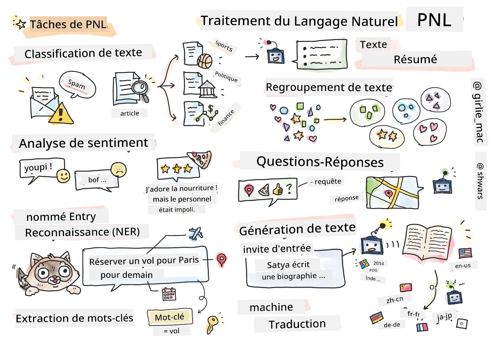

# Traitement du Langage Naturel



Dans cette section, nous allons nous concentrer sur l'utilisation des réseaux neuronaux pour traiter des tâches liées au **Traitement du Langage Naturel (NLP)**. Il existe de nombreux problèmes NLP que nous souhaitons que les ordinateurs soient capables de résoudre :

* **Classification de texte** : un problème classique de classification appliqué aux séquences de texte. Par exemple, classer des e-mails comme spam ou non-spam, ou catégoriser des articles en sport, économie, politique, etc. De plus, lors du développement de chatbots, il est souvent nécessaire de comprendre ce que l'utilisateur veut dire — dans ce cas, il s'agit de **classification d'intention**. Souvent, dans la classification d'intention, nous devons gérer de nombreuses catégories.
* **Analyse de sentiment** : un problème typique de régression, où il faut attribuer un score (un sentiment) correspondant à la positivité/négativité d'une phrase. Une version plus avancée de l'analyse de sentiment est l'**analyse de sentiment basée sur les aspects** (ABSA), où le sentiment est attribué non pas à l'ensemble de la phrase, mais à différentes parties (aspects), par exemple : *Dans ce restaurant, j'ai aimé la cuisine, mais l'ambiance était horrible*.
* **Reconnaissance d'entités nommées** (NER) : extraire certaines entités d'un texte. Par exemple, dans la phrase *Je dois prendre un vol pour Paris demain*, le mot *demain* fait référence à une DATE, et *Paris* est une LOCALISATION.  
* **Extraction de mots-clés** : similaire à la NER, mais ici, il s'agit d'extraire automatiquement les mots importants pour le sens de la phrase, sans pré-entraînement pour des types d'entités spécifiques.
* **Regroupement de texte** : utile pour regrouper des phrases similaires, par exemple, des demandes similaires dans des conversations de support technique.
* **Questions-réponses** : capacité d'un modèle à répondre à une question spécifique. Le modèle reçoit un passage de texte et une question en entrée, et doit fournir un endroit dans le texte où se trouve la réponse (ou, parfois, générer la réponse textuelle).
* **Génération de texte** : capacité d'un modèle à générer du nouveau texte. Cela peut être considéré comme une tâche de classification qui prédit la lettre/mot suivant en fonction d'un *texte d'amorce*. Les modèles avancés de génération de texte, comme GPT-3, peuvent résoudre d'autres tâches NLP telles que la classification en utilisant une technique appelée [programmation par prompt](https://towardsdatascience.com/software-3-0-how-prompting-will-change-the-rules-of-the-game-a982fbfe1e0) ou [ingénierie de prompt](https://medium.com/swlh/openai-gpt-3-and-prompt-engineering-dcdc2c5fcd29).
* **Résumé de texte** : technique permettant à un ordinateur de "lire" un texte long et de le résumer en quelques phrases.
* **Traduction automatique** : peut être vue comme une combinaison de compréhension de texte dans une langue et de génération de texte dans une autre.

À l'origine, la plupart des tâches NLP étaient résolues à l'aide de méthodes traditionnelles comme les grammaires. Par exemple, en traduction automatique, des analyseurs syntaxiques étaient utilisés pour transformer une phrase initiale en un arbre syntaxique, puis des structures sémantiques de haut niveau étaient extraites pour représenter le sens de la phrase. À partir de ce sens et de la grammaire de la langue cible, le résultat était généré. Aujourd'hui, de nombreuses tâches NLP sont plus efficacement résolues à l'aide de réseaux neuronaux.

> De nombreuses méthodes NLP classiques sont implémentées dans la bibliothèque Python [Natural Language Processing Toolkit (NLTK)](https://www.nltk.org). Un excellent [livre NLTK](https://www.nltk.org/book/) est disponible en ligne et explique comment résoudre différentes tâches NLP avec NLTK.

Dans notre cours, nous nous concentrerons principalement sur l'utilisation des réseaux neuronaux pour le NLP, et nous utiliserons NLTK si nécessaire.

Nous avons déjà appris à utiliser les réseaux neuronaux pour traiter des données tabulaires et des images. La principale différence entre ces types de données et le texte est que le texte est une séquence de longueur variable, tandis que la taille d'entrée pour les images est connue à l'avance. Bien que les réseaux convolutionnels puissent extraire des motifs des données d'entrée, les motifs dans le texte sont plus complexes. Par exemple, une négation peut être séparée du sujet par de nombreux mots (par exemple : *Je n'aime pas les oranges* vs. *Je n'aime pas ces grandes oranges colorées et savoureuses*), et cela doit toujours être interprété comme un seul motif. Ainsi, pour traiter le langage, nous devons introduire de nouveaux types de réseaux neuronaux, tels que les *réseaux récurrents* et les *transformers*.

## Installer les bibliothèques

Si vous utilisez une installation Python locale pour suivre ce cours, vous devrez peut-être installer toutes les bibliothèques nécessaires pour le NLP en utilisant les commandes suivantes :

**Pour PyTorch**  
```bash
pip install -r requirements-torch.txt
```  
**Pour TensorFlow**  
```bash
pip install -r requirements-tf.txt
```  

> Vous pouvez essayer le NLP avec TensorFlow sur [Microsoft Learn](https://docs.microsoft.com/learn/modules/intro-natural-language-processing-tensorflow/?WT.mc_id=academic-77998-cacaste)

## Avertissement sur le GPU

Dans cette section, certains exemples nécessiteront l'entraînement de modèles assez volumineux.  
* **Utilisez un ordinateur avec GPU** : Il est conseillé d'exécuter vos notebooks sur un ordinateur équipé d'un GPU pour réduire les temps d'attente lors de l'entraînement de grands modèles.  
* **Contraintes de mémoire GPU** : L'utilisation d'un GPU peut entraîner des situations où la mémoire GPU est insuffisante, en particulier lors de l'entraînement de grands modèles.  
* **Consommation de mémoire GPU** : La quantité de mémoire GPU consommée pendant l'entraînement dépend de plusieurs facteurs, notamment la taille des mini-lots.  
* **Réduisez la taille des mini-lots** : Si vous rencontrez des problèmes de mémoire GPU, envisagez de réduire la taille des mini-lots dans votre code comme solution potentielle.  
* **Libération de mémoire GPU avec TensorFlow** : Les anciennes versions de TensorFlow peuvent ne pas libérer correctement la mémoire GPU lors de l'entraînement de plusieurs modèles dans un même noyau Python. Pour gérer efficacement l'utilisation de la mémoire GPU, vous pouvez configurer TensorFlow pour allouer la mémoire GPU uniquement en cas de besoin.  
* **Inclusion de code** : Pour configurer TensorFlow afin qu'il alloue la mémoire GPU uniquement lorsque nécessaire, incluez le code suivant dans vos notebooks :  

```python
physical_devices = tf.config.list_physical_devices('GPU') 
if len(physical_devices)>0:
    tf.config.experimental.set_memory_growth(physical_devices[0], True) 
```  

Si vous souhaitez apprendre le NLP sous l'angle des méthodes classiques de ML, visitez [cette série de leçons](https://github.com/microsoft/ML-For-Beginners/tree/main/6-NLP).

## Dans cette section
Dans cette section, nous apprendrons :

* [Représenter le texte sous forme de tenseurs](13-TextRep/README.md)  
* [Word Embeddings](14-Emdeddings/README.md)  
* [Modélisation de langage](15-LanguageModeling/README.md)  
* [Réseaux neuronaux récurrents](16-RNN/README.md)  
* [Réseaux génératifs](17-GenerativeNetworks/README.md)  
* [Transformers](18-Transformers/README.md)  

**Avertissement** :  
Ce document a été traduit à l'aide du service de traduction automatique [Co-op Translator](https://github.com/Azure/co-op-translator). Bien que nous nous efforcions d'assurer l'exactitude, veuillez noter que les traductions automatisées peuvent contenir des erreurs ou des inexactitudes. Le document original dans sa langue d'origine doit être considéré comme la source faisant autorité. Pour des informations critiques, il est recommandé de recourir à une traduction humaine professionnelle. Nous déclinons toute responsabilité en cas de malentendus ou d'interprétations erronées résultant de l'utilisation de cette traduction.