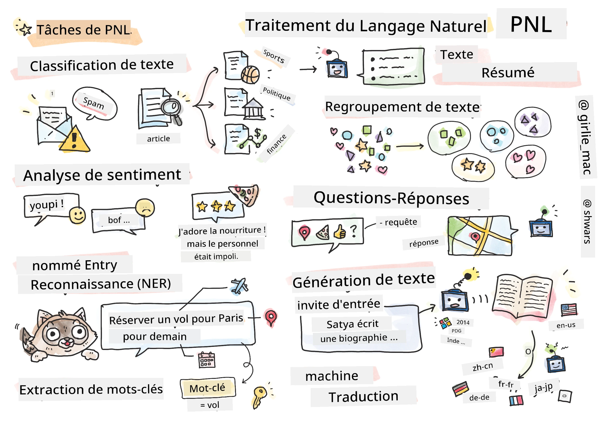

# Traitement du Langage Naturel



Dans cette section, nous allons nous concentrer sur l’utilisation des réseaux de neurones pour traiter les tâches liées au **Traitement du Langage Naturel (TLN)**. Il existe de nombreux problèmes du TLN que nous souhaitons que les ordinateurs puissent résoudre :

* **Classification de texte** est un problème typique de classification concernant les séquences de texte. Par exemple, classer les messages électroniques comme spam ou non-spam, ou catégoriser les articles en sport, affaires, politique, etc. De plus, lors du développement de chatbots, nous devons souvent comprendre ce que l’utilisateur voulait dire – dans ce cas, nous traitons de la **classification d’intention**. Souvent, pour la classification d’intention, nous devons gérer de nombreuses catégories.
* **Analyse de sentiment** est un problème typique de régression, où nous devons attribuer un nombre (un sentiment) correspondant à quel point le sens d’une phrase est positif/négatif. Une version plus avancée de l’analyse de sentiment est l’**analyse de sentiment basée sur les aspects** (ABSA), où nous attribuons le sentiment non pas à toute la phrase, mais à différentes parties de celle-ci (les aspects), par ex. *Dans ce restaurant, j’ai aimé la cuisine, mais l’atmosphère était horrible*.
* **Reconnaissance d’entités nommées** (NER) fait référence au problème d’extraire certaines entités du texte. Par exemple, nous devons comprendre que dans la phrase *Je dois prendre l’avion pour Paris demain*, le mot *demain* fait référence à une DATE, et *Paris* est un LIEU.  
* **Extraction de mots-clés** est similaire à la NER, mais nous devons extraire automatiquement des mots importants pour le sens de la phrase, sans pré-entraînement pour des types d’entités spécifiques.
* **Regroupement de textes** peut être utile lorsque nous voulons regrouper des phrases similaires, par exemple, des demandes similaires dans des conversations de support technique.
* **Réponse à des questions** fait référence à la capacité d’un modèle à répondre à une question spécifique. Le modèle reçoit en entrée un passage de texte et une question, et doit fournir un endroit dans le texte où la réponse à la question se trouve (ou, parfois, générer le texte de la réponse).
* **Génération de texte** est la capacité d’un modèle à générer un nouveau texte. Cela peut être considéré comme une tâche de classification qui prédit la lettre/mot suivant basé sur une *invite de texte*. Les modèles avancés de génération de texte, tels que GPT-3, sont capables de résoudre d’autres tâches du TLN, comme la classification, en utilisant une technique appelée [programmation par invite](https://towardsdatascience.com/software-3-0-how-prompting-will-change-the-rules-of-the-game-a982fbfe1e0) ou [ingénierie des invites](https://medium.com/swlh/openai-gpt-3-and-prompt-engineering-dcdc2c5fcd29)
* **Résumé de texte** est une technique lorsque nous voulons qu’un ordinateur "lise" un long texte et le résume en quelques phrases.
* **Traduction automatique** peut être vue comme une combinaison de compréhension de texte dans une langue et de génération de texte dans une autre.

Initialement, la plupart des tâches du TLN étaient résolues à l’aide de méthodes traditionnelles telles que les grammaires. Par exemple, en traduction automatique, des analyseurs syntaxiques étaient utilisés pour transformer la phrase initiale en un arbre syntaxique, puis des structures sémantiques de niveau supérieur étaient extraites pour représenter le sens de la phrase, et sur la base de ce sens et de la grammaire de la langue cible, le résultat était généré. Aujourd’hui, de nombreuses tâches de TLN sont plus efficacement résolues à l’aide de réseaux de neurones.

> De nombreuses méthodes classiques du TLN sont implémentées dans la bibliothèque Python [Natural Language Processing Toolkit (NLTK)](https://www.nltk.org). Il existe un excellent [livre NLTK](https://www.nltk.org/book/) disponible en ligne qui couvre comment différentes tâches du TLN peuvent être résolues avec NLTK.

Dans notre cours, nous nous concentrerons principalement sur l’utilisation des réseaux de neurones pour le TLN, et nous utiliserons NLTK si nécessaire.

Nous avons déjà appris à utiliser les réseaux de neurones pour traiter des données tabulaires et des images. La principale différence entre ces types de données et le texte est que le texte est une séquence de longueur variable, tandis que la taille d’entrée dans le cas des images est connue à l’avance. Alors que les réseaux convolutifs peuvent extraire des motifs des données d’entrée, les motifs dans le texte sont plus complexes. Par exemple, une négation peut être séparée du sujet par un nombre arbitraire de mots (par ex. *Je n’aime pas les oranges*, vs. *Je n’aime pas ces grosses oranges colorées et savoureuses*), et cela devrait toujours être interprété comme un seul motif. Ainsi, pour gérer le langage, nous devons introduire de nouveaux types de réseaux de neurones, tels que les *réseaux récurrents* et les *transformers*.

## Installer les bibliothèques

Si vous utilisez une installation locale de Python pour suivre ce cours, vous devrez peut-être installer toutes les bibliothèques nécessaires pour le TLN en utilisant les commandes suivantes :

**Pour PyTorch**
```bash
pip install -r requirements-pytorch.txt
```
**Pour TensorFlow**
```bash
pip install -r requirements-tf.txt
```

> Vous pouvez essayer le TLN avec TensorFlow sur [Microsoft Learn](https://docs.microsoft.com/learn/modules/intro-natural-language-processing-tensorflow/?WT.mc_id=academic-77998-cacaste)

## Avertissement GPU

Dans cette section, dans certains exemples, nous entraînerons des modèles assez volumineux.
* **Utilisez un ordinateur équipé d’un GPU** : Il est conseillé d’exécuter vos notebooks sur un ordinateur doté d’un GPU pour réduire les temps d’attente lors du travail avec de grands modèles.
* **Contraintes de mémoire GPU** : L’exécution sur GPU peut entraîner des situations où la mémoire GPU est insuffisante, notamment lors de l’entraînement de grands modèles.
* **Consommation de mémoire GPU** : La quantité de mémoire GPU consommée pendant l’entraînement dépend de plusieurs facteurs, dont la taille du minibatch.
* **Réduire la taille du minibatch** : Si vous rencontrez des problèmes de mémoire GPU, envisagez de réduire la taille du minibatch dans votre code comme solution possible.
* **Libération de la mémoire GPU dans TensorFlow** : Les versions plus anciennes de TensorFlow ne libèrent pas correctement la mémoire GPU lors de l’entraînement de plusieurs modèles dans un même noyau Python. Pour gérer efficacement l’utilisation de la mémoire GPU, vous pouvez configurer TensorFlow pour qu’il alloue la mémoire GPU uniquement au besoin.
* **Inclusion du code** : Pour configurer TensorFlow de façon à ce qu’il augmente l’allocation de mémoire GPU uniquement quand cela est nécessaire, incluez le code suivant dans vos notebooks :

```python
physical_devices = tf.config.list_physical_devices('GPU') 
if len(physical_devices)>0:
    tf.config.experimental.set_memory_growth(physical_devices[0], True) 
```

Si vous souhaitez apprendre le TLN d’un point de vue classique du ML, visitez [cette série de leçons](https://github.com/microsoft/ML-For-Beginners/tree/main/6-NLP)

## Dans cette section
Dans cette section, nous apprendrons à propos de :

* [Représentation du texte sous forme de tenseurs](13-TextRep/README.md)
* [Word Embeddings](14-Embeddings/README.md)
* [Modélisation du langage](15-LanguageModeling/README.md)
* [Réseaux de neurones récurrents](16-RNN/README.md)
* [Réseaux génératifs](17-GenerativeNetworks/README.md)
* [Transformers](18-Transformers/README.md)

---

<!-- CO-OP TRANSLATOR DISCLAIMER START -->
**Avertissement** :
Ce document a été traduit à l'aide du service de traduction automatique [Co-op Translator](https://github.com/Azure/co-op-translator). Bien que nous nous efforçions d'assurer l'exactitude, veuillez noter que les traductions automatisées peuvent contenir des erreurs ou des inexactitudes. Le document original dans sa langue native doit être considéré comme la source faisant autorité. Pour les informations critiques, il est recommandé de recourir à une traduction professionnelle réalisée par un humain. Nous ne saurions être tenus responsables des malentendus ou erreurs d'interprétation découlant de l'utilisation de cette traduction.
<!-- CO-OP TRANSLATOR DISCLAIMER END -->