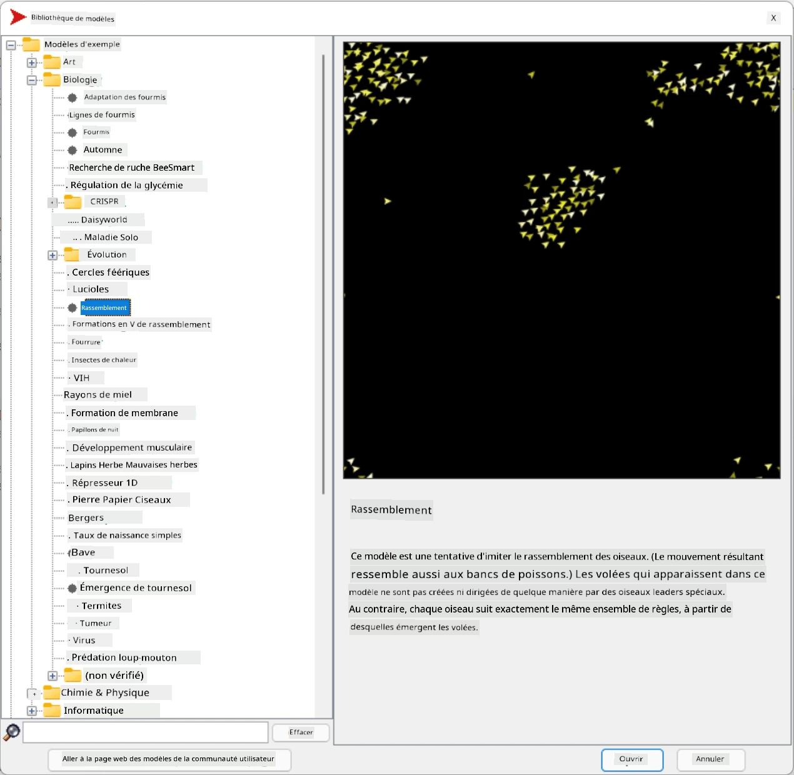
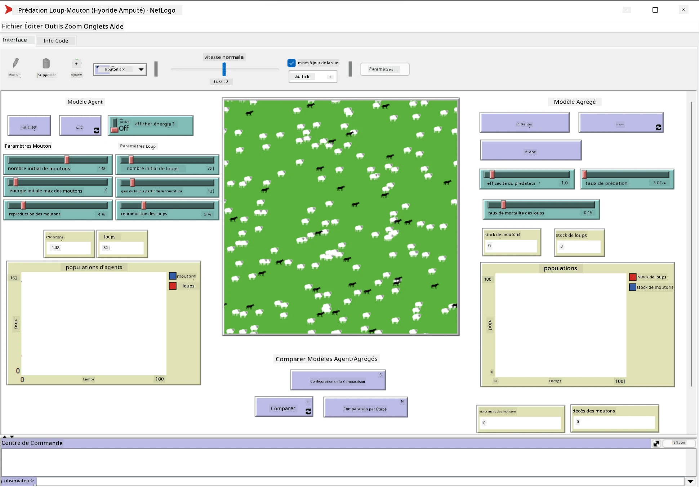

# Systèmes Multi-Agents

Une des approches possibles pour atteindre l'intelligence est l'approche dite **émergente** (ou **synergétique**), qui repose sur le fait que le comportement combiné de nombreux agents relativement simples peut aboutir à un comportement global plus complexe (ou intelligent) du système dans son ensemble. Théoriquement, cela repose sur les principes de l'[Intelligence Collective](https://fr.wikipedia.org/wiki/Intelligence_collective), de l'[Émergentisme](https://fr.wikipedia.org/wiki/Cerveau_global) et de la [Cybernétique Évolutionnaire](https://fr.wikipedia.org/wiki/Cerveau_global), qui stipulent que les systèmes de niveau supérieur acquièrent une certaine valeur ajoutée lorsqu'ils sont correctement combinés à partir de systèmes de niveau inférieur (le *principe de transition méta-systémique*).

## [Quiz pré-conférence](https://ff-quizzes.netlify.app/en/ai/quiz/45)

La direction des **Systèmes Multi-Agents** a émergé dans le domaine de l'IA dans les années 1990 en réponse à la croissance d'Internet et des systèmes distribués. L'un des manuels classiques d'IA, [Artificial Intelligence: A Modern Approach](https://fr.wikipedia.org/wiki/Artificial_Intelligence:_A_Modern_Approach), met en avant une vision de l'IA classique du point de vue des systèmes multi-agents.

Au cœur de l'approche multi-agents se trouve la notion d'**Agent** - une entité qui vit dans un certain **environnement**, qu'elle peut percevoir et sur lequel elle peut agir. Cette définition est très large, et il peut exister de nombreux types et classifications d'agents :

* Selon leur capacité à raisonner :
   - Les agents **réactifs** ont généralement un comportement simple de type demande-réponse.
   - Les agents **délibératifs** utilisent une forme de raisonnement logique et/ou des capacités de planification.
* Selon l'endroit où l'agent exécute son code :
   - Les agents **statiques** fonctionnent sur un nœud réseau dédié.
   - Les agents **mobiles** peuvent déplacer leur code entre les nœuds du réseau.
* Selon leur comportement :
   - Les agents **passifs** n'ont pas de buts spécifiques. Ces agents peuvent réagir à des stimuli externes, mais ne prendront pas d'initiatives.
   - Les agents **actifs** ont des objectifs qu'ils poursuivent.
   - Les agents **cognitifs** impliquent une planification et un raisonnement complexes.

Les systèmes multi-agents sont aujourd'hui utilisés dans de nombreuses applications :

* Dans les jeux, de nombreux personnages non-joueurs utilisent une forme d'IA et peuvent être considérés comme des agents intelligents.
* Dans la production vidéo, le rendu de scènes 3D complexes impliquant des foules est généralement réalisé à l'aide de simulations multi-agents.
* Dans la modélisation de systèmes, l'approche multi-agents est utilisée pour simuler le comportement d'un modèle complexe. Par exemple, l'approche multi-agents a été utilisée avec succès pour prédire la propagation de la COVID-19 dans le monde. Une approche similaire peut être utilisée pour modéliser le trafic dans une ville et voir comment il réagit aux changements des règles de circulation.
* Dans les systèmes d'automatisation complexes, chaque appareil peut agir comme un agent indépendant, ce qui rend le système global moins monolithique et plus robuste.

Nous ne passerons pas beaucoup de temps à approfondir les systèmes multi-agents, mais nous examinerons un exemple de **modélisation multi-agents**.

## NetLogo

[NetLogo](https://ccl.northwestern.edu/netlogo/) est un environnement de modélisation multi-agents basé sur une version modifiée du langage de programmation [Logo](https://fr.wikipedia.org/wiki/Logo_(langage)). Ce langage a été développé pour enseigner les concepts de programmation aux enfants, et il permet de contrôler un agent appelé **tortue**, qui peut se déplacer en laissant une trace derrière elle. Cela permet de créer des figures géométriques complexes, ce qui constitue une manière très visuelle de comprendre le comportement d'un agent.

Dans NetLogo, nous pouvons créer de nombreuses tortues en utilisant la commande `create-turtles`. Nous pouvons ensuite commander à toutes les tortues d'effectuer certaines actions (dans l'exemple ci-dessous - avancer de 10 unités) :

```
create-turtles 10
ask turtles [
  forward 10
]
```

Bien sûr, il n'est pas intéressant que toutes les tortues fassent la même chose, donc nous pouvons `ask` des groupes de tortues, par exemple celles qui se trouvent à proximité d'un certain point. Nous pouvons également créer des tortues de différentes *races* en utilisant la commande `breed [cats cat]`. Ici, `cat` est le nom d'une race, et nous devons spécifier à la fois le mot au singulier et au pluriel, car différentes commandes utilisent différentes formes pour plus de clarté.

> ✅ Nous n'allons pas apprendre le langage NetLogo en détail - vous pouvez consulter la brillante ressource [Beginner's Interactive NetLogo Dictionary](https://ccl.northwestern.edu/netlogo/bind/) si vous souhaitez en savoir plus.

Vous pouvez [télécharger](https://ccl.northwestern.edu/netlogo/download.shtml) et installer NetLogo pour l'essayer.

### Bibliothèque de Modèles

Un des grands avantages de NetLogo est qu'il contient une bibliothèque de modèles fonctionnels que vous pouvez essayer. Allez dans **File &rightarrow; Models Library**, et vous trouverez de nombreuses catégories de modèles à explorer.



> Une capture d'écran de la bibliothèque de modèles par Dmitry Soshnikov

Vous pouvez ouvrir l'un des modèles, par exemple **Biology &rightarrow; Flocking**.

### Principes de Base

Après avoir ouvert le modèle, vous êtes dirigé vers l'écran principal de NetLogo. Voici un exemple de modèle qui décrit la population de loups et de moutons, compte tenu de ressources limitées (herbe).



> Capture d'écran par Dmitry Soshnikov

Sur cet écran, vous pouvez voir :

* La section **Interface** qui contient :
  - Le champ principal, où vivent tous les agents
  - Différents contrôles : boutons, curseurs, etc.
  - Des graphiques que vous pouvez utiliser pour afficher les paramètres de la simulation
* L'onglet **Code** qui contient l'éditeur, où vous pouvez écrire le programme NetLogo

Dans la plupart des cas, l'interface comporte un bouton **Setup**, qui initialise l'état de la simulation, et un bouton **Go** qui lance l'exécution. Ces boutons sont gérés par des gestionnaires correspondants dans le code, qui ressemblent à ceci :

```
to go [
...
]
```

Le monde de NetLogo est constitué des objets suivants :

* **Agents** (tortues) qui peuvent se déplacer sur le champ et effectuer des actions. Vous commandez les agents en utilisant la syntaxe `ask turtles [...]`, et le code entre crochets est exécuté par tous les agents en *mode tortue*.
* **Patches** sont des zones carrées du champ, sur lesquelles vivent les agents. Vous pouvez faire référence à tous les agents sur le même patch, ou modifier les couleurs et d'autres propriétés des patches. Vous pouvez également `ask patches` de faire quelque chose.
* **Observer** est un agent unique qui contrôle le monde. Tous les gestionnaires de boutons sont exécutés en *mode observateur*.

> ✅ La beauté d'un environnement multi-agents réside dans le fait que le code exécuté en mode tortue ou en mode patch est exécuté simultanément par tous les agents en parallèle. Ainsi, en écrivant peu de code et en programmant le comportement d'un agent individuel, vous pouvez créer un comportement complexe pour le système de simulation dans son ensemble.

### Flocking

À titre d'exemple de comportement multi-agents, examinons le **[Flocking](https://fr.wikipedia.org/wiki/Flocking_(comportement))**. Le flocking est un schéma complexe qui ressemble beaucoup à la manière dont les oiseaux volent en groupe. En les observant, on pourrait penser qu'ils suivent une sorte d'algorithme collectif ou qu'ils possèdent une forme d'*intelligence collective*. Cependant, ce comportement complexe émerge lorsque chaque agent individuel (dans ce cas, un *oiseau*) observe uniquement quelques autres agents à une courte distance et suit trois règles simples :

* **Alignement** - il s'oriente vers la direction moyenne des agents voisins
* **Cohésion** - il essaie de se diriger vers la position moyenne des voisins (*attraction à longue portée*)
* **Séparation** - lorsqu'il se rapproche trop des autres oiseaux, il essaie de s'éloigner (*répulsion à courte portée*)

Vous pouvez exécuter l'exemple de flocking et observer le comportement. Vous pouvez également ajuster les paramètres, tels que le *degré de séparation* ou le *champ de vision*, qui définit jusqu'où chaque oiseau peut voir. Notez que si vous réduisez le champ de vision à 0, tous les oiseaux deviennent aveugles et le flocking s'arrête. Si vous réduisez la séparation à 0, tous les oiseaux se regroupent en une ligne droite.

> ✅ Passez à l'onglet **Code** et observez où les trois règles du flocking (alignement, cohésion et séparation) sont implémentées dans le code. Notez comment nous faisons référence uniquement aux agents qui sont dans le champ de vision.

### Autres Modèles à Explorer

Voici quelques autres modèles intéressants à expérimenter :

* **Art &rightarrow; Fireworks** montre comment un feu d'artifice peut être considéré comme un comportement collectif de jets individuels.
* **Social Science &rightarrow; Traffic Basic** et **Social Science &rightarrow; Traffic Grid** montrent le modèle de trafic urbain en 1D et en grille 2D avec ou sans feux de signalisation. Chaque voiture dans la simulation suit les règles suivantes :
   - Si l'espace devant est vide - accélérer (jusqu'à une certaine vitesse maximale)
   - Si elle voit un obstacle devant - freiner (et vous pouvez ajuster la distance de vision du conducteur)
* **Social Science &rightarrow; Party** montre comment les gens se regroupent lors d'une soirée cocktail. Vous pouvez trouver la combinaison de paramètres qui mène à l'augmentation la plus rapide du bonheur du groupe.

Comme vous pouvez le voir dans ces exemples, les simulations multi-agents peuvent être un moyen très utile de comprendre le comportement d'un système complexe composé d'individus suivant une logique similaire. Elles peuvent également être utilisées pour contrôler des agents virtuels, tels que des [PNJ](https://fr.wikipedia.org/wiki/Personnage_non-joueur) dans les jeux vidéo, ou des agents dans des mondes animés en 3D.

## Agents Délibératifs

Les agents décrits ci-dessus sont très simples, réagissant aux changements de l'environnement en utilisant une sorte d'algorithme. En tant que tels, ce sont des **agents réactifs**. Cependant, parfois, les agents peuvent raisonner et planifier leurs actions, auquel cas ils sont appelés **délibératifs**.

Un exemple typique serait un agent personnel qui reçoit une instruction d'un humain pour réserver un voyage. Supposons qu'il existe de nombreux agents sur Internet qui peuvent l'aider. Il devrait alors contacter d'autres agents pour voir quels vols sont disponibles, quels sont les prix des hôtels pour différentes dates, et essayer de négocier le meilleur prix. Une fois le plan de voyage terminé et confirmé par le propriétaire, il peut procéder à la réservation.

Pour ce faire, les agents doivent **communiquer**. Pour une communication réussie, ils ont besoin de :

* Certains **langages standards pour échanger des connaissances**, tels que le [Knowledge Interchange Format](https://fr.wikipedia.org/wiki/Knowledge_Interchange_Format) (KIF) et le [Knowledge Query and Manipulation Language](https://fr.wikipedia.org/wiki/Knowledge_Query_and_Manipulation_Language) (KQML). Ces langages sont conçus sur la base de la [théorie des actes de langage](https://fr.wikipedia.org/wiki/Acte_de_langage).
* Ces langages doivent également inclure des **protocoles de négociation**, basés sur différents **types d'enchères**.
* Une **ontologie commune** à utiliser, afin qu'ils se réfèrent aux mêmes concepts en connaissant leur sémantique.
* Un moyen de **découvrir** ce que différents agents peuvent faire, également basé sur une sorte d'ontologie.

Les agents délibératifs sont beaucoup plus complexes que les agents réactifs, car ils ne se contentent pas de réagir aux changements de l'environnement, ils doivent également être capables d'*initier* des actions. Une des architectures proposées pour les agents délibératifs est l'agent dit Belief-Desire-Intention (BDI) :

* Les **Croyances** forment un ensemble de connaissances sur l'environnement de l'agent. Cela peut être structuré comme une base de connaissances ou un ensemble de règles qu'un agent peut appliquer à une situation spécifique dans l'environnement.
* Les **Désirs** définissent ce que l'agent veut faire, c'est-à-dire ses objectifs. Par exemple, l'objectif de l'agent assistant personnel ci-dessus est de réserver un voyage, et l'objectif d'un agent hôtelier est de maximiser les profits.
* Les **Intentions** sont des actions spécifiques qu'un agent planifie pour atteindre ses objectifs. Les actions modifient généralement l'environnement et entraînent une communication avec d'autres agents.

Il existe des plateformes disponibles pour construire des systèmes multi-agents, telles que [JADE](https://jade.tilab.com/). [Cet article](https://arxiv.org/ftp/arxiv/papers/2007/2007.08961.pdf) contient une revue des plateformes multi-agents, ainsi qu'un bref historique des systèmes multi-agents et de leurs différents scénarios d'utilisation.

## Conclusion

Les systèmes multi-agents peuvent prendre des formes très diverses et être utilisés dans de nombreuses applications. 
Ils tendent tous à se concentrer sur le comportement plus simple d'un agent individuel, et à obtenir un comportement plus complexe du système global grâce à l'**effet synergétique**.

## 🚀 Défi

Appliquez cette leçon au monde réel et essayez de conceptualiser un système multi-agents capable de résoudre un problème. Que devrait faire, par exemple, un système multi-agents pour optimiser un itinéraire de bus scolaire ? Comment pourrait-il fonctionner dans une boulangerie ?

## [Quiz post-conférence](https://ff-quizzes.netlify.app/en/ai/quiz/46)

## Révision & Auto-apprentissage

Examinez l'utilisation de ce type de système dans l'industrie. Choisissez un domaine tel que la fabrication ou l'industrie du jeu vidéo et découvrez comment les systèmes multi-agents peuvent être utilisés pour résoudre des problèmes uniques.

## [Devoir NetLogo](assignment.md)

---

