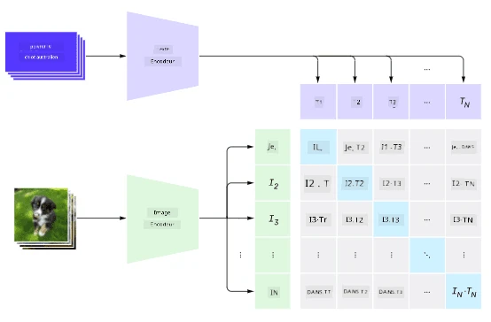
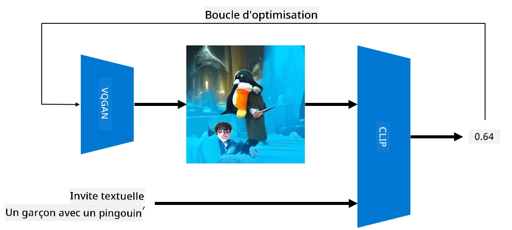

# Réseaux Multi-Modalités

Après le succès des modèles transformateurs pour résoudre des tâches de traitement du langage naturel (NLP), les mêmes architectures ou des architectures similaires ont été appliquées aux tâches de vision par ordinateur. Il y a un intérêt croissant pour la création de modèles qui *combinent* les capacités de vision et de langage naturel. Une des tentatives dans ce domaine a été réalisée par OpenAI, et elle s'appelle CLIP et DALL.E.

## Apprentissage Contrastif d'Images (CLIP)

L'idée principale de CLIP est de pouvoir comparer des descriptions textuelles avec une image et déterminer à quel point l'image correspond à la description.

> *Image tirée de [cet article de blog](https://openai.com/blog/clip/)*

Le modèle est entraîné sur des images obtenues sur Internet et leurs légendes. Pour chaque lot, nous prenons N paires (image, texte) et les convertissons en représentations vectorielles I, ..., I / T, ..., T. Ces représentations sont ensuite associées ensemble. La fonction de perte est définie pour maximiser la similarité cosinus entre les vecteurs correspondant à une paire (par exemple, I et T) et minimiser la similarité cosinus entre toutes les autres paires. C'est pourquoi cette approche est appelée **contrastive**.

La bibliothèque/modèle CLIP est disponible sur [GitHub d'OpenAI](https://github.com/openai/CLIP). L'approche est décrite dans [cet article de blog](https://openai.com/blog/clip/) et plus en détail dans [cet article scientifique](https://arxiv.org/pdf/2103.00020.pdf).

Une fois ce modèle pré-entraîné, nous pouvons lui fournir un lot d'images et un lot de descriptions textuelles, et il renverra un tenseur avec des probabilités. CLIP peut être utilisé pour plusieurs tâches :

**Classification d'Images**

Supposons que nous devons classer des images entre, par exemple, des chats, des chiens et des humains. Dans ce cas, nous pouvons donner au modèle une image et une série de descriptions textuelles : "*une image d'un chat*", "*une image d'un chien*", "*une image d'un humain*". Dans le vecteur résultant de 3 probabilités, il suffit de sélectionner l'indice avec la valeur la plus élevée.

> *Image tirée de [cet article de blog](https://openai.com/blog/clip/)*

**Recherche d'Images Basée sur du Texte**

Nous pouvons également faire l'inverse. Si nous avons une collection d'images, nous pouvons passer cette collection au modèle, ainsi qu'une description textuelle - cela nous donnera l'image la plus similaire à la description donnée.

## ✍️ Exemple : [Utilisation de CLIP pour la Classification et la Recherche d'Images](../../../../../lessons/X-Extras/X1-MultiModal/Clip.ipynb)

Ouvrez le notebook [Clip.ipynb](../../../../../lessons/X-Extras/X1-MultiModal/Clip.ipynb) pour voir CLIP en action.

## Génération d'Images avec VQGAN+CLIP

CLIP peut également être utilisé pour **générer des images** à partir d'une description textuelle. Pour ce faire, nous avons besoin d'un **modèle générateur** capable de générer des images basées sur une entrée vectorielle. Un de ces modèles s'appelle [VQGAN](https://compvis.github.io/taming-transformers/) (GAN Quantifié par Vecteurs).

Les idées principales de VQGAN qui le différencient des [GAN classiques](../../4-ComputerVision/10-GANs/README.md) sont les suivantes :
* Utilisation d'une architecture de transformateur autorégressif pour générer une séquence de parties visuelles riches en contexte qui composent l'image. Ces parties visuelles sont à leur tour apprises par un [CNN](../../4-ComputerVision/07-ConvNets/README.md).
* Utilisation d'un discriminateur de sous-images qui détecte si les parties de l'image sont "réelles" ou "fausses" (contrairement à l'approche "tout ou rien" des GAN traditionnels).

Apprenez-en davantage sur VQGAN sur le site [Taming Transformers](https://compvis.github.io/taming-transformers/).

Une des différences importantes entre VQGAN et les GAN traditionnels est que ces derniers peuvent produire une image correcte à partir de n'importe quel vecteur d'entrée, tandis que VQGAN est susceptible de produire une image incohérente. Ainsi, nous devons guider davantage le processus de création d'image, ce qui peut être fait en utilisant CLIP.

Pour générer une image correspondant à une description textuelle, nous commençons par un vecteur d'encodage aléatoire qui est passé à travers VQGAN pour produire une image. Ensuite, CLIP est utilisé pour produire une fonction de perte qui montre à quel point l'image correspond à la description textuelle. L'objectif est alors de minimiser cette perte, en utilisant la rétropropagation pour ajuster les paramètres du vecteur d'entrée.

Une excellente bibliothèque qui implémente VQGAN+CLIP est [Pixray](http://github.com/pixray/pixray).

 |   | 
----|----|----
Image générée à partir de la description *un portrait en gros plan à l'aquarelle d'un jeune professeur de littérature avec un livre* | Image générée à partir de la description *un portrait en gros plan à l'huile d'une jeune professeure d'informatique avec un ordinateur* | Image générée à partir de la description *un portrait en gros plan à l'huile d'un vieux professeur de mathématiques devant un tableau noir*

> Images tirées de la collection **Artificial Teachers** par [Dmitry Soshnikov](http://soshnikov.com)

## DALL-E
### [DALL-E 1](https://openai.com/research/dall-e)
DALL-E est une version de GPT-3 entraînée pour générer des images à partir de descriptions textuelles. Il a été entraîné avec 12 milliards de paramètres.

Contrairement à CLIP, DALL-E reçoit à la fois du texte et des images sous forme d'un flux unique de tokens pour les deux. Ainsi, à partir de plusieurs descriptions, vous pouvez générer des images basées sur le texte.

### [DALL-E 2](https://openai.com/dall-e-2)
La principale différence entre DALL-E 1 et 2 est que ce dernier génère des images et des œuvres d'art plus réalistes.

Exemples de génération d'images avec DALL-E :
 |   | 
----|----|----
Image générée à partir de la description *un portrait en gros plan à l'aquarelle d'un jeune professeur de littérature avec un livre* | Image générée à partir de la description *un portrait en gros plan à l'huile d'une jeune professeure d'informatique avec un ordinateur* | Image générée à partir de la description *un portrait en gros plan à l'huile d'un vieux professeur de mathématiques devant un tableau noir*

## Références

* Article sur VQGAN : [Taming Transformers for High-Resolution Image Synthesis](https://compvis.github.io/taming-transformers/paper/paper.pdf)
* Article sur CLIP : [Learning Transferable Visual Models From Natural Language Supervision](https://arxiv.org/pdf/2103.00020.pdf)

**Avertissement** :  
Ce document a été traduit à l'aide du service de traduction automatique [Co-op Translator](https://github.com/Azure/co-op-translator). Bien que nous nous efforcions d'assurer l'exactitude, veuillez noter que les traductions automatisées peuvent contenir des erreurs ou des inexactitudes. Le document original dans sa langue d'origine doit être considéré comme la source faisant autorité. Pour des informations critiques, il est recommandé de recourir à une traduction humaine professionnelle. Nous déclinons toute responsabilité en cas de malentendus ou d'interprétations erronées résultant de l'utilisation de cette traduction.