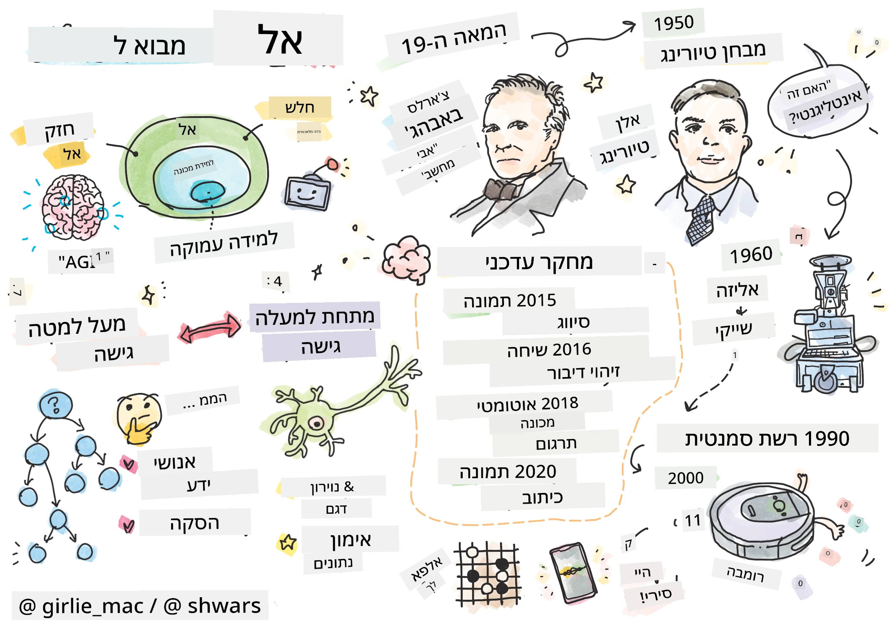
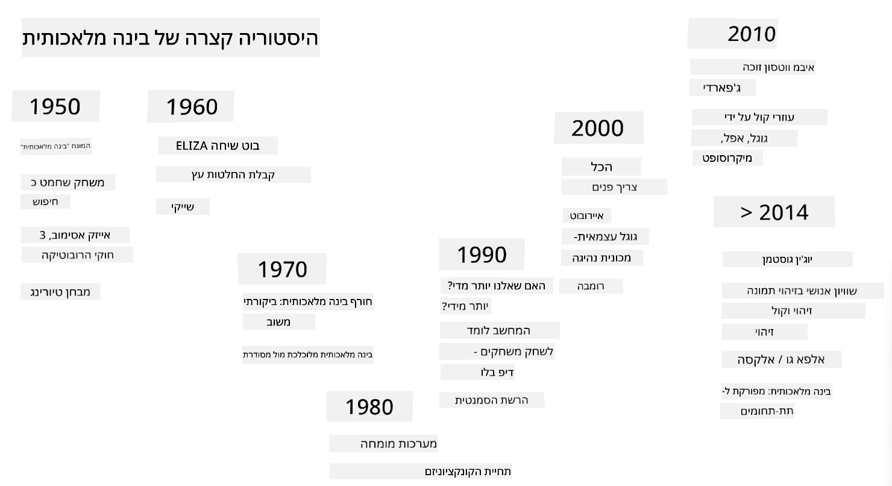
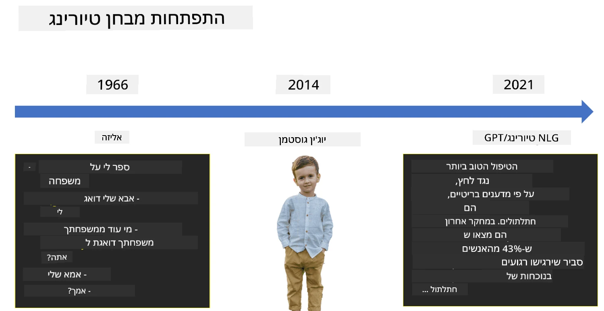

# מבוא לבינה מלאכותית

> ציור מאת [Tomomi Imura](https://twitter.com/girlie_mac)

## [שאלון לפני ההרצאה](https://ff-quizzes.netlify.app/en/ai/quiz/1)

**בינה מלאכותית** היא תחום מדעי מרתק שחוקר כיצד ניתן לגרום למחשבים להפגין התנהגות אינטליגנטית, כלומר לבצע דברים שבני אדם טובים בהם.

במקור, מחשבים הומצאו על ידי [צ'ארלס בבג'](https://en.wikipedia.org/wiki/Charles_Babbage) כדי לפעול על מספרים לפי תהליך מוגדר היטב - אלגוריתם. מחשבים מודרניים, למרות שהם מתקדמים בהרבה מהמודל המקורי שהוצע במאה ה-19, עדיין פועלים על פי אותו רעיון של חישובים מבוקרים. לכן, ניתן לתכנת מחשב לבצע משהו אם אנו יודעים את רצף הצעדים המדויק שעלינו לבצע כדי להשיג את המטרה.

> תמונה מאת [Vickie Soshnikova](http://twitter.com/vickievalerie)

> ✅ הגדרת הגיל של אדם מתמונתו היא משימה שלא ניתן לתכנת במפורש, מכיוון שאיננו יודעים כיצד אנו מגיעים למספר בראשנו כשאנו עושים זאת.

---

עם זאת, ישנן משימות שאיננו יודעים כיצד לפתור במפורש. לדוגמה, קביעת גיל של אדם מתמונתו. אנו לומדים לעשות זאת משום שראינו דוגמאות רבות של אנשים בגילאים שונים, אך איננו יכולים להסביר במפורש כיצד אנו עושים זאת, וגם לא לתכנת מחשב לעשות זאת. זה בדיוק סוג המשימות שמעניין את תחום **הבינה המלאכותית** (AI).

✅ חשבו על כמה משימות שתוכלו להטיל על מחשב ושיוכלו להרוויח מבינה מלאכותית. חשבו על תחומי הפיננסים, הרפואה והאמנות - כיצד תחומים אלו נהנים כיום מבינה מלאכותית?

## בינה מלאכותית חלשה לעומת בינה מלאכותית חזקה

בינה מלאכותית חלשה | בינה מלאכותית חזקה
---------------------------------------|-------------------------------------
בינה מלאכותית חלשה מתייחסת למערכות AI שתוכננו ואומנו למשימה מסוימת או לקבוצת משימות צרה.|בינה מלאכותית חזקה, או בינה מלאכותית כללית (AGI), מתייחסת למערכות AI עם אינטליגנציה והבנה ברמת אדם.
מערכות AI אלו אינן אינטליגנטיות באופן כללי; הן מצטיינות בביצוע משימה מוגדרת מראש אך חסרות הבנה אמיתית או תודעה.|מערכות AI אלו מסוגלות לבצע כל משימה אינטלקטואלית שאדם יכול לבצע, להסתגל לתחומים שונים, ולהחזיק בצורה כלשהי של תודעה או מודעות עצמית.
דוגמאות לבינה מלאכותית חלשה כוללות עוזרים וירטואליים כמו סירי או אלכסה, אלגוריתמי המלצה בשירותי סטרימינג, ובוטים לשירות לקוחות.|השגת בינה מלאכותית חזקה היא מטרה ארוכת טווח של מחקר AI ותדרוש פיתוח מערכות AI שיכולות להסיק, ללמוד, להבין ולהסתגל למגוון רחב של משימות והקשרים.
בינה מלאכותית חלשה מתמחה מאוד ואינה מחזיקה ביכולות קוגניטיביות דמויות אדם או יכולות פתרון בעיות כלליות מעבר לתחום הצר שלה.|בינה מלאכותית חזקה היא כרגע מושג תיאורטי, ואף מערכת AI לא הגיעה לרמת אינטליגנציה כללית זו.

למידע נוסף עיינו ב-**[בינה מלאכותית כללית](https://en.wikipedia.org/wiki/Artificial_general_intelligence)** (AGI).

## הגדרת אינטליגנציה ומבחן טיורינג

אחת הבעיות בהתמודדות עם המונח **[אינטליגנציה](https://en.wikipedia.org/wiki/Intelligence)** היא שאין הגדרה ברורה למונח זה. ניתן לטעון שאינטליגנציה קשורה ל**חשיבה מופשטת**, או ל**מודעות עצמית**, אך איננו יכולים להגדיר אותה כראוי.

> [תמונה](https://unsplash.com/photos/75715CVEJhI) מאת [Amber Kipp](https://unsplash.com/@sadmax) מ-Unsplash

כדי לראות את העמימות של המונח *אינטליגנציה*, נסו לענות על השאלה: "האם חתול הוא אינטליגנטי?". אנשים שונים נוטים לתת תשובות שונות לשאלה זו, מכיוון שאין מבחן מקובל אוניברסלית להוכיח אם הטענה נכונה או לא. ואם אתם חושבים שיש - נסו להעביר את החתול שלכם מבחן IQ...

✅ חשבו לרגע כיצד אתם מגדירים אינטליגנציה. האם עורב שיכול לפתור מבוך ולהגיע לאוכל הוא אינטליגנטי? האם ילד הוא אינטליגנטי?

---

כשמדברים על AGI, אנו זקוקים לדרך כלשהי לדעת אם יצרנו מערכת אינטליגנטית באמת. [אלן טיורינג](https://en.wikipedia.org/wiki/Alan_Turing) הציע דרך שנקראת **[מבחן טיורינג](https://en.wikipedia.org/wiki/Turing_test)**, שמשמשת גם כהגדרה לאינטליגנציה. המבחן משווה מערכת נתונה למשהו אינטליגנטי מטבעו - אדם אמיתי, ומכיוון שכל השוואה אוטומטית יכולה להיות מנוצחת על ידי תוכנת מחשב, אנו משתמשים בחוקר אנושי. אם אדם אינו מסוגל להבחין בין אדם אמיתי למערכת מחשב בדיאלוג מבוסס טקסט - המערכת נחשבת אינטליגנטית.

> בוט שיחה בשם [יוג'ין גוסטמן](https://en.wikipedia.org/wiki/Eugene_Goostman), שפותח בסנט פטרסבורג, התקרב לעבור את מבחן טיורינג בשנת 2014 על ידי שימוש בטריק אישיות חכם. הוא הודיע מראש שהוא ילד אוקראיני בן 13, מה שיסביר את חוסר הידע וחלק מהסתירות בטקסט. הבוט שכנע 30% מהשופטים שהוא אנושי לאחר דיאלוג של 5 דקות, מדד שטיורינג האמין שמכונה תוכל לעבור עד שנת 2000. עם זאת, יש להבין שזה לא מעיד שיצרנו מערכת אינטליגנטית, או שמערכת מחשב רימתה את החוקר האנושי - המערכת לא רימתה את בני האדם, אלא יוצרי הבוט עשו זאת!

✅ האם אי פעם בוט שיחה רימה אתכם לחשוב שאתם מדברים עם אדם? כיצד הוא שכנע אתכם?

## גישות שונות לבינה מלאכותית

אם אנו רוצים שמחשב יתנהג כמו אדם, עלינו לדמות בתוך המחשב את דרך החשיבה שלנו. כתוצאה מכך, עלינו לנסות להבין מה הופך אדם לאינטליגנטי.

> כדי שנוכל לתכנת אינטליגנציה למכונה, עלינו להבין כיצד תהליכי קבלת ההחלטות שלנו פועלים. אם תעשו מעט התבוננות פנימית, תבינו שיש תהליכים מסוימים שקורים באופן תת-מודע – למשל, אנו יכולים להבחין בין חתול לכלב מבלי לחשוב על כך - בעוד שאחרים כוללים הסקת מסקנות.

ישנן שתי גישות אפשריות לבעיה זו:

גישה מלמעלה למטה (הסקה סימבולית) | גישה מלמטה למעלה (רשתות נוירונים)
---------------------------------------|-------------------------------------
גישה מלמעלה למטה מדמה את הדרך שבה אדם מסיק מסקנות כדי לפתור בעיה. היא כוללת חילוץ **ידע** מאדם, וייצוגו בצורה קריאה למחשב. כמו כן, עלינו לפתח דרך לדמות **הסקה** בתוך מחשב. | גישה מלמטה למעלה מדמה את מבנה המוח האנושי, המורכב ממספר עצום של יחידות פשוטות הנקראות **נוירונים**. כל נוירון פועל כמו ממוצע משוקלל של הקלטים שלו, ואנו יכולים לאמן רשת נוירונים לפתור בעיות שימושיות על ידי מתן **נתוני אימון**.

ישנן גם גישות נוספות לאינטליגנציה:

* גישה **מתהווה**, **סינרגטית** או **רב-סוכנית** מבוססת על העובדה שהתנהגות אינטליגנטית מורכבת יכולה להתקבל מאינטראקציה של מספר רב של סוכנים פשוטים. לפי [סייברנטיקה אבולוציונית](https://en.wikipedia.org/wiki/Global_brain#Evolutionary_cybernetics), אינטליגנציה יכולה *להתפתח* מהתנהגות פשוטה יותר בתהליך של *מעבר למערכת-על*.

* גישה **אבולוציונית**, או **אלגוריתם גנטי** היא תהליך אופטימיזציה המבוסס על עקרונות האבולוציה.

נשקול גישות אלו בהמשך הקורס, אך כרגע נתמקד בשני הכיוונים העיקריים: מלמעלה למטה ומלמטה למעלה.

### הגישה מלמעלה למטה

בגישה **מלמעלה למטה**, אנו מנסים לדמות את תהליך ההסקה שלנו. מכיוון שאנו יכולים לעקוב אחר מחשבותינו כשאנו מסיקים מסקנות, אנו יכולים לנסות לנסח תהליך זה ולתכנת אותו בתוך המחשב. זה נקרא **הסקה סימבולית**.

לאנשים יש נטייה להחזיק כללים מסוימים בראשם שמנחים את תהליכי קבלת ההחלטות שלהם. לדוגמה, כאשר רופא מאבחן מטופל, הוא או היא עשויים להבין שלמטופל יש חום, ולכן ייתכן שיש דלקת כלשהי בגוף. על ידי יישום סט גדול של כללים לבעיה מסוימת, רופא עשוי להגיע לאבחנה הסופית.

גישה זו מסתמכת במידה רבה על **ייצוג ידע** ו**הסקה**. חילוץ ידע ממומחה אנושי עשוי להיות החלק הקשה ביותר, מכיוון שבמקרים רבים רופא לא יידע בדיוק מדוע הוא או היא מגיעים לאבחנה מסוימת. לפעמים הפתרון פשוט עולה בראשם מבלי לחשוב במפורש. יש משימות, כמו קביעת גיל של אדם מתמונה, שלא ניתן כלל לצמצם למניפולציה של ידע.

### הגישה מלמטה למעלה

לחילופין, אנו יכולים לנסות לדמות את האלמנטים הפשוטים ביותר במוח שלנו – נוירון. אנו יכולים לבנות **רשת נוירונים מלאכותית** בתוך מחשב, ואז לנסות ללמד אותה לפתור בעיות על ידי מתן דוגמאות. תהליך זה דומה לאופן שבו תינוק לומד על סביבתו על ידי ביצוע תצפיות.

✅ בצעו מעט מחקר על איך תינוקות לומדים. מהם האלמנטים הבסיסיים במוחו של תינוק?

> | מה לגבי ML?         |      |
> |--------------|-----------|
> | חלק מהבינה המלאכותית המבוסס על למידת מחשב לפתור בעיה על סמך נתונים מסוימים נקרא **למידת מכונה**. לא נעסוק בלמידת מכונה קלאסית בקורס זה - אנו מפנים אתכם לתוכנית הלימודים הנפרדת [למידת מכונה למתחילים](http://aka.ms/ml-beginners). |       |

## היסטוריה קצרה של בינה מלאכותית

בינה מלאכותית החלה כתחום באמצע המאה ה-20. בתחילה, גישת ההסקה הסימבולית הייתה הגישה השלטת, והיא הובילה למספר הצלחות חשובות, כמו מערכות מומחה – תוכניות מחשב שיכלו לפעול כמומחה בתחומים מוגבלים. עם זאת, עד מהרה התברר שגישה זו אינה מתאימה להרחבה. חילוץ הידע ממומחה, ייצוגו במחשב, ושמירה על בסיס הידע מדויק מתבררים כמשימה מורכבת מאוד ויקרה מדי במקרים רבים. זה הוביל למה שנקרא [חורף הבינה המלאכותית](https://en.wikipedia.org/wiki/AI_winter) בשנות ה-70.

> תמונה מאת [Dmitry Soshnikov](http://soshnikov.com)

עם הזמן, משאבי המחשוב הפכו זולים יותר, ויותר נתונים הפכו זמינים, כך שגישות רשתות נוירונים החלו להראות ביצועים מצוינים בתחרות עם בני אדם בתחומים רבים, כמו ראייה ממוחשבת או הבנת דיבור. בעשור האחרון, המונח בינה מלאכותית שימש בעיקר כמילה נרדפת לרשתות נוירונים, מכיוון שרוב ההצלחות של AI שאנו שומעים עליהן מבוססות עליהן.

אנו יכולים לראות כיצד הגישות השתנו, לדוגמה, ביצירת תוכנית מחשב לשחק שחמט:

* תוכניות שחמט מוקדמות התבססו על חיפוש – תוכנית ניסתה במפורש להעריך מהלכים אפשריים של היריב למספר מהלכים קדימה, ובחרה מהלך אופטימלי על סמך המיקום האופטימלי שניתן להשיג בכמה מהלכים. זה הוביל לפיתוח של מה שנקרא אלגוריתם [alpha-beta pruning](https://en.wikipedia.org/wiki/Alpha%E2%80%93beta_pruning).
* אסטרטגיות חיפוש עובדות היטב לקראת סוף המשחק, כאשר מרחב החיפוש מוגבל למספר קטן של מהלכים אפשריים. עם זאת, בתחילת המשחק, מרחב החיפוש עצום, והאלגוריתם יכול להשתפר על ידי למידה ממשחקים קיימים בין שחקנים אנושיים. ניסויים מאוחרים יותר השתמשו במה שנקרא [case-based reasoning](https://en.wikipedia.org/wiki/Case-based_reasoning), שבו התוכנית חיפשה מקרים בבסיס הידע הדומים מאוד למצב הנוכחי במשחק.
* תוכניות מודרניות שמנצחות שחקנים אנושיים מבוססות על רשתות נוירונים ולמידת חיזוק ([reinforcement learning](https://en.wikipedia.org/wiki/Reinforcement_learning)), שבהן התוכניות לומדות לשחק אך ורק על ידי משחק ממושך נגד עצמן ולמידה מטעויותיהן – בדומה לאופן שבו בני אדם לומדים לשחק שחמט. עם זאת, תוכנית מחשב יכולה לשחק הרבה יותר משחקים בהרבה פחות זמן, ולכן יכולה ללמוד מהר יותר.

✅ בצעו מעט מחקר על משחקים נוספים ששוחקו על ידי AI.

באופן דומה, אנו יכולים לראות כיצד הגישה ליצירת "תוכניות מדברות" (שיכולות לעבור את מבחן טיורינג) השתנתה:

* תוכניות מוקדמות מסוג זה, כמו [Eliza](https://en.wikipedia.org/wiki/ELIZA), התבססו על כללים דקדוקיים פשוטים מאוד ועל ניסוח מחדש של משפט הקלט לשאלה.
* עוזרים מודרניים, כמו Cortana, Siri או Google Assistant הם כולם מערכות היברידיות שמשתמשות ברשתות נוירונים כדי להמיר דיבור לטקסט ולהבין את כוונתנו, ואז משתמשות בהסקה או באלגוריתמים מפורשים כדי לבצע פעולות נדרשות.
* בעתיד, אנו עשויים לצפות למודל מבוסס רשת נוירונים מלא שיטפל בדיאלוג בעצמו. משפחת הרשתות הנוירוניות GPT ו-[Turing-NLG](https://www.microsoft.com/research/blog/turing-nlg-a-17-billion-parameter-language-model-by-microsoft) מראה הצלחות גדולות בתחום זה.

> תמונה מאת דמיטרי סושניקוב, [תמונה](https://unsplash.com/photos/r8LmVbUKgns) מאת [מרינה אברוסימובה](https://unsplash.com/@abrosimova_marina_foto), Unsplash

## מחקר AI עדכני

הצמיחה הגדולה במחקר רשתות נוירונים החלה סביב שנת 2010, כאשר מאגרי נתונים ציבוריים גדולים החלו להיות זמינים. אוסף עצום של תמונות בשם [ImageNet](https://en.wikipedia.org/wiki/ImageNet), המכיל כ-14 מיליון תמונות עם הערות, הוביל ליצירת [אתגר זיהוי חזותי בקנה מידה גדול של ImageNet](https://image-net.org/challenges/LSVRC/).

> תמונה מאת [דמיטרי סושניקוב](http://soshnikov.com)

בשנת 2012, [רשתות נוירונים קונבולוציוניות](../4-ComputerVision/07-ConvNets/README.md) שימשו לראשונה בסיווג תמונות, מה שהוביל לירידה משמעותית בשגיאות הסיווג (מכמעט 30% ל-16.4%). בשנת 2015, ארכיטקטורת ResNet ממיקרוסופט [השיגה דיוק ברמת אדם](https://doi.org/10.1109/ICCV.2015.123).

מאז, רשתות נוירונים הראו הצלחה רבה במשימות רבות:

---

שנה | הגעה לשוויון עם אדם
-----|--------
2015 | [סיווג תמונות](https://doi.org/10.1109/ICCV.2015.123)
2016 | [זיהוי דיבור שיחתי](https://arxiv.org/abs/1610.05256)
2018 | [תרגום מכונה אוטומטי](https://arxiv.org/abs/1803.05567) (סינית-אנגלית)
2020 | [תיאור תמונות](https://arxiv.org/abs/2009.13682)

בשנים האחרונות חווינו הצלחות גדולות עם מודלים שפתיים גדולים, כמו BERT ו-GPT-3. הדבר קרה בעיקר בזכות העובדה שיש הרבה נתוני טקסט כלליים זמינים, שמאפשרים לנו לאמן מודלים לתפוס את המבנה והמשמעות של טקסטים, לאמן אותם מראש על אוספי טקסט כלליים, ואז להתמחות במשימות ספציפיות יותר. נלמד יותר על [עיבוד שפה טבעית](../5-NLP/README.md) בהמשך הקורס.

## 🚀 אתגר

עשו סיור באינטרנט כדי לקבוע היכן, לדעתכם, נעשה שימוש יעיל ביותר ב-AI. האם זה באפליקציית מיפוי, או שירות דיבור לטקסט, או משחק וידאו? חקרו כיצד המערכת נבנתה.

## [שאלון לאחר ההרצאה](https://ff-quizzes.netlify.app/en/ai/quiz/2)

## סקירה ולימוד עצמי

סקור את ההיסטוריה של AI ו-ML על ידי קריאה דרך [השיעור הזה](https://github.com/microsoft/ML-For-Beginners/tree/main/1-Introduction/2-history-of-ML). קחו אלמנט מהסקצ'נוט שבתחילת השיעור הזה או השיעור ההוא וחקרו אותו לעומק כדי להבין את ההקשר התרבותי שהשפיע על התפתחותו.

**משימה**: [Game Jam](assignment.md)

---

<!-- CO-OP TRANSLATOR DISCLAIMER START -->
**כתב ויתור**:  
מסמך זה תורגם באמצעות שירות תרגום AI [Co-op Translator](https://github.com/Azure/co-op-translator). למרות שאנו שואפים לדיוק, יש לקחת בחשבון שתרגומים אוטומטיים עשויים להכיל שגיאות או אי דיוקים. המסמך המקורי בשפתו המקורית צריך להיחשב כמקור סמכותי. עבור מידע קריטי, מומלץ להשתמש בתרגום מקצועי אנושי. איננו אחראים לאי הבנות או לפרשנויות שגויות הנובעות משימוש בתרגום זה.
<!-- CO-OP TRANSLATOR DISCLAIMER END -->