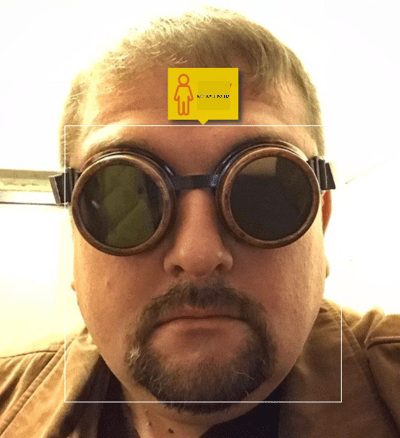

<!--
CO_OP_TRANSLATOR_METADATA:
{
  "original_hash": "06ca1b0138e65b964481ae83275b270e",
  "translation_date": "2025-10-03T08:31:23+00:00",
  "source_file": "lessons/1-Intro/README.md",
  "language_code": "he"
}
-->
# מבוא לבינה מלאכותית

> ציור מאת [Tomomi Imura](https://twitter.com/girlie_mac)

## [שאלון לפני ההרצאה](https://ff-quizzes.netlify.app/en/ai/quiz/1)

**בינה מלאכותית** היא תחום מדעי מרתק שחוקר כיצד ניתן לגרום למחשבים להציג התנהגות אינטליגנטית, כלומר לבצע דברים שבני אדם טובים בהם.

במקור, מחשבים הומצאו על ידי [צ'ארלס בבג'](https://en.wikipedia.org/wiki/Charles_Babbage) כדי לעבוד עם מספרים לפי תהליך מוגדר היטב - אלגוריתם. מחשבים מודרניים, למרות שהם מתקדמים בהרבה מהמודל המקורי שהוצע במאה ה-19, עדיין פועלים לפי אותו רעיון של חישובים מבוקרים. לכן, ניתן לתכנת מחשב לבצע משימה אם אנו יודעים את רצף השלבים המדויק שצריך לבצע כדי להשיג את המטרה.

> תמונה מאת [Vickie Soshnikova](http://twitter.com/vickievalerie)

> ✅ הגדרת גיל של אדם מתמונתו היא משימה שלא ניתן לתכנת באופן מפורש, כי איננו יודעים כיצד אנו מגיעים למספר בראשנו כשאנו עושים זאת.

---

עם זאת, ישנן משימות שאיננו יודעים לפתור באופן מפורש. לדוגמה, קביעת גיל של אדם מתמונתו. אנו לומדים לעשות זאת משום שראינו דוגמאות רבות של אנשים בגילאים שונים, אך איננו יכולים להסביר במפורש כיצד אנו עושים זאת, וגם לא לתכנת מחשב לעשות זאת. זו בדיוק סוג המשימות שמעניינות את תחום **הבינה המלאכותית** (בקיצור AI).

✅ חשבו על משימות שתוכלו להעביר למחשב ושיוכלו להרוויח מבינה מלאכותית. שקלו תחומים כמו פיננסים, רפואה ואומנות - כיצד תחומים אלו נהנים כיום מבינה מלאכותית?

## בינה מלאכותית חלשה מול בינה מלאכותית חזקה

בינה מלאכותית חלשה | בינה מלאכותית חזקה
---------------------------------------|-------------------------------------
בינה מלאכותית חלשה מתייחסת למערכות AI שתוכננו ואומנו למשימה ספציפית או סט משימות מוגבל.|בינה מלאכותית חזקה, או בינה מלאכותית כללית (AGI), מתייחסת למערכות AI עם רמת אינטליגנציה והבנה אנושית.
מערכות AI אלו אינן אינטליגנטיות באופן כללי; הן מצטיינות בביצוע משימה מוגדרת מראש אך חסרות הבנה אמיתית או מודעות.|מערכות AI אלו מסוגלות לבצע כל משימה אינטלקטואלית שבני אדם יכולים לבצע, להסתגל לתחומים שונים, ולהחזיק בצורה של מודעות או תודעה עצמית.
דוגמאות לבינה מלאכותית חלשה כוללות עוזרים וירטואליים כמו סירי או אלכסה, אלגוריתמי המלצות בשירותי סטרימינג, וצ'אטבוטים שתוכננו למשימות שירות לקוחות ספציפיות.|השגת בינה מלאכותית חזקה היא מטרה ארוכת טווח של מחקר AI ותדרוש פיתוח מערכות AI שיכולות להסיק, ללמוד, להבין ולהסתגל למגוון רחב של משימות והקשרים.
בינה מלאכותית חלשה היא מאוד מתמחה ואינה מחזיקה ביכולות קוגניטיביות אנושיות או יכולות פתרון בעיות כלליות מעבר לתחום הצר שלה.|בינה מלאכותית חזקה היא כרגע מושג תיאורטי, ואין מערכת AI שהגיעה לרמה זו של אינטליגנציה כללית.

למידע נוסף ראו **[בינה מלאכותית כללית](https://en.wikipedia.org/wiki/Artificial_general_intelligence)** (AGI).

## הגדרת אינטליגנציה ומבחן טיורינג

אחת הבעיות בהתמודדות עם המונח **[אינטליגנציה](https://en.wikipedia.org/wiki/Intelligence)** היא שאין הגדרה ברורה למונח זה. ניתן לטעון שאינטליגנציה קשורה ל**חשיבה מופשטת**, או ל**מודעות עצמית**, אך איננו יכולים להגדיר אותה בצורה מדויקת.

> [תמונה](https://unsplash.com/photos/75715CVEJhI) מאת [Amber Kipp](https://unsplash.com/@sadmax) מ-Unsplash

כדי לראות את העמימות של המונח *אינטליגנציה*, נסו לענות על השאלה: "האם חתול הוא אינטליגנטי?". אנשים שונים נוטים לתת תשובות שונות לשאלה זו, שכן אין מבחן מקובל אוניברסלית להוכיח שהטענה נכונה או לא. ואם אתם חושבים שיש - נסו להעביר את החתול שלכם מבחן IQ...

✅ חשבו לרגע כיצד אתם מגדירים אינטליגנציה. האם עורב שיכול לפתור מבוך ולהגיע לאוכל הוא אינטליגנטי? האם ילד הוא אינטליגנטי?

---

כשמדברים על AGI, אנו צריכים דרך כלשהי לדעת אם יצרנו מערכת אינטליגנטית באמת. [אלן טיורינג](https://en.wikipedia.org/wiki/Alan_Turing) הציע דרך שנקראת **[מבחן טיורינג](https://en.wikipedia.org/wiki/Turing_test)**, שמשמשת גם כהגדרה לאינטליגנציה. המבחן משווה מערכת נתונה למשהו אינטליגנטי מטבעו - אדם אמיתי, ובגלל שכל השוואה אוטומטית יכולה להיות מנוטרלת על ידי תוכנת מחשב, אנו משתמשים בחוקר אנושי. אם אדם אינו מסוגל להבחין בין אדם אמיתי לבין מערכת מחשב בדיאלוג מבוסס טקסט - המערכת נחשבת אינטליגנטית.

> צ'אטבוט בשם [Eugene Goostman](https://en.wikipedia.org/wiki/Eugene_Goostman), שפותח בסנט פטרסבורג, כמעט עבר את מבחן טיורינג בשנת 2014 באמצעות טריק אישיות חכם. הוא הודיע מראש שהוא ילד אוקראיני בן 13, מה שמסביר את חוסר הידע וכמה אי דיוקים בטקסט. הבוט שכנע 30% מהשופטים שהוא אנושי לאחר דיאלוג של 5 דקות, מדד שטיורינג האמין שמכונה תוכל לעבור עד שנת 2000. עם זאת, יש להבין שזה לא מעיד על כך שיצרנו מערכת אינטליגנטית, או שמערכת מחשב הצליחה להטעות את החוקר האנושי - המערכת לא הטעתה את בני האדם, אלא יוצרי הבוט עשו זאת!

✅ האם אי פעם הוטעתם על ידי צ'אטבוט לחשוב שאתם מדברים עם אדם? כיצד הוא שכנע אתכם?

## גישות שונות לבינה מלאכותית

אם אנו רוצים שמחשב יתנהג כמו אדם, אנו צריכים בדרך כלשהי לדמות בתוך המחשב את דרך החשיבה שלנו. כתוצאה מכך, אנו צריכים לנסות להבין מה הופך אדם לאינטליגנטי.

> כדי להיות מסוגלים לתכנת אינטליגנציה לתוך מכונה, אנו צריכים להבין כיצד תהליכי קבלת ההחלטות שלנו עובדים. אם תעשו מעט התבוננות פנימית, תבינו שיש תהליכים שמתרחשים באופן תת-מודע – למשל, אנו יכולים להבחין בין חתול לכלב מבלי לחשוב על כך - בעוד שאחרים כוללים הסקת מסקנות.

ישנן שתי גישות אפשריות לבעיה זו:

גישה מלמעלה למטה (הסקה סימבולית) | גישה מלמטה למעלה (רשתות נוירונים)
---------------------------------------|-------------------------------------
גישה מלמעלה למטה מדמה את הדרך שבה אדם מסיק כדי לפתור בעיה. היא כוללת חילוץ **ידע** מאדם, וייצוגו בצורה קריאה למחשב. אנו גם צריכים לפתח דרך לדמות **הסקה** בתוך מחשב. | גישה מלמטה למעלה מדמה את מבנה המוח האנושי, המורכב ממספר עצום של יחידות פשוטות הנקראות **נוירונים**. כל נוירון פועל כמו ממוצע משוקלל של הקלטים שלו, ואנו יכולים לאמן רשת של נוירונים לפתור בעיות שימושיות על ידי מתן **נתוני אימון**.

ישנן גם גישות אחרות אפשריות לאינטליגנציה:

* גישה **מתהווה**, **סינרגטית** או **רב-סוכנים** מבוססת על העובדה שהתנהגות אינטליגנטית מורכבת יכולה להתקבל באמצעות אינטראקציה של מספר רב של סוכנים פשוטים. לפי [סייברנטיקה אבולוציונית](https://en.wikipedia.org/wiki/Global_brain#Evolutionary_cybernetics), אינטליגנציה יכולה *להתפתח* מתוך התנהגות פשוטה יותר בתהליך של *מעבר למערכת-על*.

* גישה **אבולוציונית**, או **אלגוריתם גנטי** היא תהליך אופטימיזציה המבוסס על עקרונות האבולוציה.

נשקול גישות אלו בהמשך הקורס, אך כרגע נתמקד בשני כיוונים עיקריים: מלמעלה למטה ומלמטה למעלה.

### הגישה מלמעלה למטה

בגישה **מלמעלה למטה**, אנו מנסים לדמות את תהליך ההסקה שלנו. מכיוון שאנו יכולים לעקוב אחר מחשבותינו כשאנו מסיקים, אנו יכולים לנסות לנסח את התהליך הזה ולתכנת אותו בתוך המחשב. זה נקרא **הסקה סימבולית**.

אנשים נוטים להחזיק כללים מסוימים בראשם שמנחים את תהליכי קבלת ההחלטות שלהם. לדוגמה, כאשר רופא מאבחן מטופל, הוא או היא עשויים להבין שלמטופל יש חום, ולכן ייתכן שיש דלקת כלשהי בגוף. על ידי יישום סט גדול של כללים לבעיה ספציפית, הרופא עשוי להיות מסוגל להגיע לאבחנה הסופית.

גישה זו מסתמכת רבות על **ייצוג ידע** ו**הסקה**. חילוץ ידע ממומחה אנושי עשוי להיות החלק הקשה ביותר, מכיוון שבמקרים רבים רופא לא ידע בדיוק מדוע הוא או היא מגיעים לאבחנה מסוימת. לפעמים הפתרון פשוט עולה בראשם ללא חשיבה מפורשת. ישנן משימות, כמו קביעת גיל של אדם מתמונה, שלא ניתן כלל לצמצם למניפולציה של ידע.

### הגישה מלמטה למעלה

לחילופין, אנו יכולים לנסות לדמות את האלמנטים הפשוטים ביותר בתוך המוח שלנו – נוירון. אנו יכולים לבנות **רשת נוירונים מלאכותית** בתוך מחשב, ואז לנסות ללמד אותה לפתור בעיות על ידי מתן דוגמאות. תהליך זה דומה לאופן שבו תינוק לומד על סביבתו על ידי ביצוע תצפיות.

✅ בצעו מעט מחקר על איך תינוקות לומדים. מהם האלמנטים הבסיסיים של מוח התינוק?

> | מה לגבי ML?         |      |
> |--------------|-----------|
> | חלק מהבינה המלאכותית המבוסס על למידת מחשב לפתור בעיה על סמך נתונים נקרא **למידת מכונה**. לא נעסוק בלמידת מכונה קלאסית בקורס זה - אנו מפנים אתכם לתוכנית [למידת מכונה למתחילים](http://aka.ms/ml-beginners). |       |

## היסטוריה קצרה של בינה מלאכותית

בינה מלאכותית התחילה כתחום באמצע המאה העשרים. בתחילה, גישת ההסקה הסימבולית הייתה הגישה השלטת, והיא הובילה למספר הצלחות חשובות, כמו מערכות מומחה – תוכנות מחשב שהיו מסוגלות לפעול כמומחה בתחומים מוגבלים. עם זאת, במהרה התברר שגישה זו אינה מתרחבת היטב. חילוץ הידע ממומחה, ייצוגו במחשב ושמירה על בסיס הידע מדויק מתבררים כמשימה מורכבת מאוד ויקרה מדי כדי להיות מעשית במקרים רבים. זה הוביל למה שנקרא [חורף הבינה המלאכותית](https://en.wikipedia.org/wiki/AI_winter) בשנות ה-70.

> תמונה מאת [Dmitry Soshnikov](http://soshnikov.com)

עם הזמן, משאבי מחשוב הפכו זולים יותר, ויותר נתונים הפכו זמינים, כך שגישות רשתות נוירונים החלו להראות ביצועים מצוינים בתחרות עם בני אדם בתחומים רבים, כמו ראיית מחשב או הבנת דיבור. בעשור האחרון, המונח בינה מלאכותית שימש בעיקר כמילה נרדפת לרשתות נוירונים, מכיוון שרוב ההצלחות של AI שאנו שומעים עליהן מבוססות עליהן.

אנו יכולים לראות כיצד הגישות השתנו, למשל, ביצירת תוכנת מחשב לשחק שחמט:

* תוכנות שחמט מוקדמות התבססו על חיפוש – תוכנה ניסתה במפורש להעריך מהלכים אפשריים של היריב למספר מהלכים קדימה, ובחרה מהלך אופטימלי על סמך המיקום האופטימלי שניתן להשיג בכמה מהלכים. זה הוביל לפיתוח אלגוריתם החיפוש [alpha-beta pruning](https://en.wikipedia.org/wiki/Alpha%E2%80%93beta_pruning).
* אסטרטגיות חיפוש עובדות היטב לקראת סוף המשחק, שבו מרחב החיפוש מוגבל על ידי מספר קטן של מהלכים אפשריים. עם זאת, בתחילת המשחק, מרחב החיפוש עצום, והאלגוריתם יכול להשתפר על ידי למידה ממשחקים קיימים בין שחקנים אנושיים. ניסויים מאוחרים יותר השתמשו במה שנקרא [הסקה מבוססת מקרים](https://en.wikipedia.org/wiki/Case-based_reasoning), שבה התוכנה חיפשה מקרים בבסיס הידע הדומים מאוד למצב הנוכחי במשחק.
* תוכנות מודרניות שמנצחות שחקנים אנושיים מבוססות על רשתות נוירונים ולמידת חיזוק ([reinforcement learning](https://en.wikipedia.org/wiki/Reinforcement_learning)), שבה התוכנות לומדות לשחק רק על ידי משחק ממושך נגד עצמן ולמידה מהטעויות שלהן – בדומה לאופן שבו בני אדם לומדים לשחק שחמט. עם זאת, תוכנת מחשב יכולה לשחק הרבה יותר משחקים בהרבה פחות זמן, ולכן יכולה ללמוד מהר יותר.

✅ בצעו מעט מחקר על משחקים אחרים ששוחקו על ידי AI.

באופן דומה, אנו יכולים לראות כיצד הגישה ליצירת "תוכנות מדברות" (שיכולות לעבור את מבחן טיורינג) השתנתה:

* תוכנות מוקדמות מסוג זה, כמו [Eliza](https://en.wikipedia.org/wiki/ELIZA), התבססו על כללים דקדוקיים פשוטים מאוד ועל ניסוח מחדש של המשפט הנכנס לשאלה.
* עוזרים מודרניים, כמו Cortana, Siri או Google Assistant הם כולם מערכות היברידיות שמשתמשות ברשתות נוירונים כדי להמיר דיבור לטקסט ולזהות את כוונתנו, ואז משתמשות בהסקה או אלגוריתמים מפורשים כדי לבצע פעולות נדרשות.
* בעתיד, אנו עשויים לצפות למודל מבוסס רשת נוירונים מלא שיטפל בדיאלוג בעצמו. משפחת הרשתות הנוירוניות GPT ו-[Turing-NLG](https://www.microsoft.com/research/blog/turing-nlg-a-17-billion-parameter-language-model-by-microsoft) מראה הצלחה רבה בתחום זה.

> תמונה מאת דמיטרי סושניקוב, [תמונה](https://unsplash.com/photos/r8LmVbUKgns) מאת [מרינה אברוסימובה](https://unsplash.com/@abrosimova_marina_foto), Unsplash

## מחקר עדכני בתחום הבינה המלאכותית

הצמיחה הגדולה במחקר רשתות עצביות החלה סביב שנת 2010, כאשר מאגרי נתונים ציבוריים גדולים הפכו לזמינים. אוסף עצום של תמונות בשם [ImageNet](https://en.wikipedia.org/wiki/ImageNet), המכיל כ-14 מיליון תמונות עם תיוגים, הוביל ליצירת [תחרות זיהוי חזותי בקנה מידה גדול של ImageNet](https://image-net.org/challenges/LSVRC/).

> תמונה מאת [דמיטרי סושניקוב](http://soshnikov.com)

בשנת 2012, [רשתות עצביות קונבולוציוניות](../4-ComputerVision/07-ConvNets/README.md) שימשו לראשונה לסיווג תמונות, מה שהוביל לירידה משמעותית בשגיאות הסיווג (מכמעט 30% ל-16.4%). בשנת 2015, ארכיטקטורת ResNet של Microsoft Research [השיגה דיוק ברמה אנושית](https://doi.org/10.1109/ICCV.2015.123).

מאז, רשתות עצביות הוכיחו הצלחה רבה במגוון משימות:

---

שנה | הגעה לשוויון אנושי
-----|--------
2015 | [סיווג תמונות](https://doi.org/10.1109/ICCV.2015.123)
2016 | [זיהוי דיבור שיחתי](https://arxiv.org/abs/1610.05256)
2018 | [תרגום מכונה אוטומטי](https://arxiv.org/abs/1803.05567) (סינית-לאנגלית)
2020 | [תיאור תמונות](https://arxiv.org/abs/2009.13682)

בשנים האחרונות חזינו בהצלחות גדולות עם מודלים שפתיים גדולים, כמו BERT ו-GPT-3. הדבר קרה בעיקר בזכות העובדה שיש הרבה נתוני טקסט כלליים זמינים, שמאפשרים לנו לאמן מודלים לתפוס את המבנה והמשמעות של טקסטים, לאמן אותם מראש על אוספי טקסט כלליים, ואז להתמחות במשימות ספציפיות יותר. נלמד יותר על [עיבוד שפה טבעית](../5-NLP/README.md) בהמשך הקורס.

## 🚀 אתגר

עשו סיור באינטרנט כדי לקבוע היכן, לדעתכם, נעשה שימוש אפקטיבי ביותר בבינה מלאכותית. האם זה באפליקציית מיפוי, שירות דיבור לטקסט או משחק וידאו? חקרו כיצד המערכת נבנתה.

## [שאלון לאחר ההרצאה](https://ff-quizzes.netlify.app/en/ai/quiz/2)

## סקירה ולימוד עצמי

סקור את ההיסטוריה של AI ו-ML על ידי קריאה דרך [השיעור הזה](https://github.com/microsoft/ML-For-Beginners/tree/main/1-Introduction/2-history-of-ML). קחו אלמנט מתוך הסקצ'נוט שבתחילת השיעור הזה או השיעור הנוכחי וחקרו אותו לעומק כדי להבין את ההקשר התרבותי שהשפיע על התפתחותו.

**משימה**: [Game Jam](assignment.md)

---

**כתב ויתור**:  
מסמך זה תורגם באמצעות שירות תרגום מבוסס בינה מלאכותית [Co-op Translator](https://github.com/Azure/co-op-translator). למרות שאנו שואפים לדיוק, יש לקחת בחשבון שתרגומים אוטומטיים עשויים להכיל שגיאות או אי דיוקים. המסמך המקורי בשפתו המקורית צריך להיחשב כמקור סמכותי. עבור מידע קריטי, מומלץ להשתמש בתרגום מקצועי על ידי אדם. איננו נושאים באחריות לאי הבנות או לפרשנויות שגויות הנובעות משימוש בתרגום זה.