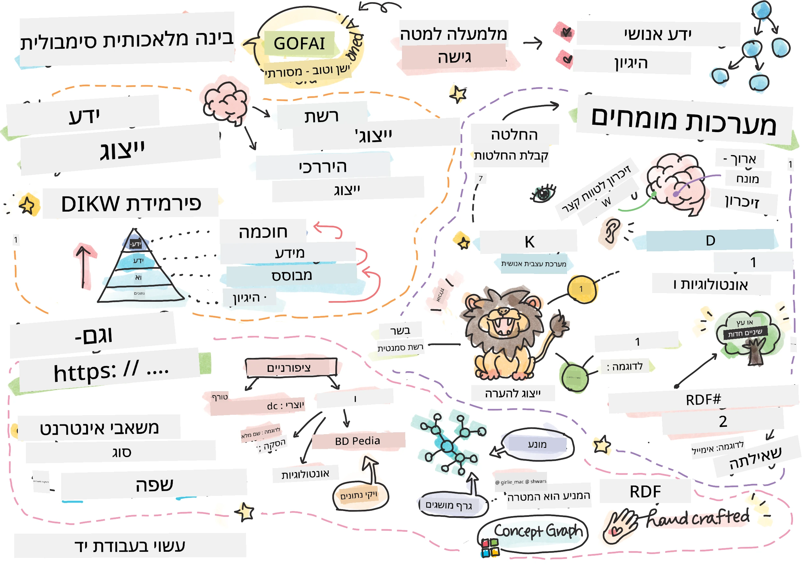
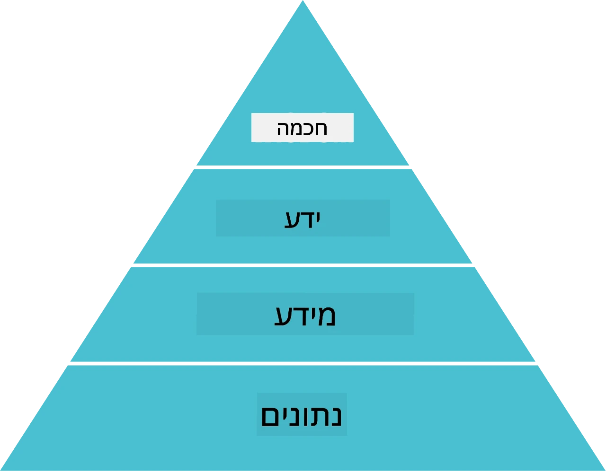
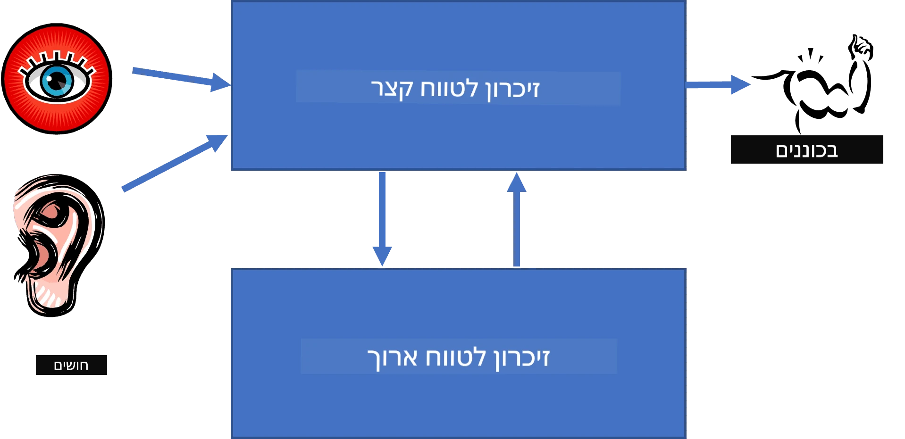
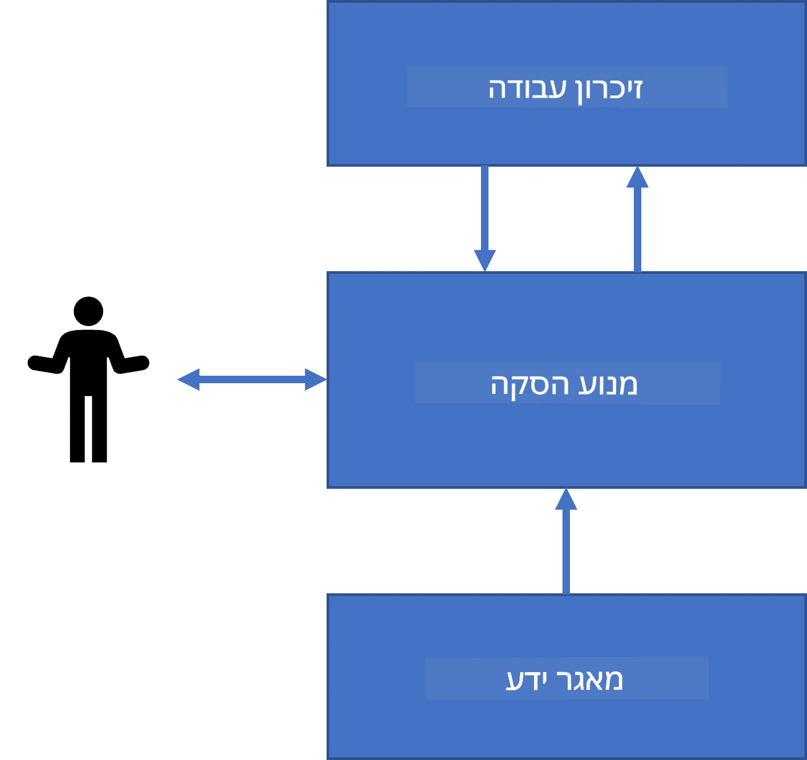
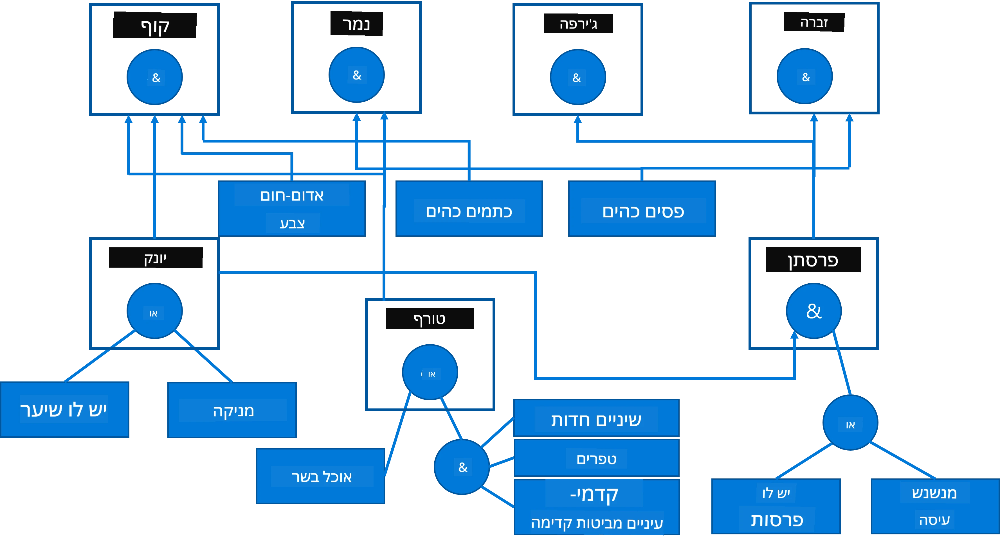
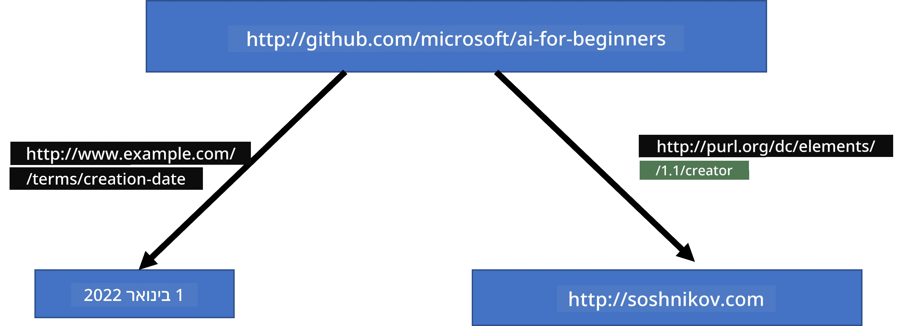
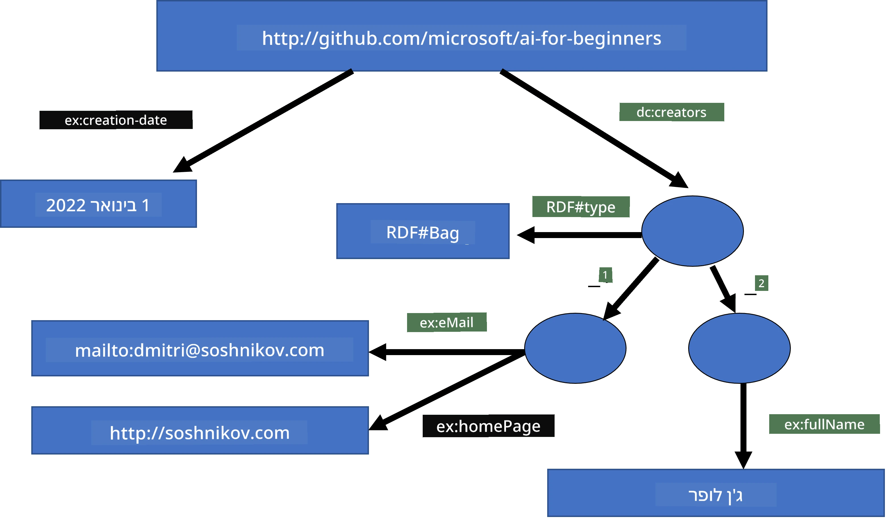
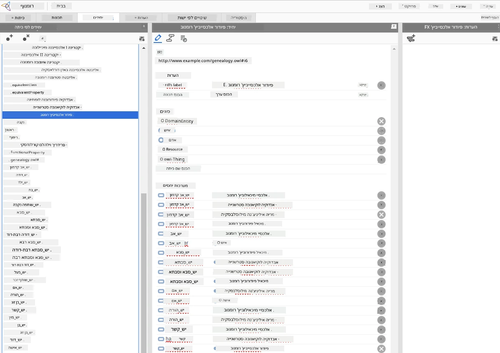

# ייצוג ידע ומערכות מומחים



> סקצ'נוט מאת [Tomomi Imura](https://twitter.com/girlie_mac)

השאיפה לאינטליגנציה מלאכותית מבוססת על חיפוש אחרי ידע, כדי להבין את העולם בדומה לדרך שבה בני אדם עושים זאת. אבל איך ניתן לעשות זאת?

## [מבחן טרום-הרצאה](https://ff-quizzes.netlify.app/en/ai/quiz/3)

בימיה הראשונים של הבינה המלאכותית, הגישה מלמעלה למטה ליצירת מערכות אינטליגנטיות (שנדונה בשיעור הקודם) הייתה נפוצה. הרעיון היה לחלץ את הידע מאנשים לצורת קריאה למכונה כלשהי, ואז להשתמש בו לפתרון אוטומטי של בעיות. גישה זו התבססה על שתי רעיונות מרכזיים:

* ייצוג ידע
* היסק

## ייצוג ידע

מושג חשוב בתחום הבינה המלאכותית הסמלית הוא **ידע**. חשוב להבדיל בין ידע ל*מידע* או ל*נתונים*. לדוגמה, ניתן לומר שספרים מכילים ידע, כי אפשר ללמוד מהם ולהפוך למומחה. עם זאת, מה שהספרים מכילים בפועל נקרא *נתונים*, ועל ידי קריאת הספרים ואינטגרציה של נתונים אלו לתוך מודל עולמנו, אנו ממירים את הנתונים לידע.

> ✅ **ידע** הוא משהו שמכיל בראשנו ומייצג את הבנתנו את העולם. הוא מושג בתהליך **למידה** פעיל, שמשלב חתיכות מידע שאנו מקבלים לתוך המודל הפעיל שלנו של העולם.

בדרך כלל אין לנו הגדרה מדויקת של ידע, אך אנו מתאימים אותו למושגים קשורים אחרים באמצעות [פירמידת DIKW](https://en.wikipedia.org/wiki/DIKW_pyramid). היא מכילה את המושגים הבאים:

* **נתונים** הם משהו המיוצג במדיה פיזית, כגון טקסט כתוב או מילים מדוברות. נתונים קיימים באופן עצמאי מבני אדם וניתן להעבירם בין אנשים.
* **מידע** הוא כיצד אנו מפרשים נתונים בראשנו. לדוגמה, כששומעים את המילה *מחשב*, יש לנו הבנה מסוימת מה זה.
* **ידע** הוא מידע שמשולב לתוך מודל העולם שלנו. לדוגמה, כאשר אנו לומדים מהו מחשב, אנו מתחילים לקבל רעיונות כיצד הוא עובד, כמה הוא עולה, ולמה ניתן להשתמש בו. רשת מושגים זו יוצרת את הידע שלנו.
* **חוכמה** היא עוד רמה בהבנתנו את העולם, והיא מייצגת *מטה-ידע*, לדוגמה מושג כיצד ומתי יש להשתמש בידע.



*תמונה [מוויקיפדיה](https://commons.wikimedia.org/w/index.php?curid=37705247), מאת Longlivetheux - עבודה עצמית, CC BY-SA 4.0*

לכן, בעיית ה**ייצוג ידע** היא למצוא דרך יעילה לייצג ידע בתוך מחשב בצורת נתונים, כדי שניתן יהיה להשתמש בו באופן אוטומטי. זה ניתן לראות כספקטרום:


> תמונה מאת [Dmitry Soshnikov](http://soshnikov.com)

* משמאל יש סוגים פשוטים של ייצוגי ידע שניתן להשתמש בהם ביעילות על ידי מחשבים. הפשוט ביותר הוא אלגוריתמי, שבו ידע מיוצג על ידי תוכנית מחשב. עם זאת, זו אינה הדרך הטובה ביותר לייצג ידע, כי היא לא גמישה. הידע שבראשנו לעיתים אינו אלגוריתמי.
* מימין יש ייצוגים כגון טקסט טבעי. זה החזק ביותר, אך אינו ניתן לשימוש להסקה אוטומטית.

> ✅ חשבו לרגע כיצד אתם מייצגים ידע בראשכם וממירים אותו להערות. האם יש פורמט מסוים שעובד טוב עבורכם להקל על זכירתו?

## סיווג שיטות ייצוג ידע במחשב

ניתן לסווג שיטות שונות לייצוג ידע במחשב לקטגוריות הבאות:

* **ייצוגים ברשת** מתבססים על העובדה שיש לנו רשת של מושגים קשורים בראש. ניתן לנסות לשחזר את אותן רשתות כפול נחשב - מה שנקרא **רשת סמנטית**.

1. **טריפלטים אובייקט-תכונה-ערך** או **זוגות תכונה-ערך**. מכיוון שגרף יכול להיות מיוצג ברשימה של צמתים וקשתות, ניתן לייצג רשת סמנטית על ידי רשימת טריפלטים המכילה אובייקטים, תכונות וערכים. לדוגמה, נבנה את הטריפלטים הבאים על שפות תכנות:

אובייקט | תכונה | ערך  
-------|---------|-------  
Python | הוא | שפה לא טיפוסית  
Python | הומצא על ידי | גוידו ואן רוסום  
Python | תחביר בלוקים | הזחה  
שפה לא טיפוסית | אינה כוללת | הגדרות טיפוס  

> ✅ חשבו כיצד ניתן להשתמש בטריפלטים כדי לייצג סוגים אחרים של ידע.

2. **ייצוגים היררכיים** מדגישים את העובדה שלעתים קרובות אנו יוצרים היררכיה של אובייקטים בראש. לדוגמה, אנו יודעים שהציפור קנרית היא ציפור, ולכל הציפורים יש כנפיים. יש לנו גם מושג לגבי צבע הקנרית ומהירות טיסתה.

   - **ייצוג במסגרת (Frame)** מבוסס על כך שכל אובייקט או מחלקת אובייקטים מיוצגת כ**מסגרת** המכילה **פתחים (slots)**. לפתחים יש ערכי ברירת מחדל אפשריים, הגבלות ערך, או פרוצדורות מאוחסנות שניתן לקרוא להם כדי לקבל את ערך הפתח. כל המסגרות יוצרות היררכיה בדומה להיררכיית אובייקטים בשפות תכנות מונחות עצמים.
   - **תרחישים** הם סוג מיוחד של מסגרות המייצגות מצבים מורכבים שיכולים להתפתח בזמן.

**Python**

פתח | ערך | ערך ברירת מחדל | תחום |  
-----|------|-----------------|--------|  
שם | Python | | |  
הוא- | שפה לא טיפוסית | | |  
מקרה משתנה | | CamelCase | |  
אורך תוכנית | | | 5-5000 שורות |  
תחביר בלוקים | הזחה | | |  

3. **ייצוגים פרוצדורליים** מבוססים על ייצוג ידע כרשימת פעולות שניתן לבצע כאשר מתקיימת תנאי מסוים.
   - חוקי ייצור הם משפטי "אם-אז" המאפשרים להסיק מסקנות. לדוגמה, לרופא יכול להיות חוק שאומר **אם** למטופל יש חום גבוה **או** רמת חלבון C-ריאקטיבי גבוהה בבדיקת דם, **אז** יש לו דלקת. ברגע שמתקיים תנאי כזה, אנו יכולים להסיק דלקת ואז להשתמש בהמשך ההיסק.
   - אלגוריתמים יכולים להיחשב גם כן לצורה נוספת של ייצוג פרוצדורלי, אף על פי שאינם בשימוש ישיר במערכות מבוססות ידע.

4. **לוגיקה** הוצעה במקור על ידי אריסטו כדרך לייצוג ידע אוניברסלי של האדם.
   - לוגיקה פרדיקטיבית היא תיאוריה מתמטית עשירה מדי כדי להיות מחושבת במלואה, ולכן בדרך כלל משתמשים בתת-קבוצה שלה, כגון קלסולי הורן המשמשים בפרולוג.
   - לוגיקה דסקריפטיבית היא משפחה של מערכות לוגיות המשמשות לייצוג והיסק על היררכיות של אובייקטים וייצוגי ידע מופצים כגון *האינטרנט הסמנטי*.

## מערכות מומחים

אחד ההצלחות המוקדמות של הבינה המלאכותית הסמלית היו מה שנקרא **מערכות מומחים** - מערכות מחשב שמטרתן לפעול כמומחים בתחום בעיה מוגבל. הן התבססו על **בסיס ידע** שחולץ מאחד או יותר מומחים אנושיים, והכילו **מנוע היסק** שביצע היסק על בסיס זה.

 |   
---------------------------------------------|------------------------------------------------  
מבנה מפושט של מערכת עצבית אנושית  | ארכיטקטורה של מערכת מבוססת ידע  

מערכות מומחים נבנות בדומה למערכת ההיסק האנושית, הכוללת **זיכרון לטווח קצר** ו**זיכרון לטווח ארוך**. בדומה לכך, במערכות מבוססות ידע אנו מבחינים ברכיבים הבאים:

* **זיכרון בעיה**: מכיל את הידע על הבעיה הנפתרת כרגע, כלומר הטמפרטורה או לחץ הדם של המטופל, האם יש לו דלקת או לא, וכו'. ידע זה נקרא גם **ידע סטטי**, כי הוא מכיל תמונת מצב של מה שאנו יודעים כרגע על הבעיה - מה שמכונה *מצב הבעיה*.
* **בסיס ידע**: מייצג ידע לטווח ארוך בתחום בעיה. הוא חולץ באופן ידני ממומחים אנושיים, ואינו משתנה בין ייעוצים. מכיוון שהוא מאפשר לנו לנוע בין מצבי בעיה שונים, הוא גם נקרא **ידע דינמי**.
* **מנוע היסק**: מארגן את כל תהליך החיפוש במרחב מצבי הבעיה, שואל שאלות למשתמש במידת הצורך. הוא גם אחראי למצוא את החוקים המתאימים שיבוצעו בכל מצב.

לדוגמה, נשקול את מערכת המומחה הבאה לקביעת חיה בהתבסס על התכונות הפיזיות שלה:



> תמונה מאת [Dmitry Soshnikov](http://soshnikov.com)

דיאגרמה זו נקראת **עץ AND-OR**, והיא ייצוג גרפי של קבוצת חוקי יצור. ציור העץ שימושי בתחילת תהליך חילוץ הידע מהמומחה. לייצוג הידע במחשב נוח יותר להשתמש בחוקים:

```
IF the animal eats meat
OR (animal has sharp teeth
    AND animal has claws
    AND animal has forward-looking eyes
) 
THEN the animal is a carnivore
```
  
ניתן להבחין שכל תנאי בצד שמאל של החוק והפעולה הם בעצם טריפלטים של אובייקט-תכונה-ערך (OAV). **זיכרון העבודה** מכיל את מערך הטריפלטים המתאימים לבעיה הנפתרת כרגע. **מנוע החוקים** מחפש חוקים שהתנאי בהם מתקיים ומיישם אותם, תוך הוספת טריפלט נוסף לזיכרון העבודה.

> ✅ כתבו את עץ ה-AND-OR שלכם בנושא שאתם אוהבים!

### היסק קדימה לעומת היסק אחורה

התהליך שתואר לעיל נקרא **היסק קדימה**. הוא מתחיל עם נתונים ראשוניים על הבעיה הזמינים בזיכרון העבודה, ואז מבצע את לולאת ההיסק הבאה:

1. אם התכונה המטרה קיימת בזיכרון העבודה - עצור והצע את התוצאה  
2. חפש את כל החוקים שהתנאי שלהם מתקיים כרגע - קבל **קבוצת קונפליקט** של חוקים.  
3. בצע **פתרון קונפליקט** - בחר חוק אחד שיופעל בשלב זה. קיימות אסטרטגיות שונות לפתרון הקונפליקט:  
   - בחר את החוק הראשון המתאים בבסיס הידע  
   - בחר חוק אקראי  
   - בחר חוק *יותר ספציפי*, כלומר העונה על הכי הרבה תנאים ב-"צד שמאל"  
4. החל את החוק שנבחר והכנס חתיכת ידע חדשה למצב הבעיה  
5. חזור לשלב 1.  

עם זאת, במקרים מסוימים נרצה להתחיל עם ידע ריק על הבעיה, ולשאול שאלות שיעזרו לנו להגיע למסקנה. לדוגמה, באבחון רפואי, בדרך כלל איננו מבצעים את כל הבדיקות הרפואיות מראש לפני תחילת האבחון. אנו מעדיפים לבצע בדיקות כאשר יש צורך בקבלת החלטה.

תהליך זה ניתן למידול באמצעות **היסק אחורה**. הוא מונחה על ידי **המטרה** - ערך התכונה שאנו רוצים למצוא:

1. בחר את כל החוקים שיכולים לתת את ערך המטרה (כלומר עם המטרה בצד ימין) - קבוצת קונפליקט  
2. אם אין חוקים לערך זה, או שיש חוק שאומר שיש לשאול את הערך מהמשתמש - שאל אותו, אחרת:  
3. השתמש באסטרטגיית פתרון הקונפליקט כדי לבחור חוק אחד כאסטרטיבה - ננסה להוכיח אותו  
4. חזור רקורסיבית על כל התכונות בצד שמאל של החוק, בניסיון להוכיח אותן כמטרות  
5. אם בתהליך כלשהו התהליך נכשל - השתמש בחוק אחר בשלב 3.  

> ✅ באילו מצבים היסק קדימה מתאים יותר? ומה לגבי היסק אחורה?

### יישום מערכות מומחים

ניתן לממש מערכות מומחים באמצעות כלים שונים:

* תכנות ישיר בשפת תכנות רמה גבוהה. זו אינה רעיון טוב במיוחד, כי היתרון המרכזי של מערכת מבוססת ידע הוא שהידע נפרד מההיסק, וסביר שמומחה בתחום הבעיה יוכל לכתוב חוקים בלי להבין את פרטי תהליך ההיסק.  
* שימוש ב**קליפה של מערכות מומחים**, כלומר מערכת המיועדת ספציפית להתמלא בידע באמצעות שפת ייצוג ידע כלשהי.

## ✍️ תרגיל: היסק על חיות

ראו את [Animals.ipynb](https://github.com/microsoft/AI-For-Beginners/blob/main/lessons/2-Symbolic/Animals.ipynb) כדוגמה ליישום מערכת מומחים בהיסק קדימה ואחורה.

> **הערה**: דוגמה זו פשוטה למדי, ומייצגת רק את הרעיון כיצד נראית מערכת מומחים. עם תחילת יצירת מערכת כזו, תבחינו בהתנהגות *חכמה* רק כאשר מגיעים למספר חוקים מסוים, סביב 200+. בנקודה מסוימת, החוקים הופכים מורכבים מדי כדי לזכור את כולם, ובנקודה זו עשויה להתעורר השאלה מדוע המערכת מקבלת החלטות מסוימות. יחד עם זאת, אחת התכונות החשובות של מערכות מבוססות ידע היא שתמיד ניתן *להסביר* בדיוק איך התקבלה כל החלטה.

## אונטולוגיות והרשת הסמנטית

בסוף המאה ה-20 הייתה יוזמה להשתמש בייצוג ידע כדי לתייג משאבי אינטרנט, כך שיהיה ניתן למצוא משאבים המתאימים לשאילתות מאוד ספציפיות. יוזמה זו נקראה **הרשת הסמנטית**, והיא התבססה על מספר רעיונות:

- ייצוג ידע מיוחד מבוסס על **[לוגיקות תיאוריות](https://en.wikipedia.org/wiki/Description_logic)** (DL). הוא דומה לייצוג במסגרת, כי בונה היררכיית אובייקטים עם תכונות, אך יש לו סמנטיקה לוגית פורמלית והיסק. קיימת משפחה של DLs שמתאזנת בין הבעה ומורכבות אלגוריתמית של היסק.
- ייצוג ידע מבוזר, שבו כל מושג מיוצג על ידי מזהה URI גלובלי, מה שמאפשר ליצור היררכיות ידע המשתרעות ברחבי האינטרנט.
- משפחה של שפות מבוססות XML לתיאור ידע: RDF (Resource Description Framework), RDFS (RDF Schema), OWL (Ontology Web Language).

מושג מרכזי ברשת הסמנטית הוא מושג של **אונטולוגיה**. הוא מתייחס למפרט מפורש של תחום בעיה באמצעות ייצוג ידע פורמלי כלשהו. האונטולוגיה הפשוטה ביותר יכולה להיות רק היררכיה של עצמים בתחום הבעיה, אך אונטולוגיות מורכבות יותר יכללו חוקים שניתן להשתמש בהם להסקה.

ברשת הסמנטית, כל הייצוגים מבוססים על משולשים. כל אובייקט וכל יחס מזוהים באופן ייחודי על ידי ה-URI. לדוגמה, אם נרצה לציין את העובדה שהקוריקולום ל-AI זה פותח על ידי דמיטרי סושניקוב ב-1 בינואר 2022 - הנה המשולשים שנוכל להשתמש בהם:



```
http://github.com/microsoft/ai-for-beginners http://www.example.com/terms/creation-date “Jan 1, 2022”
http://github.com/microsoft/ai-for-beginners http://purl.org/dc/elements/1.1/creator http://soshnikov.com
```

> ✅ כאן `http://www.example.com/terms/creation-date` ו-`http://purl.org/dc/elements/1.1/creator` הם URI מוכרים ומקובלים אוניברסלית להבעת המושגים של *יוצר* ו-*תאריך יצירה*.

במקרה מורכב יותר, אם נרצה להגדיר רשימת יוצרים, נוכל להשתמש במבני נתונים המוגדרים ב-RDF.



> הדיאגרמות למעלה מאת [דמיטרי סושניקוב](http://soshnikov.com)

ההתקדמות בבניית הרשת הסמנטית הועכבה במידה מסוימת על ידי הצלחת מנועי החיפוש וטכניקות עיבוד שפה טבעית, המאפשרות חילוץ נתונים מובנים מטקסט. עם זאת, בתחומים מסוימים עדיין קיימות מאמצים משמעותיים לשמירה על אונטולוגיות ובסיסי ידע. כמה פרויקטים שכדאי לציין:

* [WikiData](https://wikidata.org/) היא אוסף של בסיסי ידע קריאים למכונה המקושרים לויקיפדיה. רוב הנתונים נאספים מתוך *תיבות מידע* (InfoBoxes) בויקיפדיה, חתיכות תוכן מובנה בתוך עמודי ויקיפדיה. ניתן [לבצע שאילתה](https://query.wikidata.org/) בויקידטה בשפת SPARQL, שפת שאילתות מיוחדת לרשת הסמנטית. הנה שאילתה לדוגמה שמציגה את צבעי העיניים הפופולריים ביותר בקרב בני אדם:

```sparql
#defaultView:BubbleChart
SELECT ?eyeColorLabel (COUNT(?human) AS ?count)
WHERE
{
  ?human wdt:P31 wd:Q5.       # human instance-of homo sapiens
  ?human wdt:P1340 ?eyeColor. # human eye-color ?eyeColor
  SERVICE wikibase:label { bd:serviceParam wikibase:language "en". }
}
GROUP BY ?eyeColorLabel
```

* [DBpedia](https://www.dbpedia.org/) היא מאמץ נוסף דומה ל-WikiData.

> ✅ אם אתם רוצים להתנסות בבניית אונטולוגיות משלכם, או לפתוח אונטולוגיות קיימות, יש עורך אונטולוגיות גרפי מעולה בשם [Protégé](https://protege.stanford.edu/). הורידו אותו, או השתמשו בו אונליין.



*עורך Web Protégé פתוח עם אונטולוגיית משפחת רומנוב. צילום מסך מאת דמיטרי סושניקוב*

## ✍️ תרגיל: אונטולוגיית משפחה

ראו את [FamilyOntology.ipynb](https://github.com/Ezana135/AI-For-Beginners/blob/main/lessons/2-Symbolic/FamilyOntology.ipynb) כדוגמה לשימוש בטכניקות רשת סמנטית להסקת מסקנות על מערכות יחסים במשפחה. ניקח עץ משפחה המיוצג בפורמט GEDCOM נפוץ ואונטולוגיה של מערכות יחסים משפחתיות ונבנה גרף של כל מערכות היחסים במשפחה עבור קבוצת פרטים נתונה.

## Microsoft Concept Graph

לרוב, אונטולוגיות יוצרות בזהירות ביד. עם זאת, אפשר גם **לכרות** אונטולוגיות מנתונים לא מובנים, למשל מתוך טקסטים בשפה טבעית.

ניסיון כזה נעשה על ידי Microsoft Research, והתוצאה היא [Microsoft Concept Graph](https://blogs.microsoft.com/ai/microsoft-researchers-release-graph-that-helps-machines-conceptualize/?WT.mc_id=academic-77998-cacaste).

זהו אוסף גדול של ישויות הממוזגות יחד באמצעות קשר הירושה `is-a`. הוא מאפשר לענות על שאלות כמו "מהי מייקרוסופט?" - התשובה תהיה משהו כמו "חברה עם הסתברות של 0.87, ומותג עם הסתברות של 0.75".

הגרף זמין כ-REST API, או כקובץ טקסט גדול שניתן להוריד ומכיל את כל זוגות הישויות.

## ✍️ תרגיל: גרף מושגים

נסו את הפנקס [MSConceptGraph.ipynb](https://github.com/microsoft/AI-For-Beginners/blob/main/lessons/2-Symbolic/MSConceptGraph.ipynb) כדי לראות כיצד ניתן להשתמש ב-Microsoft Concept Graph כדי לקבץ מאמרי חדשות למספר קטגוריות.

## סיכום

בעידן המודרני, AI נתפס לעיתים כסינונימי ל-*למידת מכונה* או רשתות *עצביות*. עם זאת, גם בני אדם מפגינים הסקה מפורשת, שהיא משהו כרגע שאינו מטופל על ידי רשתות עצביות. בפרויקטים בעולם האמיתי, הסקה מפורשת עדיין משמשת לביצוע משימות הדורשות הסברים או היכולת לשנות את התנהגות המערכת בצורה מבוקרת.

## 🚀 אתגר

בפנקס האונטולוגיה למשפחה המשויך לשיעור הזה יש הזדמנות להתנסות במערכות יחסים משפחתיות אחרות. נסו לגלות קשרים חדשים בין אנשים בעץ המשפחה.

## [בחן לאחר ההרצאה](https://ff-quizzes.netlify.app/en/ai/quiz/4)

## סקירה ולמידה עצמית

עשו מחקר באינטרנט כדי לגלות תחומים שבהם בני אדם ניסו לכמת ולקודד ידע. שימו לב למדרג בלום, וחזרו בהיסטוריה כדי ללמוד כיצד אנשים ניסו להבין את עולמם. חקרו את עבודתו של לינאוס ליצירת טקסונומיה של אורגניזמים, והתבוננו בדרך שבה דמיטרי מנדלייב יצר שיטה לתיאור וקיבוץ יסודות כימיים. אילו דוגמאות מעניינות אחרות תוכלו למצוא?

**משימה**: [בנו אונטולוגיה](assignment.md)

---

<!-- CO-OP TRANSLATOR DISCLAIMER START -->
**הצהרת כתב ויתור**:  
מסמך זה תורגם באמצעות שירות תרגום מבוסס בינה מלאכותית [Co-op Translator](https://github.com/Azure/co-op-translator). למרות שאנו שואפים לדייק ככל האפשר, יש לקחת בחשבון שתרגומים אוטומטיים עלולים להכיל שגיאות או אי-דיוקים. המסמך המקורי בשפת המקור שלו אמור להיחשב כמקור המהימן והמחייב. למידע קריטי מומלץ להשתמש בתרגום מקצועי אנושי. איננו אחראים על אי-הבנות או פרשנויות שגויות הנובעות משימוש בתרגום זה.
<!-- CO-OP TRANSLATOR DISCLAIMER END -->