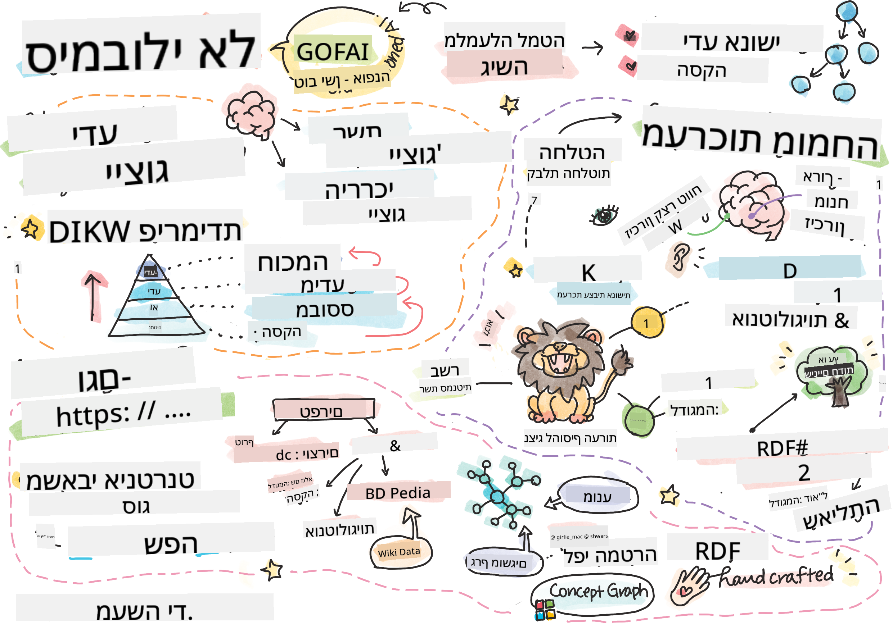

<!--
CO_OP_TRANSLATOR_METADATA:
{
  "original_hash": "98c5222ff9556b55223fed2337145e18",
  "translation_date": "2025-08-28T19:39:59+00:00",
  "source_file": "lessons/2-Symbolic/README.md",
  "language_code": "he"
}
-->
# ייצוג ידע ומערכות מומחה



> איור מאת [Tomomi Imura](https://twitter.com/girlie_mac)

החיפוש אחר בינה מלאכותית מבוסס על חיפוש ידע, כדי להבין את העולם באופן דומה לאופן שבו בני אדם עושים זאת. אבל איך ניתן לעשות זאת?

## [שאלון לפני ההרצאה](https://ff-quizzes.netlify.app/en/ai/quiz/3)

בימיה הראשונים של הבינה המלאכותית, הגישה מלמעלה-למטה ליצירת מערכות חכמות (שנדונה בשיעור הקודם) הייתה פופולרית. הרעיון היה להוציא את הידע מבני אדם לצורה שניתנת לקריאה על ידי מכונה, ואז להשתמש בו לפתרון בעיות באופן אוטומטי. גישה זו התבססה על שני רעיונות מרכזיים:

* ייצוג ידע  
* הסקת מסקנות  

## ייצוג ידע

אחד המושגים החשובים ב-AI סמלי הוא **ידע**. חשוב להבדיל בין ידע לבין *מידע* או *נתונים*. לדוגמה, ניתן לומר שספרים מכילים ידע, כי אפשר ללמוד מהם ולהפוך למומחה. עם זאת, מה שספרים מכילים נקרא למעשה *נתונים*, וכשקוראים ספרים ומשלבים את הנתונים הללו במודל העולם שלנו, אנו ממירים את הנתונים לידע.

> ✅ **ידע** הוא משהו שנמצא בראש שלנו ומייצג את ההבנה שלנו על העולם. הוא נרכש בתהליך **למידה** פעיל, שמשלב פיסות מידע שאנו מקבלים לתוך המודל הפעיל שלנו על העולם.

לעיתים קרובות, איננו מגדירים ידע באופן מחמיר, אלא מיישרים אותו עם מושגים קשורים באמצעות [פירמידת DIKW](https://en.wikipedia.org/wiki/DIKW_pyramid). היא כוללת את המושגים הבאים:

* **נתונים** הם משהו שמיוצג במדיה פיזית, כמו טקסט כתוב או מילים מדוברות. נתונים קיימים באופן עצמאי מבני אדם וניתן להעבירם בין אנשים.  
* **מידע** הוא האופן שבו אנו מפרשים נתונים בראש שלנו. לדוגמה, כשאנו שומעים את המילה *מחשב*, יש לנו הבנה מסוימת של מה זה.  
* **ידע** הוא מידע שמשולב במודל העולם שלנו. לדוגמה, לאחר שלמדנו מהו מחשב, יש לנו רעיונות על איך הוא עובד, כמה הוא עולה, ולמה הוא יכול לשמש. רשת זו של מושגים קשורים יוצרת את הידע שלנו.  
* **חוכמה** היא רמה נוספת של הבנת העולם, והיא מייצגת *מטא-ידע*, למשל הבנה מתי ואיך להשתמש בידע.  

*תמונה [מוויקיפדיה](https://commons.wikimedia.org/w/index.php?curid=37705247), מאת Longlivetheux - עבודה מקורית, CC BY-SA 4.0*

לכן, הבעיה של **ייצוג ידע** היא למצוא דרך יעילה לייצג ידע בתוך מחשב בצורה של נתונים, כדי שיהיה ניתן להשתמש בו באופן אוטומטי. ניתן לראות זאת כספקטרום:


> תמונה מאת [Dmitry Soshnikov](http://soshnikov.com)

* בצד השמאלי, ישנם סוגים פשוטים מאוד של ייצוגי ידע שניתן להשתמש בהם ביעילות על ידי מחשבים. הפשוט ביותר הוא אלגוריתמי, כאשר הידע מיוצג על ידי תוכנית מחשב. עם זאת, זו אינה הדרך הטובה ביותר לייצג ידע, כי היא אינה גמישה. הידע בראש שלנו הוא לעיתים קרובות לא-אלגוריתמי.  
* בצד הימני, ישנם ייצוגים כמו טקסט טבעי. זהו הייצוג החזק ביותר, אך לא ניתן להשתמש בו להסקת מסקנות אוטומטית.  

> ✅ חשבו לרגע איך אתם מייצגים ידע בראש שלכם וממירים אותו להערות. האם יש פורמט מסוים שעובד עבורכם טוב יותר לשימור המידע?

## סיווג ייצוגי ידע במחשבים

ניתן לסווג שיטות שונות לייצוג ידע במחשבים לקטגוריות הבאות:

* **ייצוגי רשת** מבוססים על העובדה שיש לנו רשת של מושגים קשורים בראש שלנו. ניתן לנסות לשחזר את אותן רשתות כגרף בתוך מחשב - מה שנקרא **רשת סמנטית**.

1. **שלשות אובייקט-תכונה-ערך** או **זוגות תכונה-ערך**. מכיוון שניתן לייצג גרף בתוך מחשב כרשימת צמתים וקשתות, ניתן לייצג רשת סמנטית כרשימת שלשות, המכילה אובייקטים, תכונות וערכים. לדוגמה, נבנה את השלשות הבאות על שפות תכנות:

אובייקט | תכונה | ערך  
--------|--------|------  
Python | is | Untyped-Language  
Python | invented-by | Guido van Rossum  
Python | block-syntax | indentation  
Untyped-Language | doesn't have | type definitions  

> ✅ חשבו איך ניתן להשתמש בשלשות לייצוג סוגים אחרים של ידע.

2. **ייצוגים היררכיים** מדגישים את העובדה שאנו לעיתים קרובות יוצרים היררכיה של אובייקטים בראש שלנו. לדוגמה, אנו יודעים שקנרית היא ציפור, ולכל הציפורים יש כנפיים. יש לנו גם מושג על הצבע של קנרית ומהירות התעופה שלה.

   - **ייצוג מסגרות** מבוסס על ייצוג כל אובייקט או מחלקת אובייקטים כ**מסגרת** המכילה **חריצים**. לחריצים יכולים להיות ערכי ברירת מחדל, מגבלות ערכים, או פרוצדורות מאוחסנות שניתן לקרוא להן כדי לקבל את הערך של חריץ. כל המסגרות יוצרות היררכיה דומה להיררכיית אובייקטים בשפות תכנות מונחות עצמים.  
   - **תסריטים** הם סוג מיוחד של מסגרות שמייצגים מצבים מורכבים שיכולים להתפתח לאורך זמן.

**Python**

חריץ | ערך | ערך ברירת מחדל | טווח  
------|------|----------------|------  
שם | Python | |  
Is-A | Untyped-Language | |  
סוג משתנה | | CamelCase |  
אורך תוכנית | | | 5-5000 שורות  
תחביר בלוק | Indent | |  

3. **ייצוגים פרוצדורליים** מבוססים על ייצוג ידע כרשימת פעולות שניתן לבצע כאשר מתרחש תנאי מסוים.  
   - כללי ייצור הם משפטי if-then שמאפשרים לנו להסיק מסקנות. לדוגמה, רופא יכול להחזיק כלל שאומר ש**אם** למטופל יש חום גבוה **או** רמת חלבון C-תגובתי גבוהה בבדיקת דם **אז** יש לו דלקת. ברגע שאנו נתקלים באחד התנאים, אנו יכולים להסיק מסקנה על דלקת, ואז להשתמש בהסקה זו להמשך.  
   - אלגוריתמים יכולים להיחשב כסוג נוסף של ייצוג פרוצדורלי, אם כי הם כמעט אף פעם לא משמשים ישירות במערכות מבוססות ידע.  

4. **לוגיקה** הוצעה במקור על ידי אריסטו כדרך לייצג ידע אנושי אוניברסלי.  
   - לוגיקה פרדיקטיבית כתיאוריה מתמטית עשירה מדי מכדי להיות ניתנת לחישוב, ולכן בדרך כלל משתמשים בתת-קבוצה שלה, כמו פסוקי הורן המשמשים ב-Prolog.  
   - לוגיקה תיאורית היא משפחה של מערכות לוגיות המשמשות לייצוג והסקה על היררכיות של אובייקטים בייצוגי ידע מבוזרים כמו *הרשת הסמנטית*.  

## מערכות מומחה

אחד ההישגים המוקדמים של AI סמלי היו מה שנקרא **מערכות מומחה** - מערכות מחשב שתוכננו לפעול כמומחה בתחום בעיה מוגבל. הן התבססו על **בסיס ידע** שהופק ממומחים אנושיים, וכללו **מנוע הסקה** שביצע הסקה על בסיסו.

 |   
---------------------------------------------|---------------------------------------------  
מבנה מפושט של מערכת עצבים אנושית | ארכיטקטורה של מערכת מבוססת ידע  

מערכות מומחה נבנות בדומה למערכת ההסקה האנושית, הכוללת **זיכרון לטווח קצר** ו**זיכרון לטווח ארוך**. באופן דומה, במערכות מבוססות ידע אנו מבחינים בין הרכיבים הבאים:

* **זיכרון בעיה**: מכיל את הידע על הבעיה הנוכחית, למשל הטמפרטורה או לחץ הדם של מטופל, האם יש לו דלקת או לא, וכו'. ידע זה נקרא גם **ידע סטטי**, כי הוא מכיל תמונת מצב של מה שאנו יודעים כרגע על הבעיה - מה שנקרא *מצב הבעיה*.  
* **בסיס ידע**: מייצג ידע לטווח ארוך על תחום הבעיה. הוא מופק ידנית ממומחים אנושיים, ואינו משתנה מייעוץ לייעוץ. מכיוון שהוא מאפשר לנו לנווט ממצב בעיה אחד לאחר, הוא נקרא גם **ידע דינמי**.  
* **מנוע הסקה**: מתזמר את כל תהליך החיפוש במרחב מצבי הבעיה, שואל שאלות מהמשתמש בעת הצורך. הוא גם אחראי על מציאת הכללים הנכונים ליישום בכל מצב.  

לדוגמה, נבחן את מערכת המומחה הבאה לקביעת סוג בעל חיים על בסיס מאפייניו הפיזיים:


> תמונה מאת [Dmitry Soshnikov](http://soshnikov.com)

תרשים זה נקרא **עץ AND-OR**, והוא ייצוג גרפי של קבוצת כללי ייצור. ציור עץ הוא שימושי בתחילת תהליך הפקת הידע מהמומחה. לייצוג הידע בתוך המחשב נוח יותר להשתמש בכללים:

```
IF the animal eats meat
OR (animal has sharp teeth
    AND animal has claws
    AND animal has forward-looking eyes
) 
THEN the animal is a carnivore
```

ניתן להבחין שכל תנאי בצד השמאלי של הכלל והפעולה הם למעשה שלשות אובייקט-תכונה-ערך (OAV). **זיכרון עבודה** מכיל את קבוצת השלשות OAV שמתאימות לבעיה הנוכחית. **מנוע הכללים** מחפש כללים שתנאיהם מתקיימים ומיישם אותם, מוסיף שלשה חדשה לזיכרון העבודה.

> ✅ כתבו עץ AND-OR משלכם בנושא שמעניין אתכם!

### הסקה קדימה מול הסקה אחורה

התהליך שתואר לעיל נקרא **הסקה קדימה**. הוא מתחיל עם נתונים ראשוניים על הבעיה הקיימים בזיכרון העבודה, ואז מבצע את לולאת ההסקה הבאה:

1. אם התכונה המבוקשת קיימת בזיכרון העבודה - עצרו וספקו את התוצאה.  
2. חפשו את כל הכללים שתנאיהם מתקיימים כרגע - קבלו **קבוצת קונפליקט** של כללים.  
3. בצעו **פתרון קונפליקט** - בחרו כלל אחד שיופעל בשלב זה. יכולות להיות אסטרטגיות שונות לפתרון קונפליקט:  
   - בחרו את הכלל הראשון שניתן ליישום בבסיס הידע.  
   - בחרו כלל אקראי.  
   - בחרו כלל *ספציפי יותר*, כלומר כזה שעונה על הכי הרבה תנאים בצד השמאלי (LHS).  
4. יישמו את הכלל שנבחר והוסיפו פיסת ידע חדשה למצב הבעיה.  
5. חזרו לשלב 1.  

עם זאת, במקרים מסוימים נרצה להתחיל עם ידע ריק על הבעיה, ולשאול שאלות שיעזרו לנו להגיע למסקנה. לדוגמה, באבחון רפואי, בדרך כלל איננו מבצעים את כל הבדיקות הרפואיות מראש לפני תחילת האבחון. אנו מעדיפים לבצע בדיקות כאשר יש צורך בקבלת החלטה.

תהליך זה ניתן לדמות באמצעות **הסקה אחורה**. הוא מונע על ידי **מטרה** - ערך התכונה שאנו מחפשים:

1. בחרו את כל הכללים שיכולים לספק לנו את ערך המטרה (כלומר, עם המטרה בצד הימני (RHS)) - קבוצת קונפליקט.  
2. אם אין כללים לתכונה זו, או שיש כלל שאומר שעלינו לשאול את המשתמש את הערך - שאלו אותו, אחרת:  
3. השתמשו באסטרטגיית פתרון קונפליקט כדי לבחור כלל אחד שישמש כ*השערה* - ננסה להוכיח אותו.  
4. חזרו על התהליך באופן רקורסיבי עבור כל התכונות בצד השמאלי של הכלל, בניסיון להוכיח אותן כמטרות.  
5. אם בשלב כלשהו התהליך נכשל - השתמשו בכלל אחר בשלב 3.  

> ✅ באילו מצבים הסקה קדימה מתאימה יותר? ומה לגבי הסקה אחורה?

### יישום מערכות מומחה

ניתן ליישם מערכות מומחה באמצעות כלים שונים:

* תכנות ישיר בשפת תכנות ברמה גבוהה. זו אינה הבחירה הטובה ביותר, כי היתרון המרכזי של מערכת מבוססת ידע הוא שהידע מופרד מההסקה, ובאופן פוטנציאלי מומחה בתחום הבעיה אמור להיות מסוגל לכתוב כללים מבלי להבין את פרטי תהליך ההסקה.  
* שימוש ב**מעטפת מערכות מומחה**, כלומר מערכת שתוכננה במיוחד כדי להיות מאוכלסת בידע באמצעות שפת ייצוג ידע מסוימת.  

## ✍️ תרגיל: הסקת בעלי חיים

ראו [Animals.ipynb](https://github.com/microsoft/AI-For-Beginners/blob/main/lessons/2-Symbolic/Animals.ipynb) לדוגמה של יישום מערכת מומחה עם הסקה קדימה ואחורה.
> **הערה**: דוגמה זו היא די פשוטה, והיא רק נותנת מושג כיצד נראה מערכת מומחה. ברגע שתתחיל ליצור מערכת כזו, תבחין בהתנהגות *אינטליגנטית* רק כאשר תגיע למספר מסוים של חוקים, בסביבות 200+. בשלב מסוים, החוקים הופכים להיות מורכבים מדי מכדי לזכור את כולם, ובשלב זה ייתכן שתתחיל לתהות מדוע המערכת מקבלת החלטות מסוימות. עם זאת, המאפיין החשוב של מערכות מבוססות ידע הוא שתמיד ניתן *להסביר* בדיוק כיצד התקבלו ההחלטות.
## אונטולוגיות והרשת הסמנטית

בסוף המאה ה-20 הייתה יוזמה להשתמש בייצוג ידע כדי להוסיף הערות למשאבים באינטרנט, כך שיהיה אפשר למצוא משאבים שמתאימים לשאילתות מאוד ספציפיות. יוזמה זו נקראה **הרשת הסמנטית**, והיא התבססה על מספר רעיונות:

- ייצוג ידע מיוחד המבוסס על **[לוגיקות תיאוריות](https://en.wikipedia.org/wiki/Description_logic)** (DL). זה דומה לייצוג ידע מבוסס מסגרות, מכיוון שהוא בונה היררכיה של אובייקטים עם תכונות, אך יש לו סמנטיקה לוגית פורמלית והסקה. יש משפחה שלמה של לוגיקות תיאוריות שמאזנות בין רמת הביטוי לבין המורכבות האלגוריתמית של ההסקה.
- ייצוג ידע מבוזר, שבו כל המושגים מיוצגים על ידי מזהה URI גלובלי, מה שמאפשר ליצור היררכיות ידע שחוצות את האינטרנט.
- משפחה של שפות מבוססות XML לתיאור ידע: RDF (מסגרת תיאור משאבים), RDFS (סכמת RDF), OWL (שפת האונטולוגיה של הרשת).

מושג מרכזי ברשת הסמנטית הוא מושג ה-**אונטולוגיה**. הוא מתייחס למפרט מפורש של תחום בעיה באמצעות ייצוג ידע פורמלי כלשהו. האונטולוגיה הפשוטה ביותר יכולה להיות רק היררכיה של אובייקטים בתחום הבעיה, אך אונטולוגיות מורכבות יותר יכללו חוקים שניתן להשתמש בהם להסקה.

ברשת הסמנטית, כל הייצוגים מבוססים על שלשות. כל אובייקט וכל קשר מזוהים באופן ייחודי על ידי URI. לדוגמה, אם נרצה לציין את העובדה שתוכנית הלימודים הזו ב-AI פותחה על ידי דמיטרי סושניקוב ב-1 בינואר 2022 - הנה השלשות שנוכל להשתמש בהן:


```
http://github.com/microsoft/ai-for-beginners http://www.example.com/terms/creation-date “Jan 13, 2007”
http://github.com/microsoft/ai-for-beginners http://purl.org/dc/elements/1.1/creator http://soshnikov.com
```

> ✅ כאן `http://www.example.com/terms/creation-date` ו-`http://purl.org/dc/elements/1.1/creator` הם URI מוכרים ומקובלים אוניברסלית כדי לבטא את המושגים של *יוצר* ו-*תאריך יצירה*.

במקרה מורכב יותר, אם נרצה להגדיר רשימה של יוצרים, נוכל להשתמש במבני נתונים מסוימים המוגדרים ב-RDF.


> הדיאגרמות למעלה מאת [דמיטרי סושניקוב](http://soshnikov.com)

ההתקדמות בבניית הרשת הסמנטית הואטה במידה מסוימת בשל הצלחת מנועי החיפוש וטכניקות עיבוד שפה טבעית, שמאפשרות חילוץ נתונים מובנים מטקסט. עם זאת, בתחומים מסוימים עדיין יש מאמצים משמעותיים לשמר אונטולוגיות ובסיסי ידע. כמה פרויקטים שכדאי לציין:

* [WikiData](https://wikidata.org/) הוא אוסף של בסיסי ידע קריאים למכונה הקשורים לוויקיפדיה. רוב הנתונים מופקים מתוך *תיבות מידע* בוויקיפדיה, שהן חלקים של תוכן מובנה בתוך דפי ויקיפדיה. ניתן [לשאול](https://query.wikidata.org/) את ויקידאטה באמצעות SPARQL, שפת שאילתות מיוחדת לרשת הסמנטית. הנה דוגמה לשאילתה שמציגה את צבעי העיניים הפופולריים ביותר בקרב בני אדם:

```sparql
#defaultView:BubbleChart
SELECT ?eyeColorLabel (COUNT(?human) AS ?count)
WHERE
{
  ?human wdt:P31 wd:Q5.       # human instance-of homo sapiens
  ?human wdt:P1340 ?eyeColor. # human eye-color ?eyeColor
  SERVICE wikibase:label { bd:serviceParam wikibase:language "en". }
}
GROUP BY ?eyeColorLabel
```

* [DBpedia](https://www.dbpedia.org/) הוא מאמץ נוסף הדומה ל-WikiData.

> ✅ אם תרצו להתנסות בבניית אונטולוגיות משלכם, או בפתיחת אונטולוגיות קיימות, יש עורך אונטולוגיות חזותי מצוין בשם [Protégé](https://protege.stanford.edu/). ניתן להוריד אותו או להשתמש בו אונליין.


*עורך Web Protégé פתוח עם אונטולוגיית משפחת רומנוב. צילום מסך מאת דמיטרי סושניקוב*

## ✍️ תרגיל: אונטולוגיית משפחה

ראו [FamilyOntology.ipynb](https://github.com/Ezana135/AI-For-Beginners/blob/main/lessons/2-Symbolic/FamilyOntology.ipynb) לדוגמה של שימוש בטכניקות הרשת הסמנטית כדי להסיק על קשרי משפחה. ניקח עץ משפחה המיוצג בפורמט GEDCOM נפוץ ואונטולוגיה של קשרי משפחה, ונבנה גרף של כל קשרי המשפחה עבור קבוצת אנשים נתונה.

## גרף המושגים של מיקרוסופט

ברוב המקרים, אונטולוגיות נוצרות בקפידה באופן ידני. עם זאת, ניתן גם **לכרות** אונטולוגיות מנתונים לא מובנים, לדוגמה, מטקסטים בשפה טבעית.

ניסיון כזה נעשה על ידי Microsoft Research, והוביל ל-[Microsoft Concept Graph](https://blogs.microsoft.com/ai/microsoft-researchers-release-graph-that-helps-machines-conceptualize/?WT.mc_id=academic-77998-cacaste).

זהו אוסף גדול של ישויות שמקובצות יחד באמצעות קשר ירושה `is-a`. הוא מאפשר לענות על שאלות כמו "מהי מיקרוסופט?" - כשהתשובה היא משהו כמו "חברה עם הסתברות של 0.87, ומותג עם הסתברות של 0.75".

הגרף זמין או כ-REST API, או כקובץ טקסט גדול להורדה שמפרט את כל זוגות הישויות.

## ✍️ תרגיל: גרף מושגים

נסו את המחברת [MSConceptGraph.ipynb](https://github.com/microsoft/AI-For-Beginners/blob/main/lessons/2-Symbolic/MSConceptGraph.ipynb) כדי לראות כיצד ניתן להשתמש ב-Microsoft Concept Graph כדי לקבץ מאמרי חדשות למספר קטגוריות.

## סיכום

כיום, לעיתים קרובות AI נחשב למילה נרדפת ל-*למידת מכונה* או *רשתות נוירונים*. עם זאת, בני אדם מפגינים גם יכולת הסקה מפורשת, שהיא משהו שרשתות נוירונים אינן מטפלות בו כרגע. בפרויקטים בעולם האמיתי, הסקה מפורשת עדיין משמשת לביצוע משימות שדורשות הסברים, או יכולת לשנות את התנהגות המערכת בצורה מבוקרת.

## 🚀 אתגר

במחברת אונטולוגיית המשפחה הקשורה לשיעור זה, יש הזדמנות להתנסות בקשרי משפחה נוספים. נסו לגלות קשרים חדשים בין אנשים בעץ המשפחה.

## [שאלון לאחר ההרצאה](https://ff-quizzes.netlify.app/en/ai/quiz/4)

## סקירה ולמידה עצמית

בצעו מחקר באינטרנט כדי לגלות תחומים שבהם בני אדם ניסו לכמת ולהגדיר ידע. עיינו בטקסונומיה של בלום, וחזרו אחורה בהיסטוריה כדי ללמוד כיצד בני אדם ניסו להבין את עולמם. חקרו את עבודתו של לינאוס ביצירת טקסונומיה של אורגניזמים, והתבוננו בדרך שבה דמיטרי מנדלייב יצר שיטה לתיאור וקיבוץ של יסודות כימיים. אילו דוגמאות מעניינות נוספות תוכלו למצוא?

**משימה**: [בנו אונטולוגיה](assignment.md)

---

**כתב ויתור**:  
מסמך זה תורגם באמצעות שירות תרגום מבוסס בינה מלאכותית [Co-op Translator](https://github.com/Azure/co-op-translator). למרות שאנו שואפים לדיוק, יש לקחת בחשבון שתרגומים אוטומטיים עשויים להכיל שגיאות או אי דיוקים. המסמך המקורי בשפתו המקורית צריך להיחשב כמקור סמכותי. עבור מידע קריטי, מומלץ להשתמש בתרגום מקצועי על ידי אדם. איננו נושאים באחריות לאי הבנות או לפרשנויות שגויות הנובעות משימוש בתרגום זה.