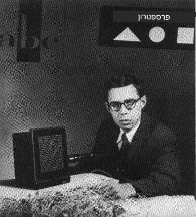
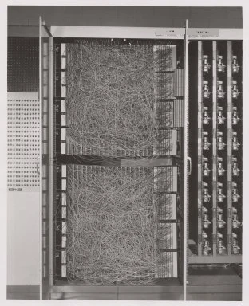
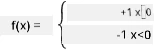

# מבוא לרשתות עצביות: פרספטרון

## [שאלון לפני השיעור](https://ff-quizzes.netlify.app/en/ai/quiz/5)

אחת הניסיונות הראשונים ליישם משהו דומה לרשת עצבית מודרנית נעשתה על ידי פרנק רוזנבלט ממעבדת התעופה של קורנל בשנת 1957. זה היה יישום חומרה שנקרא "Mark-1", שתוכנן לזהות צורות גיאומטריות פשוטות, כמו משולשים, ריבועים ועיגולים.

|      |      |
|--------------|-----------|
| | |

> תמונות [מוויקיפדיה](https://en.wikipedia.org/wiki/Perceptron)

תמונת הקלט הוצגה באמצעות מערך של 20x20 תאים פוטואלקטריים, כך שלרשת העצבית היו 400 כניסות ופלט בינארי אחד. רשת פשוטה הכילה נוירון אחד, שנקרא גם **יחידת לוגיקה סף**. המשקלים של הרשת העצבית פעלו כמו פוטנציומטרים שדרשו התאמה ידנית במהלך שלב האימון.

> ✅ פוטנציומטר הוא מכשיר שמאפשר למשתמש לכוון את ההתנגדות של מעגל חשמלי.

> הניו יורק טיימס כתב על הפרספטרון באותה תקופה: *העובר של מחשב אלקטרוני שהצי [האמריקאי] מצפה שיוכל ללכת, לדבר, לראות, לכתוב, לשכפל את עצמו ולהיות מודע לקיומו.*

## מודל פרספטרון

נניח שיש לנו N מאפיינים במודל שלנו, ובמקרה כזה וקטור הקלט יהיה וקטור בגודל N. פרספטרון הוא מודל של **סיווג בינארי**, כלומר הוא יכול להבחין בין שתי קטגוריות של נתוני קלט. נניח שלכל וקטור קלט x הפלט של הפרספטרון שלנו יהיה או +1 או -1, בהתאם לקטגוריה. הפלט יחושב באמצעות הנוסחה:

y(x) = f(w<sup>T</sup>x)

כאשר f היא פונקציית הפעלה מדרגה.

<!-- img src="http://www.sciweavers.org/tex2img.php?eq=f%28x%29%20%3D%20%5Cbegin%7Bcases%7D%0A%20%20%20%20%20%20%20%20%20%2B1%20%26%20x%20%5Cgeq%200%20%5C%5C%0A%20%20%20%20%20%20%20%20%20-1%20%26%20x%20%3C%200%0A%20%20%20%20%20%20%20%5Cend%7Bcases%7D%20%5C%5C%0A&bc=White&fc=Black&im=jpg&fs=12&ff=arev&edit=0" align="center" border="0" alt="f(x) = \begin{cases} +1 & x \geq 0 \\ -1 & x < 0 \end{cases} \\" width="154" height="50" / -->


## אימון הפרספטרון

כדי לאמן פרספטרון, עלינו למצוא וקטור משקלים w שמסווג את רוב הערכים בצורה נכונה, כלומר מביא לשגיאה **הקטנה ביותר**. שגיאה זו E מוגדרת על פי **קריטריון הפרספטרון** באופן הבא:

E(w) = -&sum;w<sup>T</sup>x<sub>i</sub>t<sub>i</sub>

כאשר:

* הסכום נלקח על נקודות נתוני האימון i שמובילות לסיווג שגוי.
* x<sub>i</sub> הוא נתון הקלט, ו-t<sub>i</sub> הוא או -1 או +1 עבור דוגמאות שליליות וחיוביות בהתאמה.

קריטריון זה נחשב כפונקציה של המשקלים w, ואנו צריכים למזער אותו. לעיתים משתמשים בשיטה שנקראת **ירידת גרדיאנט**, שבה מתחילים עם משקלים ראשוניים w<sup>(0)</sup>, ואז בכל שלב מעדכנים את המשקלים לפי הנוסחה:

w<sup>(t+1)</sup> = w<sup>(t)</sup> - &eta;&nabla;E(w)

כאן &eta; הוא מה שנקרא **קצב הלמידה**, ו-&nabla;E(w) מציין את **הגרדיאנט** של E. לאחר חישוב הגרדיאנט, אנו מקבלים:

w<sup>(t+1)</sup> = w<sup>(t)</sup> + &sum;&eta;x<sub>i</sub>t<sub>i</sub>

האלגוריתם בפייתון נראה כך:

```python
def train(positive_examples, negative_examples, num_iterations = 100, eta = 1):

    weights = [0,0,0] # Initialize weights (almost randomly :)
        
    for i in range(num_iterations):
        pos = random.choice(positive_examples)
        neg = random.choice(negative_examples)

        z = np.dot(pos, weights) # compute perceptron output
        if z < 0: # positive example classified as negative
            weights = weights + eta*weights.shape

        z  = np.dot(neg, weights)
        if z >= 0: # negative example classified as positive
            weights = weights - eta*weights.shape

    return weights
```

## סיכום

בשיעור זה למדתם על פרספטרון, שהוא מודל סיווג בינארי, וכיצד לאמן אותו באמצעות וקטור משקלים.

## 🚀 אתגר

אם תרצו לנסות לבנות פרספטרון משלכם, נסו [את המעבדה הזו ב-Microsoft Learn](https://docs.microsoft.com/en-us/azure/machine-learning/component-reference/two-class-averaged-perceptron?WT.mc_id=academic-77998-cacaste) שמשתמשת ב-[Azure ML designer](https://docs.microsoft.com/en-us/azure/machine-learning/concept-designer?WT.mc_id=academic-77998-cacaste).

## [שאלון אחרי השיעור](https://ff-quizzes.netlify.app/en/ai/quiz/6)

## סקירה ולימוד עצמי

כדי לראות כיצד ניתן להשתמש בפרספטרון לפתרון בעיה פשוטה וגם בעיות מהחיים האמיתיים, ולהמשיך ללמוד - עברו למחברת [Perceptron](Perceptron.ipynb).

הנה [מאמר מעניין על פרספטרונים](https://towardsdatascience.com/what-is-a-perceptron-basics-of-neural-networks-c4cfea20c590).

## [משימה](lab/README.md)

בשיעור זה יישמנו פרספטרון למשימת סיווג בינארי, והשתמשנו בו כדי לסווג בין שתי ספרות כתובות ביד. במעבדה זו, אתם מתבקשים לפתור את בעיית סיווג הספרות באופן מלא, כלומר לקבוע איזו ספרה סביר להניח תואמת לתמונה נתונה.

* [הוראות](lab/README.md)
* [מחברת](lab/PerceptronMultiClass.ipynb)

---

