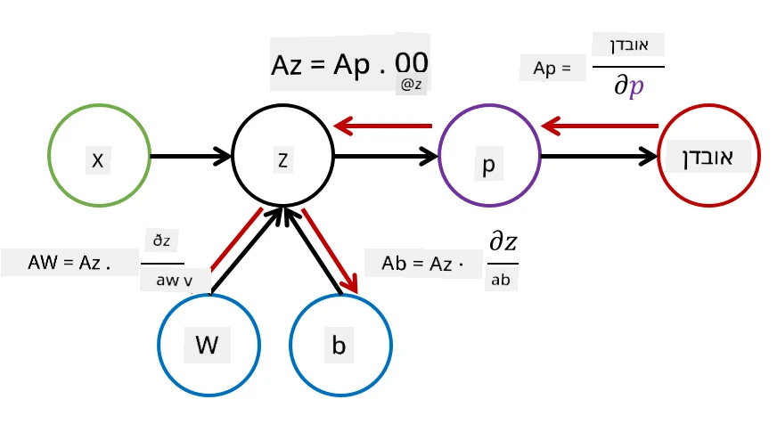

# מבוא לרשתות נוירונים. פרספטרון רב-שכבתי

בפרק הקודם למדתם על מודל הרשת הנוירונית הפשוט ביותר - פרספטרון חד-שכבתי, מודל סיווג ליניארי לשתי קטגוריות.

בפרק זה נרחיב את המודל למסגרת גמישה יותר, שתאפשר לנו:

* לבצע **סיווג רב-קטגוריות** בנוסף לסיווג דו-קטגוריות  
* לפתור **בעיות רגרסיה** בנוסף לסיווג  
* להפריד בין קטגוריות שאינן ניתנות להפרדה ליניארית  

בנוסף, נפתח מסגרת מודולרית משלנו ב-Python שתאפשר לנו לבנות ארכיטקטורות שונות של רשתות נוירונים.

## [שאלון לפני ההרצאה](https://ff-quizzes.netlify.app/en/ai/quiz/7)

## פורמליזציה של למידת מכונה

נתחיל בפורמליזציה של בעיית למידת המכונה. נניח שיש לנו קבוצת נתונים לאימון **X** עם תוויות **Y**, ואנו צריכים לבנות מודל *f* שיבצע תחזיות מדויקות ככל האפשר. איכות התחזיות נמדדת באמצעות **פונקציית הפסד** &lagran;. פונקציות הפסד נפוצות כוללות:

* עבור בעיית רגרסיה, כאשר אנו צריכים לחזות מספר, ניתן להשתמש ב**שגיאה מוחלטת** &sum;i|f(x(i))-y(i)|, או ב**שגיאה ריבועית** &sum;i(f(x(i))-y(i))2  
* עבור סיווג, משתמשים ב**0-1 loss** (שבעצם זהה ל**דיוק** המודל), או ב**logistic loss**.  

בפרספטרון חד-שכבתי, פונקציה *f* הוגדרה כפונקציה ליניארית *f(x)=wx+b* (כאן *w* הוא מטריצת המשקלים, *x* הוא וקטור התכונות הקלט, ו-*b* הוא וקטור ההטיה). בארכיטקטורות שונות של רשתות נוירונים, פונקציה זו יכולה לקבל צורה מורכבת יותר.

> במקרה של סיווג, לעיתים קרובות רצוי לקבל הסתברויות של הקטגוריות המתאימות כיציאת הרשת. כדי להמיר מספרים שרירותיים להסתברויות (למשל, לנרמל את היציאה), אנו משתמשים לעיתים קרובות בפונקציית **softmax** &sigma;, והפונקציה *f* הופכת ל-*f(x)=&sigma;(wx+b)*  

בהגדרת *f* לעיל, *w* ו-*b* נקראים **פרמטרים** &theta;=⟨*w,b*⟩. בהתחשב בקבוצת הנתונים ⟨**X**,**Y**⟩, ניתן לחשב שגיאה כוללת על כל קבוצת הנתונים כפונקציה של הפרמטרים &theta;.

> ✅ **מטרת אימון הרשת הנוירונית היא למזער את השגיאה על ידי שינוי הפרמטרים &theta;**

## אופטימיזציה באמצעות ירידת גרדיאנט

קיים שיטה ידועה לאופטימיזציה של פונקציות הנקראת **ירידת גרדיאנט**. הרעיון הוא שניתן לחשב נגזרת (במקרה רב-ממדי נקראת **גרדיאנט**) של פונקציית הפסד ביחס לפרמטרים, ולשנות את הפרמטרים כך שהשגיאה תקטן. ניתן לפרמל זאת כך:

* אתחול הפרמטרים בערכים אקראיים w(0), b(0)  
* חזרה על הצעד הבא פעמים רבות:  
    - w(i+1) = w(i)-&eta;&part;&lagran;/&part;w  
    - b(i+1) = b(i)-&eta;&part;&lagran;/&part;b  

במהלך האימון, הצעדים האופטימיזציה אמורים להיחשב בהתחשב בכל קבוצת הנתונים (זכרו שהפסד מחושב כסכום על כל דוגמאות האימון). עם זאת, בפועל אנו לוקחים חלקים קטנים מהנתונים הנקראים **minibatches**, ומחשבים גרדיאנטים על בסיס תת-קבוצה של הנתונים. מכיוון שהתת-קבוצה נלקחת באופן אקראי בכל פעם, שיטה זו נקראת **ירידת גרדיאנט סטוכסטית** (SGD).

## פרספטרונים רב-שכבתיים ובקפרופגציה

רשת חד-שכבתית, כפי שראינו לעיל, מסוגלת לסווג קטגוריות הניתנות להפרדה ליניארית. כדי לבנות מודל עשיר יותר, ניתן לשלב מספר שכבות ברשת. מבחינה מתמטית, זה אומר שהפונקציה *f* תהיה בעלת צורה מורכבת יותר, ותיחשב במספר שלבים:
* z1=w1x+b1  
* z2=w2&alpha;(z1)+b2  
* f = &sigma;(z2)  

כאן, &alpha; היא **פונקציית הפעלה לא ליניארית**, &sigma; היא פונקציית softmax, והפרמטרים הם &theta;=<*w1,b1,w2,b2*>.

אלגוריתם ירידת הגרדיאנט יישאר זהה, אך יהיה קשה יותר לחשב גרדיאנטים. בהתחשב בכלל השרשרת של נגזרות, ניתן לחשב נגזרות כך:

* &part;&lagran;/&part;w2 = (&part;&lagran;/&part;&sigma;)(&part;&sigma;/&part;z2)(&part;z2/&part;w2)  
* &part;&lagran;/&part;w1 = (&part;&lagran;/&part;&sigma;)(&part;&sigma;/&part;z2)(&part;z2/&part;&alpha;)(&part;&alpha;/&part;z1)(&part;z1/&part;w1)  

> ✅ כלל השרשרת של נגזרות משמש לחישוב נגזרות של פונקציית הפסד ביחס לפרמטרים.

שימו לב שהחלק השמאלי ביותר של כל הביטויים הללו זהה, ולכן ניתן לחשב נגזרות בצורה יעילה על ידי התחלה מפונקציית הפסד והתקדמות "אחורה" דרך גרף החישוב. לכן שיטת האימון של פרספטרון רב-שכבתי נקראת **בקפרופגציה**, או 'backprop'.

> TODO: ציון מקור התמונה  

> ✅ נעסוק בבקפרופגציה בפירוט רב יותר בדוגמה במחברת שלנו.  

## סיכום

בשיעור זה, בנינו ספריית רשתות נוירונים משלנו, והשתמשנו בה למשימת סיווג דו-ממדית פשוטה.

## 🚀 אתגר

במחברת המצורפת, תבנו ותאמנו מסגרת משלכם לבניית פרספטרונים רב-שכבתיים. תוכלו לראות בפירוט כיצד רשתות נוירונים מודרניות פועלות.

עברו למחברת [OwnFramework](OwnFramework.ipynb) ועבדו עליה.

## [שאלון אחרי ההרצאה](https://ff-quizzes.netlify.app/en/ai/quiz/8)

## סקירה ולימוד עצמי

בקפרופגציה היא אלגוריתם נפוץ ב-AI ו-ML, שכדאי ללמוד [בפירוט רב יותר](https://wikipedia.org/wiki/Backpropagation)

## [מטלה](lab/README.md)

במעבדה זו, תתבקשו להשתמש במסגרת שבניתם בשיעור זה כדי לפתור את משימת סיווג הספרות בכתב יד של MNIST.

* [הוראות](lab/README.md)  
* [מחברת](lab/MyFW_MNIST.ipynb)  

---

