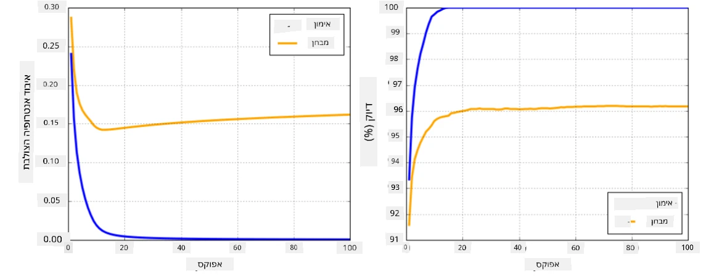

# מסגרות רשתות עצביות

כפי שלמדנו כבר, כדי לאמן רשתות עצביות בצורה יעילה, יש לבצע שני דברים:

* לעבוד עם טנסורים, למשל להכפיל, להוסיף ולחשב פונקציות כמו סיגמואיד או סופטמקס.
* לחשב גרדיאנטים של כל הביטויים, כדי לבצע אופטימיזציה באמצעות ירידת גרדיאנט.

## [שאלון לפני השיעור](https://ff-quizzes.netlify.app/en/ai/quiz/9)

בעוד שספריית `numpy` יכולה לבצע את החלק הראשון, אנו זקוקים למנגנון שיאפשר לנו לחשב גרדיאנטים. במסגרת [שלנו](../04-OwnFramework/OwnFramework.ipynb) שפיתחנו בסעיף הקודם, היינו צריכים לתכנת ידנית את כל פונקציות הנגזרות בתוך המתודה `backward`, שמבצעת את תהליך הבקפרופגציה. באופן אידיאלי, מסגרת צריכה לאפשר לנו לחשב גרדיאנטים של *כל ביטוי* שנוכל להגדיר.

דבר חשוב נוסף הוא היכולת לבצע חישובים על GPU, או יחידות חישוב מיוחדות אחרות כמו [TPU](https://en.wikipedia.org/wiki/Tensor_Processing_Unit). אימון רשתות עצביות עמוקות דורש *הרבה* חישובים, והיכולת לבצע חישובים במקביל על GPUs היא קריטית.

> ✅ המונח 'parallelize' מתייחס לחלוקת החישובים בין מספר מכשירים.

כיום, שתי המסגרות הפופולריות ביותר לרשתות עצביות הן: [TensorFlow](http://TensorFlow.org) ו-[PyTorch](https://pytorch.org/). שתיהן מספקות API ברמה נמוכה לעבודה עם טנסורים הן על CPU והן על GPU. בנוסף ל-API ברמה נמוכה, יש גם API ברמה גבוהה, הנקרא [Keras](https://keras.io/) ו-[PyTorch Lightning](https://pytorchlightning.ai) בהתאמה.

API ברמה נמוכה | [TensorFlow](http://TensorFlow.org) | [PyTorch](https://pytorch.org/)
----------------|-------------------------------------|--------------------------------
API ברמה גבוהה | [Keras](https://keras.io/) | [PyTorch Lightning](https://pytorchlightning.ai/)

**APIs ברמה נמוכה** בשתי המסגרות מאפשרים לבנות **גרפים חישוביים**. גרף זה מגדיר כיצד לחשב את הפלט (בדרך כלל פונקציית האובדן) עם פרמטרי הקלט הנתונים, וניתן לדחוף אותו לחישוב על GPU אם הוא זמין. ישנן פונקציות להבדיל את הגרף החישובי הזה ולחשב גרדיאנטים, שניתן להשתמש בהם לאחר מכן לאופטימיזציה של פרמטרי המודל.

**APIs ברמה גבוהה** מתייחסים לרשתות עצביות כאל **רצף של שכבות**, ומקלים מאוד על בניית רוב הרשתות העצביות. אימון המודל בדרך כלל דורש הכנת הנתונים ואז קריאה לפונקציה `fit` שתבצע את העבודה.

ה-API ברמה גבוהה מאפשר לבנות רשתות עצביות טיפוסיות במהירות רבה מבלי לדאוג לפרטים רבים. במקביל, ה-API ברמה נמוכה מציע שליטה רבה יותר על תהליך האימון, ולכן הוא משמש רבות במחקר, כאשר מתמודדים עם ארכיטקטורות רשת עצבית חדשות.

חשוב גם להבין שניתן להשתמש בשני ה-APIs יחד, למשל, ניתן לפתח ארכיטקטורת שכבת רשת עצבית משלכם באמצעות API ברמה נמוכה, ואז להשתמש בה בתוך רשת גדולה יותר שנבנתה ואומנה עם API ברמה גבוהה. או שניתן להגדיר רשת באמצעות API ברמה גבוהה כרצף של שכבות, ואז להשתמש בלולאת אימון ברמה נמוכה משלכם כדי לבצע אופטימיזציה. שני ה-APIs משתמשים באותם מושגים בסיסיים, והם מתוכננים לעבוד היטב יחד.

## למידה

בקורס זה, אנו מציעים את רוב התוכן הן עבור PyTorch והן עבור TensorFlow. תוכלו לבחור את המסגרת המועדפת עליכם ולעבור רק על המחברות המתאימות. אם אינכם בטוחים איזו מסגרת לבחור, קראו דיונים באינטרנט על **PyTorch לעומת TensorFlow**. תוכלו גם להסתכל על שתי המסגרות כדי לקבל הבנה טובה יותר.

כאשר ניתן, נשתמש ב-APIs ברמה גבוהה לשם פשטות. עם זאת, אנו מאמינים שחשוב להבין כיצד רשתות עצביות פועלות מהבסיס, ולכן בהתחלה נתחיל לעבוד עם API ברמה נמוכה וטנסורים. עם זאת, אם אתם רוצים להתחיל מהר ולא רוצים להשקיע זמן רב בלמידת הפרטים הללו, תוכלו לדלג עליהם ולעבור ישר למחברות של API ברמה גבוהה.

## ✍️ תרגילים: מסגרות

המשיכו את הלמידה במחברות הבאות:

API ברמה נמוכה | [מחברת TensorFlow+Keras](IntroKerasTF.ipynb) | [PyTorch](IntroPyTorch.ipynb)
----------------|-------------------------------------|--------------------------------
API ברמה גבוהה | [Keras](IntroKeras.ipynb) | *PyTorch Lightning*

לאחר שליטה במסגרות, בואו נסכם את מושג ה-overfitting.

# Overfitting

Overfitting הוא מושג חשוב ביותר בלמידת מכונה, וחשוב מאוד להבין אותו נכון!

שקלו את הבעיה הבאה של התאמת 5 נקודות (מיוצגות על ידי `x` בגרפים למטה):

 | 
-------------------------|--------------------------
**מודל ליניארי, 2 פרמטרים** | **מודל לא ליניארי, 7 פרמטרים**
שגיאת אימון = 5.3 | שגיאת אימון = 0
שגיאת ולידציה = 5.1 | שגיאת ולידציה = 20

* משמאל, אנו רואים התאמה טובה של קו ישר. מכיוון שמספר הפרמטרים מתאים, המודל מבין את הרעיון מאחורי פיזור הנקודות.
* מימין, המודל חזק מדי. מכיוון שיש לנו רק 5 נקודות והמודל מכיל 7 פרמטרים, הוא יכול להתאים את עצמו כך שיעבור דרך כל הנקודות, מה שגורם לשגיאת האימון להיות 0. עם זאת, זה מונע מהמודל להבין את הדפוס הנכון מאחורי הנתונים, ולכן שגיאת הוולידציה גבוהה מאוד.

חשוב מאוד למצוא את האיזון הנכון בין עושר המודל (מספר הפרמטרים) לבין מספר דוגמאות האימון.

## מדוע מתרחש Overfitting

  * לא מספיק נתוני אימון
  * מודל חזק מדי
  * יותר מדי רעש בנתוני הקלט

## כיצד לזהות Overfitting

כפי שניתן לראות מהגרף למעלה, ניתן לזהות Overfitting על ידי שגיאת אימון נמוכה מאוד ושגיאת ולידציה גבוהה. בדרך כלל במהלך האימון נראה ששגיאות האימון והוולידציה מתחילות לרדת, ואז בשלב מסוים שגיאת הוולידציה עשויה להפסיק לרדת ולהתחיל לעלות. זה יהיה סימן ל-Overfitting, ואינדיקציה לכך שכדאי להפסיק את האימון בנקודה זו (או לפחות לשמור עותק של המודל).

## כיצד למנוע Overfitting

אם אתם רואים ש-Overfitting מתרחש, תוכלו לעשות אחד מהדברים הבאים:

 * להגדיל את כמות נתוני האימון
 * להקטין את מורכבות המודל
 * להשתמש בטכניקת [רגולריזציה](../../4-ComputerVision/08-TransferLearning/TrainingTricks.md), כמו [Dropout](../../4-ComputerVision/08-TransferLearning/TrainingTricks.md#Dropout), שנשקול בהמשך.

## Overfitting ו-Bias-Variance Tradeoff

Overfitting הוא למעשה מקרה של בעיה כללית יותר בסטטיסטיקה הנקראת [Bias-Variance Tradeoff](https://en.wikipedia.org/wiki/Bias%E2%80%93variance_tradeoff). אם נשקול את מקורות השגיאה האפשריים במודל שלנו, נוכל לראות שני סוגי שגיאות:

* **שגיאות הטיה (Bias errors)** נגרמות מכך שהאלגוריתם שלנו לא מצליח לתפוס את הקשר בין נתוני האימון בצורה נכונה. זה יכול לנבוע מכך שהמודל שלנו לא חזק מספיק (**Underfitting**).
* **שגיאות שונות (Variance errors)** נגרמות מכך שהמודל מתאים רעש בנתוני הקלט במקום קשר משמעותי (**Overfitting**).

במהלך האימון, שגיאת הטיה יורדת (כשהמודל שלנו לומד להתאים את הנתונים), ושגיאת שונות עולה. חשוב להפסיק את האימון - או ידנית (כשמזהים Overfitting) או אוטומטית (על ידי הכנסת רגולריזציה) - כדי למנוע Overfitting.

## סיכום

בשיעור זה, למדתם על ההבדלים בין ה-APIs השונים לשתי המסגרות הפופולריות ביותר ב-AI, TensorFlow ו-PyTorch. בנוסף, למדתם על נושא חשוב מאוד, Overfitting.

## 🚀 אתגר

במחברות המצורפות תמצאו 'משימות' בתחתית; עברו על המחברות והשלימו את המשימות.

## [שאלון לאחר השיעור](https://ff-quizzes.netlify.app/en/ai/quiz/10)

## סקירה ולימוד עצמי

בצעו מחקר על הנושאים הבאים:

- TensorFlow
- PyTorch
- Overfitting

שאלו את עצמכם את השאלות הבאות:

- מה ההבדל בין TensorFlow ל-PyTorch?
- מה ההבדל בין Overfitting ל-Underfitting?

## [מטלה](lab/README.md)

במעבדה זו, תתבקשו לפתור שתי בעיות סיווג באמצעות רשתות Fully-Connected חד-שכבתיות ורב-שכבתיות, תוך שימוש ב-PyTorch או TensorFlow.

* [הוראות](lab/README.md)
* [מחברת](lab/LabFrameworks.ipynb)

---

