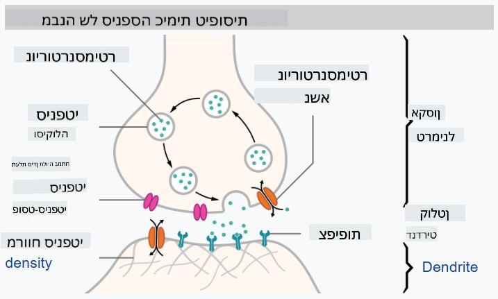
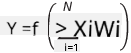

<!--
CO_OP_TRANSLATOR_METADATA:
{
  "original_hash": "f862a99d88088163df12270e2f2ad6c3",
  "translation_date": "2025-10-03T12:50:35+00:00",
  "source_file": "lessons/3-NeuralNetworks/README.md",
  "language_code": "he"
}
-->
# מבוא לרשתות עצביות

כפי שדיברנו במבוא, אחת הדרכים להשיג אינטליגנציה היא לאמן **מודל מחשב** או **מוח מלאכותי**. מאז אמצע המאה ה-20, חוקרים ניסו מודלים מתמטיים שונים, עד שבשנים האחרונות כיוון זה הוכיח את עצמו כהצלחה גדולה. מודלים מתמטיים כאלה של המוח נקראים **רשתות עצביות**.

> לעיתים רשתות עצביות נקראות *רשתות עצביות מלאכותיות*, ANNs, כדי להבהיר שמדובר במודלים ולא ברשתות עצבים אמיתיות.

## למידת מכונה

רשתות עצביות הן חלק מתחום רחב יותר שנקרא **למידת מכונה**, שמטרתו להשתמש בנתונים כדי לאמן מודלים מחשב המסוגלים לפתור בעיות. למידת מכונה מהווה חלק גדול מבינה מלאכותית, אך אנו לא מכסים למידת מכונה קלאסית בתוכנית לימודים זו.

> בקרו בתוכנית הלימודים הנפרדת שלנו **[למידת מכונה למתחילים](http://github.com/microsoft/ml-for-beginners)** כדי ללמוד עוד על למידת מכונה קלאסית.

בלמידת מכונה, אנו מניחים שיש לנו מערך נתונים של דוגמאות **X**, וערכי פלט תואמים **Y**. דוגמאות הן לעיתים וקטורים N-ממדיים שמורכבים מ**מאפיינים**, והפלטים נקראים **תוויות**.

נבחן את שתי הבעיות הנפוצות ביותר בלמידת מכונה:

* **סיווג**, שבו אנו צריכים לסווג אובייקט קלט לשתי קטגוריות או יותר.
* **רגרסיה**, שבה אנו צריכים לחזות מספר נומרי עבור כל אחת מדוגמאות הקלט.

> כאשר מייצגים קלטים ופלטים כטנזורים, מערך הקלט הוא מטריצה בגודל M&times;N, כאשר M הוא מספר הדוגמאות ו-N הוא מספר המאפיינים. תוויות הפלט Y הן וקטור בגודל M.

בתוכנית לימודים זו, נתמקד רק במודלים של רשתות עצביות.

## מודל של נוירון

מהביולוגיה אנו יודעים שהמוח שלנו מורכב מתאי עצב (נוירונים), שלכל אחד מהם יש מספר "קלטים" (דנדריטים) ו"פלט" אחד (אקסון). הן הדנדריטים והן האקסונים יכולים להוליך אותות חשמליים, והחיבורים ביניהם — הידועים כסינפסות — יכולים להציג דרגות שונות של מוליכות, שמוסדרות על ידי נוירוטרנסמיטורים.

 | 
----|----
נוירון אמיתי *([תמונה](https://en.wikipedia.org/wiki/Synapse#/media/File:SynapseSchematic_lines.svg) מוויקיפדיה)* | נוירון מלאכותי *(תמונה מאת המחבר)*

לכן, המודל המתמטי הפשוט ביותר של נוירון מכיל מספר קלטים X1, ..., XN ופלט Y, וסדרה של משקלים W1, ..., WN. הפלט מחושב כך:

כאשר f היא **פונקציית הפעלה** לא ליניארית.

> מודלים מוקדמים של נוירון תוארו במאמר הקלאסי [A logical calculus of the ideas immanent in nervous activity](https://www.cs.cmu.edu/~./epxing/Class/10715/reading/McCulloch.and.Pitts.pdf) מאת וורן מק'קולוק וולטר פיטס בשנת 1943. דונלד הב בספרו "[The Organization of Behavior: A Neuropsychological Theory](https://books.google.com/books?id=VNetYrB8EBoC)" הציע את הדרך שבה ניתן לאמן רשתות אלו.

## בסעיף זה

בסעיף זה נלמד על:
* [פרספטרון](03-Perceptron/README.md), אחד המודלים הראשונים של רשתות עצביות לסיווג דו-קטגורי
* [רשתות רב-שכבתיות](04-OwnFramework/README.md) עם מחברת מצורפת [איך לבנות את המסגרת שלנו](04-OwnFramework/OwnFramework.ipynb)
* [מסגרות רשתות עצביות](05-Frameworks/README.md), עם המחברות הבאות: [PyTorch](05-Frameworks/IntroPyTorch.ipynb) ו-[Keras/Tensorflow](05-Frameworks/IntroKerasTF.ipynb)
* [התאמת יתר](../../../../lessons/3-NeuralNetworks/05-Frameworks)

---

**כתב ויתור**:  
מסמך זה תורגם באמצעות שירות תרגום מבוסס בינה מלאכותית [Co-op Translator](https://github.com/Azure/co-op-translator). למרות שאנו שואפים לדיוק, יש לקחת בחשבון שתרגומים אוטומטיים עשויים להכיל שגיאות או אי דיוקים. המסמך המקורי בשפתו המקורית צריך להיחשב כמקור סמכותי. עבור מידע קריטי, מומלץ להשתמש בתרגום מקצועי על ידי אדם. איננו נושאים באחריות לאי הבנות או לפרשנויות שגויות הנובעות משימוש בתרגום זה.