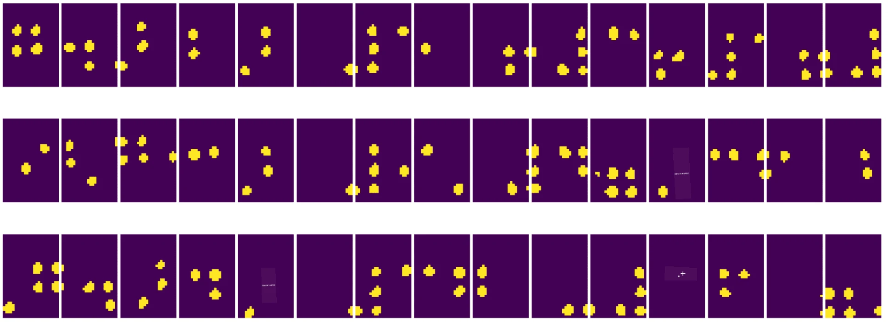

# מבוא לראייה ממוחשבת

[ראייה ממוחשבת](https://wikipedia.org/wiki/Computer_vision) היא תחום שמטרתו לאפשר למחשבים להבין ברמה גבוהה תמונות דיגיטליות. זו הגדרה רחבה למדי, כי *הבנה* יכולה להתייחס לדברים רבים, כולל זיהוי אובייקט בתמונה (**זיהוי אובייקטים**), הבנת מה מתרחש (**זיהוי אירועים**), תיאור תמונה בטקסט, או שחזור סצנה בתלת-ממד. יש גם משימות מיוחדות הקשורות לתמונות של בני אדם: הערכת גיל ורגשות, זיהוי פנים וזיהוי זהות, והערכת תנוחה בתלת-ממד, בין היתר.

## [שאלון לפני ההרצאה](https://ff-quizzes.netlify.app/en/ai/quiz/11)

אחת המשימות הפשוטות ביותר בראייה ממוחשבת היא **סיווג תמונות**.

ראייה ממוחשבת נחשבת לעיתים קרובות כענף של בינה מלאכותית. כיום, רוב המשימות בתחום זה נפתרות באמצעות רשתות נוירונים. נלמד יותר על סוג מיוחד של רשתות נוירונים המשמשות לראייה ממוחשבת, [רשתות נוירונים קונבולוציוניות](../07-ConvNets/README.md), לאורך החלק הזה.

עם זאת, לפני שמעבירים תמונה לרשת נוירונים, במקרים רבים יש הגיון להשתמש בטכניקות אלגוריתמיות לשיפור התמונה.

ישנן מספר ספריות Python זמינות לעיבוד תמונה:

* **[imageio](https://imageio.readthedocs.io/en/stable/)** יכולה לשמש לקריאה/כתיבה של פורמטים שונים של תמונות. היא גם תומכת ב-ffmpeg, כלי שימושי להמרת פריימים של וידאו לתמונות.
* **[Pillow](https://pillow.readthedocs.io/en/stable/index.html)** (המוכרת גם כ-PIL) היא חזקה יותר, ותומכת גם במניפולציות תמונה כמו עיוותים, התאמות פלטה, ועוד.
* **[OpenCV](https://opencv.org/)** היא ספריית עיבוד תמונה חזקה שנכתבה ב-C++, והפכה לסטנדרט *דה פקטו* לעיבוד תמונה. יש לה ממשק נוח ב-Python.
* **[dlib](http://dlib.net/)** היא ספריית C++ שמיישמת אלגוריתמים רבים של למידת מכונה, כולל כמה אלגוריתמים של ראייה ממוחשבת. יש לה גם ממשק Python, וניתן להשתמש בה למשימות מאתגרות כמו זיהוי פנים ונקודות ציון בפנים.

## OpenCV

[OpenCV](https://opencv.org/) נחשבת לסטנדרט *דה פקטו* לעיבוד תמונה. היא מכילה הרבה אלגוריתמים שימושיים, שמיושמים ב-C++. ניתן להשתמש ב-OpenCV גם מ-Python.

מקום טוב ללמוד על OpenCV הוא [הקורס Learn OpenCV](https://learnopencv.com/getting-started-with-opencv/). בתוכנית הלימודים שלנו, המטרה היא לא ללמוד OpenCV, אלא להראות לכם כמה דוגמאות שבהן ניתן להשתמש בה, וכיצד.

### טעינת תמונות

תמונות ב-Python מיוצגות בצורה נוחה באמצעות מערכים של NumPy. לדוגמה, תמונות בגווני אפור בגודל 320x200 פיקסלים יאוחסנו במערך בגודל 200x320, ותמונות צבעוניות באותו גודל יהיו בעלות צורה של 200x320x3 (עבור 3 ערוצי צבע). כדי לטעון תמונה, ניתן להשתמש בקוד הבא:

```python
import cv2
import matplotlib.pyplot as plt

im = cv2.imread('image.jpeg')
plt.imshow(im)
```

באופן מסורתי, OpenCV משתמש בקידוד BGR (כחול-ירוק-אדום) לתמונות צבעוניות, בעוד שאר הכלים ב-Python משתמשים בקידוד RGB (אדום-ירוק-כחול) המסורתי יותר. כדי שהתמונה תיראה נכון, יש להמיר אותה למרחב הצבעים RGB, או על ידי החלפת ממדים במערך NumPy, או על ידי קריאה לפונקציה של OpenCV:

```python
im = cv2.cvtColor(im,cv2.COLOR_BGR2RGB)
```

אותה פונקציה `cvtColor` יכולה לשמש לביצוע המרות אחרות של מרחבי צבע, כמו המרת תמונה לגווני אפור או למרחב הצבעים HSV (גוון-רוויה-ערך).

ניתן גם להשתמש ב-OpenCV לטעינת פריימים של וידאו אחד-אחד - דוגמה לכך ניתנת בתרגיל [OpenCV Notebook](OpenCV.ipynb).

### עיבוד תמונה

לפני שמעבירים תמונה לרשת נוירונים, ייתכן שתרצו לבצע מספר שלבי עיבוד מקדימים. OpenCV יכולה לבצע דברים רבים, כולל:

* **שינוי גודל** התמונה באמצעות `im = cv2.resize(im, (320,200),interpolation=cv2.INTER_LANCZOS)`
* **טשטוש** התמונה באמצעות `im = cv2.medianBlur(im,3)` או `im = cv2.GaussianBlur(im, (3,3), 0)`
* שינוי **בהירות וניגודיות** של התמונה ניתן לבצע באמצעות מניפולציות על מערכי NumPy, כפי שמתואר [בהערה הזו ב-Stackoverflow](https://stackoverflow.com/questions/39308030/how-do-i-increase-the-contrast-of-an-image-in-python-opencv).
* שימוש ב-[סף](https://docs.opencv.org/4.x/d7/d4d/tutorial_py_thresholding.html) על ידי קריאה לפונקציות `cv2.threshold`/`cv2.adaptiveThreshold`, שלעיתים עדיף על התאמת בהירות או ניגודיות.
* יישום [טרנספורמציות שונות](https://docs.opencv.org/4.5.5/da/d6e/tutorial_py_geometric_transformations.html) על התמונה:
    - **[טרנספורמציות אפיניות](https://docs.opencv.org/4.5.5/d4/d61/tutorial_warp_affine.html)** יכולות להיות שימושיות אם צריך לשלב סיבוב, שינוי גודל ועיוות בתמונה, וידועים מיקומי המקור והיעד של שלוש נקודות בתמונה. טרנספורמציות אפיניות שומרות על קווים מקבילים.
    - **[טרנספורמציות פרספקטיבה](https://medium.com/analytics-vidhya/opencv-perspective-transformation-9edffefb2143)** יכולות להיות שימושיות כאשר ידועים מיקומי המקור והיעד של 4 נקודות בתמונה. לדוגמה, אם מצלמים תמונה של מסמך מלבני באמצעות מצלמת סמארטפון מזווית מסוימת, ורוצים ליצור תמונה מלבנית של המסמך עצמו.
* הבנת תנועה בתוך התמונה באמצעות **[זרימה אופטית](https://docs.opencv.org/4.5.5/d4/dee/tutorial_optical_flow.html)**.

## דוגמאות לשימוש בראייה ממוחשבת

ב-[OpenCV Notebook](OpenCV.ipynb) שלנו, אנו מציגים כמה דוגמאות לשימוש בראייה ממוחשבת לביצוע משימות ספציפיות:

* **עיבוד מקדים של צילום ספר ברייל**. אנו מתמקדים כיצד ניתן להשתמש בסף, זיהוי תכונות, טרנספורמציית פרספקטיבה ומניפולציות NumPy כדי להפריד סמלי ברייל בודדים לסיווג נוסף על ידי רשת נוירונים.

 |  | 
----|-----|-----

> תמונה מתוך [OpenCV.ipynb](OpenCV.ipynb)

* **זיהוי תנועה בווידאו באמצעות הבדל פריימים**. אם המצלמה קבועה, אז הפריימים מהמצלמה צריכים להיות די דומים זה לזה. מכיוון שפריימים מיוצגים כמערכים, פשוט על ידי חיסור המערכים של שני פריימים עוקבים נקבל את ההבדל בפיקסלים, שאמור להיות נמוך עבור פריימים סטטיים, ולהפוך לגבוה יותר כאשר יש תנועה משמעותית בתמונה.


> תמונה מתוך [OpenCV.ipynb](OpenCV.ipynb)

* **זיהוי תנועה באמצעות זרימה אופטית**. [זרימה אופטית](https://docs.opencv.org/3.4/d4/dee/tutorial_optical_flow.html) מאפשרת להבין כיצד פיקסלים בודדים בפריימים של וידאו נעים. ישנם שני סוגים של זרימה אופטית:

   - **זרימה אופטית צפופה** מחשבת את שדה הווקטורים שמראה לכל פיקסל לאן הוא נע.
   - **זרימה אופטית דלילה** מבוססת על לקיחת תכונות ייחודיות בתמונה (למשל, קצוות), ובניית מסלולן מפריים לפריים.


> תמונה מתוך [OpenCV.ipynb](OpenCV.ipynb)

## ✍️ מחברות לדוגמה: OpenCV [נסו את OpenCV בפעולה](OpenCV.ipynb)

בואו נעשה כמה ניסויים עם OpenCV על ידי חקר [OpenCV Notebook](OpenCV.ipynb)

## סיכום

לפעמים, משימות יחסית מורכבות כמו זיהוי תנועה או זיהוי קצה אצבע יכולות להיפתר אך ורק באמצעות ראייה ממוחשבת. לכן, חשוב מאוד להכיר את הטכניקות הבסיסיות של ראייה ממוחשבת, ומה ספריות כמו OpenCV יכולות לעשות.

## 🚀 אתגר

צפו [בסרטון הזה](https://docs.microsoft.com/shows/ai-show/ai-show--2021-opencv-ai-competition--grand-prize-winners--cortic-tigers--episode-32?WT.mc_id=academic-77998-cacaste) מתוך תוכנית AI Show כדי ללמוד על פרויקט Cortic Tigers וכיצד הם בנו פתרון מבוסס בלוקים להנגשת משימות ראייה ממוחשבת באמצעות רובוט. בצעו מחקר על פרויקטים נוספים כמו זה שמסייעים למתחילים להיכנס לתחום.

## [שאלון לאחר ההרצאה](https://ff-quizzes.netlify.app/en/ai/quiz/12)

## סקירה ולימוד עצמי

קראו עוד על זרימה אופטית [במדריך הנהדר הזה](https://learnopencv.com/optical-flow-in-opencv/).

## [משימה](lab/README.md)

במעבדה זו, תצלמו וידאו עם מחוות פשוטות, והמטרה שלכם היא לחלץ תנועות למעלה/למטה/שמאלה/ימינה באמצעות זרימה אופטית.


---

