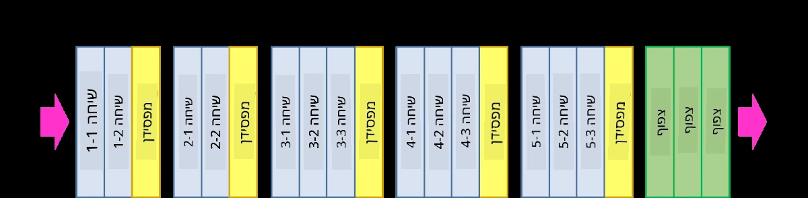
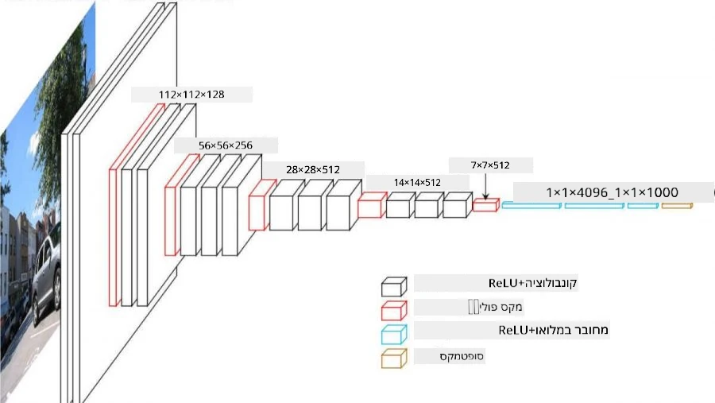
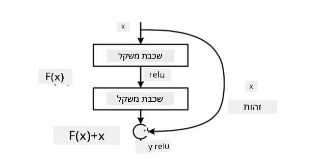
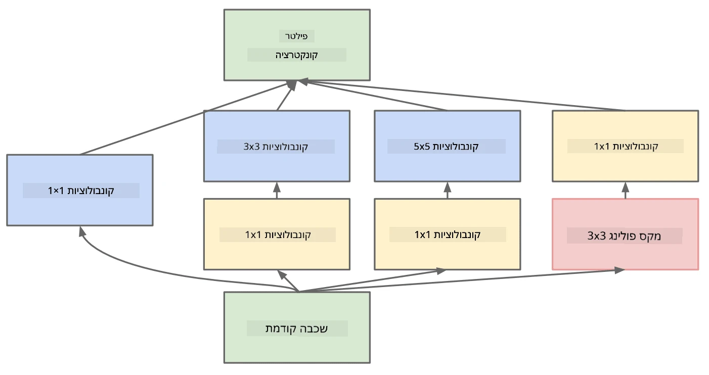

# ארכיטקטורות CNN ידועות

### VGG-16

VGG-16 היא רשת שהשיגה דיוק של 92.7% בסיווג ImageNet top-5 בשנת 2014. יש לה את מבנה השכבות הבא:

כפי שניתן לראות, VGG עוקבת אחר ארכיטקטורת פירמידה מסורתית, שהיא רצף של שכבות קונבולוציה-פולינג.

> תמונה מ-[Researchgate](https://www.researchgate.net/figure/Vgg16-model-structure-To-get-the-VGG-NIN-model-we-replace-the-2-nd-4-th-6-th-7-th_fig2_335194493)

### ResNet

ResNet היא משפחת מודלים שהוצעה על ידי Microsoft Research בשנת 2015. הרעיון המרכזי של ResNet הוא שימוש ב**בלוקים שאריתיים**:

> תמונה מ-[המאמר הזה](https://arxiv.org/pdf/1512.03385.pdf)

הסיבה לשימוש במעבר זהות היא לגרום לשכבה שלנו לחזות **את ההבדל** בין התוצאה של שכבה קודמת לבין הפלט של הבלוק השאריתי - ומכאן השם *שארית*. בלוקים אלו קלים יותר לאימון, וניתן לבנות רשתות עם מאות בלוקים כאלה (הגרסאות הנפוצות ביותר הן ResNet-52, ResNet-101 ו-ResNet-152).

ניתן גם לחשוב על רשת זו ככזו שמסוגלת להתאים את המורכבות שלה לנתונים. בתחילת האימון, כאשר ערכי המשקלים קטנים, רוב האות עובר דרך שכבות זהות. ככל שהאימון מתקדם והמשקלים גדלים, החשיבות של פרמטרי הרשת עולה, והרשת מתאימה את עצמה כדי לספק את הכוח הביטוי הנדרש לסיווג נכון של תמונות האימון.

### Google Inception

ארכיטקטורת Google Inception לוקחת את הרעיון הזה צעד אחד קדימה, ובונה כל שכבת רשת כקומבינציה של מספר מסלולים שונים:

> תמונה מ-[Researchgate](https://www.researchgate.net/figure/Inception-module-with-dimension-reductions-left-and-schema-for-Inception-ResNet-v1_fig2_355547454)

כאן, חשוב להדגיש את התפקיד של קונבולוציות בגודל 1x1, כי בהתחלה זה לא נראה הגיוני. למה שנרצה לעבור על התמונה עם פילטר בגודל 1x1? עם זאת, יש לזכור שפילטרי קונבולוציה עובדים גם עם מספר ערוצי עומק (במקור - צבעי RGB, בשכבות הבאות - ערוצים עבור פילטרים שונים), וקונבולוציה בגודל 1x1 משמשת לערבוב ערוצי הקלט הללו יחד באמצעות משקלים ניתנים לאימון. ניתן גם לראות זאת כפעולת דגימה (פולינג) על ממד הערוץ.

הנה [פוסט בלוג טוב](https://medium.com/analytics-vidhya/talented-mr-1x1-comprehensive-look-at-1x1-convolution-in-deep-learning-f6b355825578) בנושא, ו-[המאמר המקורי](https://arxiv.org/pdf/1312.4400.pdf).

### MobileNet

MobileNet היא משפחת מודלים בגודל מופחת, המתאימה למכשירים ניידים. השתמשו בהם אם אתם מוגבלים במשאבים ויכולים לוותר על מעט דיוק. הרעיון המרכזי מאחוריהם הוא **קונבולוציה נפרדת לפי עומק**, שמאפשרת לייצג פילטרי קונבולוציה כקומפוזיציה של קונבולוציות מרחביות וקונבולוציה בגודל 1x1 על ערוצי עומק. זה מפחית משמעותית את מספר הפרמטרים, מה שהופך את הרשת לקטנה יותר בגודל, וגם קלה יותר לאימון עם פחות נתונים.

הנה [פוסט בלוג טוב על MobileNet](https://medium.com/analytics-vidhya/image-classification-with-mobilenet-cc6fbb2cd470).

## סיכום

ביחידה זו, למדתם את הרעיון המרכזי מאחורי רשתות נוירונים לראייה ממוחשבת - רשתות קונבולוציה. ארכיטקטורות אמיתיות שמניעות סיווג תמונות, זיהוי אובייקטים ואפילו רשתות יצירת תמונות מבוססות כולן על CNNs, רק עם יותר שכבות וכמה טריקים נוספים באימון.

## 🚀 אתגר

במחברות המצורפות, יש הערות בתחתית על איך להשיג דיוק גבוה יותר. עשו ניסויים כדי לראות אם תוכלו להשיג דיוק גבוה יותר.

## [שאלון לאחר ההרצאה](https://ff-quizzes.netlify.app/en/ai/quiz/14)

## סקירה ולימוד עצמי

בעוד ש-CNNs משמשות לרוב למשימות ראייה ממוחשבת, הן בדרך כלל טובות בזיהוי תבניות בגודל קבוע. לדוגמה, אם אנו מתמודדים עם צלילים, ייתכן שנרצה גם להשתמש ב-CNNs כדי לחפש תבניות ספציפיות באות השמע - במקרה כזה הפילטרים יהיו חד-ממדיים (ו-CNN זו תיקרא 1D-CNN). בנוסף, לפעמים משתמשים ב-3D-CNN כדי לחלץ תכונות במרחב רב-ממדי, כמו אירועים מסוימים שמתרחשים בווידאו - CNN יכולה ללכוד תבניות מסוימות של שינוי תכונות לאורך זמן. עשו סקירה ולימוד עצמי על משימות נוספות שניתן לבצע עם CNNs.

## [משימה](lab/README.md)

במעבדה זו, אתם מתבקשים לסווג גזעים שונים של חתולים וכלבים. תמונות אלו מורכבות יותר ממאגר הנתונים MNIST ובעלות ממדים גבוהים יותר, ויש יותר מ-10 קטגוריות.

---

