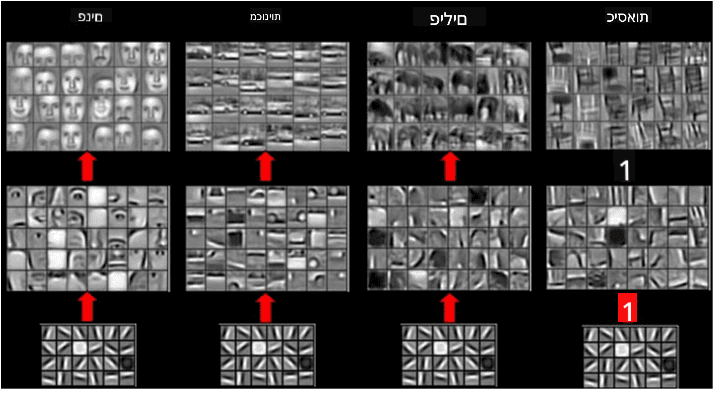

<!--
CO_OP_TRANSLATOR_METADATA:
{
  "original_hash": "088837b42b7d99198bf62db8a42411e0",
  "translation_date": "2025-08-28T19:24:31+00:00",
  "source_file": "lessons/4-ComputerVision/07-ConvNets/README.md",
  "language_code": "he"
}
-->
# רשתות עצביות קונבולוציוניות

ראינו בעבר שרשתות עצביות טובות מאוד בעיבוד תמונות, ואפילו פרספטון בעל שכבה אחת מסוגל לזהות ספרות כתובות ביד מתוך מאגר הנתונים MNIST בדיוק סביר. עם זאת, מאגר הנתונים MNIST הוא מיוחד מאוד, וכל הספרות ממורכזות בתוך התמונה, מה שמפשט את המשימה.

## [שאלון לפני ההרצאה](https://ff-quizzes.netlify.app/en/ai/quiz/13)

בחיים האמיתיים, אנחנו רוצים להיות מסוגלים לזהות אובייקטים בתמונה ללא קשר למיקומם המדויק בתמונה. ראייה ממוחשבת שונה מסיווג כללי, כי כשאנחנו מנסים למצוא אובייקט מסוים בתמונה, אנחנו סורקים את התמונה ומחפשים **תבניות** מסוימות ושילוביהן. לדוגמה, כשמחפשים חתול, אולי נתחיל בחיפוש קווים אופקיים שיכולים ליצור שפם, ואז שילוב מסוים של שפם יכול להצביע על כך שמדובר בתמונה של חתול. המיקום היחסי והנוכחות של תבניות מסוימות חשובים, ולא המיקום המדויק שלהן בתמונה.

כדי לחלץ תבניות, נשתמש במושג של **מסננים קונבולוציוניים**. כפי שאתם יודעים, תמונה מיוצגת על ידי מטריצה דו-ממדית או טנזור תלת-ממדי עם עומק צבע. יישום מסנן אומר שאנחנו לוקחים מטריצת **גרעין מסנן** קטנה יחסית, ולכל פיקסל בתמונה המקורית מחשבים ממוצע משוקלל עם נקודות שכנות. אפשר לראות זאת כמו חלון קטן שמחליק על פני כל התמונה וממוצע את כל הפיקסלים לפי המשקלים במטריצת גרעין המסנן.

 | 
----|----

> תמונה מאת דמיטרי סושניקוב

לדוגמה, אם ניישם מסנני קצה אנכי ואופקי בגודל 3x3 על הספרות של MNIST, נוכל לקבל הדגשות (למשל ערכים גבוהים) היכן שיש קצוות אנכיים ואופקיים בתמונה המקורית שלנו. כך ניתן להשתמש בשני המסננים הללו כדי "לחפש" קצוות. באופן דומה, ניתן לעצב מסננים שונים כדי לחפש תבניות ברמה נמוכה אחרות:

> תמונה של [מסנן Leung-Malik](https://www.robots.ox.ac.uk/~vgg/research/texclass/filters.html)

עם זאת, בעוד שניתן לעצב את המסננים כדי לחלץ תבניות מסוימות באופן ידני, ניתן גם לעצב את הרשת כך שהיא תלמד את התבניות באופן אוטומטי. זו אחת הרעיונות המרכזיים מאחורי רשתות עצביות קונבולוציוניות.

## רעיונות מרכזיים מאחורי רשתות עצביות קונבולוציוניות

האופן שבו רשתות עצביות קונבולוציוניות פועלות מבוסס על הרעיונות החשובים הבאים:

* מסננים קונבולוציוניים יכולים לחלץ תבניות
* ניתן לעצב את הרשת כך שהמסננים יוכשרו באופן אוטומטי
* ניתן להשתמש באותה גישה כדי למצוא תבניות בתכונות ברמה גבוהה, ולא רק בתמונה המקורית. כך, חילוץ התכונות ברשתות עצביות קונבולוציוניות עובד על היררכיה של תכונות, החל משילובי פיקסלים ברמה נמוכה ועד לשילובים ברמה גבוהה של חלקי תמונה.

> תמונה מתוך [מאמר של Hislop-Lynch](https://www.semanticscholar.org/paper/Computer-vision-based-pedestrian-trajectory-Hislop-Lynch/26e6f74853fc9bbb7487b06dc2cf095d36c9021d), מבוסס על [המחקר שלהם](https://dl.acm.org/doi/abs/10.1145/1553374.1553453)

## ✍️ תרגילים: רשתות עצביות קונבולוציוניות

בואו נמשיך לחקור כיצד רשתות עצביות קונבולוציוניות פועלות, וכיצד ניתן להשיג מסננים ניתנים לאימון, על ידי עבודה דרך המחברות המתאימות:

* [רשתות עצביות קונבולוציוניות - PyTorch](ConvNetsPyTorch.ipynb)
* [רשתות עצביות קונבולוציוניות - TensorFlow](ConvNetsTF.ipynb)

## ארכיטקטורת פירמידה

רוב הרשתות העצביות הקונבולוציוניות המשמשות לעיבוד תמונה עוקבות אחר מה שנקרא ארכיטקטורת פירמידה. השכבה הקונבולוציונית הראשונה שמיושמת על התמונות המקוריות בדרך כלל כוללת מספר נמוך יחסית של מסננים (8-16), שמייצגים שילובים שונים של פיקסלים, כמו קווים אופקיים/אנכיים של משיכות. ברמה הבאה, אנו מצמצמים את הממד המרחבי של הרשת ומגדילים את מספר המסננים, מה שמייצג יותר שילובים אפשריים של תכונות פשוטות. עם כל שכבה, ככל שאנו מתקדמים לעבר המסווג הסופי, הממדים המרחביים של התמונה מצטמצמים, ומספר המסננים גדל.

לדוגמה, בואו נסתכל על הארכיטקטורה של VGG-16, רשת שהשיגה דיוק של 92.7% בסיווג הטופ-5 של ImageNet בשנת 2014:

> תמונה מתוך [Researchgate](https://www.researchgate.net/figure/Vgg16-model-structure-To-get-the-VGG-NIN-model-we-replace-the-2-nd-4-th-6-th-7-th_fig2_335194493)

## הארכיטקטורות המוכרות ביותר של רשתות עצביות קונבולוציוניות

[המשיכו ללמוד על הארכיטקטורות המוכרות ביותר של רשתות עצביות קונבולוציוניות](CNN_Architectures.md)

---

**כתב ויתור**:  
מסמך זה תורגם באמצעות שירות תרגום מבוסס בינה מלאכותית [Co-op Translator](https://github.com/Azure/co-op-translator). למרות שאנו שואפים לדיוק, יש לקחת בחשבון שתרגומים אוטומטיים עשויים להכיל שגיאות או אי דיוקים. המסמך המקורי בשפתו המקורית צריך להיחשב כמקור סמכותי. עבור מידע קריטי, מומלץ להשתמש בתרגום מקצועי על ידי אדם. איננו נושאים באחריות לאי הבנות או לפרשנויות שגויות הנובעות משימוש בתרגום זה.