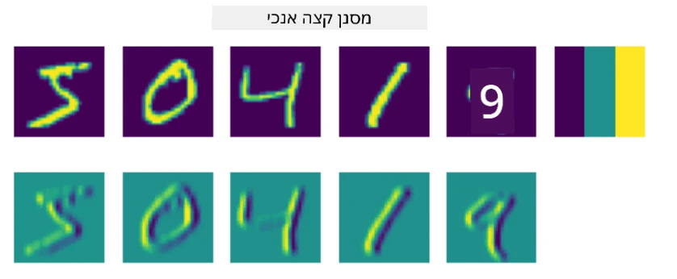
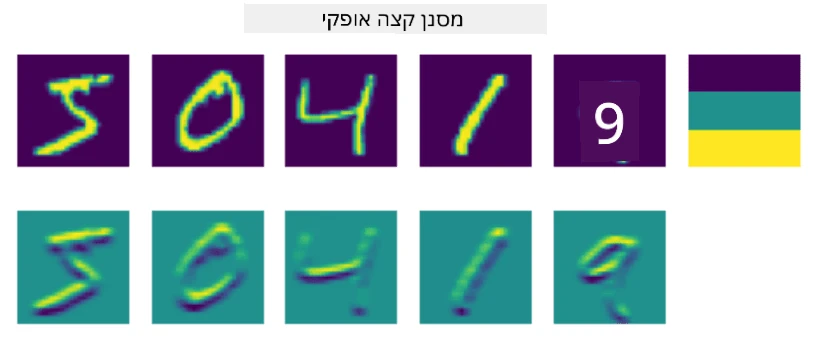

# רשתות נוירונים קונבולוציוניות

כבר ראינו בעבר שרשתות נוירונים טובות מאוד בעבודה עם תמונות, ואפילו פרספטרון בעל שכבה אחת מסוגל לזהות ספרות כתובות ביד מתוך מאגר הנתונים MNIST בדיוק סביר. עם זאת, מאגר הנתונים MNIST הוא מיוחד מאוד, וכל הספרות ממורכזות בתוך התמונה, מה שהופך את המשימה לפשוטה יותר.

## [שאלון לפני ההרצאה](https://ff-quizzes.netlify.app/en/ai/quiz/13)

בחיים האמיתיים, אנחנו רוצים להיות מסוגלים לזהות אובייקטים בתמונה ללא תלות במיקום המדויק שלהם בתמונה. ראייה ממוחשבת שונה מסיווג כללי, כי כשאנחנו מנסים למצוא אובייקט מסוים בתמונה, אנחנו סורקים את התמונה ומחפשים **תבניות** מסוימות ושילובים שלהן. לדוגמה, כשמחפשים חתול, ייתכן שנחפש תחילה קווים אופקיים שיכולים להוות שפם, ואז שילוב מסוים של שפמים יכול להצביע על כך שמדובר בתמונה של חתול. המיקום היחסי והנוכחות של תבניות מסוימות חשובים, ולא המיקום המדויק שלהן בתמונה.

כדי לחלץ תבניות, נשתמש במושג של **פילטרים קונבולוציוניים**. כפי שאתם יודעים, תמונה מיוצגת על ידי מטריצה דו-ממדית, או טנזור תלת-ממדי עם עומק צבע. החלת פילטר פירושה שאנחנו לוקחים מטריצת **ליבת פילטר** קטנה יחסית, ולכל פיקסל בתמונה המקורית מחשבים ממוצע משוקלל עם הנקודות השכנות. ניתן לראות זאת כמו חלון קטן שגולש על פני כל התמונה, וממוצע את כל הפיקסלים לפי המשקלים במטריצת ליבת הפילטר.

 | 
----|----

> תמונה מאת דמיטרי סושניקוב

לדוגמה, אם ניישם פילטרים של קצה אנכי וקצה אופקי בגודל 3x3 על הספרות של MNIST, נוכל לקבל הדגשות (למשל, ערכים גבוהים) היכן שיש קצוות אנכיים ואופקיים בתמונה המקורית שלנו. כך ניתן להשתמש בשני הפילטרים הללו כדי "לחפש" קצוות. באופן דומה, ניתן לעצב פילטרים שונים כדי לחפש תבניות בסיסיות אחרות:

> תמונה של [Leung-Malik Filter Bank](https://www.robots.ox.ac.uk/~vgg/research/texclass/filters.html)

עם זאת, בעוד שניתן לעצב פילטרים כדי לחלץ תבניות מסוימות באופן ידני, ניתן גם לעצב את הרשת כך שהיא תלמד את התבניות באופן אוטומטי. זהו אחד הרעיונות המרכזיים מאחורי רשתות נוירונים קונבולוציוניות (CNN).

## הרעיונות המרכזיים מאחורי CNN

אופן הפעולה של CNN מבוסס על הרעיונות החשובים הבאים:

* פילטרים קונבולוציוניים יכולים לחלץ תבניות
* ניתן לעצב את הרשת כך שהפילטרים יותאמו באופן אוטומטי
* ניתן להשתמש באותה גישה כדי למצוא תבניות בתכונות ברמה גבוהה, ולא רק בתמונה המקורית. כך, חילוץ התכונות ב-CNN עובד על היררכיה של תכונות, החל משילובי פיקסלים ברמה נמוכה ועד לשילובים ברמה גבוהה של חלקי תמונה.

> תמונה מתוך [מאמר של Hislop-Lynch](https://www.semanticscholar.org/paper/Computer-vision-based-pedestrian-trajectory-Hislop-Lynch/26e6f74853fc9bbb7487b06dc2cf095d36c9021d), המבוסס על [המחקר שלהם](https://dl.acm.org/doi/abs/10.1145/1553374.1553453)

## ✍️ תרגילים: רשתות נוירונים קונבולוציוניות

בואו נמשיך לחקור כיצד רשתות נוירונים קונבולוציוניות פועלות, וכיצד ניתן להשיג פילטרים ניתנים לאימון, על ידי עבודה דרך המחברות המתאימות:

* [רשתות נוירונים קונבולוציוניות - PyTorch](ConvNetsPyTorch.ipynb)
* [רשתות נוירונים קונבולוציוניות - TensorFlow](ConvNetsTF.ipynb)

## ארכיטקטורת פירמידה

רוב ה-CNN המשמשות לעיבוד תמונה עוקבות אחר מה שנקרא ארכיטקטורת פירמידה. השכבה הקונבולוציונית הראשונה המיושמת על התמונות המקוריות כוללת בדרך כלל מספר נמוך יחסית של פילטרים (8-16), המתאימים לשילובי פיקסלים שונים, כמו קווים אופקיים/אנכיים. ברמה הבאה, אנו מצמצמים את הממד המרחבי של הרשת ומגדילים את מספר הפילטרים, מה שמתאים ליותר שילובים אפשריים של תכונות פשוטות. עם כל שכבה, ככל שאנו מתקדמים לעבר המסווג הסופי, הממדים המרחביים של התמונה מצטמצמים, ומספר הפילטרים גדל.

לדוגמה, בואו נסתכל על הארכיטקטורה של VGG-16, רשת שהשיגה דיוק של 92.7% בסיווג הטופ-5 של ImageNet בשנת 2014:

> תמונה מתוך [Researchgate](https://www.researchgate.net/figure/Vgg16-model-structure-To-get-the-VGG-NIN-model-we-replace-the-2-nd-4-th-6-th-7-th_fig2_335194493)

## הארכיטקטורות המוכרות ביותר של CNN

[המשיכו ללמוד על הארכיטקטורות המוכרות ביותר של CNN](CNN_Architectures.md)

---

