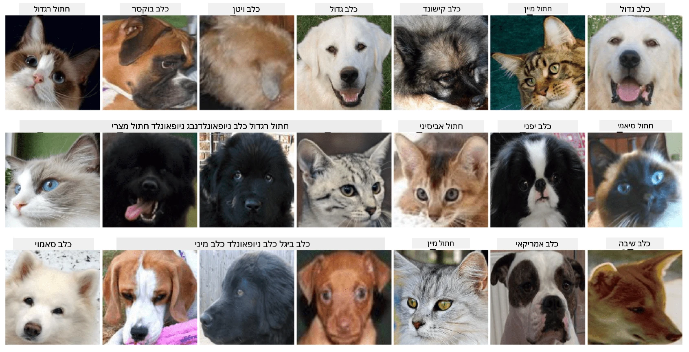

# סיווג פנים של חיות מחמד

משימת מעבדה מתוך [תוכנית הלימודים AI למתחילים](https://github.com/microsoft/ai-for-beginners).

## משימה

דמיינו שאתם צריכים לפתח אפליקציה למעון חיות מחמד כדי לקטלג את כל החיות. אחת התכונות הנהדרות של אפליקציה כזו תהיה זיהוי אוטומטי של הגזע מתוך תמונה. ניתן לבצע זאת בהצלחה באמצעות רשתות נוירונים.

עליכם לאמן רשת נוירונים קונבולוציונית כדי לסווג גזעים שונים של חתולים וכלבים באמצעות **מאגר נתוני פנים של חיות מחמד**.

## מאגר הנתונים

נשתמש ב-[מאגר הנתונים של Oxford-IIIT Pet](https://www.robots.ox.ac.uk/~vgg/data/pets/), המכיל תמונות של 37 גזעים שונים של כלבים וחתולים.



כדי להוריד את מאגר הנתונים, השתמשו בקטע הקוד הבא:

```python
!wget https://thor.robots.ox.ac.uk/~vgg/data/pets/images.tar.gz
!tar xfz images.tar.gz
!rm images.tar.gz
```

**הערה:** תמונות מאגר הנתונים של Oxford-IIIT Pet מאורגנות לפי שם הקובץ (לדוגמה, `Abyssinian_1.jpg`, `Bengal_2.jpg`). המחברת כוללת קוד לארגון התמונות הללו בתיקיות לפי גזע לצורך סיווג קל יותר.

## פתיחת המחברת

התחילו את המעבדה על ידי פתיחת [PetFaces.ipynb](PetFaces.ipynb)

## תובנות

פתרתם בעיה יחסית מורכבת של סיווג תמונות מאפס! היו לא מעט קטגוריות, ועדיין הצלחתם להגיע לדיוק סביר! יש גם היגיון למדוד דיוק top-k, מכיוון שקל להתבלבל בין כמה קטגוריות שאינן שונות באופן ברור אפילו עבור בני אדם.

---

**כתב ויתור**:  
מסמך זה תורגם באמצעות שירות תרגום מבוסס בינה מלאכותית [Co-op Translator](https://github.com/Azure/co-op-translator). למרות שאנו שואפים לדיוק, יש לקחת בחשבון שתרגומים אוטומטיים עשויים להכיל שגיאות או אי דיוקים. המסמך המקורי בשפתו המקורית צריך להיחשב כמקור סמכותי. עבור מידע קריטי, מומלץ להשתמש בתרגום מקצועי על ידי אדם. איננו נושאים באחריות לאי הבנות או לפרשנויות שגויות הנובעות משימוש בתרגום זה.