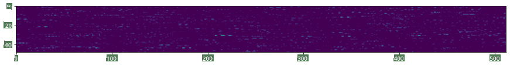
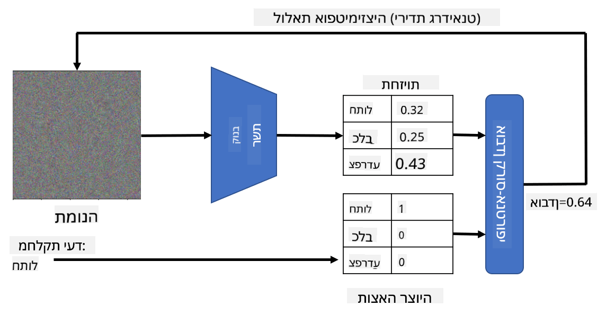

<!--
CO_OP_TRANSLATOR_METADATA:
{
  "original_hash": "717775c4050ccbffbe0c961ad8bf7bf7",
  "translation_date": "2025-08-28T19:27:14+00:00",
  "source_file": "lessons/4-ComputerVision/08-TransferLearning/README.md",
  "language_code": "he"
}
-->
# רשתות מאומנות מראש ולמידת העברה

אימון רשתות CNN יכול לקחת זמן רב, ונדרש לכך הרבה נתונים. עם זאת, חלק גדול מהזמן מושקע בלמידת הפילטרים הבסיסיים שהרשת יכולה להשתמש בהם כדי לחלץ תבניות מתמונות. עולה שאלה טבעית - האם ניתן להשתמש ברשת נוירונים שאומנה על מערך נתונים אחד ולהתאים אותה לסיווג תמונות שונות מבלי לבצע תהליך אימון מלא?

## [שאלון לפני ההרצאה](https://ff-quizzes.netlify.app/en/ai/quiz/15)

גישה זו נקראת **למידת העברה**, מכיוון שאנחנו מעבירים ידע ממודל רשת נוירונים אחד לאחר. בלמידת העברה, בדרך כלל מתחילים עם מודל מאומן מראש, שאומן על מערך נתונים גדול של תמונות, כמו **ImageNet**. מודלים אלו כבר יודעים לחלץ תכונות שונות מתמונות כלליות, וברוב המקרים בניית מסווג על גבי התכונות שהופקו יכולה להניב תוצאות טובות.

> ✅ למידת העברה הוא מונח שניתן למצוא גם בתחומים אקדמיים אחרים, כמו חינוך. הוא מתייחס לתהליך של לקיחת ידע מתחום אחד ויישומו בתחום אחר.

## מודלים מאומנים מראש כמחלצי תכונות

הרשתות הקונבולוציוניות שדיברנו עליהן בחלק הקודם מכילות מספר שכבות, שכל אחת מהן אמורה לחלץ תכונות מסוימות מהתמונה, החל משילובי פיקסלים ברמה נמוכה (כמו קווים אופקיים/אנכיים או משיכות מכחול), ועד שילובים ברמה גבוהה יותר של תכונות, כמו עין של להבה. אם נאמן רשת CNN על מערך נתונים גדול ומגוון מספיק של תמונות כלליות, הרשת תלמד לחלץ את התכונות הנפוצות הללו.

גם Keras וגם PyTorch מכילות פונקציות לטעינת משקלים של רשתות נוירונים מאומנות מראש עבור ארכיטקטורות נפוצות, שרובן אומנו על תמונות ImageNet. הארכיטקטורות הנפוצות ביותר מתוארות בעמוד [ארכיטקטורות CNN](../07-ConvNets/CNN_Architectures.md) מהשיעור הקודם. בפרט, ייתכן שתרצו לשקול שימוש באחת מהבאות:

* **VGG-16/VGG-19** - מודלים פשוטים יחסית שעדיין מספקים דיוק טוב. לעיתים שימוש ב-VGG כניסיון ראשון הוא בחירה טובה כדי לראות כיצד למידת העברה עובדת.
* **ResNet** - משפחת מודלים שהוצעה על ידי Microsoft Research בשנת 2015. יש להם יותר שכבות ולכן הם דורשים יותר משאבים.
* **MobileNet** - משפחת מודלים בגודל מופחת, המתאימה למכשירים ניידים. השתמשו בהם אם אתם מוגבלים במשאבים ויכולים להתפשר מעט על הדיוק.

להלן דוגמה לתכונות שהופקו מתמונה של חתול על ידי רשת VGG-16:

## מערך הנתונים של חתולים וכלבים

בדוגמה זו, נשתמש במערך נתונים של [חתולים וכלבים](https://www.microsoft.com/download/details.aspx?id=54765&WT.mc_id=academic-77998-cacaste), שהוא קרוב מאוד לתרחיש אמיתי של סיווג תמונות.

## ✍️ תרגיל: למידת העברה

בואו נראה את למידת ההעברה בפעולה במחברות המתאימות:

* [למידת העברה - PyTorch](TransferLearningPyTorch.ipynb)
* [למידת העברה - TensorFlow](TransferLearningTF.ipynb)

## ויזואליזציה של חתול אידיאלי

רשת נוירונים מאומנת מראש מכילה תבניות שונות בתוך ה"מוח" שלה, כולל מושגים של **חתול אידיאלי** (כמו גם כלב אידיאלי, זברה אידיאלית וכו'). יהיה מעניין לנסות **לראות את התמונה הזו**. עם זאת, זה לא פשוט, מכיוון שהתבניות מפוזרות בכל משקלי הרשת ומאורגנות במבנה היררכי.

גישה אחת שנוכל לנסות היא להתחיל מתמונה אקראית, ואז להשתמש בטכניקת **אופטימיזציית ירידת גרדיאנט** כדי להתאים את התמונה כך שהרשת תתחיל לחשוב שמדובר בחתול.

עם זאת, אם נעשה זאת, נקבל משהו שדומה מאוד לרעש אקראי. זאת מכיוון ש*יש דרכים רבות לגרום לרשת לחשוב שהתמונה הקלט היא חתול*, כולל כאלה שאין להן משמעות ויזואלית. למרות שהתמונות מכילות הרבה תבניות אופייניות לחתול, אין שום דבר שמכריח אותן להיות מובחנות ויזואלית.

כדי לשפר את התוצאה, נוכל להוסיף איבר נוסף לפונקציית האובדן, שנקרא **variation loss**. זהו מדד שמראה עד כמה הפיקסלים השכנים בתמונה דומים זה לזה. מזעור variation loss הופך את התמונה לחלקה יותר ומסיר רעש - ובכך חושף תבניות נעימות יותר לעין. להלן דוגמאות לתמונות "אידיאליות" כאלה, שמסווגות כחתול וכזברה בסבירות גבוהה:

 | 
-----|-----
*חתול אידיאלי* | *זברה אידיאלית*

גישה דומה יכולה לשמש לביצוע מה שנקרא **התקפות יריבותיות** על רשת נוירונים. נניח שאנחנו רוצים להטעות רשת נוירונים ולגרום לכלב להיראות כמו חתול. אם ניקח תמונה של כלב, שמזוהה על ידי הרשת ככלב, נוכל לשנות אותה מעט באמצעות אופטימיזציית ירידת גרדיאנט, עד שהרשת תתחיל לסווג אותה כחתול:

 | 
-----|-----
*תמונה מקורית של כלב* | *תמונה של כלב שמסווגת כחתול*

ראו את הקוד לשחזור התוצאות הנ"ל במחברת הבאה:

* [חתול אידיאלי ויריבותי - TensorFlow](AdversarialCat_TF.ipynb)

## סיכום

באמצעות למידת העברה, ניתן להרכיב במהירות מסווג למשימת סיווג אובייקטים מותאמת אישית ולהשיג דיוק גבוה. ניתן לראות שמשימות מורכבות יותר שאנחנו פותרים כעת דורשות כוח חישוב גבוה יותר, ולא ניתן לפתור אותן בקלות על גבי מעבד. ביחידה הבאה, ננסה להשתמש במימוש קל יותר כדי לאמן את אותו מודל תוך שימוש במשאבי חישוב נמוכים יותר, מה שמוביל לירידה קלה בלבד בדיוק.

## 🚀 אתגר

במחברות המצורפות, יש הערות בתחתית על כך שלמידת העברה עובדת בצורה הטובה ביותר עם נתוני אימון דומים במידה מסוימת (סוג חדש של בעל חיים, אולי). בצעו ניסויים עם סוגים חדשים לחלוטין של תמונות כדי לראות עד כמה מודלי למידת ההעברה שלכם מצליחים או לא מצליחים.

## [שאלון לאחר ההרצאה](https://ff-quizzes.netlify.app/en/ai/quiz/16)

## סקירה ולמידה עצמית

קראו את [TrainingTricks.md](TrainingTricks.md) כדי להעמיק את הידע שלכם בדרכים נוספות לאימון המודלים שלכם.

## [מטלה](lab/README.md)

במעבדה זו, נשתמש במערך הנתונים האמיתי של [Oxford-IIIT](https://www.robots.ox.ac.uk/~vgg/data/pets/) הכולל 35 גזעים של חתולים וכלבים, ונבנה מסווג למידת העברה.

---

**כתב ויתור**:  
מסמך זה תורגם באמצעות שירות תרגום מבוסס בינה מלאכותית [Co-op Translator](https://github.com/Azure/co-op-translator). למרות שאנו שואפים לדיוק, יש לקחת בחשבון שתרגומים אוטומטיים עשויים להכיל שגיאות או אי דיוקים. המסמך המקורי בשפתו המקורית צריך להיחשב כמקור סמכותי. עבור מידע קריטי, מומלץ להשתמש בתרגום מקצועי על ידי אדם. איננו נושאים באחריות לאי הבנות או לפרשנויות שגויות הנובעות משימוש בתרגום זה.