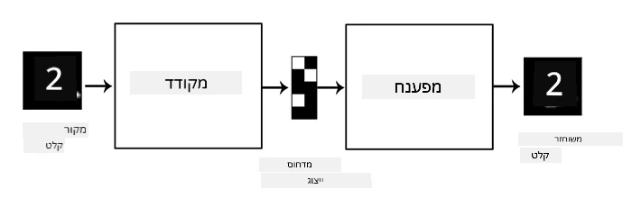
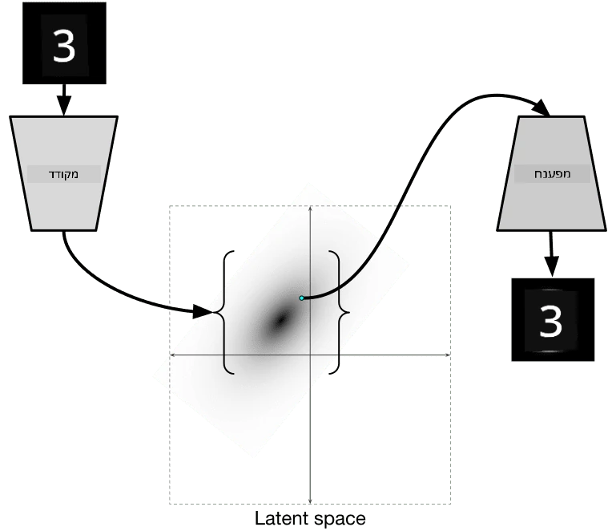
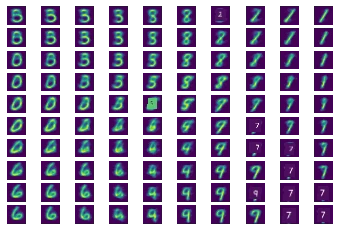

# אוטואנקודרים

בעת אימון רשתות CNN, אחת הבעיות היא הצורך בכמות גדולה של נתונים מתויגים. במקרה של סיווג תמונות, יש להפריד את התמונות לקבוצות שונות, מה שדורש מאמץ ידני.

## [שאלון לפני השיעור](https://ff-quizzes.netlify.app/en/ai/quiz/17)

עם זאת, ייתכן שנרצה להשתמש בנתונים גולמיים (לא מתויגים) כדי לאמן את רשתות ה-CNN לחילוץ מאפיינים, מה שנקרא **למידה עצמית-מונחית**. במקום תוויות, נשתמש בתמונות האימון גם כקלט וגם כפלט של הרשת. הרעיון המרכזי של **אוטואנקודר** הוא שיהיה לנו **רשת מקודדת** שממירה תמונת קלט למרחב **לטנטי** (בדרך כלל וקטור בגודל קטן יותר), ואז **רשת מפענחת**, שמטרתה לשחזר את התמונה המקורית.

> ✅ [אוטואנקודר](https://wikipedia.org/wiki/Autoencoder) הוא "סוג של רשת עצבית מלאכותית המשמשת ללמידת קידודים יעילים של נתונים לא מתויגים."

מכיוון שאנו מאמנים אוטואנקודר כדי ללכוד כמה שיותר מידע מהתמונה המקורית לצורך שחזור מדויק, הרשת מנסה למצוא את ה**הטמעה** הטובה ביותר של תמונות הקלט כדי ללכוד את המשמעות.

> תמונה מתוך [בלוג Keras](https://blog.keras.io/building-autoencoders-in-keras.html)

## תרחישים לשימוש באוטואנקודרים

למרות ששחזור תמונות מקוריות לא נראה שימושי בפני עצמו, ישנם כמה תרחישים שבהם אוטואנקודרים מועילים במיוחד:

* **הורדת ממדיות של תמונות לצורך ויזואליזציה** או **אימון הטמעות תמונה**. בדרך כלל אוטואנקודרים נותנים תוצאות טובות יותר מ-PCA, מכיוון שהם מתחשבים בטבע המרחבי של תמונות ובמאפיינים היררכיים.
* **הסרת רעשים**, כלומר הסרת רעש מהתמונה. מכיוון שרעש נושא מידע חסר תועלת רב, האוטואנקודר אינו יכול להתאים את כולו למרחב לטנטי קטן יחסית, ולכן הוא לוכד רק את החלק החשוב של התמונה. בעת אימון מסירי רעשים, מתחילים עם תמונות מקוריות ומשתמשים בתמונות עם רעש מלאכותי כתמונות קלט לאוטואנקודר.
* **שיפור רזולוציה**, הגדלת רזולוציית תמונה. מתחילים עם תמונות ברזולוציה גבוהה ומשתמשים בתמונה ברזולוציה נמוכה כקלט לאוטואנקודר.
* **מודלים גנרטיביים**. לאחר אימון האוטואנקודר, ניתן להשתמש בחלק המפענח כדי ליצור אובייקטים חדשים החל מוקטורים לטנטיים אקראיים.

## אוטואנקודרים וריאציוניים (VAE)

אוטואנקודרים מסורתיים מפחיתים את ממדי נתוני הקלט בצורה כלשהי, ומגלים את המאפיינים החשובים של תמונות הקלט. עם זאת, וקטורים לטנטיים לעיתים קרובות אינם מובנים. במילים אחרות, אם ניקח את מאגר הנתונים MNIST כדוגמה, קשה להבין אילו ספרות תואמות לוקטורים לטנטיים שונים, מכיוון שוקטורים לטנטיים קרובים לא בהכרח תואמים לאותן ספרות.

לעומת זאת, כדי לאמן מודלים *גנרטיביים* עדיף שיהיה לנו הבנה כלשהי של המרחב הלטנטי. רעיון זה מוביל אותנו ל**אוטואנקודר וריאציוני** (VAE).

VAE הוא אוטואנקודר שלומד לחזות *התפלגות סטטיסטית* של הפרמטרים הלטנטיים, מה שנקרא **התפלגות לטנטית**. לדוגמה, ייתכן שנרצה שוקטורים לטנטיים יהיו מופצים נורמלית עם ממוצע zmean וסטיית תקן zsigma (גם הממוצע וגם סטיית התקן הם וקטורים בעלי ממדיות מסוימת d). המקודד ב-VAE לומד לחזות את הפרמטרים הללו, ואז המפענח לוקח וקטור אקראי מההתפלגות הזו כדי לשחזר את האובייקט.

לסיכום:

* מתוך וקטור הקלט, אנו חוזים `z_mean` ו-`z_log_sigma` (במקום לחזות את סטיית התקן עצמה, אנו חוזים את הלוגריתם שלה)
* אנו דוגמים וקטור `sample` מההתפלגות N(zmean,exp(zlog\_sigma))
* המפענח מנסה לפענח את התמונה המקורית באמצעות `sample` כוקטור קלט

> תמונה מתוך [פוסט בבלוג](https://ijdykeman.github.io/ml/2016/12/21/cvae.html) מאת Isaak Dykeman

אוטואנקודרים וריאציוניים משתמשים בפונקציית הפסד מורכבת שמורכבת משני חלקים:

* **הפסד שחזור** הוא פונקציית הפסד שמראה עד כמה התמונה המשוחזרת קרובה ליעד (זה יכול להיות Mean Squared Error, או MSE). זו אותה פונקציית הפסד כמו באוטואנקודרים רגילים.
* **KL loss**, שמבטיח שהתפלגות המשתנים הלטנטיים תישאר קרובה להתפלגות נורמלית. זה מבוסס על מושג [סטיית קולבק-לייבלר](https://www.countbayesie.com/blog/2017/5/9/kullback-leibler-divergence-explained) - מדד להערכת הדמיון בין שתי התפלגויות סטטיסטיות.

יתרון חשוב של VAEs הוא שהם מאפשרים לנו ליצור תמונות חדשות יחסית בקלות, מכיוון שאנו יודעים מאיזו התפלגות לדגום וקטורים לטנטיים. לדוגמה, אם נאמן VAE עם וקטור לטנטי דו-ממדי על MNIST, נוכל לשנות את רכיבי הוקטור הלטנטי כדי לקבל ספרות שונות:

> תמונה מאת [Dmitry Soshnikov](http://soshnikov.com)

שימו לב כיצד התמונות מתמזגות זו בזו, כאשר אנו מתחילים לקבל וקטורים לטנטיים מחלקים שונים של מרחב הפרמטרים הלטנטיים. ניתן גם להמחיש את המרחב הזה ב-2D:

 

> תמונה מאת [Dmitry Soshnikov](http://soshnikov.com)

## ✍️ תרגילים: אוטואנקודרים

למדו עוד על אוטואנקודרים במחברות הבאות:

* [אוטואנקודרים ב-TensorFlow](AutoencodersTF.ipynb)
* [אוטואנקודרים ב-PyTorch](AutoEncodersPyTorch.ipynb)

## תכונות של אוטואנקודרים

* **ספציפיים לנתונים** - הם עובדים היטב רק עם סוג התמונות שעליהן אומנו. לדוגמה, אם נאמן רשת לשיפור רזולוציה על תמונות פרחים, היא לא תעבוד היטב על דיוקנאות. זאת מכיוון שהרשת יכולה ליצור תמונה ברזולוציה גבוהה על ידי לקיחת פרטים עדינים ממאפיינים שנלמדו ממאגר הנתונים.
* **מאבדים מידע** - התמונה המשוחזרת אינה זהה לתמונה המקורית. אופי האובדן מוגדר על ידי *פונקציית הפסד* שנעשה בה שימוש במהלך האימון.
* עובדים עם **נתונים לא מתויגים**

## [שאלון אחרי השיעור](https://ff-quizzes.netlify.app/en/ai/quiz/18)

## סיכום

בשיעור זה, למדתם על סוגים שונים של אוטואנקודרים הזמינים למדען AI. למדתם כיצד לבנות אותם וכיצד להשתמש בהם לשחזור תמונות. כמו כן, למדתם על VAE וכיצד להשתמש בו ליצירת תמונות חדשות.

## 🚀 אתגר

בשיעור זה, למדתם על שימוש באוטואנקודרים לתמונות. אך ניתן להשתמש בהם גם למוזיקה! בדקו את פרויקט [MusicVAE](https://magenta.tensorflow.org/music-vae) של פרויקט Magenta, שמשתמש באוטואנקודרים כדי ללמוד לשחזר מוזיקה. ערכו [ניסויים](https://colab.research.google.com/github/magenta/magenta-demos/blob/master/colab-notebooks/Multitrack_MusicVAE.ipynb) עם הספרייה הזו כדי לראות מה תוכלו ליצור.

## [שאלון אחרי השיעור](https://ff-quizzes.netlify.app/en/ai/quiz/16)

## סקירה ולימוד עצמי

לקריאה נוספת, עיינו במשאבים הבאים על אוטואנקודרים:

* [בניית אוטואנקודרים ב-Keras](https://blog.keras.io/building-autoencoders-in-keras.html)
* [פוסט בבלוג NeuroHive](https://neurohive.io/ru/osnovy-data-science/variacionnyj-avtojenkoder-vae/)
* [הסבר על אוטואנקודרים וריאציוניים](https://kvfrans.com/variational-autoencoders-explained/)
* [אוטואנקודרים וריאציוניים מותנים](https://ijdykeman.github.io/ml/2016/12/21/cvae.html)

## משימה

בסוף [המחברת הזו ב-TensorFlow](AutoencodersTF.ipynb), תמצאו 'משימה' - השתמשו בה כמשימה שלכם.

---

