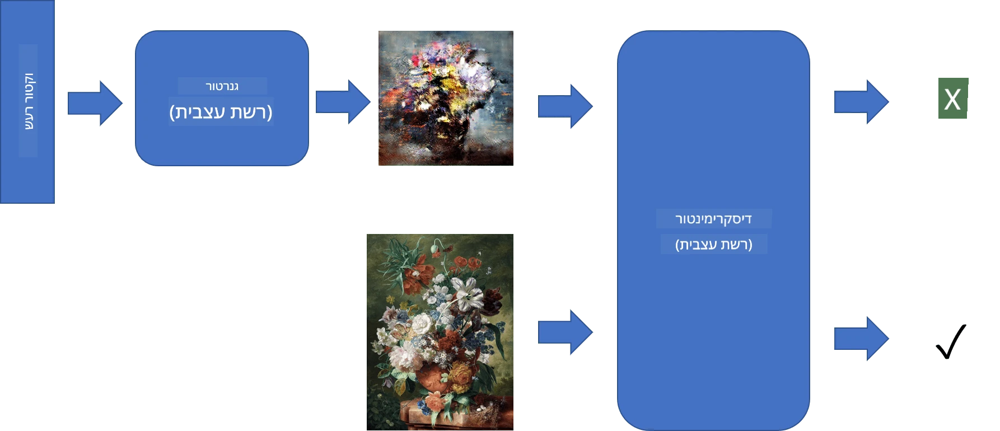
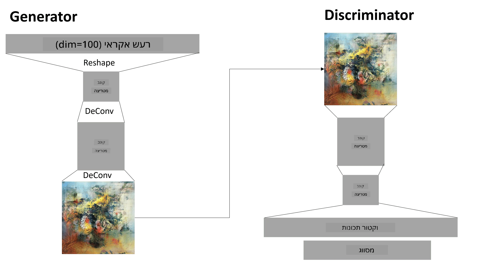

# רשתות גנרטיביות מתחרותיות (GANs)

בפרק הקודם למדנו על **מודלים גנרטיביים**: מודלים שיכולים לייצר תמונות חדשות הדומות לאלו שבמערך האימון. VAE היה דוגמה טובה למודל גנרטיבי.

## [שאלון לפני השיעור](https://ff-quizzes.netlify.app/en/ai/quiz/19)

עם זאת, אם ננסה לייצר משהו משמעותי באמת, כמו ציור ברזולוציה סבירה, באמצעות VAE, נגלה שהאימון לא מתכנס היטב. לשימוש כזה, עלינו ללמוד על ארכיטקטורה אחרת שמיועדת במיוחד למודלים גנרטיביים - **רשתות גנרטיביות מתחרותיות**, או GANs.

הרעיון המרכזי של GAN הוא להפעיל שתי רשתות נוירונים שמתאמנות אחת נגד השנייה:

> תמונה מאת [Dmitry Soshnikov](http://soshnikov.com)

> ✅ קצת אוצר מילים:
> * **Generator** (גנרטור) היא רשת שלוקחת וקטור אקראי ומייצרת תמונה כתוצאה.
> * **Discriminator** (דיסקרימינטור) היא רשת שלוקחת תמונה, והיא צריכה לקבוע האם זו תמונה אמיתית (ממערך האימון) או שהיא נוצרה על ידי הגנרטור. למעשה, מדובר בסיווג תמונה.

### דיסקרימינטור

הארכיטקטורה של הדיסקרימינטור אינה שונה מרשת סיווג תמונות רגילה. במקרה הפשוט ביותר, זו יכולה להיות רשת fully-connected, אך סביר להניח שהיא תהיה [רשת קונבולוציונית](../07-ConvNets/README.md).

> ✅ GAN המבוסס על רשתות קונבולוציוניות נקרא [DCGAN](https://arxiv.org/pdf/1511.06434.pdf)

דיסקרימינטור מבוסס CNN מורכב מהשכבות הבאות: מספר שכבות של קונבולוציה+Pooling (עם הקטנת גודל מרחבי), ואחת או יותר שכבות fully-connected ליצירת "וקטור תכונות", ולבסוף מסווג בינארי.

> ✅ 'Pooling' בהקשר זה הוא טכניקה שמקטינה את גודל התמונה. "שכבות Pooling מקטינות את ממדי הנתונים על ידי שילוב הפלטים של קבוצות נוירונים בשכבה אחת לנוירון יחיד בשכבה הבאה." - [מקור](https://wikipedia.org/wiki/Convolutional_neural_network#Pooling_layers)

### גנרטור

הגנרטור מעט יותר מורכב. ניתן לראות אותו כהיפוך של הדיסקרימינטור. הוא מתחיל מווקטור סמוי (במקום וקטור תכונות), יש לו שכבת fully-connected שממירה אותו לגודל/צורה הנדרשים, ואחריה שכבות deconvolutions+upscaling. זה דומה לחלק ה-*decoder* של [autoencoder](../09-Autoencoders/README.md).

> ✅ מכיוון ששכבת הקונבולוציה מיושמת כפילטר לינארי שעובר על התמונה, deconvolution דומה למעשה לקונבולוציה, וניתן ליישם אותו באמצעות אותה לוגיקה של שכבה.

> תמונה מאת [Dmitry Soshnikov](http://soshnikov.com)

### אימון ה-GAN

GANs נקראים **מתחרים** מכיוון שיש תחרות מתמדת בין הגנרטור לדיסקרימינטור. במהלך התחרות הזו, שניהם משתפרים, וכך הרשת לומדת לייצר תמונות טובות יותר ויותר.

האימון מתבצע בשני שלבים:

* **אימון הדיסקרימינטור**. משימה זו די פשוטה: אנו מייצרים אצווה של תמונות באמצעות הגנרטור, מסמנים אותן כ-0 (תמונות מזויפות), ולוקחים אצווה של תמונות ממערך הנתונים (מסומנות כ-1, תמונות אמיתיות). אנו מחשבים *discriminator loss* ומבצעים backprop.
* **אימון הגנרטור**. זה מעט יותר מורכב, מכיוון שאין לנו פלט צפוי ישיר עבור הגנרטור. אנו לוקחים את כל רשת ה-GAN, שמורכבת מגנרטור ואחריו דיסקרימינטור, מזינים אותה בווקטורים אקראיים, ומצפים שהתוצאה תהיה 1 (תמונות אמיתיות). בשלב זה אנו מקפיאים את הפרמטרים של הדיסקרימינטור (איננו רוצים שהוא יתאמן), ומבצעים backprop.

במהלך התהליך הזה, הפסדי הגנרטור והדיסקרימינטור לא יורדים באופן משמעותי. במצב אידיאלי, הם אמורים להתנדנד, מה שמעיד על שיפור הביצועים של שתי הרשתות.

## ✍️ תרגילים: GANs

* [מחברת GAN ב-TensorFlow/Keras](GANTF.ipynb)
* [מחברת GAN ב-PyTorch](GANPyTorch.ipynb)

### בעיות באימון GAN

GANs ידועים כקשים במיוחד לאימון. הנה כמה בעיות נפוצות:

* **קריסת מודל (Mode Collapse)**. הכוונה היא שהגנרטור לומד לייצר תמונה אחת מוצלחת שמטעה את הדיסקרימינטור, ולא מגוון של תמונות שונות.
* **רגישות להיפר-פרמטרים**. לעיתים ניתן לראות ש-GAN לא מתכנס כלל, ואז פתאום שינוי קטן בקצב הלמידה מוביל להתכנסות.
* שמירה על **איזון** בין הגנרטור לדיסקרימינטור. במקרים רבים הפסד הדיסקרימינטור יכול לרדת לאפס במהירות, מה שמונע מהגנרטור להמשיך להתאמן. כדי להתגבר על כך, ניתן לנסות להגדיר קצבי למידה שונים לגנרטור ולדיסקרימינטור, או לדלג על אימון הדיסקרימינטור אם הפסד שלו כבר נמוך מדי.
* אימון עבור **רזולוציה גבוהה**. בעיה זו דומה לבעיה עם autoencoders, והיא נגרמת מכך ששחזור שכבות רבות מדי של רשת קונבולוציונית מוביל לארטיפקטים. פתרון נפוץ הוא **גדילה פרוגרסיבית**, שבה תחילה מאמנים שכבות על תמונות ברזולוציה נמוכה, ואז "משחררים" או מוסיפים שכבות. פתרון נוסף הוא הוספת חיבורים בין שכבות ואימון בכמה רזולוציות בו-זמנית - ראו את המאמר [Multi-Scale Gradient GANs](https://arxiv.org/abs/1903.06048) לפרטים נוספים.

## העברת סגנון

GANs הם דרך נהדרת לייצר תמונות אמנותיות. טכניקה מעניינת נוספת היא **העברת סגנון**, שבה לוקחים **תמונת תוכן** ומציירים אותה מחדש בסגנון שונה, תוך יישום פילטרים מ-**תמונת סגנון**.

כך זה עובד:
* מתחילים מתמונת רעש אקראית (או מתמונת תוכן, אך לצורך ההבנה קל יותר להתחיל מרעש אקראי).
* המטרה היא ליצור תמונה שתהיה קרובה גם לתמונת התוכן וגם לתמונת הסגנון. זה נקבע על ידי שתי פונקציות הפסד:
   - **Content loss** מחושב על בסיס התכונות שמופקות על ידי ה-CNN בשכבות מסוימות מהתמונה הנוכחית ותמונת התוכן.
   - **Style loss** מחושב בין התמונה הנוכחית לתמונת הסגנון בצורה חכמה באמצעות מטריצות Gram (פרטים נוספים ב-[מחברת הדוגמה](StyleTransfer.ipynb)).
* כדי להפוך את התמונה לחלקה ולהסיר רעש, מוסיפים גם **Variation loss**, שמחשב את המרחק הממוצע בין פיקסלים שכנים.
* לולאת האופטימיזציה הראשית מתאימה את התמונה הנוכחית באמצעות ירידת גרדיאנט (או אלגוריתם אופטימיזציה אחר) כדי למזער את סך ההפסד, שהוא סכום משוקלל של כל שלושת ההפסדים.

## ✍️ דוגמה: [העברת סגנון](StyleTransfer.ipynb)

## [שאלון אחרי השיעור](https://ff-quizzes.netlify.app/en/ai/quiz/20)

## סיכום

בשיעור זה למדתם על GANs וכיצד לאמן אותם. כמו כן, למדתם על האתגרים המיוחדים שעומדים בפני סוג זה של רשתות נוירונים, וכמה אסטרטגיות להתמודדות איתם.

## 🚀 אתגר

הריצו את [מחברת העברת הסגנון](StyleTransfer.ipynb) עם תמונות משלכם.

## סקירה ולמידה עצמית

לקריאה נוספת על GANs, עיינו במשאבים הבאים:

* Marco Pasini, [10 Lessons I Learned Training GANs for one Year](https://towardsdatascience.com/10-lessons-i-learned-training-generative-adversarial-networks-gans-for-a-year-c9071159628)
* [StyleGAN](https://en.wikipedia.org/wiki/StyleGAN), ארכיטקטורת GAN שכדאי להכיר
* [יצירת אמנות גנרטיבית באמצעות GANs על Azure ML](https://soshnikov.com/scienceart/creating-generative-art-using-gan-on-azureml/)

## משימה

חזרו לאחת משתי המחברות הקשורות לשיעור זה ואמנו מחדש את ה-GAN על תמונות משלכם. מה תוכלו ליצור?

---

