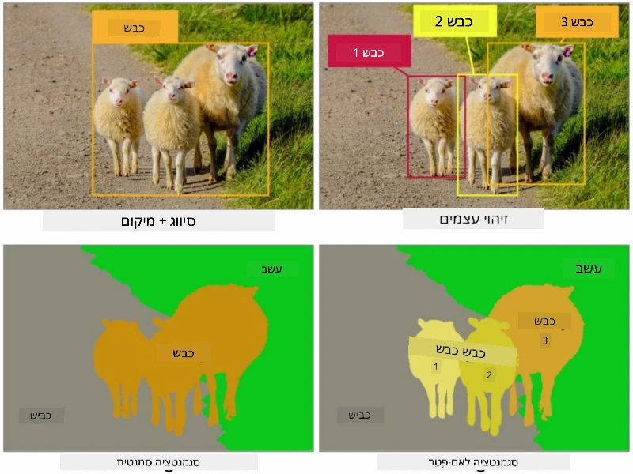
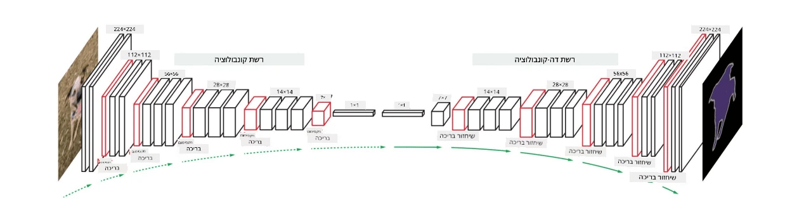

# סגמנטציה

למדנו בעבר על זיהוי אובייקטים, שמאפשר לנו לאתר אובייקטים בתמונה על ידי חיזוי *תיבות גבול*. עם זאת, עבור משימות מסוימות אנחנו לא רק צריכים תיבות גבול, אלא גם לוקליזציה מדויקת יותר של האובייקט. משימה זו נקראת **סגמנטציה**.

## [שאלון לפני השיעור](https://ff-quizzes.netlify.app/en/ai/quiz/23)

ניתן לראות סגמנטציה כ**סיווג פיקסלים**, כאשר עבור **כל** פיקסל בתמונה עלינו לחזות את הקטגוריה שלו (*רקע* הוא אחת הקטגוריות). קיימים שני אלגוריתמים עיקריים לסגמנטציה:

* **סגמנטציה סמנטית** רק מציינת את קטגוריית הפיקסל, ואינה מבדילה בין אובייקטים שונים מאותה קטגוריה.
* **סגמנטציה של מופעים** מחלקת את הקטגוריות למופעים שונים.

לדוגמה, בסגמנטציה של מופעים, הכבשים הללו הן אובייקטים שונים, אך בסגמנטציה סמנטית כל הכבשים מיוצגות כקטגוריה אחת.

> תמונה מתוך [הפוסט הזה](https://nirmalamurali.medium.com/image-classification-vs-semantic-segmentation-vs-instance-segmentation-625c33a08d50)

קיימות ארכיטקטורות נוירוניות שונות לסגמנטציה, אך לכולן יש מבנה דומה. במובן מסוים, זה דומה לאוטואנקודר שלמדתם עליו בעבר, אך במקום לפרק את התמונה המקורית, המטרה שלנו היא לפרק **מסכה**. לכן, לרשת סגמנטציה יש את החלקים הבאים:

* **מקודד** שמחלץ תכונות מהתמונה המקורית.
* **מפענח** שממיר את התכונות הללו לתוך **תמונת המסכה**, עם אותו גודל ומספר ערוצים התואם למספר הקטגוריות.

> תמונה מתוך [הפרסום הזה](https://arxiv.org/pdf/2001.05566.pdf)

יש לציין במיוחד את פונקציית ההפסד שמשתמשים בה עבור סגמנטציה. כאשר משתמשים באוטואנקודרים קלאסיים, עלינו למדוד את הדמיון בין שתי תמונות, וניתן להשתמש בשגיאת ממוצע ריבועים (MSE) לשם כך. בסגמנטציה, כל פיקסל בתמונת המסכה המטרה מייצג את מספר הקטגוריה (מקודד ב-one-hot לאורך הממד השלישי), ולכן עלינו להשתמש בפונקציות הפסד ספציפיות לסיווג - הפסד קרוס-אנטרופי, ממוצע על פני כל הפיקסלים. אם המסכה היא בינארית - משתמשים ב**הפסד קרוס-אנטרופי בינארי** (BCE).

> ✅ קידוד one-hot הוא דרך לקודד תווית קטגוריה לתוך וקטור באורך השווה למספר הקטגוריות. עיינו ב[מאמר הזה](https://datagy.io/sklearn-one-hot-encode/) על הטכניקה הזו.

## סגמנטציה עבור הדמיה רפואית

בשיעור הזה, נראה את הסגמנטציה בפעולה על ידי אימון רשת לזהות נבי אנושיים (המוכרים גם כנקודות חן) בתמונות רפואיות. נשתמש ב<a href="https://www.fc.up.pt/addi/ph2%20database.html">מאגר PH2</a> של תמונות דרמוסקופיה כמקור התמונות. מאגר זה מכיל 200 תמונות של שלוש קטגוריות: נבי טיפוסי, נבי לא טיפוסי ומלנומה. כל התמונות מכילות גם **מסכה** שמסמנת את הנבי.

> ✅ טכניקה זו מתאימה במיוחד לסוג זה של הדמיה רפואית, אך אילו יישומים נוספים בעולם האמיתי אתם יכולים לדמיין?

> תמונה מתוך מאגר PH2

נאמן מודל שיבצע סגמנטציה של כל נבי מהרקע שלו.

## ✍️ תרגילים: סגמנטציה סמנטית

פתחו את המחברות הבאות כדי ללמוד עוד על ארכיטקטורות שונות של סגמנטציה סמנטית, לתרגל עבודה איתן ולראות אותן בפעולה.

* [סגמנטציה סמנטית Pytorch](SemanticSegmentationPytorch.ipynb)
* [סגמנטציה סמנטית TensorFlow](SemanticSegmentationTF.ipynb)

## [שאלון אחרי השיעור](https://ff-quizzes.netlify.app/en/ai/quiz/24)

## סיכום

סגמנטציה היא טכניקה חזקה מאוד לסיווג תמונות, שמתקדמת מעבר לתיבות גבול לסיווג ברמת הפיקסל. זו טכניקה שמשתמשים בה בהדמיה רפואית, בין יישומים נוספים.

## 🚀 אתגר

סגמנטציה של גוף היא רק אחת מהמשימות הנפוצות שניתן לבצע עם תמונות של אנשים. משימות חשובות נוספות כוללות **זיהוי שלד** ו**זיהוי תנוחה**. נסו את ספריית [OpenPose](https://github.com/CMU-Perceptual-Computing-Lab/openpose) כדי לראות כיצד ניתן להשתמש בזיהוי תנוחה.

## סקירה ולימוד עצמי

המאמר הזה ב[ויקיפדיה](https://wikipedia.org/wiki/Image_segmentation) מציע סקירה טובה של היישומים השונים של הטכניקה הזו. למדו עוד בעצמכם על תתי-התחומים של סגמנטציה של מופעים וסגמנטציה פנופטית בתחום זה.

## [מטלה](lab/README.md)

במעבדה זו, נסו **סגמנטציה של גוף אנושי** באמצעות [מאגר Segmentation Full Body MADS Dataset](https://www.kaggle.com/datasets/tapakah68/segmentation-full-body-mads-dataset) מ-Kaggle.

---

