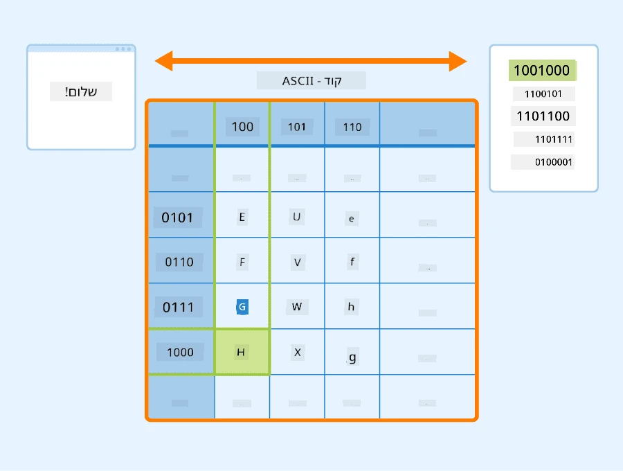
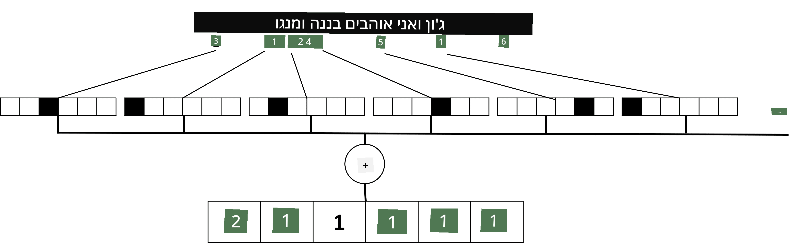

# ייצוג טקסט כטנסורים

## [מבחן לפני השיעור](https://ff-quizzes.netlify.app/en/ai/quiz/25)

## סיווג טקסט

במהלך החלק הראשון של הסעיף הזה, נתמקד במשימת **סיווג טקסט**. נשתמש במאגר הנתונים [AG News](https://www.kaggle.com/amananandrai/ag-news-classification-dataset), שמכיל כתבות חדשות כמו זו:

* קטגוריה: מדע/טכנולוגיה  
* כותרת: חברה מקנטקי זכתה במענק לחקר פפטידים (AP)  
* גוף: AP - חברה שהוקמה על ידי חוקר כימיה מאוניברסיטת לואיוויל זכתה במענק לפיתוח...

המטרה שלנו תהיה לסווג את פריט החדשות לאחת הקטגוריות על בסיס הטקסט.

## ייצוג טקסט

אם אנחנו רוצים לפתור משימות עיבוד שפה טבעית (NLP) באמצעות רשתות נוירונים, אנחנו צריכים דרך לייצג טקסט כטנסורים. מחשבים כבר מייצגים תווים טקסטואליים כמספרים שממופים לגופנים על המסך שלך באמצעות קידודים כמו ASCII או UTF-8.

> [מקור התמונה](https://www.seobility.net/en/wiki/ASCII)

כאנשים, אנחנו מבינים מה כל אות **מייצגת**, ואיך כל התווים מתחברים יחד כדי ליצור את המילים במשפט. עם זאת, מחשבים בעצמם אינם מבינים זאת, ורשת נוירונים צריכה ללמוד את המשמעות במהלך האימון.

לכן, ניתן להשתמש בגישות שונות לייצוג טקסט:

* **ייצוג ברמת תו**, שבו אנו מייצגים טקסט על ידי התייחסות לכל תו כמספר. בהינתן שיש לנו *C* תווים שונים בקורפוס הטקסט שלנו, המילה *Hello* תיוצג על ידי טנסור בגודל 5x*C*. כל אות תתאים לעמודת טנסור בקידוד one-hot.  
* **ייצוג ברמת מילה**, שבו אנו יוצרים **אוצר מילים** של כל המילים בטקסט שלנו, ואז מייצגים מילים באמצעות קידוד one-hot. גישה זו טובה יותר במידה מסוימת, מכיוון שלאות בודדת אין הרבה משמעות בפני עצמה, ולכן באמצעות מושגים סמנטיים ברמה גבוהה יותר - מילים - אנו מפשטים את המשימה עבור רשת הנוירונים. עם זאת, בהתחשב בגודל המילון הגדול, עלינו להתמודד עם טנסורים דלילים בעלי ממדים גבוהים.

לא משנה מה הייצוג, תחילה עלינו להמיר את הטקסט לרצף של **טוקנים**, כאשר טוקן אחד יכול להיות תו, מילה, או אפילו חלק ממילה. לאחר מכן, אנו ממירים את הטוקן למספר, בדרך כלל באמצעות **אוצר מילים**, ומספר זה יכול להיות מוזן לרשת נוירונים באמצעות קידוד one-hot.

## N-Grams

בשפה טבעית, המשמעות המדויקת של מילים יכולה להיקבע רק בהקשר. לדוגמה, המשמעויות של *רשת נוירונים* ו-*רשת דיג* שונות לחלוטין. אחת הדרכים להתחשב בכך היא לבנות את המודל שלנו על זוגות מילים, ולהתייחס לזוגות מילים כטוקנים נפרדים באוצר המילים. בדרך זו, המשפט *אני אוהב ללכת לדוג* ייוצג על ידי רצף הטוקנים הבא: *אני אוהב*, *אוהב ללכת*, *ללכת לדוג*. הבעיה בגישה זו היא שגודל המילון גדל משמעותית, ושילובים כמו *ללכת לדוג* ו-*ללכת לקניות* מיוצגים על ידי טוקנים שונים, שאינם חולקים שום דמיון סמנטי למרות אותו פועל.

במקרים מסוימים, ניתן לשקול שימוש בטרי-גרמים -- שילובים של שלוש מילים -- גם כן. לכן, גישה זו נקראת לעיתים **n-grams**. כמו כן, יש היגיון להשתמש ב-n-grams עם ייצוג ברמת תו, שבו n-grams יתאימו בערך להברות שונות.

## Bag-of-Words ו-TF/IDF

כאשר פותרים משימות כמו סיווג טקסט, אנו צריכים להיות מסוגלים לייצג טקסט על ידי וקטור בגודל קבוע, אותו נשתמש כקלט למסווג הסופי הצפוף. אחת הדרכים הפשוטות לעשות זאת היא לשלב את כל ייצוגי המילים הבודדות, למשל על ידי חיבורם. אם נחבר את קידודי ה-one-hot של כל מילה, נקבל וקטור של תדירויות, שמראה כמה פעמים כל מילה מופיעה בתוך הטקסט. ייצוג כזה של טקסט נקרא **bag of words** (BoW).

> תמונה מאת המחבר

BoW למעשה מייצג אילו מילים מופיעות בטקסט ובאילו כמויות, מה שיכול להיות אינדיקציה טובה למה הטקסט עוסק בו. לדוגמה, כתבת חדשות על פוליטיקה עשויה להכיל מילים כמו *נשיא* ו-*מדינה*, בעוד פרסום מדעי עשוי לכלול מילים כמו *מאיץ חלקיקים*, *גילוי*, וכו'. לכן, תדירויות מילים יכולות במקרים רבים להיות אינדיקטור טוב לתוכן הטקסט.

הבעיה עם BoW היא שמילים מסוימות נפוצות, כמו *ו*, *הוא*, וכו', מופיעות ברוב הטקסטים, ויש להן תדירויות גבוהות, מה שמטשטש את המילים שבאמת חשובות. ניתן להוריד את החשיבות של אותן מילים על ידי התחשבות בתדירות שבה מילים מופיעות בכל אוסף המסמכים. זו הרעיון המרכזי מאחורי גישת TF/IDF, שמכוסה בפירוט רב יותר במחברות המצורפות לשיעור זה.

עם זאת, אף אחת מהגישות הללו אינה יכולה לקחת בחשבון באופן מלא את **הסמנטיקה** של הטקסט. אנו זקוקים למודלים רשתות נוירונים חזקים יותר כדי לעשות זאת, אותם נדון בהמשך בסעיף זה.

## ✍️ תרגילים: ייצוג טקסט

המשיכו ללמוד במחברות הבאות:

* [ייצוג טקסט עם PyTorch](TextRepresentationPyTorch.ipynb)  
* [ייצוג טקסט עם TensorFlow](TextRepresentationTF.ipynb)  

## סיכום

עד כה, למדנו טכניקות שיכולות להוסיף משקל תדירות למילים שונות. עם זאת, הן אינן מסוגלות לייצג משמעות או סדר. כפי שאמר הבלשן המפורסם ג'. ר. פירת' בשנת 1935, "המשמעות המלאה של מילה תמיד תלויה בהקשר, ואין לקחת ברצינות שום מחקר על משמעות מחוץ להקשר." נלמד בהמשך הקורס כיצד ללכוד מידע הקשרי מטקסט באמצעות מודלים שפתיים.

## 🚀 אתגר

נסו תרגילים נוספים באמצעות bag-of-words ומודלים נתונים שונים. ייתכן שתמצאו השראה בתחרות זו ב-[Kaggle](https://www.kaggle.com/competitions/word2vec-nlp-tutorial/overview/part-1-for-beginners-bag-of-words)

## [מבחן אחרי השיעור](https://ff-quizzes.netlify.app/en/ai/quiz/26)

## סקירה ולימוד עצמי

תרגלו את המיומנויות שלכם עם טכניקות הטמעת טקסט ו-bag-of-words ב-[Microsoft Learn](https://docs.microsoft.com/learn/modules/intro-natural-language-processing-pytorch/?WT.mc_id=academic-77998-cacaste)

## [מטלה: מחברות](assignment.md)

---

