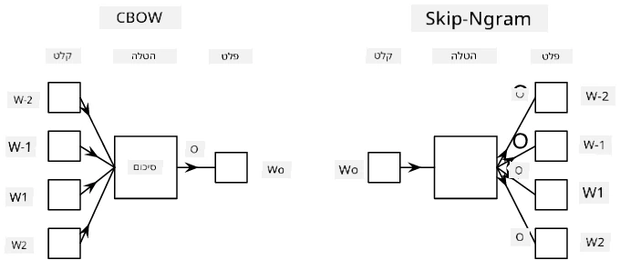

# מודל שפה

הטמעות סמנטיות, כמו Word2Vec ו-GloVe, הן למעשה צעד ראשון לקראת **מודל שפה** - יצירת מודלים שמבינים (או מייצגים) בצורה כלשהי את טבע השפה.

## [שאלון לפני השיעור](https://ff-quizzes.netlify.app/en/ai/quiz/29)

הרעיון המרכזי מאחורי מודל שפה הוא אימון על מערכי נתונים לא מתויגים בצורה לא מפוקחת. זה חשוב מכיוון שיש לנו כמויות עצומות של טקסט לא מתויג, בעוד שכמות הטקסט המתויג תמיד תהיה מוגבלת על ידי המאמץ שנוכל להשקיע בתיוג. לרוב, ניתן לבנות מודלים שפה שיכולים **לחזות מילים חסרות** בטקסט, מכיוון שקל להסתיר מילה אקראית בטקסט ולהשתמש בה כדוגמת אימון.

## אימון הטמעות

בדוגמאות הקודמות שלנו, השתמשנו בהטמעות סמנטיות מוכנות מראש, אך מעניין לראות כיצד ניתן לאמן את ההטמעות הללו. ישנם כמה רעיונות אפשריים שניתן להשתמש בהם:

* **מודל שפה N-Gram**, שבו אנו חוזים טוקן על ידי התבוננות ב-N טוקנים קודמים (N-gram).
* **Continuous Bag-of-Words** (CBoW), שבו אנו חוזים את הטוקן האמצעי $W_0$ ברצף טוקנים $W_{-N}$, ..., $W_N$.
* **Skip-gram**, שבו אנו חוזים סט של טוקנים סמוכים {$W_{-N},\dots, W_{-1}, W_1,\dots, W_N$} מתוך הטוקן האמצעי $W_0$.

> תמונה מתוך [המאמר הזה](https://arxiv.org/pdf/1301.3781.pdf)

## ✍️ מחברות לדוגמה: אימון מודל CBoW

המשיכו ללמוד במחברות הבאות:

* [אימון CBoW Word2Vec עם TensorFlow](CBoW-TF.ipynb)
* [אימון CBoW Word2Vec עם PyTorch](CBoW-PyTorch.ipynb)

## סיכום

בשיעור הקודם ראינו שהטמעות מילים עובדות כמו קסם! עכשיו אנחנו יודעים שאימון הטמעות מילים אינו משימה מורכבת מאוד, ואנו יכולים לאמן הטמעות מילים משלנו לטקסטים ספציפיים לתחום במידת הצורך.

## [שאלון אחרי השיעור](https://ff-quizzes.netlify.app/en/ai/quiz/30)

## סקירה ולימוד עצמי

* [המדריך הרשמי של PyTorch על מודל שפה](https://pytorch.org/tutorials/beginner/nlp/word_embeddings_tutorial.html).
* [המדריך הרשמי של TensorFlow על אימון מודל Word2Vec](https://www.TensorFlow.org/tutorials/text/word2vec).
* שימוש במסגרת **gensim** לאימון הטמעות הנפוצות ביותר בכמה שורות קוד מתואר [בתיעוד הזה](https://pytorch.org/tutorials/beginner/nlp/word_embeddings_tutorial.html).

## 🚀 [משימה: אימון מודל Skip-Gram](lab/README.md)

במעבדה, אנו מאתגרים אתכם לשנות את הקוד מהשיעור הזה כדי לאמן מודל Skip-Gram במקום CBoW. [קראו את הפרטים](lab/README.md)

---

