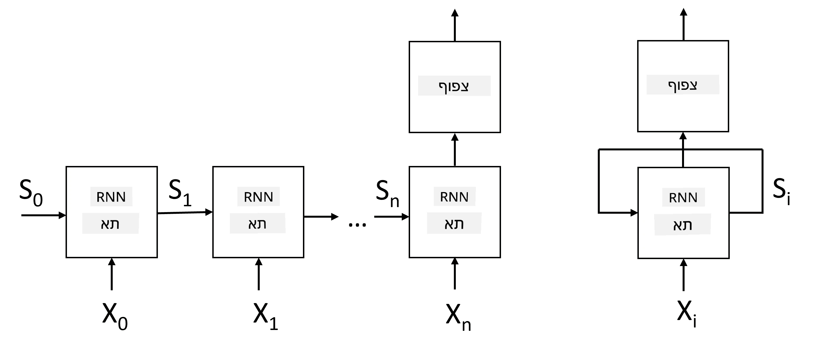
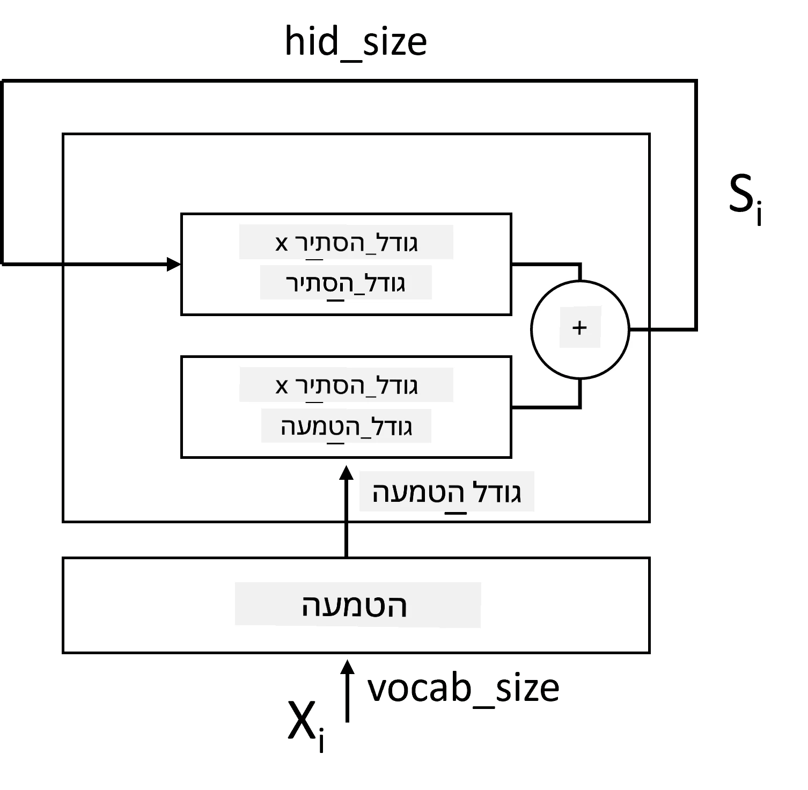
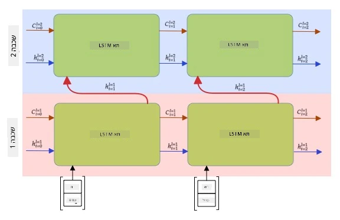

# רשתות עצביות חוזרות

## [שאלון לפני ההרצאה](https://ff-quizzes.netlify.app/en/ai/quiz/31)

בקטעים הקודמים השתמשנו בייצוגים סמנטיים עשירים של טקסט ובמסווג ליניארי פשוט מעל ההטמעות. מה שהארכיטקטורה הזו עושה הוא לתפוס את המשמעות המצטברת של מילים במשפט, אך היא אינה מתחשבת ב**סדר** המילים, מכיוון שפעולת ההטמעה מעל ההטמעות הסירה את המידע הזה מהטקסט המקורי. מכיוון שמודלים אלו אינם מסוגלים לדגם את סדר המילים, הם אינם יכולים לפתור משימות מורכבות או עמומות יותר כמו יצירת טקסט או מענה על שאלות.

כדי לתפוס את המשמעות של רצף טקסט, עלינו להשתמש בארכיטקטורה אחרת של רשת עצבית, הנקראת **רשת עצבית חוזרת**, או RNN. ב-RNN, אנו מעבירים את המשפט דרך הרשת סמל אחד בכל פעם, והרשת מייצרת **מצב** מסוים, אותו אנו מעבירים שוב לרשת עם הסמל הבא.

> תמונה מאת המחבר

בהינתן רצף הקלט של טוקנים X0,...,Xn, RNN יוצרת רצף של בלוקים של רשת עצבית, ומאמנת את הרצף הזה מקצה לקצה באמצעות שיטת ה-backpropagation. כל בלוק רשת מקבל זוג (Xi,Si) כקלט, ומייצר את Si+1 כתוצאה. המצב הסופי Sn או (פלט Yn) מועבר למסווג ליניארי כדי לייצר את התוצאה. כל בלוקי הרשת חולקים את אותם משקלים, ומאומנים מקצה לקצה באמצעות מעבר אחד של backpropagation.

מכיוון שוקטורי המצב S0,...,Sn מועברים דרך הרשת, היא מסוגלת ללמוד את התלות הסדרתית בין מילים. לדוגמה, כאשר המילה *לא* מופיעה במקום כלשהו ברצף, היא יכולה ללמוד לשלול אלמנטים מסוימים בתוך וקטור המצב, מה שמוביל לשלילה.

> ✅ מכיוון שהמשקלים של כל בלוקי ה-RNN בתמונה למעלה משותפים, ניתן לייצג את אותה תמונה כבלוק אחד (מימין) עם לולאת משוב חוזרת, שמעבירה את מצב הפלט של הרשת חזרה לקלט.

## אנטומיה של תא RNN

בואו נראה כיצד תא RNN פשוט מאורגן. הוא מקבל את המצב הקודם Si-1 ואת הסמל הנוכחי Xi כקלטים, ועליו לייצר את מצב הפלט Si (ולפעמים, אנו גם מתעניינים בפלט אחר Yi, כמו במקרה של רשתות גנרטיביות).

לתא RNN פשוט יש שני מטריצות משקל בפנים: אחת ממירה סמל קלט (נקרא לה W), ואחת ממירה מצב קלט (H). במקרה זה, הפלט של הרשת מחושב כ-&sigma;(W&times;Xi+H&times;Si-1+b), כאשר &sigma; היא פונקציית האקטיבציה ו-b הוא הטיה נוספת.

> תמונה מאת המחבר

במקרים רבים, טוקני הקלט מועברים דרך שכבת הטמעה לפני הכניסה ל-RNN כדי להקטין את הממדיות. במקרה זה, אם הממד של וקטורי הקלט הוא *emb_size*, ווקטור המצב הוא *hid_size* - גודל W הוא *emb_size*&times;*hid_size*, וגודל H הוא *hid_size*&times;*hid_size*.

## זיכרון ארוך וקצר טווח (LSTM)

אחת הבעיות המרכזיות של RNN קלאסיים היא בעיית **הגרדיאנטים הנעלמים**. מכיוון ש-RNNs מאומנים מקצה לקצה במעבר אחד של backpropagation, יש להם קושי להפיץ שגיאה לשכבות הראשונות של הרשת, ולכן הרשת אינה יכולה ללמוד קשרים בין טוקנים רחוקים. אחת הדרכים להימנע מבעיה זו היא להכניס **ניהול מצב מפורש** באמצעות שימוש ב**שערים**. ישנן שתי ארכיטקטורות ידועות מסוג זה: **זיכרון ארוך וקצר טווח** (LSTM) ויחידת ממסר משולבת (GRU).

> מקור תמונה TBD

רשת LSTM מאורגנת בצורה דומה ל-RNN, אך ישנם שני מצבים שעוברים משכבה לשכבה: המצב האמיתי C, ווקטור המצב הנסתר H. בכל יחידה, וקטור המצב הנסתר Hi משולב עם הקלט Xi, והם שולטים במה שקורה למצב C באמצעות **שערים**. כל שער הוא רשת עצבית עם אקטיבציה מסוג סיגמואיד (פלט בטווח [0,1]), שניתן לחשוב עליו כמסכה ביטית כאשר הוא מוכפל בוקטור המצב. ישנם השערים הבאים (משמאל לימין בתמונה למעלה):

* **שער השכחה** לוקח וקטור נסתר וקובע אילו רכיבים של וקטור C אנו צריכים לשכוח ואילו להעביר הלאה.
* **שער הקלט** לוקח מידע מסוים מהקלט ומהוקטורים הנסתרים ומכניס אותו למצב.
* **שער הפלט** ממיר מצב דרך שכבה ליניארית עם אקטיבציה מסוג *tanh*, ואז בוחר כמה מרכיביו באמצעות וקטור נסתר Hi כדי לייצר מצב חדש Ci+1.

ניתן לחשוב על רכיבי המצב C כעל דגלים שניתן להפעיל ולכבות. לדוגמה, כאשר אנו נתקלים בשם *אליס* ברצף, ייתכן שנרצה להניח שהוא מתייחס לדמות נשית, ולהרים את הדגל במצב שיש לנו שם עצם נשי במשפט. כאשר אנו נתקלים בהמשך בביטוי *וגם טום*, נרים את הדגל שיש לנו שם עצם ברבים. כך, על ידי מניפולציה של המצב, אנו יכולים לכאורה לעקוב אחר התכונות הדקדוקיות של חלקי המשפט.

> ✅ משאב מצוין להבנת הפנימיות של LSTM הוא המאמר הנהדר הזה [Understanding LSTM Networks](https://colah.github.io/posts/2015-08-Understanding-LSTMs/) מאת כריסטופר אולה.

## RNN דו-כיווני ורב-שכבתי

דנו ברשתות חוזרות שפועלות בכיוון אחד, מתחילת רצף ועד סופו. זה נראה טבעי, מכיוון שזה דומה לאופן שבו אנו קוראים ומקשיבים לדיבור. עם זאת, מכיוון שבמקרים רבים יש לנו גישה אקראית לרצף הקלט, ייתכן שיהיה הגיוני להריץ חישוב חוזר בשני הכיוונים. רשתות כאלה נקראות **RNN דו-כיווני**. כאשר מתמודדים עם רשת דו-כיוונית, נצטרך שני וקטורי מצב נסתרים, אחד לכל כיוון.

רשת חוזרת, בין אם חד-כיוונית או דו-כיוונית, תופסת דפוסים מסוימים בתוך רצף, ויכולה לאחסן אותם בוקטור מצב או להעבירם לפלט. כמו ברשתות קונבולוציה, אנו יכולים לבנות שכבה חוזרת נוספת מעל הראשונה כדי לתפוס דפוסים ברמה גבוהה יותר ולבנות מדפוסים ברמה נמוכה שנלכדו על ידי השכבה הראשונה. זה מוביל אותנו למושג של **RNN רב-שכבתי** שמורכב משתי רשתות חוזרות או יותר, כאשר הפלט של השכבה הקודמת מועבר לשכבה הבאה כקלט.

*תמונה מתוך [הפוסט הנהדר הזה](https://towardsdatascience.com/from-a-lstm-cell-to-a-multilayer-lstm-network-with-pytorch-2899eb5696f3) מאת פרננדו לופז*

## ✍️ תרגילים: הטמעות

המשיכו ללמוד במחברות הבאות:

* [RNNs עם PyTorch](RNNPyTorch.ipynb)
* [RNNs עם TensorFlow](RNNTF.ipynb)

## סיכום

ביחידה זו, ראינו ש-RNNs יכולים לשמש לסיווג רצפים, אך למעשה, הם יכולים להתמודד עם משימות רבות נוספות, כמו יצירת טקסט, תרגום מכונה ועוד. נבחן את המשימות הללו ביחידה הבאה.

## 🚀 אתגר

קראו ספרות על LSTMs ושקלו את היישומים שלהם:

- [Grid Long Short-Term Memory](https://arxiv.org/pdf/1507.01526v1.pdf)
- [Show, Attend and Tell: Neural Image Caption
Generation with Visual Attention](https://arxiv.org/pdf/1502.03044v2.pdf)

## [שאלון אחרי ההרצאה](https://ff-quizzes.netlify.app/en/ai/quiz/32)

## סקירה ולימוד עצמי

- [Understanding LSTM Networks](https://colah.github.io/posts/2015-08-Understanding-LSTMs/) מאת כריסטופר אולה.

## [מטלה: מחברות](assignment.md)

---

