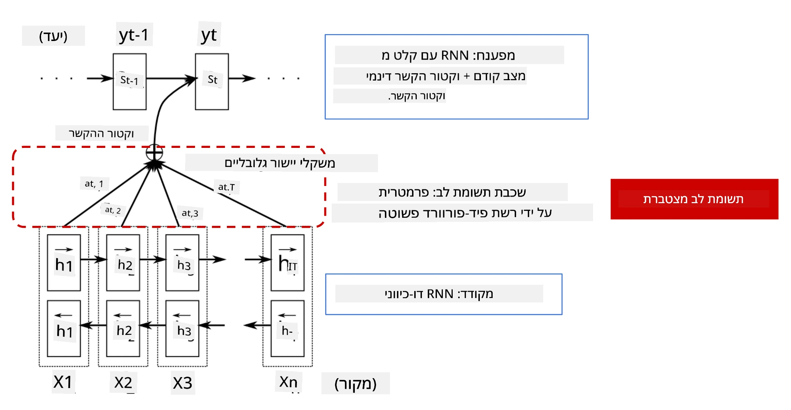
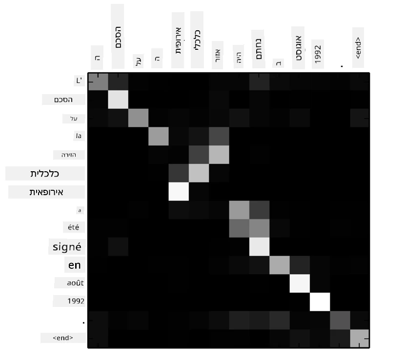
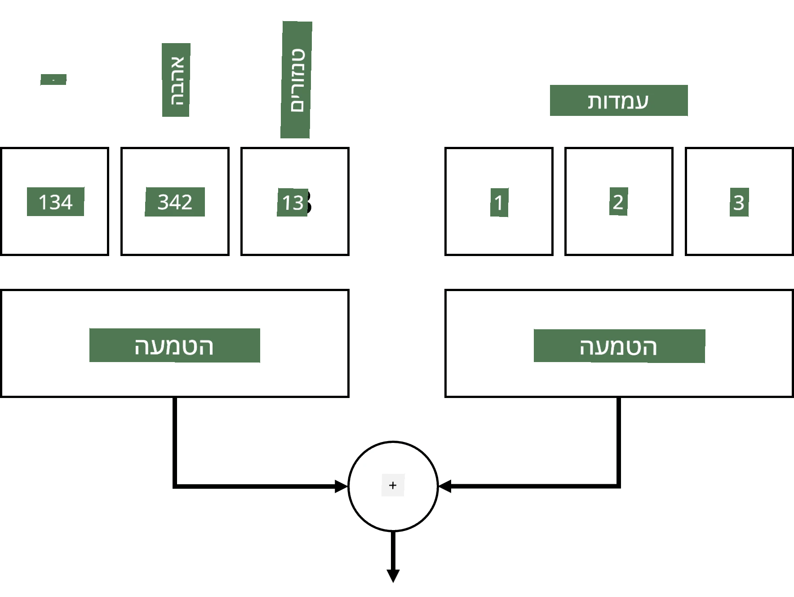
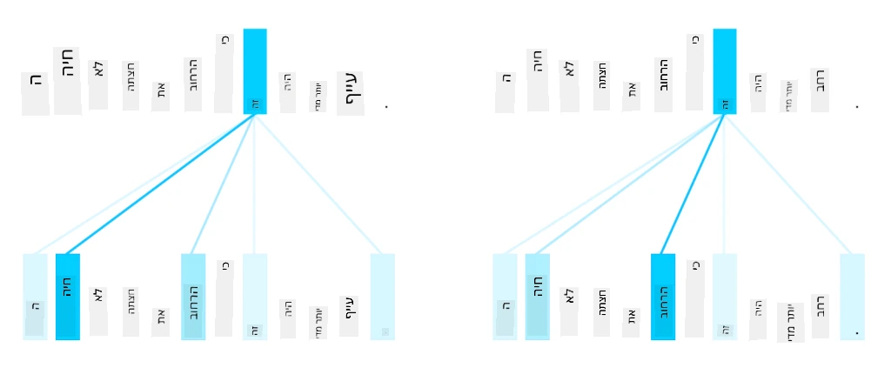
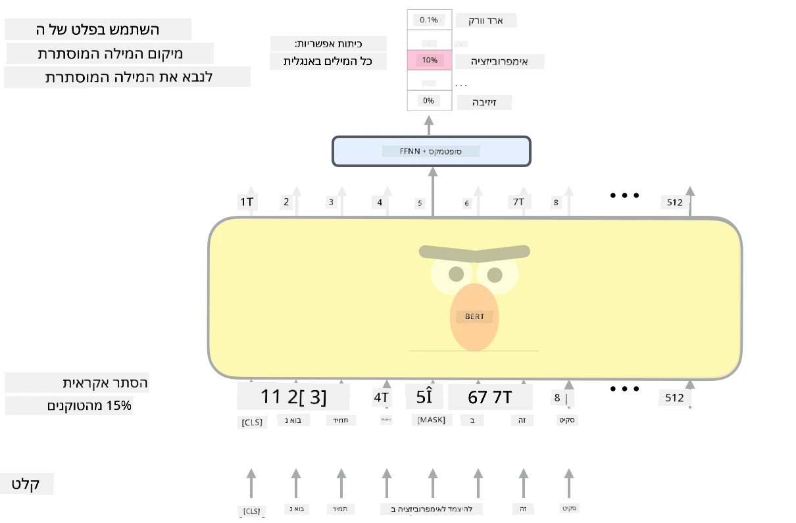

# מנגנוני קשב ומודלים של טרנספורמרים

## [שאלון לפני ההרצאה](https://ff-quizzes.netlify.app/en/ai/quiz/35)

אחת הבעיות החשובות ביותר בתחום עיבוד השפה הטבעית (NLP) היא **תרגום מכונה**, משימה חיונית שעומדת בבסיס כלים כמו Google Translate. בחלק זה נתמקד בתרגום מכונה, או באופן כללי יותר, בכל משימה של *רצף-לרצף* (המכונה גם **העברת משפטים**).

עם רשתות RNN, משימות רצף-לרצף מיושמות באמצעות שתי רשתות חוזרות, כאשר רשת אחת, ה-**encoder**, דוחסת רצף קלט למצב מוסתר, בעוד רשת אחרת, ה-**decoder**, פותחת את המצב המוסתר לתוצאה מתורגמת. ישנן כמה בעיות בגישה זו:

* המצב הסופי של רשת ה-encoder מתקשה לזכור את תחילת המשפט, מה שגורם לאיכות נמוכה של המודל במשפטים ארוכים.
* לכל המילים ברצף יש השפעה זהה על התוצאה. במציאות, לעומת זאת, למילים מסוימות ברצף הקלט יש השפעה רבה יותר על הפלט מאשר לאחרות.

**מנגנוני קשב** מספקים דרך לשקלל את ההשפעה ההקשרית של כל וקטור קלט על כל תחזית פלט של ה-RNN. זה מיושם על ידי יצירת קיצורי דרך בין המצבים הביניים של ה-RNN הקלט לבין ה-RNN הפלט. כך, בעת יצירת סמל פלט yt, ניקח בחשבון את כל המצבים המוסתרים של הקלט hi, עם מקדמי משקל שונים &alpha;t,i.

> מודל ה-encoder-decoder עם מנגנון קשב אדיטיבי מתוך [Bahdanau et al., 2015](https://arxiv.org/pdf/1409.0473.pdf), מצוטט מתוך [פוסט בבלוג זה](https://lilianweng.github.io/lil-log/2018/06/24/attention-attention.html)

מטריצת הקשב {&alpha;i,j} מייצגת את המידה שבה מילים מסוימות בקלט משפיעות על יצירת מילה מסוימת בפלט. להלן דוגמה למטריצה כזו:

> איור מתוך [Bahdanau et al., 2015](https://arxiv.org/pdf/1409.0473.pdf) (איור 3)

מנגנוני קשב אחראים לחלק גדול מהמצב הנוכחי או הקרוב ביותר של האמנות בתחום ה-NLP. עם זאת, הוספת קשב מגדילה מאוד את מספר הפרמטרים של המודל, מה שהוביל לבעיות קנה מידה עם RNNs. מגבלה מרכזית של קנה המידה של RNNs היא שהאופי החוזר של המודלים מקשה על ביצוע אימון במקביל. ב-RNN כל אלמנט ברצף צריך להיות מעובד בסדר רציף, מה שמקשה על ביצוע מקבילי.

> איור מתוך [הבלוג של Google](https://research.googleblog.com/2016/09/a-neural-network-for-machine.html)

האימוץ של מנגנוני קשב בשילוב עם מגבלה זו הוביל ליצירת מודלים של טרנספורמרים, כמו BERT ו-Open-GPT3, שהם כיום המובילים בתחום.

## מודלים של טרנספורמרים

אחת הרעיונות המרכזיים מאחורי טרנספורמרים היא להימנע מהאופי הרציף של RNNs וליצור מודל שניתן לבצע עליו אימון במקביל. זה הושג על ידי יישום שני רעיונות:

* קידוד מיקום (positional encoding)
* שימוש במנגנון קשב עצמי (self-attention) כדי לזהות תבניות במקום RNNs (או CNNs). זו הסיבה שהמאמר שמציג את הטרנספורמרים נקרא *[Attention is all you need](https://arxiv.org/abs/1706.03762)*.

### קידוד/הטמעת מיקום

הרעיון של קידוד מיקום הוא כדלקמן:
1. בשימוש ב-RNNs, המיקום היחסי של הטוקנים מיוצג על ידי מספר הצעדים, ולכן אין צורך לייצגו במפורש.
2. עם זאת, כאשר עוברים לקשב, יש לדעת את המיקומים היחסיים של הטוקנים בתוך הרצף.
3. כדי לקבל קידוד מיקום, אנו מוסיפים לרצף הטוקנים רצף של מיקומי טוקנים (כלומר, רצף של מספרים 0,1, ...).
4. לאחר מכן אנו מערבבים את מיקום הטוקן עם וקטור ההטמעה של הטוקן. כדי להפוך את המיקום (מספר שלם) לוקטור, ניתן להשתמש בגישות שונות:

* הטמעה ניתנת לאימון, בדומה להטמעת טוקנים. זו הגישה שנשקול כאן. אנו מיישמים שכבות הטמעה על גבי הטוקנים והמיקומים שלהם, ומקבלים וקטורי הטמעה באותם ממדים, אותם אנו מחברים יחד.
* פונקציית קידוד מיקום קבועה, כפי שהוצע במאמר המקורי.

> תמונה מאת המחבר

התוצאה שאנו מקבלים עם הטמעת מיקום משלבת גם את הטוקן המקורי וגם את מיקומו בתוך הרצף.

### קשב עצמי רב-ראשי

כעת, עלינו לזהות תבניות בתוך הרצף שלנו. לשם כך, טרנספורמרים משתמשים במנגנון **קשב עצמי**, שהוא למעשה קשב המיושם על אותו רצף כקלט וכפלט. יישום קשב עצמי מאפשר לנו לקחת בחשבון **הקשר** בתוך המשפט ולראות אילו מילים קשורות זו לזו. לדוגמה, הוא מאפשר לנו לראות אילו מילים מתייחסות להן באמצעות התייחסויות כמו *it*, וגם לקחת את ההקשר בחשבון:

> תמונה מתוך [הבלוג של Google](https://research.googleblog.com/2017/08/transformer-novel-neural-network.html)

בטרנספורמרים, אנו משתמשים ב**קשב רב-ראשי** כדי לתת לרשת את היכולת לזהות סוגים שונים של תלות, למשל, יחסים בין מילים לטווח ארוך לעומת טווח קצר, התייחסות משותפת לעומת משהו אחר, וכו'.

[מחברת TensorFlow](TransformersTF.ipynb) מכילה פרטים נוספים על יישום שכבות טרנספורמרים.

### קשב בין מקודד לפענח

בטרנספורמרים, קשב משמש בשני מקומות:

* כדי לזהות תבניות בתוך טקסט הקלט באמצעות קשב עצמי.
* כדי לבצע תרגום רצף - זהו שכבת הקשב בין ה-encoder ל-decoder.

קשב בין מקודד לפענח דומה מאוד למנגנון הקשב המשמש ב-RNNs, כפי שתואר בתחילת חלק זה. האיור האנימטיבי הבא מסביר את תפקיד הקשב בין מקודד לפענח.

מכיוון שכל מיקום קלט ממופה באופן עצמאי לכל מיקום פלט, טרנספורמרים יכולים לבצע פעולות במקביל טוב יותר מ-RNNs, מה שמאפשר מודלים לשוניים גדולים ומבטאים יותר. כל ראש קשב יכול לשמש ללמידת יחסים שונים בין מילים, מה שמשפר משימות עיבוד שפה טבעית.

## BERT

**BERT** (Bidirectional Encoder Representations from Transformers) הוא רשת טרנספורמרים גדולה מאוד עם 12 שכבות עבור *BERT-base*, ו-24 עבור *BERT-large*. המודל מאומן תחילה על מאגר טקסט גדול (ויקיפדיה + ספרים) באמצעות אימון לא מפוקח (חיזוי מילים מוסתרות במשפט). במהלך האימון הראשוני, המודל סופג רמות משמעותיות של הבנת שפה, שניתן לאחר מכן לנצל עם מערכי נתונים אחרים באמצעות כוונון עדין. תהליך זה נקרא **למידת העברה**.

> מקור התמונה [כאן](http://jalammar.github.io/illustrated-bert/)

## ✍️ תרגילים: טרנספורמרים

המשיכו ללמוד במחברות הבאות:

* [טרנספורמרים ב-PyTorch](TransformersPyTorch.ipynb)
* [טרנספורמרים ב-TensorFlow](TransformersTF.ipynb)

## סיכום

בשיעור זה למדתם על טרנספורמרים ומנגנוני קשב, כלים חיוניים בארגז הכלים של NLP. ישנם וריאציות רבות של ארכיטקטורות טרנספורמרים, כולל BERT, DistilBERT, BigBird, OpenGPT3 ועוד, שניתן לכוונן. חבילת [HuggingFace](https://github.com/huggingface/) מספקת מאגר לאימון רבות מהארכיטקטורות הללו עם PyTorch ו-TensorFlow.

## 🚀 אתגר

## [שאלון לאחר ההרצאה](https://ff-quizzes.netlify.app/en/ai/quiz/36)

## סקירה ולמידה עצמית

* [פוסט בבלוג](https://mchromiak.github.io/articles/2017/Sep/12/Transformer-Attention-is-all-you-need/), המסביר את המאמר הקלאסי [Attention is all you need](https://arxiv.org/abs/1706.03762) על טרנספורמרים.
* [סדרת פוסטים בבלוג](https://towardsdatascience.com/transformers-explained-visually-part-1-overview-of-functionality-95a6dd460452) על טרנספורמרים, המסבירה את הארכיטקטורה בפירוט.

## [מטלה](assignment.md)

---

